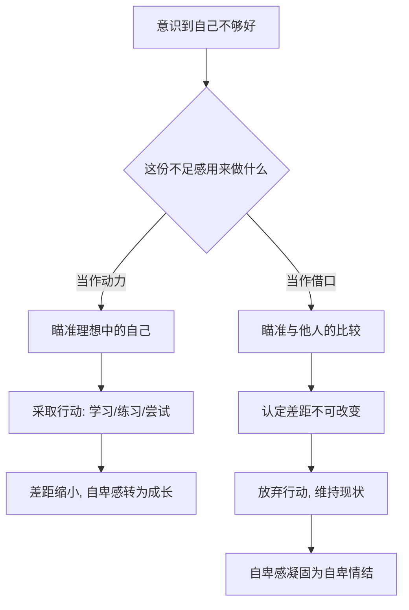

# 08｜自卑感一定是坏事吗？

> 阿德勒为什么说，自卑感其实可以成为动力？

---

## 一、先说结论

阿德勒认为，自卑感本身不是病，甚至不是坏事。它是一种中性的、几乎人人都有的心理信号，提醒你"我离理想中的自己还有一点距离"。

真正有害的，不是自卑感，而是**自卑情结**：把"我自卑"当成不行动的借口。

一句话概括：**自卑感是燃料，自卑情结是刹车。** 前者让你想往前开，后者让你拉起手刹，还心安理得地说"反正我车不行"。

---

## 二、我们先理解一个问题

先看一个我们都熟悉的心理动作。

当我们说"我很自卑"的时候，语气里通常带着一种宿命感，好像自卑是一种天生的缺陷，是贴在身上撕不掉的标签。我们默认它是坏的，是需要被"克服"甚至"治好"的。

但阿德勒偏偏要在这里停一下，问三个问题：

自卑感到底从哪里来？它为什么会存在？它是怎么从"我觉得自己不够好"，一步步变成"所以我什么都做不了"的？

如果自卑感能被拆成两个阶段看，那第一个阶段也许没那么糟，糟的是它后面被拿去做了什么。

---

## 三、作者到底提出了什么观点？

阿德勒（以及岸见一郎在书中的转述）做了一个关键区分：**自卑感**和**自卑情结**。

- **自卑感**：当你面对"理想中的自己"时，感到的那点"还不够"。考试没考好，你会难受；看到别人做得比自己好，你会不甘心。这种感受本身，说明你心里有一个想去的方向。
- **自卑情结**：把这份"不够好"的感受固定下来，当作"所以我不必去尝试"的理由。学历低、性格内向、家境普通……这些事实被拿来证明"我本来就没资格"。

阿德勒认为，自卑感根源于人都有的"追求优越性"——一种"想变得更好"的普遍冲动。所以自卑感不是敌人，它更像车上的一盏提示灯：亮起来，不是让你停车，是告诉你哪里需要加油。

问题从来不是"你有没有自卑感"，而是"你用这份自卑感做了什么"。

---

## 四、把这个观点翻译成人话

用学历举个例子。

小林本科读的是一所普通院校，进了公司之后发现，身边同事不少是名校毕业。他心里那点不舒服，就是自卑感。

接下来会出现两条完全不同的路：

**第一条路，把差距当方向。** 他想："我确实在学识和视野上还有欠缺。"于是他去报课、去读书、去主动接那些能锻炼自己的项目。自卑感在这里发挥了作用——它像一根绷起来的弦，逼着他往前。

**第二条路，把差距当判决。** 他得出结论："我学历不如人，所以我本来就不配争取那个岗位。"于是他连简历都不投，会议上有想法也不说。自卑感在这里变成了自卑情结——它不再是提示灯，而是一张贴在门上的"此路不通"。

同样是"我学历不如人"这个念头，一个盯着"理想中的我"，一个盯着"别人的我"；一个用来丈量距离，一个用来划出界线。差别不在感受本身，而在这份感受被用来做什么。

---

## 五、为什么会这样？

把两条路的分叉画出来，就清楚了：

分叉点在 B：**同样是"我不够好"，你要拿它当方向，还是当理由？**

当方向时，你的参照系是"理想中的我"，所以你能看到距离，也能看到路。当理由时，你的参照系是"别人"，而别人的位置是你改变不了的，于是"不够好"就变成了一件命运般的事。阿德勒的洞察在于：让人卡住的往往不是落差本身，而是人把落差解释成了"永远追不上"。

---

## 六、举一个现实生活中的例子

小林进公司第一个月，部门要选一个人去总部参加一个短期项目。报名条件里写着"优先考虑相关背景"。

他心动了，但立刻想起了自己的学历。他开始在心里写一份自我否决的清单："我不是名校出身""我基础肯定比不过别人""就算去了也是垫底"。最后他没报名。

后来去的人是他同组的阿May。项目结束后，阿May回来讲收获，小林坐在下面，一边羡慕，一边暗暗庆幸："看吧，那种场合果然不适合我。"

请注意这句话的妙处——**"不适合我"听起来像结论，其实是他的自我保护。** 只要能把失败归因于学历这个改不了的事实，他就永远不用面对"我其实没试过"这件事。学历在这里充当了一把保护伞。

半年后，小林换了一种做法。他不再问"我配不配"，而是问"如果我想争取这类机会，我还差什么"。他补了两门专业课，主动在小项目里练手。等下一次机会出现时，他依然没有名校学历，但他递上了报名表。

学历没变，自卑感也没消失，变的是他不再让自卑感替自己决定"要不要开始"。

---

## 七、回到书中重新理解

现在顺着阿德勒的框架回看，就顺了。

书中反复讲，自卑感来自"追求优越性"这个普遍欲求。人只要有个"想成为的样子"，就会不断发现自己和它之间的差距，于是自卑感几乎无法避免。它不是什么需要根除的疾病，而是成长本身带来的副产品。

哲人要纠正的，是青年把自卑感当成了"人生的底色"。青年觉得，因为自己学历、长相、出身处处不如人，所以人生注定受限。哲人否定的不是他的感受，而是他给这份感受下的那个结论——"所以我改变不了"。

所以在阿德勒这里，处理自卑的方向不是"消灭自卑"，而是"别让自卑替你写结论"。你甚至可以保留那点不甘心，把它留在发动机里，而不是把它按在刹车上。

---

## 八、这个观点背后还有什么？

有几个细节值得单独拎出来。

**第一，自卑感是主观的，不是客观的。** 阿德勒强调，自卑感是一种主观感受，而不是对事实的测量。身高、学历、收入这些数字本身是中性的，是人给它们安上了"低人一等"的意义。同样一米六的人，有人毫不在意，有人一辈子耿耿于怀。这说明起作用的不只是事实，还有你赋予事实的意义。

**第二，它意味着自卑感人人都有。** 阿德勒并不认为只有"条件差的人"才自卑。一个看起来处处优秀的人，也可能因为目标定得极高而持续感到不足，甚至呈现出"优越情结"——用炫耀、贬低别人来掩盖内心的不安。这也是下一层要谈的问题：追求优越性走偏时会变成什么。

**第三，它和"自卑"这个词的日常用法不太一样。** 我们平时说"某人很自卑"，往往指一种长期的性格状态；而阿德勒说的自卑感，更接近一种人人都会有的、流动的"不足感"。分清这一点，才不会一听到"自卑"就自动把它等同于心理疾病。

---

## 九、这个观点有问题吗？

有。把自卑感一概说成"可以变成动力"，是一种乐观到近乎轻率的说法。

**一些心理学家认为**，长期的低自尊、自我攻击、抑郁与焦虑障碍，并不只是"看问题的角度"问题，它们有其生理、心理与环境的复杂成因，可能需要专业干预。"只要把自卑当燃料就能前进"这句话，对陷在严重自我否定里的人，可能既无力又伤人。

**关于这一问题，学界存在不同解释。** 有一种批评认为，阿德勒过度强调主观意义，低估了真实的结构性不平等：在学历歧视、出身差距客观存在的环境里，告诉一个人"你的自卑只是主观的"，容易滑向"你的痛苦是你自己想出来的"，对处境不利的人不够体谅。

**但也有不可否认的价值。** 自卑感/自卑情结这个区分，最大的贡献是把"我很自卑"从一个固定身份，拆成了一种可观察、可操作的状态。它给了人一个具体的落点：我不必消灭自卑，我只需要检查它现在驱动我前进，还是替我踩住了刹车。

所以更稳妥的说法是：自卑感确实可以成为动力，但这需要条件——相对健康的心境、可用的资源与支持。它是一盏提示灯，不是一剂万能药。

---

## 十、今天再看这个观点

以下部分是阿德勒思想的现代延伸，不是阿德勒或作者的原话。

在今天，"学历焦虑""第一学历歧视""学历鄙视链"几乎是公开的日常。一个人很容易被一张文凭定义，甚至自己也接受这种定义。这种情况下，阿德勒的区分可以当一副清醒剂使用。

你可以问自己一个问题：我此刻感到的差距，是在提醒我"我想成为谁"，还是在替我宣布"我不配"？

前者指向可能的行动，后者堵死了一切行动。一个人能把"我学历低"改写成"我在某个方向上还缺一些东西"，往往比喊十遍"我要自信"更管用。自卑感不需要被羞耻地藏起来，它只需要被放对位置——放在发动机里，而不是刹车上。

---

## 十一、这一篇真正应该记住什么？

1. **阿德勒区分"自卑感"与"自卑情结"。** 前者是人人都有的"不足感"，后者是把不足感当成不行动的借口。

2. **自卑感本身是中性的，甚至是健康的。** 它说明你心里有一个想去的方向。

3. **关键不在有没有自卑，而在你拿它做什么。** 用来丈量距离，它是燃料；用来划出界线，它是刹车。

4. **自卑感是主观的。** 事实往往中性，是"意义"决定了它压不压垮你。

5. **但别把它推成万能。** 严重的低自尊与结构性困境真实存在，可能需要专业帮助，而不是一句"换个角度"。

---

## 十二、留一个问题

> 你此刻最耿耿于怀的那份"不如人"，
> 它正在推着你往前走，还是在替你守住原地不动？

---

**下一篇**：承认自卑感可以成为动力之后，一个新的问题就冒出来了——阿德勒说的那台"发动机"，到底是什么？他把它叫作"追求优越性"。可是，这个词听起来太像"争强好胜"了。它真的等于"比别人强"吗？还是说，我们一直理解错了这四个字？

下一篇我们就来拆开这个问题——**"追求优越性"为什么不等于"比别人强"？**
