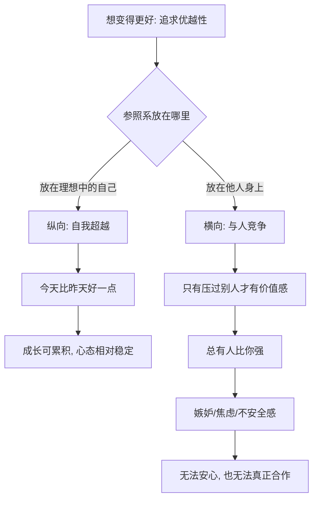

# 09｜“追求优越性”为什么不等于“比别人强”？

> 阿德勒所说的“追求优越性”，和争强好胜有什么区别？

---

## 一、先说结论

阿德勒所说的"追求优越性"，指向的是**朝理想中的自己前进**，是一种纵向的自我超越；它不等于横向地踩着别人往上爬。

一旦把人生看成与他人的竞争，你就把衡量自己的标尺交到了别人手里。而竞争的逻辑注定让人不得安宁：**总有人比你强。** 于是羡慕、嫉妒、焦虑、不安全感会接踵而来。

方向对了，它是成长；方向错了，它是消耗。

---

## 二、我们先理解一个问题

先看一个几乎所有职场人都经历过的心理动作。

你听说同组的同事升了职，或者拿了你一直想要的那个项目。有那么一瞬间，你先是为他高兴，紧接着心里一沉——不是替他难过，而是替自己难过。

这个"心里一沉"从哪来？它不是我过得不好的证明，而是**你悄悄把"我好不好"换算成了"我有没有比别人好"**。这才是阿德勒要指出的东西。

所以要先弄明白：他讲的"追求优越性"，跟我们通常理解的"争强好胜"，是同一个东西吗？

---

## 三、作者到底提出了什么观点？

阿德勒（以及岸见一郎在书中的转述）认为，"追求优越性"是人的一种普遍欲求——一种想要摆脱无力状态、不断向上的冲动。注意，这是一股向前的力量，而不是一把向下的梯子。

作者在书中借哲人的话，指出了它的两种走向：

- **健康的追求优越性**：目标是"理想中的自己"。今天比昨天好一点，就够。参照系是自己的过去。
- **不健康的走向**：目标是"比别人强"。只有把别人比下去，才觉得自己有价值。参照系是他人。

关键区别在于参照系。前者是纵向的，是自己和理想的自己的比较；后者是横向的，是自己和他人的比较。阿德勒要人警惕的，从来不是"想变得更好"，而是"想比别人更好"。

---

## 四、把这个观点翻译成人话

用一个很日常的场景来说。

你和同事在同一个团队，两个人都在暗暗较劲。表面客客气气，私下都在盯着对方的进度、业绩和领导的态度。

在这种状态下，你的每一次进步都不再是单纯的"我变强了"，而是"我暂时领先了"。你很难真正为工作本身高兴，因为真正让你安心的是比较的结果。

而比较的结果是不稳定的：今天你领先，明天他反超。于是你被绑在一根随时会翻转的钟摆上——升职后的那个晚上你可能睡得很好，一周后听说他拿了更好的项目，你又睡不着了。

但如果把参照系换回自己呢？你想的就不再是"我要比小周强"，而是"我今年要学会哪些去年不会的东西"。前者的快乐由别人决定，后者的进步由自己掌握。

同一份努力，两种活法。差别只在：你的标尺，放在谁手里。

---

## 五、为什么会这样？

把两条走向拆成图，看得很清楚：

分叉点同样在参照系上。**纵向的自比，结果由你掌握；横向的攀比，结果由别人和运气掌握。**

还有一个更深的连锁：横向竞争会反过来破坏关系。因为一旦进入比较，同事就不再是伙伴，而是潜在的对手。你会开始防备、隐瞒、抢夺功劳。阿德勒会说，这正是很多人"工作能力不差，人际关系却很僵"的根源——他们把纵向的胜败感带进了本该合作的地方。

---

## 六、举一个现实生活中的例子

小周和阿哲是同一年进公司的运营。两人能力相近，一开始关系不错。

后来公司设了一个唯一的"年度优秀"名额。消息一出，两个人的相处方式就变了。以前小周会主动把自己整理的资料发给阿哲，现在会犹豫一下："万一他做出来的方案比我好怎么办？"以前阿哲会夸小周数据做得细，现在改成一句"也就那样"。

他们都没有做错什么，甚至都更努力了。但注意这份努力的去向：小周熬夜改方案时，脑子里想的不是"这个方案能不能更打动用户"，而是"这个版本能不能压过阿哲"。阿哲也一样。

结果公布，小周评上了。她开心了几天，然后发现阿哲明显疏远了，团队的气氛也微妙起来。而更麻烦的是，她心里冒出一个新恐惧：明年怎么办？如果明年是阿哲呢？

这就是横向竞争的代价：**赢的时候也不踏实，因为你要一直担心输。**

如果换成纵向的参照系，同样两个人，可能会变成另一种关系。小周盯着"我想成为一个能独立带项目的运营"，阿哲盯着"我想把数据分析这块做扎实"。两个人可能仍然努力，但不必互相视为威胁，甚至可以交换所长。阿德勒认为，只有当人不再把他人当对手，合作才真正成为可能。

---

## 七、回到书中重新理解

现在回看书中这场关于"优越性"的讨论，就能接上前一篇的自卑感。

在阿德勒的体系里，自卑感来自"追求优越性"，而追求优越性又常常走偏成"想比别人强"，于是产生优越情结——用炫耀、贬低、打压来填补内心的不安。可以说，**"一定要比别人强"很多时候不是自信，而是自卑的另一张脸。**

哲人提醒青年的，是别把这条链继续接下去：自卑 → 想压过别人 → 永远不安。他把人重新引回纵向的框架：你该比较的对象，是昨天的你，不是隔壁的人。

理解了这一点，才能理解阿德勒为什么后面要谈"课题分离""横向关系"——它们的任务之一，就是把人生从"与他人的竞争"里解救出来。

---

## 八、这个观点背后还有什么？

**第一，它区分了"优越情结"和健康的追求。** 优越情结是自卑感走偏的结果，表现为处处要显得高出别人一头。阿德勒认为，越是要靠贬低别人来抬自己，越说明内心站不稳。

**第二，它把"合作"当成竞争的解药。** 阿德勒不否认人可以有野心，但他认为野心应当指向对共同体的贡献，而不是指向排名。这也是他后面讲"共同体感觉"的伏笔。

**第三，它重新定义了"进步"。** 在纵向框架里，进步是"离理想更近"；在横向框架里，进步是"离别人更远"。后者永远没有终点，因为你无法保证别人不追上来。

**第四，它点出竞争对关系的破坏。** 一个人若把周围所有人都看成对手，就很难与人建立真正的信任。这种状态下，即使赢了比赛，也是输掉了关系。

---

## 九、这个观点有问题吗？

有，而且争议不小。

**一些心理学家认为**，竞争并不必然是病态的。适度的竞争被普遍认为可以激发动力、促进创新，体育、学术、商业中都有大量例子。把"想比别人强"一律读作不健康，可能抹掉了一部分人对卓越的正常渴望。关于竞争对动机和表现的影响，学界存在不同解释，并非一边倒地支持阿德勒。

**也有批评指出**，阿德勒把问题想得太"心态化"了。在现实职场里，名额有限、资源稀缺、绩效排名客观存在，"不跟人比"并不总能由个人选择。当结构逼着你竞争时，说"你只要换参照系就好"，可能低估了现实压力。

**还有人质疑**，区分"健康的自我超越"与"不健康的攀比"在操作上并不容易。很多人的动力其实是混合的：既想超越自己，也难免在意别人。这时该算哪一类，很难一刀切。

**但它仍有价值。** 它的贡献在于提醒人注意到一个常被忽略的事实：当"变好"被偷偷替换成"比别人好"，快乐就从由内而生变成了由外而定。哪怕做不到完全不比较，能识别出"我现在是在超越自己，还是在踩别人"，就已经少了很多无谓的痛苦。

---

## 十、今天再看这个观点

以下部分是阿德勒思想的现代延伸，不是阿德勒或作者的原话。

今天，"比较"的舞台比阿德勒的时代大得多。绩效排名、末位淘汰、社交媒体的完美人生展演，把每个人都放进了一个巨大的排行榜里。你不仅在跟同事比，还在跟平台上素未谋面的陌生人比。

在这种环境里，阿德勒式的提问可以当作一个过滤器：你现在的努力，是为了"成为某种人"，还是为了"压过某个人"？

一个判断方法很实用：如果你的满足感完全依赖"我赢了谁"，那么赢的第二天，这种满足就会开始消失；如果你的满足感来自"我比过去多会了一点"，那它不会被任何人的反超夺走。前者是别人发的奖状，后者是自己存下的本钱。

---

## 十一、这一篇真正应该记住什么？

1. **追求优越性是向前的力量，不是向下的梯子。** 它指向理想中的自己，而不是"比别人强"。

2. **区别在参照系。** 纵向的自我超越由自己掌握，横向的攀比由别人掌握。

3. **竞争注定带来不安。** 因为总有人比你强，所以"一定要赢"永远无法真正兑现。

4. **竞争会破坏关系。** 把人当对手的地方，很难长出真正的信任与合作。

5. **不是要你放弃野心，而是要你换一个方向。** 把"要赢过谁"，换成"要成为谁"。

---

## 十二、留一个问题

> 你最近一次感到满足，是因为"我比过去更好了"，
> 还是因为"我这次比过了某个人"？

---

**下一篇**：一旦不再横向竞争，一个新的问题就浮现了——那我们到底要面对哪些必须处理的人际关系？阿德勒把它们归纳成三种：工作、交友、爱。它们看起来只是生活的不同场景，难易程度却天差地别，而很多人恰恰在看起来最容易的地方过得去，在最难的地方一直卡着。

下一篇我们就来拆开这个问题——**人生有哪三大课题？**
