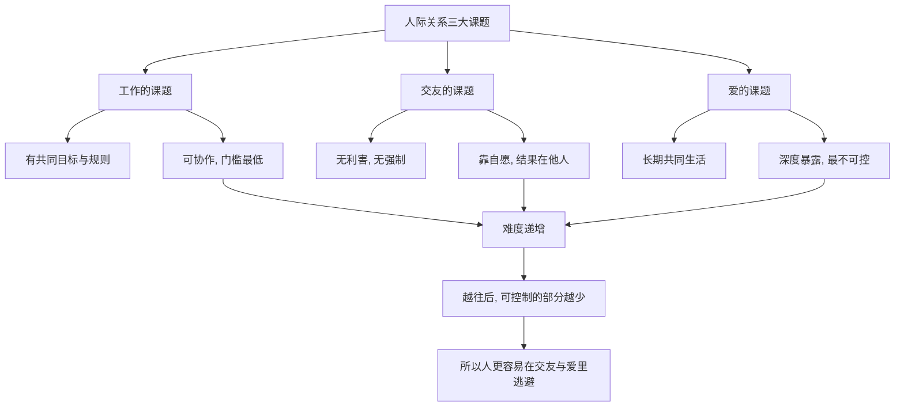

# 10｜人生有哪三大课题？

> 阿德勒说的“工作、交友、爱”三大课题，分别难在哪里？

---

## 一、先说结论

阿德勒认为，人的一切烦恼都是人际关系的烦恼，而人际关系可以归为三类课题：**工作、交友、爱**。

它们不是随便举的三个场景，而是一道由浅入深的坡：

- **工作**门槛最低——有共同目标，有明确角色，不喜欢也能共事。
- **交友**更难——没有利害，没有强制，全靠自愿。
- **爱**最难——要长时间共同生活，深度暴露自己，退无可退。

一个值得留意的现象是：很多人在工作上表现得体面、稳定，却在交友和爱里长期卡住。因为前者可以靠规则维持，后者不行。

---

## 二、我们先理解一个问题

先看一个几乎人人都有的经验。

有些人在公司里是"靠谱的人"：交代的任务准能完成，开会不迟到，客户关系也处理得不错。可一旦下班，这个人的社交生活却几乎是空的——没有可以半夜打电话的朋友，恋爱也总是不长久。

他并不懒，也不坏，甚至工作能力很强。那问题出在哪？

阿德勒的答案是：**工作、交友、爱，是三种难度不同的关系。** 他精通的是最简单的那一种，却误以为"我连工作都能搞定，其他应该也不难"。于是挫折感就更重了。

所以要先弄清，这三类课题的本质差别究竟在哪里。

---

## 三、作者到底提出了什么观点？

阿德勒（由岸见一郎在书中转述）提出，人在成长中必须面对三种人际关系课题：

**第一，工作的课题。** 指完成工作、与同事协作、处理上下级关系。它的特点是：有共同目标，有分工，有外部规则。哪怕你并不喜欢某个同事，只要目标一致，你们仍然可以合作。

**第二，交友的课题。** 指在工作之外，与他人建立平等的、自愿的关系。它没有任务，没有利害，也没有考核。一个人愿不愿意跟你做朋友，纯粹是对方的选择。

**第三，爱的课题。** 指亲密关系，包括恋爱与婚姻。它要求两个人长期共同生活，彼此深度敞开，把最不设防的一面暴露给对方。

作者强调，三者不是并列的，而是**难度递增**的，而最容易逃避的，恰恰是最难的那两类。

---

## 四、把这个观点翻译成人话

再把这三个课题放到生活里体会一下。

**工作上，你可以"装"。** 和同事合不来，你可以只聊公事，把情绪收起来，靠流程和契约把关系维持在一个能运转的水平。只要活干完，别人不会深究你喜不喜欢他。这就是为什么工作课题门槛最低。

**交友上，"装"就不够用了。** 想交到真朋友，你得主动、得投入、得让对方看到真实的你。可是你没法命令别人喜欢你——这正是它比工作难的地方：努力不保证结果，而结果完全在对方手里。

**爱上更是如此。** 恋爱受挫时，你不能像换一个项目那样轻松抽身。你投入了时间、情绪和期待，一旦被拒绝或关系破裂，痛的是整个人的自我。所以爱的课题最难，也最考验一个人。

一句话：**工作靠规则，交友靠自愿，爱靠敞开。** 越往后，可控制的部分越少，需要承受的不确定越大。

---

## 五、为什么会这样？

把三类课题的难度来源画出来，就清楚了：

这张图想说的是：**难度不是来自"事情多不多"，而是来自"你能控制多少"。**

工作里你能控制自己的产出，所以有底气。交友和爱里，你只能控制自己的付出，不能控制对方的回应。人对不可控的东西天然想逃。于是我们常常看到，一个人把全部精力投入工作，用"我很忙"来解释为什么没有朋友、为什么恋爱不顺——忙是真的，回避也是真的。

阿德勒说，这背后往往有一个目的：**把最难的两道题拖到最后，甚至交白卷，就不用面对可能的拒绝。**

---

## 六、举一个现实生活中的例子

用同一个人，看三道题的三个不同结果。

**第一题：和同事合不来。** 小林发现，自己跟同组的一位老同事怎么也处不来，对方说话冲，爱抢功。他的解决办法是：只谈工作，尽量减少私下接触，把每次协作拆成清晰的邮件。半年下来，活干得不错，两人也没起冲突。这就是工作课题的典型应对——**用规则把关系隔离到能运转的程度。** 它有效，但它只是隔离，不是解决。

**第二题：交不到真朋友。** 小林周末常常一个人。他也想有朋友，可每次有人约他，他都要犹豫："去了聊什么呢？会不会很尴尬？"他习惯用"大家都忙"解释这份空白。真相是：交友没有 KPI 逼他，所以他能拖就拖；而拖久了，主动联系人的勇气就更少了。工作课题里练出来的"专业客气"，在交友里反而成了隔阂——朋友要的不是得体，是真实。

**第三题：恋爱受挫。** 小林谈过一段恋爱，不到半年结束。对方说："跟你在一起，我总觉得隔着一层。"他很委屈：自己明明很努力，记着她的生日，尽量不争吵。可问题恰恰在这里——他一直在用"做好分内的事"来经营亲密关系，像完成一个项目。爱需要的是把不完美的自己交出去，而这正是他最害怕的。于是他在爱里也退回了最擅长的模式，然后失败。

三个场景，一个共同点：**小林最拿手的是有规则可依的关系，最躲的就是没有规则可依的关系。** 他不是不会做人，而是只学会了在有人给标准时做人。

---

## 七、回到书中重新理解

现在回看书中哲人的分类，就能理解他为什么这样排序。

他不是在做社会学分类，而是在指出一个成长方向：**人要从"因为有用才连接"，走向"因为自愿才连接"，最后走到"因为爱才连接"。** 工作课题里，你和同事的连接是"共同目标"；交友课题里，连接是"彼此欣赏"；爱的课题里，连接是"我选择与你共度这段人生"。

阿德勒把这三者统称为"课题"，是因为它们都需要人**主动去面对，而不是等待它自己发生**。工作上，任务会推着你前进；交友和爱里，没人推你，所以更需要勇气。这也解释了为什么他后面要讲"被讨厌的勇气"——在交友和爱里，你必然要冒被拒绝、被讨厌的风险。

理解了三大课题，前面的"课题分离""不做比较"才落到实处：分开的，是每道题里各自该承担的部分；不比较的，是不把交友和爱也变成一场排名。

---

## 八、这个观点背后还有什么？

**第一，它把"逃避"具体化了。** 以前我们只知道有人"社交有问题"，现在能更精确地问：他卡在哪一类课题上？是工作上就跟人处不好，还是工作没问题、只卡在亲密关系里？分清这一点，才知道该从哪里下手。

**第二，它指出三类课题是有关联的。** 一个人若在交友课题上长期退缩，往往也会在爱的课题上困难重重，因为亲密关系需要的正是交友那种自愿敞开的能力。反过来，能交到真朋友的人，通常在爱里也更有底气。

**第三，它暗示了"勇气的顺序"。** 阿德勒并不要求人一步跨到最难处。先在工作中学会课题分离，再在交友中练习主动和被拒，最后才可能承担起爱。这是一条有台阶的路，而不是一句"你要勇敢去爱"。

**第四，它把"关系"而不是"成就"放到人生核心。** 三大课题里没有一项是"升职""发财"，全是"如何与人相处"。这正是阿德勒心理学的基本立场：人的价值感，最终在关系里形成。

---

## 九、这个观点有问题吗？

有问题，而且需要认真对待。

**一些心理学家认为**，把人际关系切成工作、交友、爱三类，是相当简化的模型。现实里三者常常互相交织：同事可能成为挚友，伴侣也可能一起创业。把人的困扰硬塞进三个格子，可能漏掉了文化、性别、经济条件这些更根本的因素。关于人际关系的分类框架，学界存在不同解释，阿德勒的划分只是其中一种。

**另有一种批评**更为尖锐：当一个人陷在不良关系里——比如被家暴、被职场霸凌、被情感操控——告诉他"这是你的三大课题之一，需要你自己去面对"，有可能被读成把责任推给受害者。阿德勒的原意不是指责，但"课题"这个词本身容易被误用。

**还有一点**是难度排序是否普适。对某些人来说，交友比工作轻松得多；也有人工作关系处理得一团糟，却在爱情里游刃有余。所谓"由易到难"更像一个大致趋势，而不是每个人都适用的定律。

**但它仍有一个朴素的洞见**：不同的关系确实需要不同的能力，而人容易在自己最擅长的那一种里反复打转，回避不擅长的。能意识到"我正在用工作的方式，处理一段需要心的关系"，本身就是改变的开始。

---

## 十、今天再看这个观点

以下部分是阿德勒思想的现代延伸，不是阿德勒或作者的原话。

今天，这三个课题都出现了新的变形。工作上，远程办公和分工细化让人际连接变得更加功能化；交友上，社交软件给了你海量的"联系人"，却没给你一个可以深谈的人；爱上，认识的成本降低了，投入和承诺反而变得更难。

有意思的是，技术往往让最容易的课题更容易，让最难的课题更难。工作上，工具让人协作更高效；交友和爱里，工具却常被用来回避真正的敞开——用刷屏代替联系，用"我们改天约"代替"我现在就想见你"。

阿德勒式的问题可以这样问：我把最多的时间给了哪一类课题？我是不是正好把最少的时间，留给了最需要勇气的那一类？

---

## 十一、这一篇真正应该记住什么？

1. **人际关系有三大课题：工作、交友、爱。** 它们不是并列，而是一道由浅入深的坡。

2. **难度来自可控程度。** 工作有目标和规则，交友靠自愿，爱要深度敞开，越往后越不受你掌控。

3. **很多人卡在最难的题上。** 工作正常，交友和爱却长期空着，这并不矛盾。

4. **逃避往往有目的。** 把精力全投给工作，有时是为了不必面对交友和爱的不确定。

5. **面对课题需要勇气，也需要台阶。** 不必一步跨到最难处，但要开始走。

---

## 十二、留一个问题

> 工作、交友、爱这三道题里，
> 你最不愿意翻开的是哪一道？你又在用哪种忙碌，替自己把它往后拖？

---

**下一篇**：谈到人与人的相处，一个几乎没人怀疑的做法是"表扬"。表扬孩子、表扬下属、表扬做出成绩的人，看起来天经地义。可阿德勒偏偏说：他反对表扬。这听起来像在鼓励人吝啬赞美，甚至有点不近人情。

下一篇我们就来拆开这个问题——**为什么阿德勒反对"表扬"？**
