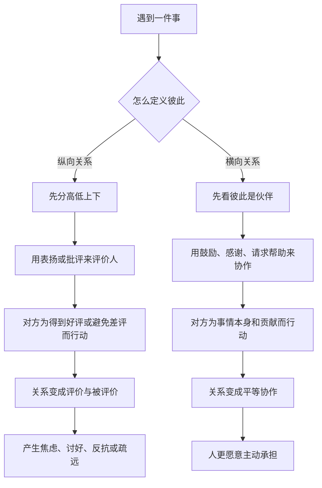

# 12｜什么是“横向关系”？

> 不批评也不表扬，那到底该怎么与人相处？

---

## 一、先说结论

阿德勒认为，人际关系只有两种基本形态：**纵向关系**和**横向关系**。

纵向关系是“有人在上、有人在下”：表扬意味着评价者站在高处，批评意味着惩罚者站在更高处。横向关系则把每个人看作**价值上平等、只是任务和处境不同**的人。

所以阿德勒的答案不是“那就别管了”，而是换一种方式：**不批评、不表扬，改为鼓励、感谢、请求帮助。** 一句话，横向关系不是取消影响力，而是取消“谁比谁高”那条隐形的线。

---

## 二、我们先理解一个问题

先问一个日常问题：当你是上司，看到下属交上来一份做得不错的工作，你脱口而出的是什么？

大概率是“做得不错”“很好，继续加油”。再看做得不好时：“这么简单也能错？”

请注意这两句话的结构——它们都在**给一个人打分**。分数高时是表扬，分数低时是批评，但打分这个动作是一样的：你是裁判，他是被评价的对象。

阿德勒要问的正是：**除了当裁判，我们还有没有别的位置可站？**

---

## 三、作者到底提出了什么观点？

阿德勒认为，一切人际关系都可以分成纵向与横向两种。

纵向关系，是把他人的位置放在自己之上或之下，用评价、奖惩、比较来维持秩序。表扬和批评，都属于纵向关系。横向关系，则是承认人与人在价值上平等，只是能力、角色、任务不同；相处方式不是评判，而是**鼓励、感谢、请求帮助**。

这里的关键是：阿德勒反对的不是“指出问题”，而是“通过评价来决定一个人的价值”。他可以接受你说“这部分需要改”，但不接受你用“你这个人不行”来完成这件事。

---

## 四、把这个观点翻译成人话

回到上司与下属的场景。

纵向版的上司看到下属加班做完项目，会说：“干得不错，我看好你。”这话听起来是表扬，但它同时确认了“我有资格评价你”。

横向版的上司会说：“谢谢你把这件事顶下来了，帮了团队大忙。”或者：“这部分我想请你帮我看一下，你比我熟。”

看出区别了吗？

前者把对方放在“被考核”的位置上，后者把对方放在“伙伴”的位置上。前者让人为了再拿一个好评而努力，后者让人因为“我确实帮上了忙”而努力。

阿德勒认为，长期处在纵向关系里的人，会慢慢把自己的价值建立在别人的评分上——这正是他为什么反对表扬的原因。

---

## 五、为什么会这样？

纵向关系之所以让人累，是因为它把关系变成了“高低”问题，而不是“事情”问题：

同一件事——下属做得好或不好——在两种关系里会走向完全不同的结果。区别不在于“要不要反馈”，而在于**反馈是指向人，还是指向事情**。

---

## 六、举一个现实生活中的例子

一位主管带一个刚入职的年轻人。第一次交报告，年轻人做得比较粗糙。主管的第一反应是：“你这水平也太差了，重做。”

年轻人没有反驳，但从此以后，交东西前会反复揣摩主管的脸色，先猜“他要什么”，再决定“我做什么”。

后来主管换了一种方式。他把年轻人叫过来，说：“我们一起看看这份报告里，哪一块最影响结论。”看完之后他说：“第二部分的数据整理得很清楚，帮我把判断做实了。开头这段我想请你再改一版，可以吗？”

年轻人后来交的东西越来越主动。不是因为被夸了，而是因为他慢慢相信：**在这里，我是被当成同事对待的，不是被当成被考核的学生。**

前者是纵向——主管站在评判台上，年轻人站在被告席上。后者是横向——两个人站在同一张桌子边，看同一份报告。阿德勒会说：不是那个年轻人被“批评”变好了，而是他被“当成伙伴”之后，自己愿意做好的。

---

## 七、回到书中重新理解

书里青年其实问过一个很现实的问题：如果不用表扬，也不批评，那还怎么带人、怎么教育？难道放任不管吗？

哲人的回答核心是：**不是不管，而是换一个位置管。** 表扬和批评都是在用赏罚驱动人，而赏罚的前提正是纵向关系。横向关系不用赏罚，它用两样东西：一是**鼓励**，告诉对方“你可以”；二是**感谢**，告诉对方“你帮到了我”。

这背后是阿德勒的一贯立场：人的行为最终应该由自己驱动，而不是由外部的评分驱动。纵向关系再温和，也在悄悄告诉人“你的价值由我决定”；横向关系则把价值判断的权力，还给每个人自己。

所以横向关系不是某一种技巧，而是阿德勒整个体系在关系层面的落地方式。

---

## 八、这个观点背后还有什么？

**第一，横向关系不等于没有规则。** 团队仍然可以有分工、有截止日期、有质量要求，只是这些要求针对的是事情，不是人的价值。

**第二，它不等于不能指出错误。** 阿德勒反对的是评价人格，不是回避问题。说“这个方案有漏洞”和说“你这个人不靠谱”，是两回事。

**第三，它和课题分离是一体的。** 你能做的，是提供帮助、表达感谢；对方接不接受、改不改变，是他的课题。横向关系天然要求你放下控制。

**第四，它需要一个前提：你真的相信对方是伙伴。** 如果你心里仍然觉得对方低你一等，那么无论语气多温柔，也只是把纵向关系包装得更客气而已。

---

## 九、这个观点有问题吗？

有问题，而且这一篇的争议集中在“平等”这三个字上。

**一方面，职场里的权力结构是真实存在的。** 上司确实掌握考核、晋升与解雇的权力，下属确实要对上司交付结果。把这种结构性不对等说成“只要心态上平等就行”，可能掩盖了弱势一方的真实处境——当下属说“我们都是伙伴”时，他未必真的自由。

**另一方面，“横向关系”容易被曲解。** 有些组织会用“我们是一家人”“大家都是伙伴”的话术，要求员工自愿加班、不计回报。这时候，平等反而成了让人放弃权利的理由。

**但阿德勒的原意并不是否认组织结构，而是调整相处时的态度。** 它反对的是：明明只是任务不同，却要把人分成三六九等；反对的是用表扬和批评去控制一个人的自我评价。

**所以更准确的说法是**：横向关系是一种“把对方当人看”的态度，它能缓解很多关系里的消耗；但它不能替代对真实权力关系的清醒认识。既承认结构的不对等，又不在态度上侮辱对方——这两件事可以同时成立。

---

## 十、今天再看这个观点

以下部分是横向关系思想的现代延伸，不是阿德勒或作者的原话。

今天的管理讨论里，出现了一些和横向关系气味相通的做法，比如强调团队的心理安全感、强调反馈针对行为而非人格、强调用提问代替命令。它们和横向关系并不完全相同，但共享同一个直觉：**当一个人感到自己不被俯视时，他才更愿意真正投入。**

反过来，那句古老的“胡萝卜加大棒”依然流行。它有效，但代价是：被奖惩驯化的人，一旦奖励消失，动力也跟着消失。

阿德勒式的追问仍然适用：**我此刻是想把事情做好，还是想确认我比对方高一等？**

---

## 十一、这一篇真正应该记住什么？

1. **横向关系是指价值平等、角色不同，不是没有分工。**
2. **表扬和批评都建立在纵向关系上。** 它们都在给人打分，只是分数高低不同。
3. **横向关系的具体动作是鼓励、感谢、请求帮助。** 它们指向事情与贡献，不指向人格评价。
4. **它不是放任，而是换一个位置相处。** 规则照旧，但不把人分成上等下等。
5. **别把“平等”当成话术。** 真实的权力差距需要被看见，否则平等二字会被拿来要求弱者忍让。

---

## 十二、留一个问题

> 在你的某一段关系里——无论对方是上司、下属、父母还是伴侣——
> 你有没有一个瞬间，其实是在“打分”，而不是在“相处”？

---

**下一篇**：如果横向关系处理的是“我和某一个人”怎么站，那再往外扩一层——我究竟属于哪个更大的整体？为什么有人在工作里、在家里，明明身在其中，却始终觉得自己是个局外人？下一篇我们就来谈**什么是“共同体感觉”**。
