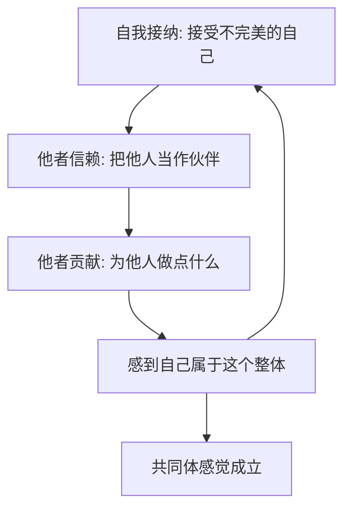

# 13｜什么是“共同体感觉”？

> 为什么阿德勒把“对社会的关心”看作心理健康的核心？

---

## 一、先说结论

阿德勒认为，一个人的心理健康，最终系于一种感觉：**我感到自己属于这里。**

这就是“共同体感觉”。它不是把自己关进“我”里，而是把“我”放进一个更大的整体——家庭、职场、社会，乃至更广的范围——并且在其中找到自己的位置。

它由三个部分构成：**自我接纳**（接受不完美的自己）、**他者信赖**（把他人当伙伴）、**他者贡献**（为他人做点什么）。这三者互相支撑，共同托起一个人的归属感与价值感。

---

## 二、我们先理解一个问题

先看一种很常见、却很难说出口的体验。

一个人在公司里，会照常上班、参加会议、回复消息，一切看起来都正常。但每次开完会走出会议室，他心里会有一种说不出的空：**这里好像有我没我，都差不多。**

回到家，情况也没好多少。一家人坐在客厅里，他却在心里觉得自己像个借住的人。

他并不是被谁排挤，也没有被明确针对。他只是**身在关系之中，却不觉得自己属于哪里**。我们要问的问题是：这种“找不到归属感”，到底缺的是什么？

---

## 三、作者到底提出了什么观点？

阿德勒认为，人的一切烦恼都来自人际关系；那么解药也必须在人际关系里找，而不是在“一个人待着”里找。

他给出的这个词——共同体感觉——核心不是“我有多优秀”，而是两件事：**我是否把他人当作伙伴，以及我是否感到自己在这个整体里有位置。** 它由三部分构成：

- **自我接纳**：坦然接受“做不到的自己”，而不是硬要相信“我能做到”。它和自我肯定不同：自我肯定是给自己打气，自我接纳是承认现状仍向前走。
- **他者信赖**：在分清课题的前提下，把他人当作伙伴。是否信赖，是我的课题；是否被背叛，是对方的课题。
- **他者贡献**：为他人做点什么，从中感到“我对别人有用”。

阿德勒认为，这三者不是先后步骤，而是互相支撑的循环。

---

## 四、把这个观点翻译成人话

我们通常以为，归属感是别人给的：**先被别人接纳，我才觉得自己属于这里。**

阿德勒把这个顺序倒过来了。

他说，归属感更像是一种**主动建立**的东西。我愿意把这里当成我的地方，愿意把周围的人当作伙伴，愿意为这里做一点点什么——在做这些事的过程中，我才慢慢感到“我属于这里”。

换句话说，**不是先有归属感才去贡献，而是在信赖和贡献中，归属感才生长出来。** 一个总在等别人先接纳自己的人，往往会一直等下去。

---

## 五、为什么会这样？

三要素之间的关系，可以画成一个循环：

这个循环之所以成立，是因为三个环节彼此需要。

一个人若不能自我接纳，就总觉得“我不配”，于是不敢信赖别人，也不敢贡献；一个人若不信赖他人，就会把每次付出都算成一笔交易，贡献也变成了委屈；而一个人若从不贡献，他就很难真的感到自己在这个整体里有位置。

反过来，任何一环松动，整个循环都会重新转起来。这就是为什么阿德勒说它们“互相支撑”——**你不需要等三样都具备，从任意一环开始都可以。**

---

## 六、举一个现实生活中的例子

一个人在一家不大不小的公司待了两年，始终找不到归属感。

他给的答案是：“这里的人都很表面，没人真的在乎我。”所以他做的是：上班做完分内事，下班立刻走人；午餐一个人吃；团建能推就推。他等着一件从来不会发生的事——**等别人先主动来接纳他。**

两年后他换了公司，半年后又陷入同样的感觉。

如果按阿德勒的思路看，问题可能不在“这里的人不好”，而在他把自己放在了“等待被接纳”的位置上。他既没有把同事当作伙伴，也没有为这个集体做点什么，自然也就感受不到自己是它的一部分。

同样是这个职场，另一个人做的事可能不同：他会在别人卡住时搭把手，会在开会时说出自己真实的看法，会记得同事提过的困难。他没有刻意讨好谁，但半年之后，他走进办公室时会觉得——**这里是我的地方。** 区别不在于环境变了，而在于一个人有没有从“等归属”，转向“建归属”。

---

## 七、回到书中重新理解

书里青年对“他者信赖”提出过一个非常尖锐的质疑：如果无条件把别人当伙伴，结果被背叛了，那不是自找苦吃吗？

哲人的回答正是课题分离的延伸：**是否信赖别人，是你的课题；别人是否背叛你，是别人的课题。** 你不能为了防备“万一被背叛”，就永远不把别人当伙伴——那样你付出的代价，是一辈子都进不了任何共同体。

青年接着问：那“共同体”到底指什么？是公司、家庭，还是社会？

阿德勒的回答是：它可以一直往外扩。小到两个人，大到家庭、职场、社会，甚至更大的范围。重要的是，一个人能在其中找到“我在这里有位置”的感觉。

这也解释了为什么阿德勒把“对社会的关心”看作心理健康的核心——一个人如果只关心“我”，他的世界就会随着自己的得失起伏；而当他能把自己放进更大的整体，他的价值感就不再只系于一个人的成败。

---

## 八、这个观点背后还有什么？

**第一，共同体感觉不等于合群。** 合群是融入人群、避免冲突；共同体感觉是心里真的把别人当伙伴，这两件事常常并不一致。

**第二，自我接纳不等于躺平。** 它说的是“承认我现在的样子”，同时仍然愿意往前走，而不是用“我不行”来放弃。

**第三，他者信赖不等于没有边界。** 信赖是一种态度，但课题分离仍然在：我可以把真心交出去，也可以决定不再继续一段伤害我的关系。

**第四，它把归属感从“别人给”改成了“自己建”。** 这是阿德勒一贯的方向——把主动权收回自己手里。

---

## 九、这个观点有问题吗？

有问题，而且这一篇的争议相当集中。

**一方面，“无条件信赖”在现实中可能带来真实的风险。** 一个人如果对所有人都先敞开心扉，确实可能被利用、被欺骗。阿德勒可以回答说“背叛是对方的课题”，但对已经受伤的人来说，这句话并不足以抵消代价。

**另一方面，“共同体感觉”很容易被组织滥用。** 当一家公司说“我们就是一家人”，要求员工无限加班、放弃个人时间时，它借用的正是“共同体”的语言。此时所谓归属感，反而变成了让人放弃权利的理由。

**还有，对处境特殊的人而言，这套说法可能不合时宜。** 对一个正在遭受排挤、霸凌甚至家庭暴力的人说“你要把对方当伙伴、要为共同体贡献”，不仅是无效的，甚至是危险的。在这种情况下，首先要做的不是扩大共同体，而是先离开伤害自己的关系。

**但阿德勒的原意也不是让人无限忍让。** 他讲的共同体，前提始终是价值平等和课题分离。如果一个共同体要求你贬低自己才能留下，那它不是共同体，而是需要被离开的地方。

**所以更准确的说法是**：共同体感觉是一条值得走的路，但它有前提——先能保护自己，再谈信赖与贡献。把“无条件”理解成“无底线”，就越过了阿德勒的本意。

---

## 十、今天再看这个观点

以下部分是共同体感觉思想的现代延伸，不是阿德勒或作者的原话。

今天，孤独感成为一个被反复讨论的话题；与此同时，越来越多人开始主动寻找“归属”：社群、兴趣小组、志愿服务、邻里互助。人们逐渐意识到，长期缺少社会联结，影响的远不只是心情。

阿德勒式的视角在这里依然有用：**归属感常常不是被分配到的，而是在参与中长出来的。** 它对一个具体的人意味着：与其等一个地方为你准备好位置，不如先问问自己——我愿意为这里做点什么？

---

## 十一、这一篇真正应该记住什么？

1. **共同体感觉是“我感到自己属于这里”，不是“我被这里接纳”。**
2. **它由自我接纳、他者信赖、他者贡献三部分构成，互相支撑。**
3. **归属感是可以主动建立的，而不是被动等待的。**
4. **信赖是一种态度，但边界和课题分离仍然不能丢。**
5. **共同体不等于组织，也不等于合群。** 要求你贬低自己的地方，不是共同体。

---

## 十二、留一个问题

> 在哪个你“待了很久却始终觉得自己在外围”的场合里——
> 你是一直在等别人接纳，还是曾经试着先做点什么？

---

**下一篇**：如果共同体感觉的核心是“我对这里有用”，那这句话再往前走一步，就会直接碰到阿德勒对幸福的定义：幸福不是被爱、被需要，而是**我确信自己对别人有用**。下一篇我们就来谈——**幸福为什么等于“贡献感”**。
