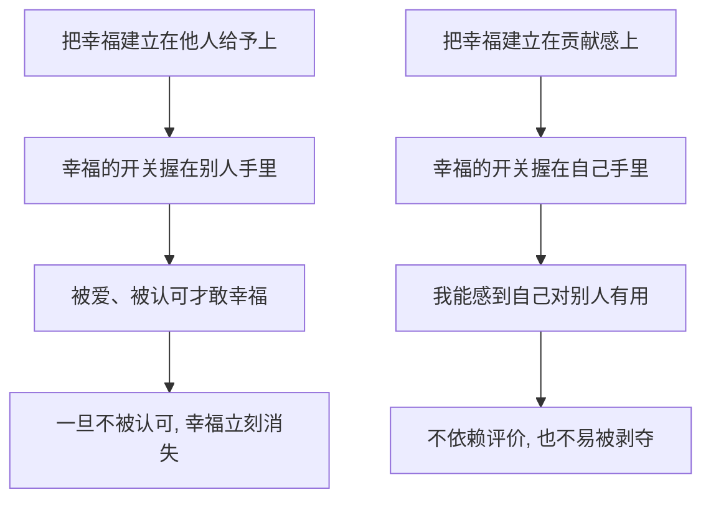

# 14｜幸福为什么等于“贡献感”？

> 为什么阿德勒说，幸福不是被爱，而是“我对别人有用”？

---

## 一、先说结论

阿德勒给出的答案，可能比我们习惯的更硬：**幸福就是贡献感。**

它指的是一种主观感觉——我确信自己对共同体有价值，我的存在对别人有意义。

这个定义有两个特别之处。第一，它不依赖别人的认可：你不需要先被表扬、被感谢，才能感到幸福。第二，它不要求你成为英雄：日常的、微小的贡献同样算数。正因为它可以被自己确认，**幸福就不容易被别人夺走。**

---

## 二、我们先理解一个问题

我们通常怎么理解幸福？

大多数人给出的答案都指向“被给予”：被爱、被认可、被需要、被在乎。这些答案背后有一个共同结构——**幸福是我从别人那里得到的东西。**

问题也正出在这里。如果幸福是别人给的，那它的开关就在别人手里。别人今天爱你，你幸福；明天冷淡了，你就不幸福。你会不自觉地围着别人的态度转，像等天气放晴一样等自己快乐。

于是要先问一个问题：**有没有一种幸福，是不必等别人发牌的？**

---

## 三、作者到底提出了什么观点？

阿德勒认为，幸福不是“别人对我做了什么”，而是“我能感到自己对别人有用”。他把它叫作**贡献感**。

注意，是“感”——它是一种主观体验，而不是一份客观的功劳簿。你的付出有没有被看见、有没有被承认，和你能不能感到幸福，是两件事。

阿德勒还强调，贡献不必惊天动地。为家人做一顿饭、在工作中把一件事做好、顺手帮邻居一个忙，都可以是贡献。重要的不是贡献的大小，而是你是否从中感到“我对别人有用”。

这与共同体感觉是连着的：因为把自己放进了一个整体，所以“我能为这个整体做点什么”才会变成一件让人踏实的事。

---

## 四、把这个观点翻译成人话

举个最朴素的场景。

一个人周末去做志愿者，帮社区整理物资、分发给需要的人。一整天下来，没有人给他发奖状，甚至没有几个人知道他的名字。但他傍晚走回家时，心里有一种很安静的充实：**今天没有白过。**

这种充实从哪来？不是来自赞美，也不是来自报酬。它来自一个很直接的判断——今天我做的事，对别人有用。

再想一个相反的场面：一个人在聚会上被很多人夸、被围观、被追捧，热闹散场后却觉得空。因为那些赞美指向的是“我多好”，而不是“我做了什么有用的事”。

阿德勒的意思是：**前者更接近幸福。** 因为它的落点不在别人怎么看我，而在我与别人的关系里，我留下了什么。

---

## 五、为什么会这样？

把两种幸福路径并排放在一起，区别就很清楚：

阿德勒之所以把幸福定义成贡献感，正是因为它把判断权交还给了自己。

一个人可以完全不被感谢，却仍然知道“我今天帮到了谁”；也可以被很多人围着，却心里清楚“他们喜欢的只是我会不会说话”。前者稳，后者飘，差别就在这里。

这也解释了为什么贡献感能抵抗嫉妒和焦虑——当你忙着为别人做点什么时，你就没有那么多精力去和别人比。**贡献感让比较失去意义。**

---

## 六、举一个现实生活中的例子

一个人长期照顾家里生病的老人。

这件事没有掌声，也没有假期。凌晨起来端水、白天跑医院、耐心应对老人反复的情绪。有很长一段时间，他觉得自己像一台被耗尽的机器，甚至怀疑这一切到底值不值得。

后来有一次，老人握着他的手，含糊地说了一句：“有你在，我心里就踏实。”

就是这句话，让他心里某样东西落了地。不是因为他终于被表扬了，而是因为他第一次清楚地感到——**我的存在，对另一个人是有意义的。**

他重新有了一点力气。不是在“我必须坚持”的压力下，而是在“我做的事真的有用”的确认里。这就是阿德勒所说的贡献感：它不是别人发的一张成绩单，而是你自己能感到的那份重量。哪怕照顾的对象最终没有好起来，哪怕事情本身充满无力感，**“我尽力让另一个人少受了一点苦”这件事，本身就有意义。**

---

## 七、回到书中重新理解

书里青年对贡献感提出过很实在的疑问：如果我的贡献根本没人看见，甚至被别人当成理所当然，我还怎么感到幸福？

这正是阿德勒的高明之处。他并不承诺“你的贡献一定会被认可”，他承诺的是另一件事：**贡献感的判断权，可以在你自己手上。**

如果一个人的幸福必须建立在“被别人承认”之上，那他其实又回到了认可欲求里，只是换了一个说法。阿德勒要的是：你为共同体做了事，你自己知道这件事有意义，这就够了。

这看起来像是在安慰人，其实它是一套很严格的要求：**它要求你对自己诚实。** 你不能用“我付出了这么多”来自我感动，也不能用“反正没人看见”来停下手中的事。你要真的看清：我的付出，对别人是不是有意义的。

---

## 八、这个观点背后还有什么？

**第一，贡献感不等于牺牲感。** 牺牲感是“我为你付出了这么多”，它盯着自己失去的东西；贡献感是“我为你做了这些”，它盯着自己给出的东西。前者容易积怨，后者容易安定。

**第二，它不需要你成为英雄。** 阿德勒一再强调，贡献可以非常普通。把日常的事认真做好，就已经在贡献。

**第三，它是一种感觉，不是一张奖状。** 因此它有力量，也有风险——这一点下一段就要谈。

**第四，它把自己和他人连在一起。** 一个人越是只想“我”，越容易被得失牵着走；当他心里有别人，他的价值感反而更稳。

---

## 九、这个观点有问题吗？

有问题，而且这里的争议不能绕过。

**第一，贡献感太主观，可能变成自我感动。** 一个人如果只是觉得“我对别人好”，却从不确认对方真实的需要，那么他所谓的贡献，可能只是一厢情愿的想象，甚至给对方造成了负担。

**第二，“我对别人有用”这句话有被剥削的空间。** 有些家庭和单位会用它来要求人无条件付出：“你对这个家有贡献，所以再忍一忍。”此时贡献感变成了让人放弃自己需要的理由。

**第三，照顾者的耗竭是真实存在的。** 长期照顾家人的人，常常在付出中渐渐失去了自己。阿德勒可以回答说“贡献感是主观的”，但当一个人被耗到没有力气时，“感到有用”这件事本身也会变得困难。把幸福完全押在贡献上，可能忽略了一个人同样需要被照顾。

**第四，它回避了一个现实问题：如果贡献长期不被看见，人真的能一直幸福吗？** 阿德勒的答案偏向“可以，因为判断权在你自己”。但一些心理学家会认为，人终究是社会性动物，长期得不到任何反馈的付出，很难只靠主观确认来维持。

**但它的价值依然清楚。** 在一个把幸福等同于“被爱、被追捧”的时代，贡献感提供了一个更稳的支点：**它让幸福不再取决于别人今天的心情。**

**所以更准确的说法是**：贡献感是幸福的一条可靠路径，但不是唯一路径，也不能被拿来要求别人无限付出。它成立的前提，是你在贡献的同时，没有把自己弄丢。

---

## 十、今天再看这个观点

以下部分是贡献感思想的现代延伸，不是阿德勒或作者的原话。

今天，关于利他与幸福感的关系有不少研究和讨论。许多研究者观察到，经常帮助他人、参与志愿服务的人，往往报告更高的生活满意度。这和阿德勒的直觉方向一致，但两者并不完全等同：研究关心的是统计上的相关，阿德勒关心的是一个人如何看待自己。

这也提醒我们：“做贡献”不是一条可以外包的公式。同样是照顾家人、同样是做志愿者，有人从中获得力量，有人从中被掏空。区别常常在于——他是不是还能感到那是自己选择的，以及他有没有在付出的同时，保留照顾自己的空间。

---

## 十一、这一篇真正应该记住什么？

1. **阿德勒认为幸福就是贡献感：确信自己对别人有用。**
2. **贡献感是主观的，不依赖别人是否认可，因此不易被夺走。**
3. **贡献不需要伟大，日常的、微小的付出同样算数。**
4. **贡献感不等于牺牲感。** 前者盯着给出，后者盯着失去。
5. **但别把自己耗光。** 贡献若变成被剥削的理由，就不再通向幸福。

---

## 十二、留一个问题

> 回想你最近一次真心为别人做点什么——
> 那一刻的幸福，是因为对方感谢了你，还是因为你自己知道，这件事有意义？

---

**下一篇**：如果幸福是“我对别人有用”，那这份幸福该在什么时候发生？是等某一天终于抵达理想状态之后再拥有，还是在每一个普通的今天里就已经可以？阿德勒的答案指向一个很特别的说法——人生不是一条通往终点的线，而是**连续的刹那**。下一篇我们就来谈这个。
