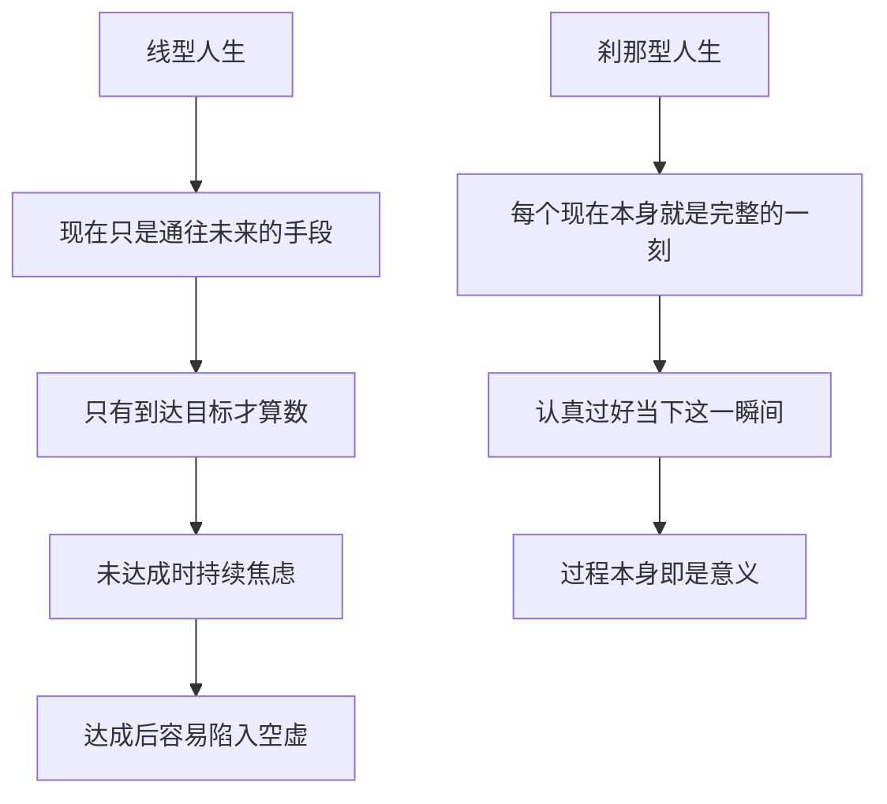

# 15｜为什么人生是“连续的刹那”？

> 如果人生是一条通往目标的线，那为什么阿德勒说它是“一个个刹那”？

---

## 一、先说结论

阿德勒反对一种几乎人人默认的人生观：人生是一条线，从此刻通往某个终点，只有到达终点才算数。

他说，人生其实是**连续的刹那**——由无数个“此时此刻”组成。每一个当下，本身就可以是完整的、圆满的，而不只是通往未来的一个台阶。

因此，认真过好此刻，不是放弃目标，而是拒绝把现在贬低成手段。他反对把人生当成“必须登顶才算成功”的登山。

---

## 二、我们先理解一个问题

先看一个熟悉的心态：**“等我……就好了。”**

等我升职就好了，等我买房就好了，等孩子考上大学就好了，等我熬过这一阵就好了。

这句话看起来是在盼头，它背后却有一个很硬的假设：**现在不算人生，现在只是通往人生的过道。** 于是人一辈子都站在过道里，等着推门进房间。

问题是：如果人生是这条线，那么“到达终点”之后呢？很多人真正抵达之后，发现的那一刻并不是满足，而是一种奇怪的茫然——**然后呢？**

---

## 三、作者到底提出了什么观点？

阿德勒认为，把人生理解成一条“奔向目标的线”，是一种误解。

他说人生是**连续的刹那**。人只能活在“此时此刻”，也只能在此刻行动。过去已经不在，未来尚未到来，唯一真实存在的，是现在这一瞬间。

他用了两个对比很鲜明的比喻。一个是登山：把人生当成登山的人，会把登顶那一刻当作全部意义，而攀登的过程只是“还没到”；另一个是跳舞：跳舞的意义不在“跳到某个地方”，而在跳舞这件事本身，每一个动作都有意义，不必等跳到终点才算数。

阿德勒主张的是后者。他不是说不要目标，而是说：**目标可以有，但人生不是只由目标来定义的。**

---

## 四、把这个观点翻译成人话

假如一个人去登山，心里只有山顶。

一路上，他不断问“还有多远”，风景从身边流过，他几乎不看；同行的人讲笑话，他敷衍地笑；中途下雨、起雾，他只觉得倒霉。

等他终于站上山顶，拍了一张照片，喘了几口气，然后开始下山。他记忆里留下了什么？可能只有两个字：累，和“到过了”。

而另一个人走同一条路，节奏慢一点。他会在半山腰停下来看云，会在累的时候允许自己休息，会记得山路上某一段的味道和风声。他未必走得比第一个人远，但他真正**走过**了这条路。

阿德勒会说：人生就像后一种登山。**登顶是结果，但人生不是结果，而是过程本身。** 如果你只为登顶而活，那你其实是把绝大多数时间，都当成了“不算数”的时间。

---

## 五、为什么会这样？

线型人生与刹那型人生的差别，可以这样画出来：

关键在于：**意义被放在哪里。**

放在终点，意义就永远是“以后”才有的东西，你现在过得再认真，也只是在“准备生活”。放在此刻，意义就立刻兑现了——你今天做的这件事，此刻就已经是人生的一部分，而不是它前面的铺垫。

这也解释了为什么“等达成目标就幸福了”常常落空：因为幸福被设计成只能发生在未来，而人永远只能活在现在。

---

## 六、举一个现实生活中的例子

一个人计划了三年去登一座著名的山。

出发前，他做了详细的攻略，目标只有一个——登顶。到了山下，他嫌气温太低；爬到半程，他开始焦虑自己体力不够；风景最好的那段，他低头赶路，想着“不能耽误时间”。

最后他确实登顶了。他在山顶站了十分钟，拍了几张照片，然后发现：**心里并没有想象中那种翻天覆地的满足。** 他只觉得任务完成了，松了一口气。下山以后，他甚至有点失落——那个支撑了自己三年的目标，就这么结束了。

如果他换一种方式呢？他仍然可以以登顶为目标，但他也会在半山腰停下来看看来时的路，会在休息时和同行的人聊几句，会在体力不支的时候允许自己慢一点。他未必次次都能登顶，但他不会在登顶那天，发现自己“什么也没记住”。

阿德勒想说的正是这个：**山要登，但不要为了那个点，把你唯一拥有的此刻，全部抵押出去。**

---

## 七、回到书中重新理解

书里青年对“活在当下”有一个很自然的担心：如果只强调此时此刻，那人不就变成没有目标、得过且过的享乐主义者了吗？

哲人的回答是：**不是不要目标，而是不要被目标绑架。** 人生可以有目标、有方向、有努力，但一个人的生活不是靠终点来获得意义的。你此刻认真做的这件事，本身就已经是完整的人生。

这也和全书前面的想法连成一片。前面说过，过去不决定你；现在这一篇说的是，**未来也不应该单方面决定你。** 一个人如果总被“以后”牵着走，他其实和被困在过去里一样，都不算真正活在属于自己的时间里。

阿德勒用跳舞来收尾，意思很深：跳舞的人不会问“跳到哪一步才算成功”，因为跳的每一步，本身就在跳舞。人生也是如此——**此刻认真，就已经足够。**

---

## 八、这个观点背后还有什么？

**第一，它不是否定规划。** 有目标、做计划，都没有问题。阿德勒反对的是把现在当作“不算数”的过渡期。

**第二，它不是享乐主义。** “活在当下”不是今朝有酒今朝醉，而是认真对待此刻正在做的事，包括那些辛苦的、需要忍耐的事。

**第三，它是对焦虑的一种回应。** 人焦虑，常常不是因为此刻不好，而是因为脑子里一直放着一个“还差得远”的未来。把注意力拉回此刻，焦虑会松一些。

**第四，它让“人生的意义”落回自己手上。** 意义不在某个宏大终点，而在你怎么过每一个今天。**这也是全书最终要交还给读者的东西。**

---

## 九、这个观点有问题吗？

有问题，而且“活在当下”这四个字最容易被人拿去乱用。

**一方面，它可能被读成短视。** 如果一个人只关心此刻舒服，不看长远，他的选择可能伤害未来的自己。延迟满足、长期积累，对很多人来说确实有价值。把“刹那”理解成“不用规划”，是对阿德勒的误读。

**另一方面，它可能被拿来劝人安于现状。** 当一个人面临不公、压榨或需要改变的处境时，一句“你应该活在当下、享受此刻”，可能变成让人闭嘴的借口。此时需要的不是接受当下，而是改变当下。

**还有一种情况是，说这话的人其实站着不腰疼。** 对正在经历痛苦、挣扎求生的人讲“此刻就圆满”，是轻飘的。阿德勒的“刹那”建立在一个人基本能自主生活的前提上；当这个前提不成立时，它并不好用。

**但它的洞见依然有力。** 它精准地指出了一种现代病：**把全部生活抵押给一个未来的点，然后在抵达时发现，自己早已把过程丢掉了。**

**所以更准确的说法是**：不是“不要未来”，而是“未来不能吞掉现在”。规划与当下并不对立——好的规划，恰恰是为了让无数个当下都能过得更像样。

---

## 十、今天再看这个观点

以下部分是“活在当下”思想的现代延伸，不是阿德勒或作者的原话。

今天，正念、心流等概念被广泛讨论。它们和“连续的刹那”有相通之处：都把注意力放回此刻正在做的事情上，而不是飘在懊悔过去或担忧未来。这些讨论关心的是注意力和情绪，阿德勒关心的是人如何理解自己的一生，两者角度不同，但方向交汇在同一个地方——**此刻，是你唯一真正拥有并可以行动的地方。**

---

## 十一、这一篇真正应该记住什么？

1. **阿德勒认为人生是连续的刹那，而不是一条通往终点的线。**
2. **每个当下都可以是完整的，不必等“到达”才开始生活。**
3. **目标可以有，但不能反过来吞掉此刻。**
4. **它不是不规划、不是享乐主义，而是拒绝把现在当成手段。**
5. **人生的意义不在终点，而在你怎么过每一个今天。**

---

## 十二、留一个问题

> 你此刻正在等的那个“等我……就好了”，究竟是什么？
> 如果它永远不会来，你打算怎么过好今天？

---

**收束全系列**

写到这里，这套关于阿德勒心理学的解读，就走到了最后一篇。

回头看，这个系列的开篇问的是一个看起来最简单、其实最难的问题：过去能不能决定你？阿德勒的回答是——不能。人不是被过去推着走，而是带着此刻的目的，回头去解释过去。整本书的地基，就压在这一句话上。

而这一篇要做的，是把这句话再往未来推一步：**既然过去不能决定你，未来也不该替你决定。** 人生既不是过去写好的判决书，也不是未来设好的终点线，它是你此刻正在过的每一个刹那。所谓自由，或许就是一个人终于承认——**能决定我怎么活的，只有现在这个我。**

阿德勒从来不提供标准答案，他提供的是一套让你自己去用的工具。所以这最后一篇，他也不会给你一个“人生的意义是什么”的定论。他要你相信的是：**意义不是被找到的，是你自己在每一个当下，一步步做出来的。**

读到这里，你不需要同意阿德勒的每一句话。有些地方他过于乐观，有些地方他低估了现实的重量。但如果这套解读能让你在某个普通的下午，忽然愿意为自己做一个不同的选择——那它就已经完成了它该做的事。

接下来，去形成你自己的理解吧。
