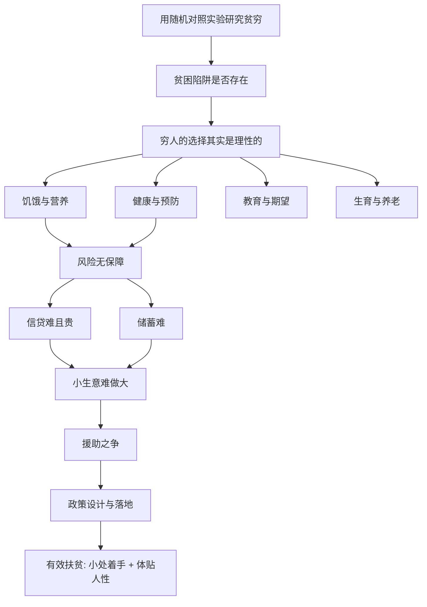

# 《贫穷的本质》深度解读系列

## 系列简介

《贫穷的本质》是两位诺贝尔经济学奖得主——班纳吉与迪弗洛——的代表作。它要回答的问题，看似老生常谈，却极难回答：**穷人为什么穷？什么样的帮助才真正有效？**

这本书最大的不同，在于方法。它不靠宏大理论，也不靠坐在办公室里推演，而是把经济学家派到田野里，用**随机对照实验**（RCT）去检验：多发一袋粮、免费发顶蚊帐、给老师发奖金、给家长一份成绩单……到底有没有用？

结论往往出人意料：贫穷不是单一的"陷阱"，也不等于懒惰或无知。穷人在资源极度匮乏、风险极高、信息极少的处境里，做出的很多看似"不理性"的选择，其实是对环境的合理适应。真正有效的政策，往往不是大手一挥的宏大方案，而是**在设计细节上体贴人性**的小改动。

本系列围绕 **16 个核心问题**，从饥饿、健康、教育、生育，讲到风险、信贷、储蓄与生意，最后回到那场关于援助的大争论。

---

## 全书核心问题

| 层次 | 问题 |
|---|---|
| 方法问题 | 研究贫穷，为什么要用随机实验？ |
| 认知问题 | 贫穷是陷阱吗？穷人真的不理性吗？ |
| 生存问题 | 吃、健康、教育、生育中，藏着哪些反直觉？ |
| 资金问题 | 为什么穷人应对风险难、借钱难、存钱难、做生意也难？ |
| 政策问题 | 援助有没有用？怎样的帮助才真正有效？ |

---

## 全书知识地图



---

## 全系列目录

### 第一部分：如何理解贫穷

#### 01｜为什么研究贫穷要用“随机实验”？

核心问题：为什么不能靠理论和大数据，而要跑到村里做实验？

核心观点：班纳吉与迪弗洛主张用随机对照实验（RCT）：把人群随机分成干预组和对照组，比较结果差异，从而判断"到底是这项措施起了作用，还是别的因素"。它把扶贫从"凭信念"变成"可检验"，是本书方法论的核心。

理解难度：★★★☆☆

关键词：随机对照实验、因果推断、试点、证据

---

#### 02｜“贫困陷阱”真的存在吗？

核心问题：穷人是不是掉进了一个"越穷越穷"的坑，爬不出来？

核心观点：作者检验"贫困陷阱"假说（如吃不饱导致没力气工作、越穷越无法投资），结论是：它并不普遍存在，只在特定条件下出现。换句话说，贫穷不是单一的"宿命黑洞"，而是许多具体问题的叠加，因此也需要具体的、分领域的方法。

理解难度：★★★★☆

关键词：贫困陷阱、S 形曲线、临界点、分领域

---

#### 03｜穷人真的是“又懒又不理性”吗？

核心问题：穷人那些看似"不明智"的选择，究竟是不是愚蠢？

核心观点：作者反复强调：穷人的选择往往是**在极度匮乏与高风险下的理性适应**。他们承担着更高的风险、面对更少的信息、承受更大的即时压力。理解这一点，是设计有效政策的前提——如果先假定他们愚昧，政策就一定会失败。

理解难度：★★★★☆

关键词：理性、约束条件、风险、贫困的处境

---

### 第二部分：吃、健康与预防

#### 04｜穷人最缺的是粮食吗？

核心问题：贫穷的第一问题是"吃不饱"吗？

核心观点：研究显示，问题往往不是"总热量不够"，而是**营养结构差、微量元素缺乏**。而且当收入增加时，穷人不一定会把多出的钱用来买更有营养的食物，而可能买口味更好的。因此，"多给粮食"未必解决营养问题。

理解难度：★★★☆☆

关键词：饥饿、营养、微量元素、选择

---

#### 05｜为什么免费的疫苗和蚊帐，还是有人不用？

核心观点：预防性投入（疫苗、蚊帐、消毒剂）回报极高，却常常被忽视。原因包括：预防的好处"看不见"（没得病不知道是它的功劳）、需要现在付出而回报在未来、以及信念与习惯的阻碍。政策因此需要"助推"，而不是只讲道理。

核心问题：回报这么高的预防措施，为什么普及不起来？

理解难度：★★★★☆

关键词：预防、无形收益、时间偏好、助推

---

#### 06｜为什么穷人更愿意花钱“治病”而非“防病”？

核心问题：为什么有限的医疗支出，常常花在了低效甚至有害的地方？

核心观点：当疾病已经发生，"治病"是紧迫且可见的；而"预防"的好处是想象出来的。加上信息匮乏，穷人可能把钱花在昂贵的抗生素、输液甚至无效疗法上，却省下最便宜的疫苗。这提醒政策：**要让正确的做法变得更容易、更便宜。**

理解难度：★★★★☆

关键词：治疗、预防、信息、医疗支出结构

---

### 第三部分：教育与人口

#### 07｜为什么教育投入未必换来成绩？

核心问题：学校建起来了、孩子也上学了，为什么学习效果还是差？

核心观点：问题往往不在"有没有学上"，而在**教育的质量与期望**：老师是否认真教、课程是否匹配、家长是否相信教育能改变命运。作者发现，家长对教育回报的预期，会显著影响孩子的学习投入——期望本身就能改变结果。

理解难度：★★★★☆

关键词：教育质量、期望、教师、回报预期

---

#### 08｜为什么“多生孩子”不一定是愚昧？

核心问题：穷人为什么生那么多孩子？这真的是观念落后吗？

核心观点：在缺乏养老保障、儿童死亡率高的环境里，多生孩子是一种**现实的"保险与养老"策略**。因此，降低生育率的关键，不是宣传"少生"，而是降低儿童死亡率、提供养老保障、提升女性教育与收入。生育决策，是理性反应，而非愚昧。

理解难度：★★★★★

关键词：生育、养老、死亡率、女性赋权

---

#### 09｜改善教育，一定要先建更多学校吗？

核心问题：教育问题的瓶颈，到底在供给，还是在质量与激励？

核心观点：在很多地区，入学率已经不低，但学习效果差。因此，与其继续增加学校数量，不如解决"教得怎么样"：教师出勤与激励、因材施教、给家长提供信息。这体现了本书的一贯思路——**先弄清真正的约束在哪，再投入资源。**

理解难度：★★★☆☆

关键词：入学率、学习效果、教师激励、约束

---

### 第四部分：风险、资金与生意

#### 10｜穷人为什么难以应对风险？

核心问题：为什么一场病、一次天灾，就能让一个家庭跌回原点？

核心观点：穷人的生活充满风险（疾病、天气、价格波动），却几乎没有任何保险工具：没有医保、没有失业保险、没有对冲手段。于是他们只能靠"哑铃式"策略——过度保守地保住底线，同时偶尔赌一把。风险无从分散，是贫困难以摆脱的重要原因。

理解难度：★★★★☆

关键词：风险、保险缺失、脆弱性、应对策略

---

#### 11｜为什么穷人借钱那么难、那么贵？

核心问题：为什么正规金融不愿服务穷人，而高利贷却能生存？

核心观点：穷人缺乏抵押物、交易金额小、监督成本高，正规银行不愿放贷；于是他们转向亲友或高利贷。小额信贷提供了一种可能，但它也不是万能的"奇迹"。问题的核心是**信息与抵押的缺失**，而不是穷人"不讲信用"。

理解难度：★★★★☆

关键词：信贷、抵押、小额信贷、信息不对称

---

#### 12｜为什么穷人存不下钱？

核心问题：明明知道该存钱，为什么就是存不下来？

核心观点：储蓄难，不只是因为没钱，更因为**自我控制难、外部压力大、缺乏合适工具**。作者发现，一些"逼自己存"的巧办法很有效——比如买建筑材料（砖头）当作强制储蓄，因为它难以随时变卖换取零食或应酬。储蓄产品要顺应人性，而非对抗人性。

理解难度：★★★★☆

关键词：储蓄、自我控制、强制储蓄、行为设计

---

#### 13｜为什么穷人的生意做不大？

核心问题：穷人很有"创业精神"，为什么大多只能做糊口的小生意？

核心观点：穷人的生意多为"糊口型"：靠自身劳动维持，利润微薄，难以雇佣、扩张或获得贷款。它们不是"未来的大企业"，而是"没有更好选择时的生计"。政策若把它当成"潜在的增长引擎"，往往会误判。

理解难度：★★★★☆

关键词：糊口型生意、创业、扩张、误判

---

### 第五部分：政策与出路

#### 14｜援助到底有没有用？

核心问题：几十年的对外援助，为什么争议如此之大？

核心观点：这场争论没有简单答案。批评者认为援助养成了依赖、被腐败截留；支持者指出，许多具体援助（疫苗、驱虫、上学）效果明确。作者的立场是务实的：与其争论"援助总体来说有没有用"，不如问**"具体哪一种援助、在什么条件下、效果如何"**。

理解难度：★★★★★

关键词：援助之争、依赖、效果、条件

---

#### 15｜为什么好政策常常落不了地？

核心问题：方案明明很好，为什么到了基层就变形？

核心观点：政策要落地，必须面对执行者（官员、教师、医生）的激励与约束，以及制度与腐败的问题。作者既看到"好的制度"的重要，也强调在现实约束下"先做能做的、可验证的小改进"。理想主义若不落地，等于零。

理解难度：★★★★☆

关键词：执行、激励、制度、落地

---

#### 16｜消除贫穷，究竟靠什么？

核心问题：面对如此复杂的贫穷问题，我们到底应该抱什么态度？

核心观点：作者既反对"贫穷无法改变"的宿命论，也反对"一个方案解决一切"的万能论。他们的答案是：**以证据为基础、从小处着手、把政策设计得体贴人性。** 一个个具体、可验证的小改变累积起来，就是真实的进步。这既需要科学的严谨，也需要直面现实的谦逊。

理解难度：★★★★☆

关键词：证据、小处着手、行为设计、谦逊

---

## 推荐阅读顺序

**主线顺序（推荐）：01 → 16。**

```text
第一段｜方法（01–03）   随机实验 → 贫困陷阱 → 穷人的理性
第二段｜生存（04–06）   营养 → 预防 → 治病
第三段｜教育人口（07–09）教育质量 → 生育 → 供给与质量
第四段｜资金（10–13）   风险 → 信贷 → 储蓄 → 小生意
第五段｜出路（14–16）   援助之争 → 政策落地 → 消除贫穷
```

**阅读建议：**

- **想先抓住骨架**：读 01、03、05、10、14、16 六篇。
- **对扶贫政策感兴趣**：05、09、10、14、15 是核心。
- **对行为经济学感兴趣**：03、05、06、12 最有意思。
- **想练习批判性阅读**：重点看 02、14、15 三篇。

---

## 全系列状态

> 本系列共 16 篇，正文生成中。
