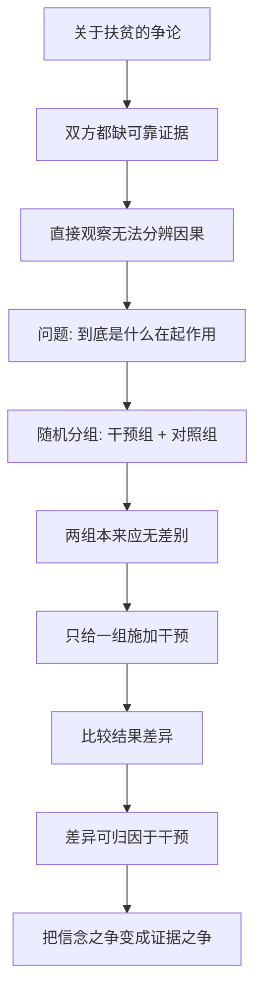

# 01｜为什么研究贫穷要用“随机实验”？

> 为什么不能靠理论和感觉扶贫，而要跑到村庄里做实验？

---

## 一、先说结论

班纳吉与迪弗洛给出的答案，是方法论上的一个转向：**用随机对照实验（RCT）来研究贫穷。**

做法其实很像医学试验：把人群随机分成"干预组"和"对照组"，只对前者采取某项措施，再比较两组结果的差异。这样就能回答一个关键问题——**这个改善，到底是这项措施带来的，还是本来就会发生？**

它的意义在于：把扶贫从"凭信念、凭立场"变成"可检验、可比较"。这本书之所以颠覆，很大程度上不是因为结论惊人，而是因为**它用证据代替了想象。**

---

## 二、我们先理解一个问题

先想一个再普通不过的争论。

有人说："给贫困家庭免费发蚊帐，能大大降低疟疾。"

马上有人反对："免费的东西没人珍惜，发了也不用，还不如让他们自己买。"

两种说法都很有道理，也都有支持者。可问题是：

> 我们凭什么知道，到底哪一种是对的？

如果只是收集"发了蚊帐的地区"和"没发的地区"的数据，你会发现很难下结论——因为这两类地区本来就可能不一样：富裕程度不同、卫生条件不同、气候不同。你看到的差异，可能根本不是蚊帐造成的。

**这就是贫穷研究最大的难题：你无法知道，到底是什么在起作用。**

---

## 三、作者到底提出了什么观点？

面对这个难题，两位作者主张：**像做医学试验一样做经济学。**

随机对照实验的核心逻辑是：

1. 把研究对象**随机**分成两组——随机是关键，它能保证两组在统计上"本来就应该差不多"；
2. 只给其中一组施加干预（比如免费蚊帐），另一组保持不变（对照）；
3. 比较两组结果的差异，这个差异就可以归因于干预本身。

他们的判断是：**关于贫穷的很多争论，本质上是"证据不足"造成的**。与其在会议室里辩论"穷人到底理不理性"，不如设计实验去测。这本书的每一章，几乎都是这种思路的产物。

一句话概括作者的态度：**先别急着下结论，先去做个能验证的实验。**

---

## 四、把这个观点翻译成人话

把它想成"双胞胎对照"。

假设你怀疑"喝某种饮料会让人长高"。如果只是观察一群喝饮料的孩子，你没法确定——也许他们本来就在长个子的年纪，也许他们还爱运动。

但如果你找到 1000 对情况几乎相同的双胞胎，随机让其中一半喝、一半不喝，跟踪一年——结果差异就很可能是饮料造成的。

随机实验的威力就在这里：**它人为地把"两组本该差不多"这件事变成了现实，于是任何差异都能被更干净地归因。**

扶贫也一样。"免费蚊帐有没有用""给老师发奖金有没有用""给家长发成绩单有没有用"——这些都可以被设计成实验，而不是靠猜。

---

## 五、为什么会这样？

把它拆成一条清晰的链：

关键在 **C → E** 这一跳。

没有随机分组，我们就无法排除"别的因素"；有了随机分组，我们才有可能把"因果关系"从"相关关系"里分离出来。这正是 RCT 的全部价值：**它不保证结论一定正确，但它让结论变得可检验。**

---

## 六、举一个现实生活中的例子

看一个书里反复出现的场景：**免费发蚊帐。**

疟疾在部分地区是致命威胁，而蚊帐是极有效的预防手段。可"要不要免费发"却长期争论不休：有人担心免费会让人不珍惜，有人认为应该收费以保证"被使用"。

于是研究者设计了实验：在一些地区免费发蚊帐，在条件相似的地区按不同价格卖，另一些地区作为对照。随后比较各组的购买率与实际使用率。

结果出乎很多人的直觉：**免费或极低价格发放，并没有显著降低使用率**，反而让更多人得到了保护。类似的实验还检验过驱虫、疫苗、教师激励、给家长发成绩单……

这些结论之所以可信，正是因为它们不是"谁觉得"，而是"实验测出来的"。

---

## 七、回到书中重新理解

现在再回看两位作者为什么把"随机实验"放在最前面，就顺了。

他们要对抗的，是扶贫领域长期存在的两种懒惰：一种是**立场先行**（左派说要多援助，右派说援助有害，各自找证据支持自己），另一种是**想当然**（觉得穷人"不理性""不珍惜"，于是设计出错误的政策）。

RCT 提供的不是答案，而是**获取答案的方法**。它让"穷人到底会怎么反应"这类问题，第一次可以用数据来回答。理解了这一点，才能理解后面那些关于营养、健康、教育、储蓄的结论——它们都建立在这套方法之上。

---

## 八、这个观点背后还有什么？

**第一，随机实验只能回答"具体问题"。** 它能告诉你"这个措施在这群人、这个地区、这个时间有没有用"，但不能直接推出"援助总体上有没有用"。

**第二，它依赖执行质量。** 随机化是否真正做到、干预是否落实、数据是否可靠，都会影响结论。

**第三，它天然偏向"可测量"的东西。** 入学率、发病率容易测，尊严、希望、生活质量则难以量化，可能被忽略。

**第四，它改变了"政策设计"的思路。** 从"我认为应该这样"转向"我们试试看，再改"，是一种更谦逊、也更有效的态度。

---

## 九、这个观点有问题吗？

有，而且争议不小。

**第一，"外部效度"问题。** 在肯尼亚某地有效的措施，搬到印度农村未必有效。把实验结论直接推广，是常见误用。

**第二，成本和伦理的约束。** 不是所有政策都能做随机实验：不给对照组提供明显有益的帮助，可能涉及伦理问题。

**第三，它可能窄化了"贫穷"的问题。** 一些批评者认为，RCT 擅长微调，却难以回答结构性问题——如土地制度、全球贸易、政治权力如何造成并维持贫穷。

**第四，但它显著提升了扶贫的科学性。** 无论局限如何，"用证据说话"这一点，是这本书不可替代的贡献。

**所以更准确的说法是**：随机实验是把"扶贫讨论"从玄学拉回科学的有力工具；但它回答的是具体问题，不能替代对结构性不平等与制度性原因的追问。

---

## 十、今天再看这个观点

以下部分是基于本书思想的现代延伸，不是两位作者的原话。

在今天，"用实验验证政策"已经从学术方法，走向了更广的实践。各国政府、平台公司、公益组织，都在做类似的"AB 测试"：同一批用户随机分组，看哪种设计更有效。

但这也带来新的警觉：**AB 测试天然偏爱短期、可量化的指标。** 一个产品可以把"点击率"优化得很好，同时伤害用户的长期福祉；一项政策可以提高"入学率"，却没改善"学习质量"。

所以这本书给我们的，不只是一套方法，还有一个提醒：**能被测量的，不一定是最重要的；在追求"有效"之前，先想清楚"有效"到底指什么。**

---

## 十一、这一篇真正应该记住什么？

1. **随机实验是本书的方法核心。** 随机分组 + 对照组，让因果推断变得可能。
2. **它把争论从"立场"拉回"证据"。** 与其辩论穷人理性与否，不如设计实验去测。
3. **它能回答具体问题，不能回答一切。** 外部效度、伦理、结构性问题，都是它的边界。
4. **它改变了政策设计的态度：** 从"我想应该这样"到"试试看、再改"。
5. **同时要警惕"可测量"的陷阱。** 有效不等于有价值，指标不等于目标。

---

## 十二、留一个问题

> 如果关于贫穷的很多结论，其实是"想当然"而非"验证过"，
> 那么当你在谈论"穷人为什么穷"时，
> 你手里握着的，是证据，还是印象？

---

**下一篇**：方法是随机实验，那第一个要检验的大问题就是——穷人是不是掉进了一个"越穷越穷"的坑，无论怎么努力都爬不出来？这个"贫困陷阱"，真的存在吗？

下一篇我们就来拆开这个问题——**"贫困陷阱"真的存在吗？**
