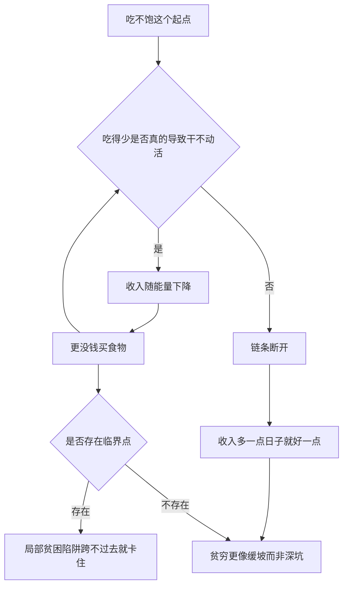

# 02｜“贫困陷阱”真的存在吗？

> 穷人是不是掉进了一个“越穷越穷”的坑，无论怎么努力都爬不出来？

---

## 一、先说结论

两位作者的意见是：**“贫困陷阱”并不是一个普遍存在的事实，而是一个在某些条件下才成立的假设。**

换句话说，贫穷不是一口“一旦掉进去就永远爬不出来”的黑洞。对绝大多数穷人来说，收入多一点，日子就会好一点，并不是“越穷越穷”的自我循环。但在一些具体领域——比如初始投入门槛很高的农业、教育、健康——确实存在“临界点”：跨过去就往上走，跨不过去就原地打转。

所以作者的态度是：**不要用一个笼统的“陷阱”去解释所有贫穷，而要一个领域一个领域地去找，究竟卡在了哪里。**

---

## 二、我们先理解一个问题

先看那条被引用最多的链条：

> 吃不饱 → 没力气工作 → 挣得更少 → 更吃不饱。

这条链看起来天衣无缝。它几乎是很多人心中“贫穷陷阱”的标准画面：一个闭环，越转越紧，把穷人死死锁在里面。

如果这条链真的成立，那么结论就很直接：**只要给穷人足够的粮食，他们就能恢复力气，多挣钱，然后自己走出贫穷。** 援助的方向也因此变得简单——发粮、补贴主食、保证热量。

可问题在于：这条链，是**必然成立**的吗？

它成立的隐含前提是：穷人真的“吃不饱”，而且吃得少，确实让他们“干不动活”。这两个前提，都需要被检验。

---

## 三、作者到底提出了什么观点？

两位作者的核心判断是：**“贫困陷阱”是一个需要证明的假说，而不是一个可以直接拿来用的前提。**

他们在书中讨论了一种典型的“陷阱”机制：如果一个人今天的收入，决定了他明天能挣多少，而这条关系呈现出一个特殊的形状——在某个临界点之下，收入越低、未来越低；在临界点之上，收入越高、未来越高——那么穷人才会被困住。这个形状，常被画成一条 S 形曲线。

在 S 形曲线的逻辑里，存在一个“临界点”：

- 临界点以下，人会被一股向下的力量拖住，越挣越少；
- 临界点以上，人则会进入向上的良性循环。

于是作者去检验：**这样一条会“锁定”穷人的曲线，在现实中到底有多常见？**

他们发现，至少在“吃不饱导致干不动活”这件事上，证据远没有想象中那么强。多数情况下，穷人的能量摄入并没有低到让他们无法工作的程度；多给一点钱，他们的确会多吃一点，但并不会因此突然变得更有生产力，从而彻底翻身。

**贫困陷阱不是不存在，而是它不像人们以为的那样普遍。**

---

## 四、把这个观点翻译成人话

想象一个斜坡，而不是一个深坑。

很多人对贫穷的想象是“掉进坑里”：一旦进去，四周都是光滑的墙，怎么爬都爬不出来。

但作者说，更多时候，贫穷更像**一个缓坡**：你多走一步，就往上挪一点；少走一步，就往下滑一点。它让人很累、很难，但并不是一个“无论做什么都没用”的死局。

坑和缓坡的区别至关重要：

- 如果贫穷是坑，那么外部的“一把力”（比如一次大规模援助）可能是唯一出路；
- 如果贫穷是缓坡，那么进步就来自许多次“往上挪一点”的累积，而不是一次性的拯救。

真正需要警惕的，是那些**局部确实存在的“台阶”**——比如一块需要前期大投入才能种好的地。没有那笔钱，就迈不上台阶；迈上去了，收益才会显现。

---

## 五、为什么会这样？

把“陷阱”成立的条件拆开看：

关键在于 **B 这个判断**。

如果“吃得少”并没有让人丧失劳动能力，那么 B 到 C 的那一步就走不通，整个闭环就断了。链条一断，所谓“越穷越穷”的自我循环也就无从谈起。

作者进一步指出，真正容易形成“临界点”的，往往不是日常热量，而是**一次性的、门槛很高的投入**：买一头耕牛、供孩子读完一段学、把一块贫瘠的地改造好。这些地方确实可能出现“台阶”，也因此成为政策该重点发力的地方。

---

## 六、举一个现实生活中的例子

回到那条链：**“吃不饱 → 没力气工作 → 更穷”。**

假设一位农民，每天靠打零工挣钱。按“陷阱”的说法，他因为吃不饱，所以干活效率低，工钱少，于是更吃不饱。

但实际情况常常是另一回事。研究者观察发现，很多穷人并没有处在“饿到无法劳动”的状态——他们可能吃得不多、营养不均衡，但基本的体力还在。当他们手头稍微宽裕一点，多出来的钱未必用于“把热量吃到饱”，而可能花在别的地方。

也就是说，那条链条的**第一步到第二步之间，往往是松的**。少吃饭未必直接等于少干活；而多吃饭，也未必直接等于多挣钱。

这并不是说饥饿不存在，而是说：**“吃不饱”并不自动等于“掉进了无法自救的陷阱”。** 它更像一个可以被逐步缓解的困难，而不是一个锁死人的机关。

---

## 七、回到书中重新理解

理解这一点，就能明白作者为什么反复强调“**分领域**”。

如果贫穷是一个笼统的大陷阱，那么答案也会是一个笼统的大方案。但作者发现，不同的贫穷问题，背后卡住的地方完全不同：

- 有的卡在“吃不饱”，但在很多地方，它并没有严重到形成陷阱；
- 有的卡在“健康预防”，回报很高却没人做；
- 有的卡在“教育质量”，孩子上了学却学不到东西；
- 有的卡在“风险”，一场病就让家庭返贫。

所以他们的方法论是：**先把“陷阱”这个模糊的印象，拆成一个个具体的、可检验的问题。** 哪一个领域真的存在临界点，就在哪一个领域想办法把门槛降下来。

这背后其实是一种谦逊：承认“贫穷”不是一个大词就能概括的，它是一堆不同难题的叠加。

---

## 八、这个观点背后还有什么？

**第一，它区分了“困难”和“陷阱”。** 贫穷当然很困难，但“困难”意味着努力可能有回报；“陷阱”意味着努力也没用。作者认为，多数情况属于前者。

**第二，它提醒我们警惕“宿命论”。** 如果贫穷真是无法挣脱的陷阱，那么帮助就失去了意义。作者的结论恰恰相反：正因为大多数贫穷不是死局，具体的帮助才有价值。

**第三，它把政策的落点指向“临界点”。** 哪里存在“跨过去就不同”的门槛，哪里就是投入最划算的地方——比如让一个孩子先跨过最基础的那一段教育。

**第四，它反对“一刀切”的援助方案。** 因为陷阱是局部的、分领域的，笼统的“给钱给粮”未必命中要害。

---

## 九、这个观点有问题吗？

有。这个判断本身就处在争议之中。

**一些发展经济学家认为**，班纳吉与迪弗洛可能低估了贫困陷阱的普遍性。他们的理由包括：

**第一，测量不易。** “吃不饱”和“干不动活”都很难精确测量，用短期数据可能看不出长期的慢性影响。长期的营养不良对儿童发育的伤害，可能在多年后才显现。

**第二，陷阱可能不在热量，而在别处。** 就算“热量陷阱”不普遍，土地、信贷、教育、健康等领域的“门槛效应”依然可能广泛存在，把人锁住。

**第三，定义之争。** 什么叫“贫困陷阱”，不同研究的定义不同，结论自然不同。有人在“收入不增长”的意义上找陷阱，有人在“资产无法积累”的意义上找，两者看到的世界并不一样。

**第四，S 形曲线能否真地拟合现实，学界也有争论。**

**所以更准确的说法是**：两位作者用证据成功地否定了“贫困陷阱无处不在”这种笼统说法，但“陷阱到底有多普遍、藏在哪些领域”，至今仍是开放的问题。他们更重要的贡献，或许不是给出一个“有”或“没有”的答案，而是把这个问题变成了**可以用数据分开检验的具体问题**。

---

## 十、今天再看这个观点

以下部分是基于本书思想的现代延伸，不是两位作者的原话。

在今天，“贫困陷阱”这个词已经超出了发展经济学。人们开始谈论“健康陷阱”“债务陷阱”“注意力陷阱”“算法陷阱”——它们的共同结构都是：**因为现在的处境，你做出了让未来处境更糟的选择，于是不断下沉。**

这套思路有它的价值：它提醒我们，很多看似个人的失败，背后是结构性、自我强化的循环。但它也容易滑向一个危险的方向——**把一切都解释成“陷阱”，于是个人努力被完全取消，政策也只剩“推倒重来”一条路。**

这本书的态度其实很克制：承认有些地方确实有临界点，需要外部力量帮着跨过去；但也提醒，大多数时候，事情没有那么宿命。**分清哪一段是台阶、哪一段是缓坡，比笼统地喊“陷阱”更有用。**

---

## 十一、这一篇真正应该记住什么？

1. **“贫困陷阱”是需要证明的假说，不是默认前提。** 作者检验后认为它并不普遍。
2. **那条“吃不饱 → 没力气 → 更穷”的链，并不必然成立。** 它的关键环节往往是松的。
3. **陷阱更像局部的“台阶”，而非全局的“深坑”。** 门槛高的领域才容易出现临界点。
4. **所以要“分领域”地看待贫穷。** 每一类问题卡在哪里，要单独去找。
5. **它也反对宿命论。** 正因多数贫穷不是死局，具体的帮助才有意义。

---

## 十二、留一个问题

> 如果贫穷大多不是“深坑”，而是一条需要一步步往上挪的“缓坡”，
> 那么当我们期待“一次大援助就彻底翻身”时，
> 我们到底是在解决问题，还是在满足自己对“奇迹”的想象？

---

**下一篇**：说“穷人掉进了陷阱”也好，说“穷人不努力”也好，这些判断背后，其实都藏着一个更深的假设——穷人配得上他们现在的选择吗？接下来要问的是：穷人真的是“又懒又不理性”吗？
