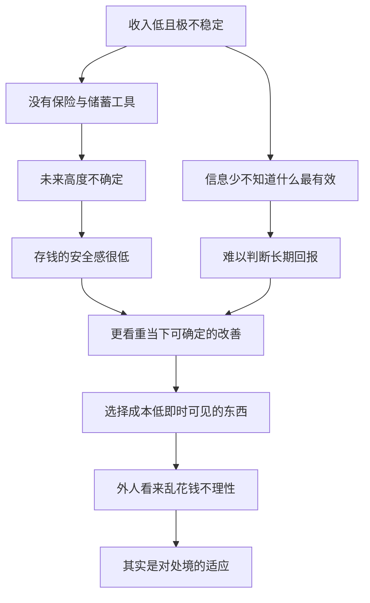

# 03｜穷人真的是“又懒又不理性”吗？

> 穷人那些看似“不明智”的选择，究竟是不是愚蠢？

---

## 一、先说结论

两位作者给出的是一个相当不客气的结论：**把穷人当成“又懒又不理性”，本身就是一种傲慢，也是一种错误。**

他们的判断是：穷人的很多选择，是在**极度匮乏、风险极高、信息极少**的处境下做出的合理适应。你看到的是“乱花钱”，他们面对的是“一个没有安全网的世界”。同一个行为，放在不同的约束下，含义完全不同。

所以作者强调：理解贫穷的前提，是**先站到穷人的处境里**。如果一开始就假定他们愚昧，那么设计出来的政策，注定会失败——因为它针对的不是真实的约束，而是我们自己想象中的懒惰。

---

## 二、我们先理解一个问题

先看一个让很多人皱眉的场景。

一个贫困家庭，终于攒下一点钱。你原以为他们会拿去买更多粮食、添些衣物，或存起来以防万一。

结果他们把第一笔钱用来买了一台电视。

看到这个，很多人的第一反应是：**“果然，穷人就是不理性，有钱先享受。”** 这个判断来得太快，也太符合直觉。它把“买电视”直接等同于“不懂事、不负责、不配得到帮助”。

但我们先别急着下结论。真正该问的是：

> 在一个收入极不稳定、随时可能被一场病击穿的处境里，
> 花一点钱买一台电视，真的是“非理性”吗？

---

## 三、作者到底提出了什么观点？

**两位作者认为**，判断一个选择是否理性，不能脱离选择者所处的约束条件。

他们反复提醒：穷人和你我并没有两套心智，区别在于**他们面对的世界不一样**。这个世界有三个特征：

**第一，风险极高、缓冲极少。** 没有医保、没有失业保险、没有储蓄工具。一场病、一次歉收、一笔意外支出，就能抹掉多年的积累。在这样的世界里，把钱全部押在“未来的稳妥”上，未必是最优解。

**第二，信息极少。** 他们往往不知道哪种药真有疗效、哪个学校真能改变命运、哪种储蓄方式更安全。信息越少，判断越容易偏离书本上的“最优”。

**第三，即时压力更大。** 当每一天都在为当下发愁时，“先让今天好过一点”不是短视，而是一种调节。一台电视带来的，不只是娱乐，也是在沉闷、艰难、少有出路的生活里，**一点可支配的快乐与尊严**。

因此作者的立场是：**穷人的选择是“在给定约束下的理性”，而不是“愚蠢”。** 把约束拿走、只看行为，得出的必然是偏见的结论。

---

## 四、把这个观点翻译成人话

把它想成一场考试。

同班两个学生，一个坐拥全套资料、有家教、睡眠充足；另一个只有半本破书，还要打工，家里随时可能出事。考完试，前者分数高。请问：**后者分数低，是因为他“不努力”吗？**

大概率不是。真正拉开学分差距的，是两人手里的资源完全不同。

“穷人买电视”也是同一回事。我们在一个安全的、有储蓄、有保险的世界里，当然可以说“应该先存钱”。但对一个连“明天会不会出意外”都无法确定的人来说，**把钱换成一台能用很多年、每天都能带来陪伴与放松的电器，未必比存进一个随时会被意外掏空的“罐子”更亏。**

理性不是“做书上说的正确选择”，而是“在自己的约束里，尽量让自己不那么糟”。

---

## 五、为什么会这样？

把“看着不理性”拆成一条链：

关键在 **C → D → G** 这一段。

正因为未来的不确定性太高，**“为遥远的以后省钱”这件事，在穷人那里带来的心理回报，反而比我们想象的低。** 不是他们不懂“存钱有价值”，而是他们清楚地知道：这笔钱可能根本留不到用它的那天。

所以，与其说穷人“不看长远”，不如说他们的处境让“长远”变得不可靠。

---

## 六、举一个现实生活中的例子

回到那台**电视**。

研究者走访贫困家庭时发现，不少家里明明食物并不充裕，却仍有收音机、电视这类“非必需品”。这让许多观察者得出结论：穷人宁可要娱乐，也不要营养，可见其不理性。

但作者拆开来看，看到了另一层：

第一，这些家庭**并不是“吃不饱到快饿死”**。他们有基本的食物，只是营养不够好（这一点在下一篇里还会展开）。换句话说，买电视并没有以“饿死某人”为代价。

第二，这些电器往往是**分期购买、全家共用、能用很多年**的耐用品。折算下来，它带来的持续快乐，可能是这笔钱能买到的最“经久”的东西之一。

第三，在一个几乎没有娱乐、没有假期、很难看到希望的环境里，**一台电视提供的心理慰藉，本身就是一种真实的需求**——不是奢侈，是撑着活下去的一部分。

也就是说，同样的“买电视”，放在“月入几万、有医保有存款”的人身上，也许是个审美选择；放在“天天担心明天”的人身上，它是对不确定性的一种应对。**行为一样，处境不同，意义就不同。**

---

## 七、回到书中重新理解

理解了这一点，就能明白作者为什么把“理性”二字看得这么重。

他们不是在替穷人开脱，也不是说穷人的每个选择都对。他们真正反对的，是**从外部、带着优越感去做判断**：

- 看到不买蚊帐，就说“愚昧”——却不去问蚊帐贵不贵、买不买得到、用了会不会觉得闷；
- 看到不存钱，就说“不会过日子”——却不去问有没有安全、方便、不会被亲友借走的储蓄方式；
- 看到买电视，就说“不理性”——却不去问他们一天要在什么环境里熬多久。

这种判断一旦进入政策，后果是严重的。因为**你按“他们蠢”来设计，就不会去降低门槛、提供信息、改变激励，只会去做宣传教育——然后失败，再把失败归因于“他们就是不听”。**

作者的结论因此很朴素：**先理解约束，再谈改变。** 这不是宽容，这是解决问题的唯一有效路径。

---

## 八、这个观点背后还有什么？

**第一，它把“理性”从道德判断里解放出来。** 理性不等于高尚、不等于省吃俭用，而是在约束下做出对自己最不坏的选择。

**第二，它直接把矛头指向“污名化”。** 用“懒”“蠢”“不争气”解释贫穷，最省事，也最有害——因为它让帮助者免于思考，让被帮助者承受羞辱。

**第三，它意味着政策要“体贴人性”。** 如果人会在当下与长远之间挣扎，那政策就不该一味说教，而应让正确的选择变得更容易：把健康食品放得更便宜、把储蓄变得不方便乱取、把好学校的门槛降低。

**第四，它也暗含一个提醒：** 我们每个人的“理性”，其实都依赖于自己拥有的资源。今天的判断力，部分是安全感买来的。

---

## 九、这个观点有问题吗？

有，而且这正是本书最常被挑战的地方之一。

**一些行为经济学家认为**，把穷人的行为一概归为“理性适应”，可能走过了头。他们的证据是：

**第一，有些选择确实存在系统性的偏差。** 比如对即时满足的偏爱、对概率的直觉性误判、在压力下注意力被耗尽。这些偏差在穷人身上可能更强，不能全用“约束”解释。

**第二，同样的约束下，人也会做出明显更差的选择。** 比如把有限的资源花在低效甚至有害的“治疗”上（后文会讨论），很难说这是最优。

**第三，认知负荷的影响。** 有研究显示，长期的资源匮乏会挤占人的注意力与决策能力，使人更容易犯错。这既支持“处境塑造选择”，也说明选择本身确实可能变差。

**第四，“理性”的门槛怎么定，也有争议。** 如果任何选择都能被解释成“对处境的适应”，那么“理性”这个概念就失去了区分能力。

**所以更平衡的看法是**：作者的下述判断无疑是正确的——**不该用“懒”和“蠢”去解释贫穷，贫穷的选择受到严峻约束。** 但他们可能低估了**约束之外，人性中那些普遍的、系统性的认知偏差**——这些偏差不分贫富，只是在匮乏中被放大。**既要同情处境，也要承认人会犯错；这两件事并不矛盾。**

---

## 十、今天再看这个观点

以下部分是基于本书思想的现代延伸，不是两位作者的原话。

在今天，这套思路已经渗进了很多领域。产品设计、信贷、公共政策，都开始认真对待“人不是完全理性的计算器”这件事：默认选项、即时反馈、简化流程，被用来帮人做出更好的决定。

但也要小心它的另一面。**当“行为设计”被用来让人更容易消费、更容易借贷、更容易沉迷时，它就成了一种精致的操纵。** 平台可能比你更懂你的偏差，然后用它来赚钱。

所以这本书真正给人的提醒，不只是“别怪穷人”，而是一句更普遍的话：**每个人的选择都受处境和偏差影响。理解了这一点，是为了让环境对人更友善，而不是让更有权力的一方用它来占便宜。**

---

## 十一、这一篇真正应该记住什么？

1. **穷人的选择多是“约束下的理性”。** 换成你的处境，你未必做得更好。
2. **别用“懒”“蠢”解释贫穷。** 这种解释最省事，也最误导政策。
3. **同样的行为，在不同处境下意义不同。** 买电视不是奢侈品，可能是真实的慰藉。
4. **理解约束，才能改变行为。** 政策要降低门槛、改善信息、体贴人性。
5. **但别走向另一个极端。** 人也确实会犯系统性错误，同情处境与承认偏差可以并存。

---

## 十二、留一个问题

> 如果穷人的许多选择，其实是在极端约束下的合理反应，
> 那么你是否愿意再想一层：
> 当你觉得某个人的选择“不可理喻”时，
> 你看到的，是他的愚蠢，还是他没说出口的处境？

---

**下一篇**：既然“买电视”已经把话题引到了吃，那就顺着往下问一个更根本的问题——贫穷的第一难题，真的是“吃不饱”吗？把粮食给够，营养问题就解决了吗？
