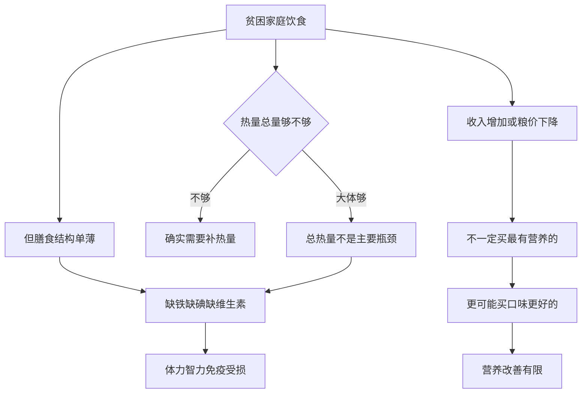

# 04｜穷人最缺的是粮食吗？

> 贫穷的第一问题是“吃不饱”吗？

---

## 一、先说结论

两位作者给出的判断，又一次与直觉相反：**对很多穷人来说，最缺的并不是“粮食总量”，而是“营养质量”。**

他们发现，多数贫困家庭并没有处在“饿到无法生存”的状态，热量摄入大体够用。真正拖累他们的，是**膳食结构单薄、微量元素不足**——缺铁、缺碘、缺维生素。这些不是“多一碗饭”能补上的。

所以作者的态度是：**“多给粮食”未必解决营养问题。** 如果把贫穷的第一难题想当然地定成“吃不饱”，那么解决办法也会跟着错——发再多的主食，也可能补不到真正缺的那一环。

---

## 二、我们先理解一个问题

我们习惯了一个画面：穷人面黄肌瘦、食不果腹，“吃饱饭”是他们的头等大事。

这个画面有它真实的来源，但它也可能过于简单。因为它默认了一件事：**只要把热量灌够，营养问题就解决了。**

可是营养从来不只是“多少卡路里”。人要活下去、要长身体、要能劳动、要能思考，需要的不只是热量，还有蛋白质、铁、碘、各类维生素。一个人可以每天吃得很饱，同时严重缺铁或缺碘——而这两样东西，恰恰在悄悄损害他的体力、智力与未来。

于是真正值得追问的问题是：

> 穷人的头等难题，到底是“吃不够”，还是“吃不好”？
> 如果是后者，那么“多发粮食”真的对口吗？

---

## 三、作者到底提出了什么观点？

**两位作者认为**，关于穷人的营养问题，需要把“热量”和“营养”分开来谈。

他们的观察大致有几点：

**第一，多数穷人并没有“饥饿”到无法劳动的程度。** 贫困确实限制饮食，但在很多地区，基本热量是能保证的，至少不至于让人完全失去体力。

**第二，营养问题的关键在“结构”。** 缺铁会让人疲惫、注意力下降、劳动能力降低；缺碘会影响儿童智力发育；缺乏某些维生素会削弱免疫力。这些“微量”的缺乏，造成的却是巨大的、长期的损失。

**第三，穷人对食物的选择，不只是“填饱肚子”。** 这一点尤其反直觉：当收入或价格变化时，他们不一定会把多出来的购买力换成“最有营养的”食物，而更可能换成**口味更好、更体面、更让人愉快**的食物。

第三点，是这一篇最核心、也最容易被误解的地方。它并不意味着穷人“不懂营养”，而是说明：**吃什么，从来不只是营养计算，还关乎口味、习惯、社交与尊严。**

---

## 四、把这个观点翻译成人话

把它想成“给车加油”。

如果一辆车跑不动，你第一反应是“没油了”，于是猛加油。可如果问题其实出在**机油、冷却液或某个零件**上，那么加再多的汽油也没用——甚至方向就是错的。

“多给粮食”的思路，就是只盯着汽油。它默认“能量不够”是唯一瓶颈，却没看到，真正缺的可能是“某几种关键成分”。

而“口味优先”这件事，也可以换个角度理解。我们劝人“要吃得健康”，自己也常常做不到——爱吃的东西未必最营养。穷人同样是人，也有口味偏好，也想在有限的生活里，吃到一点让自己开心的东西。**差别不在欲望，而在预算。**

所以作者的提醒是：**别把“营养”当成纯技术问题。** 它同时是经济问题、习惯问题、心理问题。只算热量，就会看漏一大半真相。

---

## 五、为什么会这样？

把这条逻辑拆开：

关键在 **H → I → J** 这一段。

当价格下降或收入上升，经济学上的“理性人”应该去买更多、更营养的食物。但现实是：**人一旦有了一点余裕，第一件事往往是“吃得更好吃”，而不是“吃得更科学”。** 这不是穷人独有的毛病，而是普遍的人性。只是对穷人来说，这一点点余裕太宝贵，方向一旦偏向口味，营养的改善就被推迟了。

理解了这条链，就能明白为什么单纯“让粮食更便宜”，未必能解决营养问题。

---

## 六、举一个现实生活中的例子

来看那个被反复观察到的现象：**收入增加后，穷人更可能买口味更好的食物，而不是最有营养的。**

研究者在中国、在印度，都看到过类似的情形。当收入提高、或某种主食价格下降时，人们的反应往往不是“在原有的饭量上再加几碗”，而是**换一种吃法**：

- 从粗粮转向更精细、口感更好的主食；
- 从“吃饱就行”转向“吃点有味道的、体面的”；
- 减少某些便宜但单调的食物，增加肉、油、糖这类更香、更解馋的东西。

结果可能是：**热量并没有显著增加，甚至没有增加；而营养结构也未必变得更均衡，某些时候反而更糟**——比如油和糖的摄入上升了，而微量元素依旧缺乏。

这并不是说穷人“不珍惜健康”。它说明一件更朴素的事：**当日子稍微好过一点，人首先想满足的，是味觉和心情，而不是一份营养清单。** 你我多半也是如此。

于是作者得出结论：**光靠提高收入或压低粮价，未必自动带来营养改善。** 想要真正补上营养缺口，需要有更直接的干预——比如食品强化、营养补充、改变关键食品的价格结构。

---

## 七、回到书中重新理解

把这一点放回全书，就能理解作者为什么反复强调“**别误判约束在哪里**”。

如果我们认定贫穷的第一问题是“吃不饱”，政策就会去发粮食、补贴主食。但如果真正的瓶颈是“缺铁、缺碘、缺维生素”，那么这些努力就会打偏——**粮食便宜了，人却依然缺营养。**

这也解释了为什么一些“看似很小”的干预，效果却出奇地好：**在盐里加碘、在食物里强化铁、给孕妇和孩子补充微量营养素。** 这些做法成本不高，却能实实在在地改善体力、智力与健康。它们的共同特点是：**直接命中真正缺失的那一环，而不是笼统地“多给一点”。**

作者的方法论在这里再次出现：**先弄清到底缺什么，再决定给什么。** 贫穷不是一个大问题，而是一堆不同的小问题，营养就是其中最容易被“想当然”的一个。

---

## 八、这个观点背后还有什么？

**第一，它区分了“热量不足”和“营养不足”。** 两者常被混为一谈，但解决方式完全不同。

**第二，它说明“给钱”不一定等于“吃得更好”。** 钱会流向口味、习惯与社交需求，而不只是营养。

**第三，它把营养问题与“人力资本”绑在一起。** 缺铁、缺碘造成的体力与智力损失，会直接影响一个人未来的收入——营养因此不是消费，而是投资。

**第四，它提醒政策要“精准”。** 与其泛泛地补贴粮食，不如针对特定人群、特定营养素做干预。

**第五，它也提醒我们：** 认为穷人“连饭都吃不饱”的想象，既可能夸大，也可能因此错过了真正该做的事。

---

## 九、这个观点有问题吗？

有。这个结论同样有它的边界与争议。

**第一，地区差异极大。** “热量大体够用”在某些地区成立，但在另一些极端贫困、连年歉收或遭遇饥荒的地方则完全不成立。把这些地方的饥饿问题一概说成“结构问题”，是危险的。

**第二，测量困难。** 人吃了多少、吸收了多少，极难精确测量；家庭调查常常低估或高估摄入量。“热量够不够”本身就是一个有争议的判断。

**第三，关于“口味优先”，学界存在不同解释。** 一种解释是：穷人并非不重视营养，而是在信息不足、价格波动与口味偏好之间做了权衡；另一种解释则强调，收入提高到一定水平前，营养改善本来就有限。两种解释各有一批支持者，至今没有定论。

**第四，作者并非否定饥饿的存在。** 他们反对的是把它当成一个笼统的、放之四海皆准的第一原因。

**所以更平衡的说法是**：作者成功地纠正了“穷人穷首先因为吃不饱”的简单印象，把注意力引向了营养质量这一常被忽略的维度；但这不等于饥饿问题已经无关紧要。**在有些地方，吃饱依然是第一步；在更多地方，吃好才是关键。分清这两者，是这一篇真正的贡献。**

---

## 十、今天再看这个观点

以下部分是基于本书思想的现代延伸，不是两位作者的原话。

在今天，这套思路已经被推得更远。人们越来越清楚：**营养问题不只是“发展中国家的问题”，也不只是“穷人的问题”。**

一方面，食品强化、微量营养素补充、学校供餐等技术手段，在全球范围内持续改善着无数人的健康与学习能力。另一方面，一个新的问题出现了：**当便宜、可口、高热量的加工食品铺天盖地，营养不足和营养过剩开始同时存在。** 一些人仍然缺铁缺碘，另一些人则因过量的糖、油、盐而付出健康代价。

这恰好呼应了本书的一个基本判断：**人在食物面前的偏好，从来不是一张营养表。** 无论是穷人还是富裕社会，真正的难题都不是“有没有吃的”，而是“什么样的食物更容易得到、更让人想吃”。**改善营养，与其说是在教育人，不如说是在设计环境——让更健康的选择，同时变得更便宜、更方便、也更体面。**

---

## 十一、这一篇真正应该记住什么？

1. **贫穷的营养问题，常不是“热量不够”，而是“结构不好”。** 缺铁、缺碘、缺维生素才是隐形杀手。
2. **“多给粮食”未必解决问题。** 方向错了，投入再多也会打偏。
3. **收入增加未必带来营养改善。** 人更可能先买口味，而不是先买营养。
4. **营养是一种投资。** 它影响体力、智力与未来的收入。
5. **政策的落点应是“精准补缺”。** 强化食品、补充微量元素，比笼统补贴更有效。

---

## 十二、留一个问题

> 如果贫穷的营养难题，往往不是“够不够”，而是“对不对”，
> 那么当我们说要“帮穷人吃饱”时，
> 我们真正该给的，是更多的粮食，
> 还是更懂他们的一份设计？

---

**下一篇**：既然“吃什么”背后是选择，那就接着问一个更让人意外的问题——明明有回报极高的预防手段，比如疫苗和蚊帐，为什么还是有那么多人不用？
