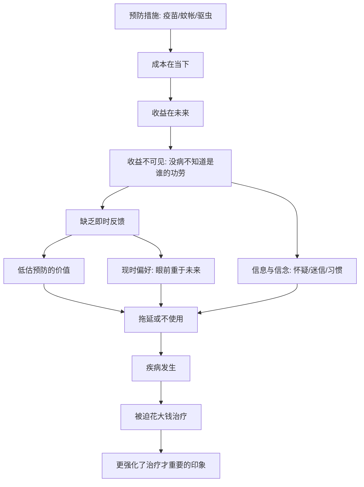

# 05｜为什么免费的疫苗和蚊帐，还是有人不用？

> 预防的回报那么高，为什么送到家门口还是有人不用？

---

## 一、先说结论

两位作者认为，预防性健康投入（疫苗、蚊帐、消毒、驱虫）的回报极高，却长期被低估。问题不在于“免费”，而在于**预防的好处看不见**。

一个人打了疫苗没有生病，他不会知道是疫苗救了他；蚊子被蚊帐挡住，他也不会因此感谢谁。预防的收益发生在未来、又缺乏即时反馈，于是被系统性地忽视。

因此，让预防普及起来的办法，不是反复讲道理，而是**把正确的做法变得更容易、更省事**——比如送上门、设得更近、给一点小激励。这就是“助推”。

---

## 二、我们先理解一个问题

先看一个反直觉的现象。

在疟疾高发的地区，一顶蚊帐能显著降低感染风险；疫苗、驱虫这类措施，成本低、效果好，几乎是公共卫生里性价比最高的买卖之一。

可现实中，即使把这些东西**免费**提供，甚至**送到家门口**，使用率往往仍然不理想。有人不接种，有人领了蚊帐却不用。

这就奇怪了：既然几乎不花钱、又能防病，为什么还有人不用？

如果只站在旁观者角度看，很容易得出结论——“他们不理性”“不珍惜免费的东西”。但两位作者提醒我们：这样想，恰恰是政策失败的开端。

---

## 三、作者到底提出了什么观点？

两位作者的核心判断是：**预防被低估，不是因为价格，而是因为它的收益不可见。**

他们把与健康有关的行为分成两类：

- **治疗**：疾病已经发生，痛苦是眼前的，治好与否立竿见影；
- **预防**：现在付出，未来受益，而你往往感觉不到自己躲过了什么。

前者的回报看得见、来得快；后者的回报看不见、来得慢。人天生对前者反应更强。

所以，两位作者的结论是：**阻碍预防普及的第一道墙，是认知与时间，而不是钱。** 价格当然重要，但在很多情境下，即便价格降到零，需求依然上不去。

---

## 四、把这个观点翻译成人话

可以把它想成“功劳看不见”。

你打了疫苗，然后一整年都没得病。你会怎么想？你多半会觉得“本来就不会得”，而不是“是疫苗保护了我”。防住了，等于什么都没发生；一旦没防住，你反而会怪它没用。

这就好比给房子装了防盗门。没被偷，你永远不知道门起了多大作用；而被偷过一次的人，才会立刻愿意花钱加固。

人还有另一种倾向：**眼前的一百块，比明年的一千块更有吸引力。** 预防是现在花钱、未来受益，治疗是现在花钱、现在舒服。多数人会先把眼前的日子过好。

再加上信息不足——有人担心疫苗不安全，有人觉得祖祖辈辈都这么过来的——这些信念都会压低接种意愿。

一句话：**预防输给了看不见和等不及。**

---

## 五、为什么会这样？

把这条逻辑链拆开看：

关键在 **D 到 F** 这一跳。

预防的效果是“没有发生的事”，而人对“没有发生的事”几乎没有感知。于是，明明回报最高的投入，反而最容易被跳过。这不是某个人糊涂，而是人类认知的普遍弱点，穷人在其中只是被放大了代价。

---

## 六、举一个现实生活中的例子

书里反复出现的一个场景，就是**免费疫苗与免费蚊帐**。

研究者曾在疟疾流行的地区做过这样的尝试：在条件相似的村庄里，有的只提供常规的接种点，有的把接种服务**送到村里、送到家门口**，有的再加上一点象征性的小奖励。

结果很能说明问题：**仅仅免费，并不足以让接种率大幅提高。** 真正有效的，是把服务挪到人们身边、降低去一趟的时间与麻烦，再加上一点点即时的好处。

也就是说，挡住人们的往往不是多少钱，而是要走多远、要等多久、值不值得今天跑一趟。当接种点就在村口、顺路就能完成，使用率就明显不同。

同样的逻辑也适用于蚊帐：免费发放后，只要发放渠道顺畅、人们当场就能拿到，覆盖和使用就会好得多；而领用环节一旦麻烦，再便宜也可能被搁置。

---

## 七、回到书中重新理解

现在再回头看两位作者为什么在健康这一章里反复强调预防和助推，就顺了。

他们想纠正的，是一种居高临下的假设：**这么划算的事还不做，一定是人傻。** 而真实情况是，人并不按照回报率行事，而是按照感受行事——看得见的痛苦、看得见的好处、眼前就能完成的动作。

政策的意义因此不在于训诫，而在于**替人搬开那几块拦路石**：把服务送近一点，把流程简化一点，把默认选项设成接种。

理解了这一点，也就能理解下一章的问题：为什么穷人把有限的钱，更多地花在了治疗上，而不是预防上。

---

## 八、这个观点背后还有什么？

**第一，这是行为经济学的典型场景。** 现时偏好、损失厌恶、心理账户，都会让人高估眼前的治疗、低估未来的预防。

**第二，供给端的质量同样重要。** 就算人愿意来，如果诊所经常没人、态度冷淡、要排很久，意愿也会被消磨。可及性本身就是需求的一部分。

**第三，信任是隐形的门槛。** 对疫苗、对医护、对政府的不信任，会让好心的服务也推不动。这种不信任往往来自过去的糟糕经历。

**第四，预防还有外部性。** 一个人接种，也保护了周围的人。这意味着预防的社会回报比个人回报更高，也给搭便车留下了空间——别人防住了，我就可以不防。

---

## 九、这个观点有问题吗？

有，而且值得认真对待。

**一种批评认为**，把预防不足主要归因于个体认知，可能低估了结构性的障碍：偏远地区根本没有合格诊所、医护人员长期缺勤、女性出门接种需要家庭许可、往返要损失一天的收入。在这些约束下，不去接种未必是认知偏差，而是现实所迫。

**另一种质疑指向助推本身。** 用默认选项、小奖励去引导行为，效率很高，但边界在哪里？如果被用来推销对提供者有利、对个人未必有利的东西，就可能变成操纵。

**关于价格是否真的无关，学界也存在不同解释。** 一些发展经济学家认为，完全免费可能让部分人觉得不值钱而怠慢；也有实验显示，小额收费能筛选出更有意愿的使用者。但作者一方的观察是：免费或极低价格，并没有显著降低使用率，反而扩大了覆盖。就免费是否会降低使用这一问题，学界仍有争论，答案可能取决于具体情境与人群。

**所以更准确的说法是**：预防普及难，是认知、供给、信任、结构多重因素叠加的结果。把责任全推给个人，或者全推给系统，都只看到了一半。

---

## 十、今天再看这个观点

以下部分是预防与行为干预研究的现代延伸，不是两位作者的原话。

今天，“让正确的事更容易做”已经成为公共政策的常用工具：疫苗预约自动提醒、社区健康工作者上门、把体检设为默认选项、给按时接种设立正向激励。在传染病防控、慢病管理、器官捐献登记等领域，都能看到这套思路。

同时，经验也带来了新的教训。**可及性不等于信任。** 只把服务送到门口，不解决人们对信息与机构的疑虑，意愿依然上不去。新冠疫情的经历就说明：供给再充足，只要信任缺失，接种率仍然会卡住。

所以这本书给我们的，不只是一条健康建议，更是一种设计观：**别指望靠喊话改变行为，要去改环境、改流程、改默认选项。**

---

## 十一、这一篇真正应该记住什么？

1. **预防的回报极高，却最容易被跳过。** 因为它的好处看不见、来得慢。
2. **障碍不主要是价格。** 免费不等于会被使用。
3. **现时偏好与信息不足，是两道主要的墙。** 人对眼前、可见的东西反应更强。
4. **让正确的事变容易，比讲道理有用。** 送上门、简化流程、给点小激励。
5. **但也要看到供给与信任。** 认知不是唯一答案，结构性的限制同样真实。

---

## 十二、留一个问题

> 如果预防的价值在于什么都没发生，
> 那么在一个只看重看得见的结果的世界里，
> 还有多少真正重要的事，正因为我们感觉不到，而被悄悄省略？

---

**下一篇**：如果说预防是隐形的收益，那么治疗就是显形的支出——一有小病就急着打针输液，却省下最便宜的疫苗。为什么穷人的医疗支出，常常花在低效甚至有害的地方？下一篇我们就来拆开这个问题——**为什么穷人更愿意花钱“治病”而非“防病”。**
