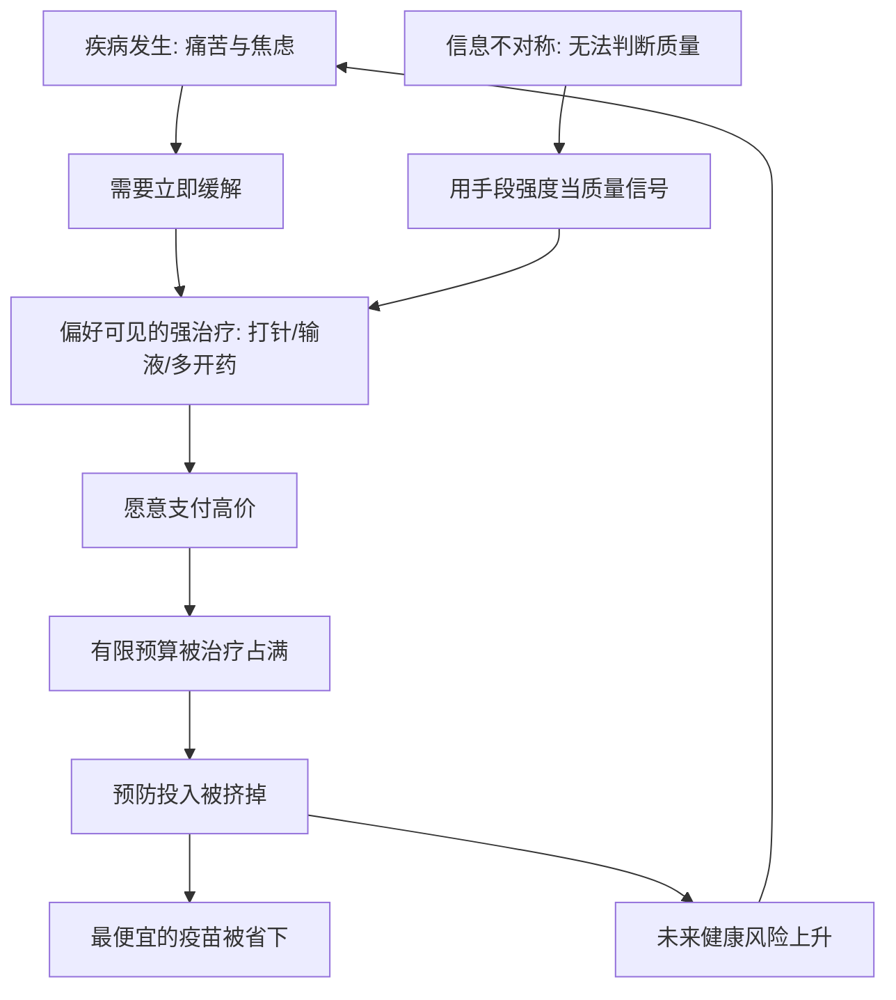

# 06｜为什么穷人更愿意花钱“治病”而非“防病”？

> 为什么有限的医疗支出，常常花在了低效甚至有害的地方？

---

## 一、先说结论

两位作者认为，穷人在医疗上的钱其实花得并不少，问题在于**结构扭曲**：钱更多流向了昂贵、立竿见影、往往无效甚至有害的治疗（打针、输液、抗生素），而最便宜的预防却被省下。

原因有两层：需求端，治疗有即时、可见的回报，预防没有；信息端，病人难以判断医疗质量，于是把打了针、开了很多药当成好医生的标志。

政策启示因此是：**让正确的做法更容易、更便宜**，并提高正规医疗的可及与可信。

---

## 二、我们先理解一个问题

先看一个常见的场景：一个人有点小病，立刻去诊所要求打针输液；而旁边免费的疫苗，却一直没去打。

奇怪的地方在于：输液往往更贵、风险更高、对很多小病并无必要；疫苗便宜、有效、能防大病。从性价比看，这个选择几乎是反的。

为什么会出现这种“花大钱买低效，省小钱漏高效”的选择？这正是两位作者要追问的：有限的医疗支出，究竟为什么流向那些未必管用的地方？

---

## 三、作者到底提出了什么观点？

两位作者认为，这不能简单归为无知。贫穷环境下的医疗选择，有它自己的逻辑：

- 疾病发生时，痛苦与焦虑迫在眉睫，治好了马上能感觉到；
- 预防没有这种即时反馈，没得病很难归功于疫苗；
- 医疗市场信息高度不对称，病人无法评价谁是真正合格的医生。

在这样的条件下，人们会用**看得见的信号**判断质量：谁给打针、谁给开更多药、谁更顺着病人的要求，谁就像更好的医生。而预防，在这个评价体系里几乎得不到分数。

因此，两位作者的判断是：**不是穷人不重视健康，而是他们把钱投向了能立刻看到效果的地方。**

---

## 四、把这个观点翻译成人话

可以把它想成“修屋顶”和“补漏洞”。

漏水了，你立刻找人修，花多少钱都愿意，因为眼看着就不漏了。而换一根旧水管、补一块防水层，你永远不知道它避免了多大的损失，于是总往后拖。

医疗也一样。打一针，症状马上缓解，钱花得踏实；打疫苗，打完什么感觉都没有，你会怀疑这钱是不是白花了。

还有一个心理：**输液看起来更重、更认真。** 在信息不足时，人们往往用“治疗手段的强度”来判断“医生是否尽力”。越是被尊重、越是被“下猛药”，越觉得钱花得值。

---

## 五、为什么会这样？

把这条逻辑链拆开看：

关键在 **H 到 I** 这一跳：当质量难以判断时，价格与手段的重就成了替代信号，而这恰恰把需求推向更贵、未必更有效的治疗。

于是形成一个循环：治病花掉的钱越多，越显得治疗才是要紧事；预防被省下，未来的病又更多。有限的预算，就此在“看得见”的一端不断被吸走。

---

## 六、举一个现实生活中的例子

书里描述过这样的现象：在不少贫困地区，人们一旦身体不适，会同时找好几个医生，或去私人诊所要求打针输液，觉得这样才管用；与此同时，免费的疫苗接种却被一拖再拖。

研究者发现，穷人的医疗支出中，有相当大的部分流向了私立、非正规的提供者。这些诊所未必合格，但它们有一个明显优势——**近，而且愿意顺着病人**。当公立诊所经常没人、态度冷淡、要排很久，人们自然转向眼前这个能马上解决问题的地方。

结果就是：钱确实花出去了，健康却未必改善。有些治疗不但无效，甚至有害——过度使用抗生素、滥用注射，本身就可能带来风险。用最便宜的疫苗能防住的病，反而被留给昂贵的治疗去应付。

---

## 七、回到书中重新理解

回看这一章，两位作者真正想说的，其实是**医疗市场的信息问题**。

在普通商品市场，你能通过反复购买判断好坏；但在医疗上，你常常无法判断——你不知道这次康复是治疗起了作用，还是本来就会好。这种信息不对称，让会顺从、会开药的提供者反而更有竞争力。

所以政策的方向不是责怪病人，而是：**提高正规医疗的可及性与可信度，同时让预防变得省事。** 免费疫苗、就近接种、可靠的健康教育，都是在修正这个扭曲的市场。这也解释了他们为什么一再强调：要让正确的做法更容易、更便宜。

---

## 八、这个观点背后还有什么？

**第一，信任与传统。** 对正规医疗的不信任，会把需求推向熟悉的、看起来更负责的非正规提供者。

**第二，供给端激励。** 私立诊所靠卖药和注射盈利，天然有诱导需求的动力。过度治疗，未必全是病人的选择。

**第三，风险与因病致贫。** 一次大病的开销可能压垮一个家庭，治病因此是不得不花的钱，而预防总觉得可以以后再说。

**第四，保险的缺失。** 没有医保兜底，人们只能靠短期的、可见的治疗来应付，很难为长期健康做规划。

---

## 九、这个观点有问题吗？

有，而且这一领域争论不少。

**一种批评认为**，把过度治疗主要归因于病人的选择，可能低估了正规医疗的缺位。在很多地方，穷人附近根本没有合格的医生，私立诊所虽然差，却是唯一够得着的选择。这不是偏好问题，而是约束问题。

**另一些发展经济学家认为**，过度医疗里很大一部分是供给方诱导的结果——提供者有动机多开药、多打针，不能把账都算在病人头上。

**关于信息能否改变行为，学界存在不同解释。** 有研究显示，向人们说明抗生素对普通感冒无效、或提供质量信息，能明显改变就医行为；也有研究提醒，信息干预的效果高度依赖情境与信任基础，未必处处有效。

**所以更准确的说法是**：医疗支出结构失衡，是需求偏差、供给激励与制度缺位共同作用的结果。只改一头，效果都有限。

---

## 十、今天再看这个观点

以下部分是医疗行为与公共卫生的现代延伸，不是两位作者的原话。

今天，这套逻辑在全球范围内回响：抗生素耐药已经成为严峻的公共卫生问题，过度输液、过度用药的文化在很多地方依然存在；与此同时，互联网让人们先自我诊断、再走进医院，信息既更多也更杂。

在制度层面，越来越多的医保与卫生体系尝试用预防激励来纠偏——免费体检、慢病管理、分级诊疗，让防病比治病更划算。这些做法的背后，正是同一个判断：人会跟着“更容易、更划算、更可见”的选项走。

这本书提醒我们的核心，其实没有过时：**当正确的做法又贵又麻烦时，人们就会去做那个又便宜又立刻见效、但未必正确的选择。**

---

## 十一、这一篇真正应该记住什么？

1. **医疗支出的问题不在总量，而在结构。**
2. **治疗可见、即时；预防不可见、延迟。**
3. **信息不对称，让“手段重”被当成“质量高”。**
4. **政策要做的是让正确的做法更容易、更便宜，而不是责怪病人。**
5. **供给激励与正规医疗缺位，同样是重要原因。**

---

## 十二、留一个问题

> 如果你生病时也倾向于多打一针才安心，
> 那么在信息不足的地方，
> 我们究竟是靠理性选择，还是靠看起来更用力，
> 来判断什么是好的照顾？

---

**下一篇**：健康之外，另一个被寄予厚望的脱贫工具是教育。学校建起来了，孩子也坐进了教室，可成绩依然上不去。问题究竟出在哪里？下一篇我们就来拆开这个问题——**为什么教育投入未必换来成绩。**
