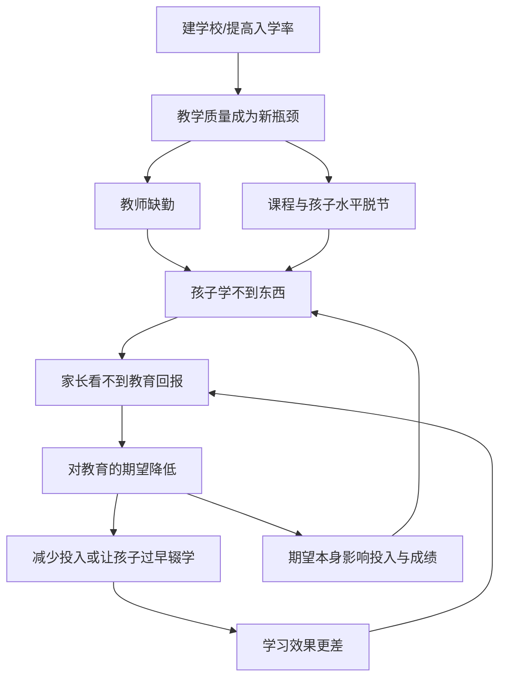

# 07｜为什么教育投入未必换来成绩？

> 学校建起来了、孩子也上学了，为什么学习效果还是差？

---

## 一、先说结论

两位作者认为，教育的问题往往不在有没有学上，而在**质量与期望**：老师是否认真教、课程是否匹配孩子的水平、家长是否相信教育能改变命运。

在很多地方，入学率已经不低，但真正学到的东西很少。更关键的是，家长的期望会反过来影响孩子的投入——**期望本身就能改变结果**。

因此，继续增加学校数量，未必能提高学习；把钱和注意力用在教得怎么样上，才更接近瓶颈。

---

## 二、我们先理解一个问题

想象一所学校：教室有了，课本发了，孩子也来了。看起来，教育的机会已经给到了。

可一年之后，很多孩子仍然读不懂一段简单的课文，算不对几道基础题。

问题出在哪？孩子不努力？家长不上心？还是别的？这正是两位作者要追问的：**当入学这一关基本过了之后，真正卡住教育的，到底是什么？**

---

## 三、作者到底提出了什么观点？

两位作者认为，教育的瓶颈往往在两个地方。

**一是质量。** 老师可能经常缺勤，课程难度与孩子的实际水平脱节——教材按少数能升学的孩子设计，大多数孩子跟不上，慢慢被放弃。学生坐在教室里，却没有真正学会。

**二是期望。** 家长对教育能带来什么回报的预期，会显著影响他们让孩子学习、坚持的投入。如果家长觉得读了也没用，孩子就很难被推着走下去。

也就是说，教育不是把资源投入进去就自动产出成绩。**中间隔着教得怎么样和信不信有用这两道关口。**

---

## 四、把这个观点翻译成人话

可以把它想成健身。

办了年卡、进了健身房，不等于你会变壮。关键是有没有认真练、练的方法对不对、你信不信坚持下来有用。只把健身房建在家门口，却没人好好教你，结果多半还是老样子。

教育也一样。**上学是进门，学会才是结果。** 而进门和结果之间，差的正是老师、课程和家长的期待。

还有一个容易被忽略的点：如果家长判断读了书也找不到好工作，那么他少投入、早让孩子去挣钱，对他来说未必是短视，而可能是对现实的理性回应。这一点，后面还要专门回来看。

---

## 五、为什么会这样？

把这条逻辑链拆开看：

关键在 **F 到 G 再到 J** 这条回路：期望不是结果之后的态度，而是会**主动塑造**投入和成绩。低期望会自我实现——家长越不信，孩子越学不好；孩子越学不好，家长越不信。

---

## 六、举一个现实生活中的例子

书里提到过一类实验，思路很直接：**把信息交给家长。**

比如，让家长知道孩子的实际学习水平，或告诉他们教育在现实中能带来多少回报。这些信息本身，就可能改变家长对孩子上学的态度与投入。

与此同时，研究也关注教师这一端：老师缺勤和课程脱节，是很多地区学习效果不佳的直接原因。于是有实验尝试用不同的合同形式、考勤与激励，来减少缺勤、改善教学。

家长的期望、老师的缺勤、课程与孩子的脱节——它们不是各自独立的小毛病，而是彼此咬合在一起，共同决定了孩子到底学没学会。只盯住其中一环，往往改不动结果。

---

## 七、回到书中重新理解

现在回看两位作者为什么把教育问题归结为质量与期望，就清楚了。

他们的判断是：**光看入学率，会得出一个过于乐观的假象。** 学校建了、孩子进了，不等于教育起了作用。真正的产出是学到了什么，而这一点恰恰最容易被忽略，因为它更难测量。

这也解释了为什么继续建学校常常效果有限——不是学校不重要，而是当入学不再是主要约束时，钱的边际收益就会转移到别处：教师、课程、信息和家长的参与。

---

## 八、这个观点背后还有什么？

**第一，教育体系的目标。** 如果体系是为筛选少数人而设计的，那么大多数孩子从一开始就被当作陪跑，课程自然不匹配。

**第二，信息与参与。** 家长不了解学校真实情况时，很难形成有效的监督与支持；把信息透明出来，往往能激活改变。

**第三，教师的激励与问责。** 缺勤和低效，背后是激励机制的问题，不能只靠道德要求。

**第四，性别与机会。** 对女孩教育的低估，会让一部分孩子连进门的机会都被剥夺。

**第五，教育的信号作用。** 就算学校没教多少真本事，文凭仍可能被用来筛选人才——但这无法替代真实的学习。

---

## 九、这个观点有问题吗？

有，而且这一章尤其需要平衡。

**一种批评认为**，把家长的低期望当成症结，可能倒果为因。如果当地劳动力市场本身机会稀少，毕业也找不到像样的工作，那么家长的期望低，恰恰是对现实的准确判断，不该被说成不重视教育。真正的问题在外部机会，而非家长的观念。

**另一些发展经济学家强调**，教育质量差更多是资源、治理与政治经济的结果：教师待遇、学校管理、地方财政，都可能让好政策难以落地。把期望和信息当成灵药，可能忽略更硬的结构障碍。

**关于提供信息就能改变结果，学界存在不同解释。** 一些研究显示信息干预有效，另一些则发现效果依赖情境，甚至只对部分家庭起作用。

**所以更准确的说法是**：教育投入换不来成绩，是质量、期望、机会与制度共同作用的结果。期望是其中一个可干预、且常被忽视的环节，但它不是全部答案。

---

## 十、今天再看这个观点

以下部分是教育政策与学习评估的现代延伸，不是两位作者的原话。

今天，学习贫困已成为全球教育议题的关键词：孩子在学校里，却没有掌握最基本的读写与计算。国际学生测评等评估体系，让学得怎么样第一次变得可比，也把关注点从入学率推向学习成果。

实践上，焦点也从建校舍转向教师培训、因材施教、按孩子水平分层教学，以及让家长掌握孩子的学习信息。这些方向，都能在两位作者当年的问题意识里找到影子。

这本书给的提醒依然锋利：**衡量教育的指标，如果只盯着进去了多少人，就会漏掉最重要的问题——他们学会了没有。**

---

## 十一、这一篇真正应该记住什么？

1. **入学不等于学习，教育投入不等于教育产出。**
2. **质量是瓶颈：教师缺勤、课程脱节，让坐在教室变得廉价。**
3. **期望会自我实现，家长相信教育有用，孩子更可能学好。**
4. **干预点不只在供给，也在信息、教师激励与家长参与。**
5. **但期望低往往是对现实机会的回应，不能只怪家长。**

---

## 十二、留一个问题

> 如果上学与学会之间隔着这么远，
> 那么我们衡量教育成功时，
> 究竟该看孩子进了多少间教室，
> 还是该看他们真正带走了什么？

---

**下一篇**：教育之外，还有一个常被贴上愚昧标签的选择——为什么穷人要生那么多孩子？这真的只是观念落后吗？下一篇我们就来拆开这个问题——**为什么“多生孩子”不一定是愚昧。**
