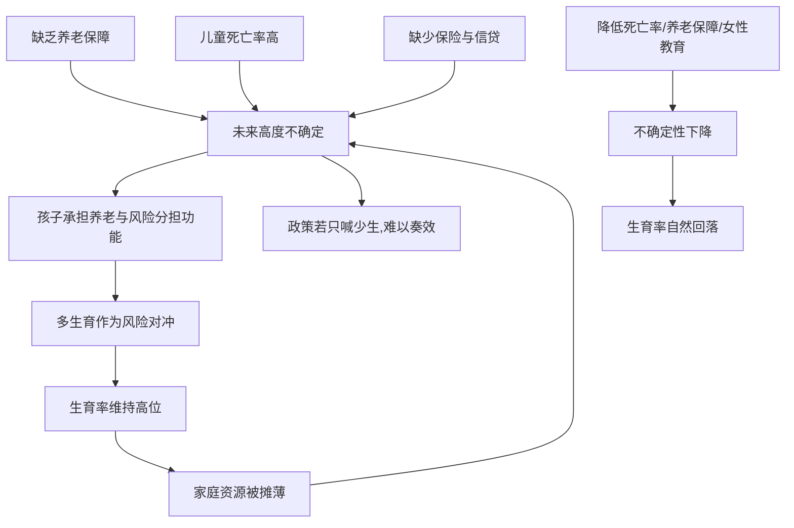

# 08｜为什么“多生孩子”不一定是愚昧？

> 穷人为什么生那么多孩子？这真的是观念落后吗？

---

## 一、先说结论

两位作者认为，生育决策在很大程度上是**对环境的理性反应**。

在缺乏养老保障、儿童死亡率高、又没有保险和储蓄工具的环境里，孩子既是未来的劳动力，也是唯一的养老保险和风险分担器。多生，是普通人对不确定未来的一种对冲。

因此，降低生育率的关键，不是反复宣传少生，而是**改变他们面对的环境**：降低儿童死亡率、建立养老保障、提升女性的教育与收入。

---

## 二、我们先理解一个问题

先抛开成见，问一个朴素的问题：如果你生活在一个地方——

- 孩子可能因为一场病、一次腹泻就夭折；
- 没有养老金，老了只能靠子女；
- 没有医保，生病只能自己扛；
- 也没有可靠的银行和保险可以依靠。

在这样的处境里，你会生几个孩子？

站在这个位置上再看多生，你会发现，它未必是不懂事，而更像是一种被现实逼出来的安排。两位作者要追问的，正是这个被道德评判掩盖了太久的问题。

---

## 三、作者到底提出了什么观点？

两位作者认为，生育数量并不是文化愚昧的简单产物，而是**家庭在特定约束下的选择**。

- 儿童死亡率高，意味着必须多生，才能保证最终有几个孩子活到成年；
- 缺乏社会养老，意味着养儿防老不是观念，而是唯一可行的制度替代；
- 缺少保险与信贷，意味着孩子还是分散风险、分担劳动的手段。

所以在这样的环境里，**多生是一种保险策略**。收入、教育、保障一旦改善，人们往往会主动少生——这正是历史上人口转型的常见路径。

---

## 四、把这个观点翻译成人话

可以把它想成“没有保险的人怎么自保”。

如果外面没有保险公司、没有退休金、没有医保，你只能靠自己攒人力保险——多几个孩子，就有了多几份未来的依靠。孩子多了，万一有一个不成器、有一个生病，还有别的能顶上。

这不是不爱孩子，恰恰相反：在高风险的环境里，**数量本身就是一种对抗风险的方式。**

换个角度，这也解释了为什么养儿防老在很多地方根深蒂固——它不是一句老话，而是一套在缺保障条件下的生存方案。

---

## 五、为什么会这样？

把这条逻辑链拆开看：

关键在 A、B、C 汇聚成 D：真正决定生育的，不是观念本身，而是**环境的确定性与保障水平**。当不确定性下降，生育的保险功能就减弱，数量也会随之变化。

---

## 六、举一个现实生活中的例子

书里观察到的现象，集中在南亚与撒哈拉以南非洲等高生育地区：**儿童死亡率越高、养老保障越弱的地方，生育数量往往越多。**

随着儿童存活率提高、女性受教育与就业机会增加、社会保障逐步建立，生育率通常会明显下降。这种人口转型在世界许多地方都发生过，并不是靠单纯的宣传完成的。

换句话说，**人们不是因为被说服了才少生，而是因为多生的功能被替代了。** 当孩子不再是唯一的养老与保险工具，少生就变得自然。生育率的变化，其实是环境变化的回声。

---

## 七、回到书中重新理解

现在再回看两位作者为什么坚持把生育当成经济问题而不是道德问题，就顺了。

他们想打破的是一种指责：把穷人的生育说成落后、不负责任。但如果站在一个没有养老金、没有医保、孩子随时可能夭折的位置上，多生恰恰是**最负责任、最务实**的安排之一——它是在用自己的方式，为家庭买一份保险。

这也解释了一个政策教训：**想让人少生，先让少生变得可行。** 与其劝，不如把儿童存活率、养老与医疗保障、女性的教育与收入这些基础打好。

---

## 八、这个观点背后还有什么？

**第一，性别不平等。** 生育往往不是夫妻共同、平等的决定，女性的意愿与自主权常被忽视。

**第二，避孕的可及性。** 很多人并非不想控制生育，而是缺乏可靠、方便、负担得起的方法和信息。

**第三，数量与质量的权衡。** 家庭资源有限时，孩子越多，每个孩子能分到的东西越少。这种数量与质量之间的权衡，是生育决策背后的现实张力。

**第四，社会规范与偏好。** 孩子也可能承载地位、情感与家族延续的意义，生育并不只是算经济账。

---

## 九、这个观点有问题吗？

有，而且这里是全书中争议最大的问题之一。

**一种批评认为**，把生育完全视为经济理性，可能忽略了文化与宗教规范的力量。在很多社会中，生育本身就是价值与身份的来源，家庭未必是在计算保险收益。

**另一些发展经济学家认为**，即便生育是理性的，也未必是人人都能做出的选择——当女性缺乏教育、收入与决策权，生育数量可能更多反映的是权力不对等，而不是家庭的共同最优。

**关于理性选择与文化规范孰轻孰重，学界存在不同解释。** 更可能的情况是两者并存：文化与规范塑造了偏好，而经济环境决定了这些偏好会带来什么后果。

**所以更准确的说法是**：生育既是经济策略，也嵌在文化与性别结构之中。把它简化为愚昧或纯理性，都会丢掉一部分真相。

---

## 十、今天再看这个观点

以下部分是人口与社会保障的现代延伸，不是两位作者的原话。

今天，全世界很多地区的生育率都在下降，一些国家却开始面对新问题——人口老龄化与劳动力萎缩，甚至转而鼓励生育。中国的生育政策变迁，以及东亚多地的低生育率，都说明：**生育率会随环境改变而改变，也会带来新的、不同于过去的挑战。**

与此同时，用社会保障替代养儿防老这一思路仍在推进：养老金、医保、儿童福利，都在削弱多生作为保险的功能。

这本书给的提醒，至今有效：**当人们面对高风险而又缺乏工具时，他们会自己发明工具——哪怕这个工具，在旁观者看来是落后的。**

---

## 十一、这一篇真正应该记住什么？

1. **多生常常是理性选择，不是愚昧。**
2. **高死亡率、无养老、缺保险，是生育率高的现实土壤。**
3. **孩子在高风险环境里，承担了保险与养老的功能。**
4. **降低生育率，靠改善环境，而非宣传口号。**
5. **但生育也受文化与性别权力影响，不能只算经济账。**

---

## 十二、留一个问题

> 如果一个人的落后，其实是他所处境地下最务实的选择，
> 那么当我们评价别人的人生方式时，
> 到底是在看他的对错，
> 还是在看我们自己站的位置？

---

**下一篇**：既然生育是与环境相关的理性选择，那么教育呢？如果学校已经建得足够多，学习的瓶颈又在哪里？下一篇我们就来拆开这个问题——**改善教育，一定要先建更多学校吗。**
