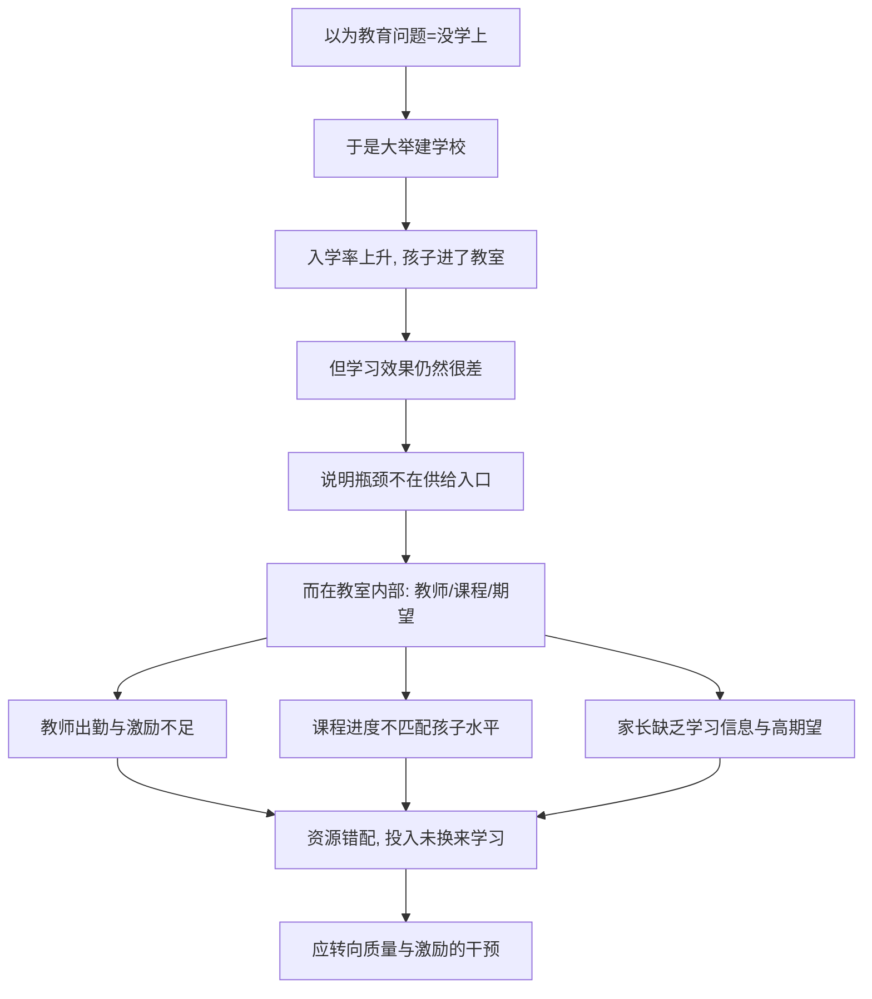

# 09｜改善教育，一定要先建更多学校吗？

> 当孩子已经坐在教室里，教育的问题就真的解决了吗？

---

## 一、先说结论

两位作者认为，今天很多地方教育问题的关键约束，已经不在"有没有学校"，而在"教得怎么样、学得怎么样"。

在很多地区，入学率其实已经不低——孩子背着书包进了教室，可学习效果依然很差，甚至一些孩子上了几年学，仍然读不顺一段简单的课文、算不清一道基础算术。学校是建起来了，人也是来了，但"学会"这件事并没有跟着发生。

所以他们主张：与其继续把资源投向"建更多学校"，不如先解决"教得怎么样"——教师的出勤与激励、课程是否匹配孩子的实际水平、家长有没有关于孩子学习状况的信息。这背后是本书一贯的方法论：**先弄清真正的约束究竟在哪里，再决定把资源投到哪里。**

---

## 二、我们先理解一个问题

先做一个特别自然的思想实验。

假设有个地区，很多孩子没学上。你的第一反应会是什么？多半是：**那就建学校啊。**

这个反应没错，但它悄悄地包含了一个假设：孩子没上好学，是因为缺少学校。于是"多建学校"就成了解决方案。问题是，这个假设在几十年前也许成立，在今天很多地方却已经不成立了。

现实里常见的情况是这样的：政府把学校建到了村口，孩子们也确实来上学了，入学率漂亮地往上走。可几年过去，一测学业水平，发现孩子的实际学习能力低得惊人。也就是说，**"上学"和"学会"之间，出现了一道巨大的裂缝。**

这时如果仍然按老思路继续建校、继续追求"让更多孩子进校门"，你会发现自己把钱花在了刀刃之外——因为真正的瓶颈，早已不在"门口的台阶"，而在"门里面发生的事"。

---

## 三、作者到底提出了什么观点？

两位作者的观点可以概括成一句：**教育的约束，正在从"供给"转向"质量与激励"。**

他们观察到，许多贫困地区的入学率已经相当高，问题出在三处：

第一，**教师层面**。老师可能经常缺勤，或者人在教室却并没有真正在教。一个地区如果教师长期缺勤，那么再多学校、再多学生，也只是把空转办得更大。

第二，**教学层面**。课程往往按照国家统一进度推进，可孩子的实际起点参差不齐。对基础薄弱的孩子来说，跟着一个远超自己水平的进度走，结果就是"人在教室、心在门外"，几年后仍然什么都没掌握。作者与相关研究都指出，**按孩子的实际水平分组教学、把课程压回他们能跟上的高度**，往往比"按部就班赶进度"有效得多。

第三，**信息与期望层面**。很多家长并不知道自己孩子的真实学习水平，也不知道教育的回报到底有多大。一旦家长对"教育能否改变命运"的预期偏低，他们对孩子学习的投入、督促与坚持就会跟着变弱。

一句话概括：**问题不是"没学上"，而是"上了却没学会"。**

---

## 四、把这个观点翻译成人话

把它想成"开餐馆"。

一家餐馆生意不好，老板的第一反应常常是："是不是店面太小、位置不够？"于是换个更大的铺面。可换完之后，生意还是不好——因为真正的问题是：厨师水平不行、菜单不对路、客人根本不知道这家的招牌菜是什么。

换个更大的店面，只是把"生意不好"这件事，放在了一个更宽敞的空间里。

教育是同样的道理。"建学校"相当于"换大铺面"，它解决的是容量问题；而"教师是否真在教、课程是否合身、家长是否有信息"相当于"厨师、菜单、口碑"，它解决的是质量问题。如果质量这一环没打通，扩张只会让问题以更大的规模重演。

所以那句关键提醒是：**在你花大钱扩张之前，先确认瓶颈到底在容量，还是在质量。**

---

## 五、为什么会这样？

把它拆成一条链来看：

关键在于 **C → E** 这一跳。

当入学率上升到一定程度之后，"再多一个学校"带来的边际收益会迅速变小，因为多出来的那所学校并不能自动保证孩子学会。此时，决定学习效果的，变成了教室内部的那些变量：老师今天来没来、教的是不是孩子能懂的内容、家长有没有在背后托一把。

这解释了一个反直觉的现象：**同一笔钱，投在"多建一所学校"和"让老师好好教、让孩子跟上进度"上，后者的回报可能高得多。** 不是因为学校不重要，而是因为在很多地方，学校这道坎已经迈过去了。

---

## 六、举一个现实生活中的例子

看一个在书中反复被讨论的现象：**很多地区入学率已经很高，但孩子的学习效果依然很差。**

在这些地方，你能看到一幅奇怪的图景：教室坐得满满的，出勤表上数字漂亮，可一到实际测验，孩子们连最基础的阅读和计算都过不了关。有的孩子在学校待了好几年，回家却仍然看不懂简单的说明、算不清买菜找零。

如果按"缺学校"的思路，这里似乎什么都该好了——学校有了，学生来了，可结果不理想。问题出在哪？

出在那些看不见的地方：老师可能常常没来，或者来了却没有把精力放在教学上；课程可能远远跑在孩子的实际水平前面，让基础差的孩子彻底掉队；家长可能根本不知道孩子在学校的真实表现，也就无从督促。

于是研究者开始做另一类实验：不是再建学校，而是去测试"教师出勤激励""按水平分组教学""给家长发一份孩子的学习报告"这些小改动。结果常常显示，这些几乎不烧钱的调整，却能实实在在提升孩子的学习。

这个例子最能说明本书的态度：**先别急着上大工程，先找到真正卡住的那一环。**

---

## 七、回到书中重新理解

现在再看两位作者为什么在讲到教育时，不先谈"多建学校"，就顺了。

因为他们的整套方法，都是从"约束在哪里"出发的。RCT 的精神不是"哪个措施听起来好就上哪个"，而是"先测量哪个环节真的卡住了，再对症下药"。在教育这个领域，如果测量下来发现约束在质量与激励，那么继续加码供给，就是在错误的环节使劲。

这也解释了本书为何反复强调"教育质量"和"家长期望"。它们看起来软、难以量化，却是决定孩子到底学没学会的关键变量。作者提醒我们：**把资源投在看得见的建筑上，永远比投在看不见的教学质量上更容易，也更容易被误认为"有成效"。**

理解了这一点，也就能理解他们为什么强调"贴着约束做设计"——这句话在后面讲风险、讲储蓄、讲小生意时，还会一再出现。

---

## 八、这个观点背后还有什么？

**第一，它假设"测量"能反映真实。** 入学率容易测，学习效果也可以测，但孩子的学习动机、自信、对世界的好奇，则难以量化，可能在评估中被忽略。

**第二，"供给不足"并未在所有地方退场。** 在另一些地区，学校、课桌、教师确实严重短缺，那里"建学校"依然是第一位的。作者并没有否定供给，只是提醒要看约束在哪里。

**第三，它把"教育"从工程问题变成了激励问题。** 一旦承认关键在"人"而不在"楼"，政策的形态就会改变：考核、培训、信息反馈，往往会取代"大兴土木"。

**第四，它给家长的期望赋予了因果力量。** 家长相信教育有用，孩子就更可能学得好；这不只是观念问题，而是一个可以被干预、被改变的变量。

---

## 九、这个观点有问题吗？

有，学界对这一问题存在不同解释，值得摆出来。

**第一，因果方向可能有争议。** 到底是"家长期望高促使孩子学得好"，还是"孩子本来就学得好、所以家长期望高"？两者之间的因果箭头，未必像看上去那样单向。一些研究者因此更谨慎地看待"期望"的作用。

**第二，质量干预的效果并不总是稳定。** 教师激励、按水平分组等做法，在有些实验里效果好，换个环境却可能失效，甚至产生副作用（比如把孩子过早地"贴标签"分层）。外部效度问题在这里同样存在。

**第三，"只谈质量、不谈供给"也可能被误读。** 如果把它当成普遍结论，就可能忽视那些真正缺乏学校的地区，或者为削减教育投入提供借口。

**第四，但我们仍应认真对待它。** 它纠正了一个长期存在的懒惰——把"教育问题"简单等同于"多盖楼"。这个纠偏本身，价值很大。

**所以更准确的说法是**：在入学率已经很高的地方，重点应从供给转向质量与激励；但这不等于供给永远不重要，而是提醒我们，资源要投在真正的约束上。

---

## 十、今天再看这个观点

以下部分是基于本书思想的现代延伸，不是两位作者的原话。

今天，"教育的关键在质量而非数量"这个判断，已经被越来越多的实践印证。很多国家和地区的入学率接近普及，可"学习危机"却成了新的关键词——孩子在学校里待着，却没有真正获得读写与计算能力。

于是一个新的关注点浮现出来：**如何衡量"学会"，而不只是"上学"。** 人们开始把目光从出勤率转向实际能力评测，从"建了多少学校"转向"孩子掌握了多少"。这背后正是本书的思路——测量真正的目标，而不是测量最方便的代理指标。

同时也有新的警惕：如果只盯着考试分数，就可能把教育再次窄化成"刷题"。**能被测量的是学习成果，但教育的目的还包括好奇心、判断力和成为一个完整的人。** 指标是手段，不是终点。

这提醒我们：纠正一个错误的方向，不等于找到了唯一正确的方向。质量很重要，但"质量"本身也需要被不断追问。

---

## 十一、这一篇真正应该记住什么？

1. **教育问题的约束会移动。** 早期是"没学上"，后期是"上了没学会"，方案必须跟着约束走。
2. **入学率高不等于学习效果好。** 两者之间隔着巨大的裂缝，衡量要对准真正的目标。
3. **关键变量常在教室内：** 教师出勤与激励、课程匹配度、家长的信息与期望。
4. **资源要投在真正的约束上。** 在已经普及入学的地方，加码建校的边际回报很低。
5. **但供给并未在处处退场。** 别把"重质量"误读成"供给永远不重要"。

---

## 十二、留一个问题

> 如果孩子已经坐在教室里，却仍然没有学会，
> 那么你认为，缺的是那栋楼，
> 还是教室里那个正在发生、也可能正在缺席的过程？

---

**下一篇**：教育和人口之外，穷人还要面对一个更冷酷的现实：生活里处处是风险，而他们手中几乎没有一件可以对冲风险的工具。一场病、一次天灾，就可能让一个家庭多年的积累化为乌有。这种"脆弱"，为什么如此难以摆脱？

下一篇我们就来拆开这个问题——**穷人为什么难以应对风险？**
