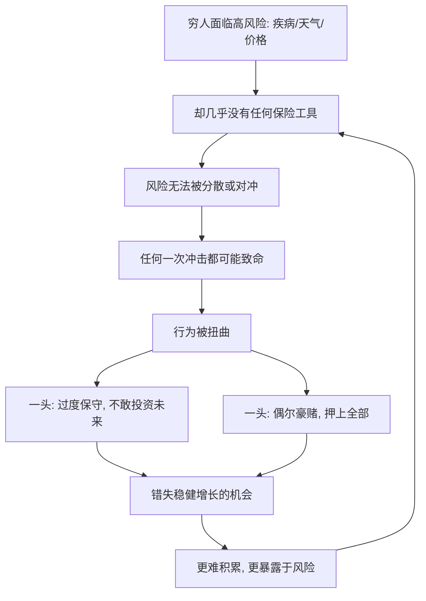

# 10｜穷人为什么难以应对风险？

> 为什么一场病、一次天灾，就能让一个家庭多年积累瞬间清零？

---

## 一、先说结论

两位作者认为，穷人的生活被各种风险包围——疾病、恶劣天气、价格波动、意外伤亡——可他们手里几乎没有任何可以对冲风险的工具：没有医保、没有失业保险、没有正规的信贷缓冲，也没有金融市场上那些用来"分散风险"的手段。

于是他们只能采用一种被作者形容为"哑铃式"的策略：一头是**极度保守**，为了守住那点底线，宁愿放弃高回报的机会；另一头是**偶尔赌一把**，在绝望或希望驱动下押上重注。风险无从分散，一次打击就可能抹掉多年积累——这正是贫困难以摆脱的重要原因。

一句话概括：**不是穷人不会规划，而是他们承受不起"计划外的坏事"。**

---

## 二、我们先理解一个问题

先想一个中产家庭和一个贫困家庭的差别。

一个中产家庭如果突然有人生了大病，会怎样？通常会有医保报销一部分，有积蓄垫付，有信用卡或银行贷款周转，实在不行还能把房子抵押。这件事当然痛苦，但多半不会让全家一夜之间跌回起点。

可如果一个贫困家庭碰上同样的事呢？没有医保，积蓄本来就薄，借不到低息的钱，唯一能做的可能是卖掉赖以生存的资产——牛、地、种子，或者让孩子辍学去挣钱。

问题就在这里：**同样是"遭遇一次坏事"，为什么对有些家庭只是损失，对另一些家庭却是坠落？**

差别不在于谁更坚强、谁更会打算，而在于：**有没有工具，把一次冲击摊薄、吸收掉。**

---

## 三、作者到底提出了什么观点？

两位作者的核心判断是：**风险本身不可怕，可怕的是风险没有被分散。**

他们指出，穷人面对的风险密度远高于其他人——收入不稳定、健康受威胁、天气决定收成、疾病随时降临。可与此同时，他们能用的保险机制少得可怜：

- 没有正式的健康保险，看病要自己全额掏钱；
- 没有失业保险，失业就等于断了全部收入；
- 缺少可及的正规信贷，遇到急事借不到低息的钱；
- 某些本该起作用的非正式互助，也常常因为"人人都在同一场灾害里"而一起失灵。

当风险无法分散时，人的行为会被扭曲。作者观察到两种看似矛盾、实则同一根源的应对方式：

**一种是过度保守。** 因为输不起，贫困家庭往往选择最稳妥、也最没有增长空间的做法：不种经济价值高但风险大的作物，不敢投入新技术，不敢让孩子去赌一个更远的未来。

**另一种是冒险一搏。** 因为长期看不到出路，他们有时又会把仅有的资源押在一个高回报的机会上，像是买一张彩票，或者投入一个并不靠谱的赌注。

两种策略看似相反，其实都是**在没有任何缓冲垫的情况下，对极端风险的被动反应**。作者把这称为一种"哑铃式"的生存结构：一端死守，一端豪赌，中间那个稳健增长的区间，反而被挤没了。

---

## 四、把这个观点翻译成人话

把它想成"走钢丝和走大路"。

一个背着安全绳、脚下有网的人，走一段窄路是没问题的；就算失足，还有网接住。可如果一个人既没有绳也没有网，那么同样一段路，他要么慢到几乎不敢走，要么心一横大步冲过去——这两种走法，都不是因为他更笨或更莽，而是因为他**一旦摔下去，就是万丈深渊**。

穷人就是那个没有网的人。

所以你会看到，他们有时谨慎得近乎固执，有时又冲动得让人不解。外人常批评他们"没有长远眼光"，可"长远眼光"是需要余粮的：**只有先确定自己摔了不会死，人才敢往前走、敢等明天。**

风险无法分散，就等于同时拿走了他们的"安全网"和"远见"。

---

## 五、为什么会这样？

把这套机制拆成一条链：

关键在于 **B → D** 这一环。

如果中间有保险、有储蓄、有信贷、有社会保障，那么一次冲击就会被这些工具吸收、摊薄，家庭只需承受可承受的损失。可当这些工具统统缺席时，风险就直接砸在家庭仅有的那点资产上，砸一次就可能返贫。

而返贫之后，家庭更买不起保险、更存不下钱、更借不到钱——于是回到 B，形成一个自我强化的圈：**越是抵御不了风险，就越容易被下一次风险击倒。** 这，才是"风险"真正可怕的地方。

---

## 六、举一个现实生活中的例子

看一个最典型的场景：**一场大病，或者一次天灾，就让一个家庭跌回原点。**

设想一个靠种地和小买卖过活的家庭。日子虽然紧巴，几年下来也攒了一点钱，还养了一头牛、留了来年的种子。生活刚刚有点起色，家里一个人突然病倒，需要一笔不小的治疗费。

接下来会发生什么？很可能是一连串被迫的变卖：先花掉积蓄，再卖掉那头牛，甚至卖掉用来耕地的牲畜、抵押土地、或者借下高息的债。如果恰逢天灾，收成再受打击，整个家庭就直接归零。

更糟的是，病好之后，原本可以支撑生产的资产已经不在了：没有牛耕不了地，没有种子种不了粮，没有钱供孩子上学，孩子可能就此辍学去打工。**一次冲击，不只是清空了积蓄，还削掉了这个家庭未来重新爬起来的能力。**

而这一切的起点，往往不是什么大灾大难，只是一件在别处可以用保险和积蓄轻松化解的事。**同样的病、同样的灾，落在有保障的人身上是麻烦，落在没保障的人身上是悬崖。**

---

## 七、回到书中重新理解

现在再看两位作者为什么把"风险"单列一章，就很清楚了。

在他们的分析里，贫穷不只是"收入低"这一个数字，更是一种**结构性的脆弱**：收入低、波动大、又没有任何缓冲。理解了这一点，前面几篇的很多结论就串起来了——为什么穷人不敢投资教育、为什么不敢尝试新技术、为什么宁可守着低回报的生计？因为在一个没有任何安全网的世界里，"稳妥"不是保守，而是保命。

这也解释了为什么"消除风险"本身就是扶贫。给穷人一份医保、一个能平滑收入的储蓄工具、一条可及的低息信贷渠道，表面上是提供金融产品，实质上是**给了他们敢于规划未来的底气**。没有这层底气，再好的致富机会，也只是诱人却危险的赌局。

这也自然引出了下一篇——要平滑风险、要缓一口气，穷人常常需要借钱。可为什么他们借钱，总是那么难、又那么贵？

---

## 八、这个观点背后还有什么？

**第一，它把"保守"重新定义了。** 穷人避开高回报的机会，不是不懂道理，而是在没有保险的情况下，风险本身就是不可承受的成本。

**第二，它指出非正式互助的局限。** 亲友之间确实有互帮互助，但一次区域性灾害会让所有人同时陷入困境，最需要理赔的时候，恰恰谁也拿不出钱。

**第三，它把健康风险放在了中心。** 疾病是穷人最常遭遇、也最昂贵的风险之一，一场大病就足以击穿整个家庭，这也是为什么卫生保障在扶贫中格外关键。

**第四，它暗示了工具的重要性。** 改变行为，有时不需要改变人，只需要提供一件合适的工具——一份保险、一个储蓄账户，就能让同一个人做出不同的选择。

---

## 九、这个观点有问题吗？

有，关于风险与贫困的关系，学界存在不同解释，需要平衡地看。

**第一，风险是"原因"还是"结果"？** 一种解释认为，缺乏保险导致穷人脆弱；另一种观点则强调，正因为穷，才买不起保险、进不了正规金融，风险与贫困互为因果，很难说清谁先谁后。

**第二，保险本身也面临市场难题。** 保险公司不愿服务穷人是可以理解的：金额小、成本高、还容易出问题（比如骗保、逆向选择）。所以"提供保险"这句话说起来容易，设计起来极难，很多小额保险产品实际效果并不理想。

**第三，社会保护会改变激励吗？** 有观点担心，过度的保障可能削弱个人努力。不过多数证据显示，基本的社会保护更多是"托底"而非"养懒"，但这一争论至今没有完全平息。

**第四，作者并未否认家庭能动性。** 穷人也在努力应对风险——借粮、互助、分散种植、打零工，本书承认这些努力，只是强调：**靠个人的土办法，扛不过系统性的风险。**

**所以更准确的说法是**：风险的无法分散，是贫困顽固存在的一个关键机制；提供风险应对工具极其重要，但工具的形态、成本与可持续性，同样决定成败。

---

## 十、今天再看这个观点

以下部分是基于本书思想的现代延伸，不是两位作者的原话。

今天，"冲击导致返贫"已经被越来越多地正视。人们发现，脱贫之后最怕的不是"没有机会"，而是**一次意外把成果全部抹掉**——因此，"守住脱贫成果"和"创造新机会"同样重要。

这也催生了各种旨在平滑冲击的做法：基础的医疗保障、天气指数保险把"天不下雨"直接变成可赔付的事件、手机端的小额储蓄与转账、面向低收入人群的普惠金融。它们的共同思路，正是本书所强调的：**与其教育穷人"要学会应对风险"，不如把风险应对的工具，变得便宜、可见、容易使用。**

同时也有新的警惕：任何"保险"或"兜底"的设计，都必须考虑钱从哪来、会不会被滥用、是否可持续。善意如果设计粗糙，反而可能制造新的困境。

所以这本书留给今天的启示不只是"要有保障"，还有一个更冷静的追问：**一份真正奏效的风险抵御机制，怎样才能既托住人，又长久地运转下去？**

---

## 十一、这一篇真正应该记住什么？

1. **穷人不缺风险，缺的是对冲风险的工具。** 医保、失业保险、信贷与储蓄的缺席，是脆弱的核心。
2. **风险无法分散，会扭曲行为。** 过度保守与偶尔豪赌，同一根源的两种反应。
3. **一次冲击可能抹掉多年积累，还削掉重新爬起来的能力。**
4. **提供工具本身就是扶贫。** 一份保险或一个储蓄账户，能改变一个人对未来的选择。
5. **保障的设计极难，别把善意当成解药。** 成本、可持续性与滥用风险，都要一起想清楚。

---

## 十二、留一个问题

> 如果一场病、一次天灾，就能把多年积累清零，
> 那么真正决定一个家庭能否往上走的，
> 究竟是它挣了多少，
> 还是它在摔倒之后，还能不能站起来？

---

**下一篇**：要平滑风险、要渡过难关，穷人往往需要借钱。可他们一旦走到银行门口，常常被拒之门外，最后只能转身投向高利贷。为什么正规金融不愿服务穷人，而高利贷却能扎下根来？

下一篇我们就来拆开这个问题——**为什么穷人借钱那么难、那么贵？**
