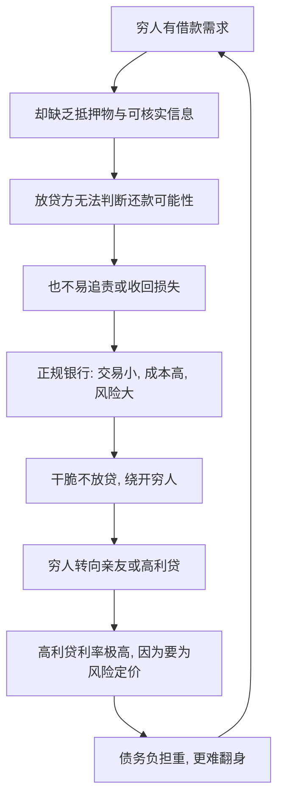

# 11｜为什么穷人借钱那么难、那么贵？

> 为什么正规银行不愿把钱借给穷人，而高利贷却能在穷人的世界里扎根？

---

## 一、先说结论

两位作者认为，穷人借钱难、借钱贵，根源不在"他们不讲信用"，而在**信息与抵押的缺失**。

穷人身上几乎没有银行愿意接受的抵押物——没有房产证、没有可抵押的资产、没有稳定的工资流水；他们想借的金额又小，交易成本摊下来格外高；再加上放贷方很难核实他们的信用和用途，监督成本很高。于是正规银行算来算去，觉得不划算，干脆不做这门生意。

被正规金融拒之门外的人，只能转向亲友，或者转向高利贷。小额信贷提供了一条新的可能，但它也不是包治百病的奇迹。问题的核心，始终是那两样东西的缺席：**可用的抵押物，和可获取的信息。**

一句话概括：**不是穷人借不到钱所以不守信用，而是他们不守信用这件事太难被验证，于是没人愿意借。**

---

## 二、我们先理解一个问题

先问一个看似简单的问题：银行为什么愿意借钱给一个有房、有稳定工作的人？

答案通常不是"因为他是好人"，而是因为**万一他不还，银行有办法收回损失**：房子可以拍卖，工资可以扣划，他的信用记录会留下污点，以后处处受限。银行不需要认识这个人，只需要知道他"跑不掉"。

现在把镜头换到穷人身上。他可能没有产权清晰的房产，靠打零工或小买卖过活，收入不稳定，也没有能抵押的资产。如果他借了钱不还，银行能怎么办？几乎什么都做不了。

于是你会发现：**银行不借钱给穷人，不是因为它歧视穷人，而是因为它算不出这笔账该怎么保本。**

那么问题就变成了：在一个"借了不还也很难追责"的世界里，谁还愿意把钱借出去？答案是把利率抬到极高、或者用非正规手段催收的人——也就是高利贷。**贵的利率，本质上是在为"收不回来的风险"定价。**

---

## 三、作者到底提出了什么观点？

两位作者的核心分析是：**信贷市场的失灵，源于信息不对称与抵押物的缺失。**

具体来说，正规放贷方面对穷人时，会碰到三重叠在一起的成本：

**第一，没有抵押物。** 借贷的本质，是"用抵押品保证还款"。穷人拿不出银行认可的抵押，银行失去了兜底，自然不愿放款。

**第二，信息不对称。** 放贷方不清楚借款人会不会还、拿钱去做什么、有多大风险。在这种信息劣势下，谨慎的做法就是：要么不借，要么要求极高的利率来补偿风险。

**第三，交易成本高。** 给一个穷人的贷款金额可能很小，但审核、放款、催收的流程几乎是一样的。同样一套流程，做一笔大额贷款和做一笔小额贷款，成本相近而收益悬殊，银行自然倾向服务大客户。

这三点叠加，就形成了作者所描述的困境：**正规金融系统性地绕开穷人，穷人则被迫转向更贵、更危险的融资渠道。**

关于高利贷，作者的看法也很冷静：它的存在，说明正规金融留下了巨大的真空。高利贷之所以能生存，是因为它填补了银行不愿填的坑，它对借款人了解得更深、监督得更紧、催收也更有办法——这些"能力"，恰恰是正规银行所不具备的。作者还提到，穷人的非正规借款渠道主要有两类：亲友之间的互助，和职业放贷人；前者利息低但额度有限，后者额度灵活但价格高昂。

至于小额信贷，作者给予了肯定，也保持了清醒：它确实让很多穷人第一次获得了正规信贷，还款率也常常很高；但它并非万能，它更擅长支持"周转"，未必能支撑"扩张"，也不总能触及最穷的人。

---

## 四、把这个观点翻译成人话

把它想成"借钱给一个陌生人"。

假设有个你完全不认识的人，开口向你借一笔钱，说自己会努力还。你大概率会犹豫，甚至拒绝——因为你不了解他，也没法保证他跑不掉。

可如果这个人是你邻居，你知道他住哪、做什么、家人是谁，他要是赖账，全街坊都会知道——你可能就愿意借了，哪怕利息不高。

正规银行面对穷人的处境，更接近前者：**它对借款人不了解，也没有可靠的手段保证还款**。而高利贷更像后者：它靠"离得近、看得紧、追得动"来弥补信息与抵押的不足，代价就是极高的利息。

所以"贵"不是无缘无故的。**利息里，藏着一大块"风险补偿"和"催收成本"。** 理解了这一点，就知道为什么简单地说"高利贷就是坏人盘剥穷人"并不够——它背后有个更深的问题：正规金融为什么没有把这块服务做好？

---

## 五、为什么会这样？

把这套逻辑拆成一条链：

关键在于 **B → F** 这一跳。

如果没有抵押物、没有信息，放贷方就失去了判断与保障的依据；而小额贷款的固定成本又摊不薄，于是"不做"成了理性选择。这不是恶意，而是结构。

而一旦穷人只能转向高利贷，高利率又会把他们的处境推得更糟：本该用来投资或应急的钱，被沉重的利息吸走；越还不起，越要借新还旧，越陷越深。**信贷市场的失灵，于是在穷人身上变成了一个越滚越大的雪球。**

---

## 六、举一个现实生活中的例子

看一个在贫困地区相当普遍的场景：**穷人走进正规银行，被拒之门外；转身投向高利贷，或者试试小额信贷。**

一个摊贩、一位农妇，想借一笔钱进货、买种子、或者应付一场急病。她先去了银行，可银行要看抵押、看流水、看信用记录——她一样都拿不出来，于是贷款申请被退回。额度太小、风险太高、无法担保，银行的理由都很正当。

她只好转向别处。要么找高利贷，借得快、手续少，但利息高得吓人，约定还款的日子一近，压力就像山一样压下来；要么找亲戚朋友借，利息可能很低甚至不要利息，但能借到的数额有限，而且一旦还不上，伤的是人情。

小额信贷的出现，改变了其中一部分人的处境：它专门面向没有抵押物的低收入人群，用小组联保、按期还款等机制，把"互相监督"变成了替代抵押的办法，让很多原本借不到钱的人第一次从正规渠道拿到了资金。这确实是一种进步。

可即便如此，小额信贷也不是万能钥匙：它能帮人周转，却未必能帮人做大；它能覆盖一部分人，却未必能触及最穷、最脆弱的那一群。所以作者的态度是：**它是一条值得肯定的路，但不是贫困之谜的唯一答案。**

---

## 七、回到书中重新理解

现在再回看两位作者为什么反复强调"信息与抵押"，就明白了。

他们想纠正一个流行的道德判断：穷人借钱不还、信用差，所以金融机构不愿服务他们。作者提醒我们，事情的顺序可能恰恰相反——**正是因为他们"不还钱也很难被约束"这一点太突出，才导致金融机构不愿服务他们。** 换句话说，问题出在制度和工具的缺失，而不是出在人的品性。

这也把信贷这一篇，和前一篇"风险"连在了一起：穷人既没有保险来对冲风险，也没有信贷来平滑冲击，还被排斥在最基础的金融服务之外。这三者叠加，让一次意外就可能变成永久性坠落。

理解了这一点，也就能理解作者为什么看重"让金融变便宜、变可及"这类看似技术性的改进——因为在他们的框架里，**能不能借到一笔不太贵的钱，往往决定了一个家庭是原地打转，还是有机会往上走。**

而这又引出了另一个更贴近日常的难题：就算收入有了、借到了钱，为什么穷人还是攒不下钱、存不住积蓄？

---

## 八、这个观点背后还有什么？

**第一，它把"信用"从道德问题变成了信息问题。** 不是穷人天生不守信，而是他们的信用无法被低成本地记录和验证。

**第二，它解释了高利贷的"合理性"与危害。** 高利贷填补了正规金融的真空，同时用高利率把风险转嫁给最无力承担的人。

**第三，它揭示了金融排斥的结构性。** 银行服务大客户不是阴谋，而是成本与收益自然筛选的结果；可正是这种"自然"，让穷人被系统性地留在门外。

**第四，它给小额信贷留了位置，也划了边界。** 小额信贷证明了穷人可以被正规金融良好服务，但它改变不了"缺抵押、缺信息"这些根本约束。

---

## 九、这个观点有问题吗？

有，关于如何评价穷人的借贷，学界存在不同解释，值得平衡地看。

**第一，小额信贷的成效仍有争议。** 一些发展经济学家认为，小额信贷提升了家庭消费与抗风险能力；也有研究显示，它对收入增长和创业扩张的长期效果，并没有人们期待的那样显著。两种结论各有证据支持。

**第二，高利贷未必只有负面作用。** 在正规金融缺位的地方，它至少提供了一根救命稻草。完全否定它，反而可能切断穷人眼前唯一的资金渠道——如何替代它，比指责它更重要。

**第三，"缺抵押"可能被过度强调。** 有些穷人确实有资产（如牲畜、土地），只是因为产权不清、市场不完善而无法变现为抵押。这提示问题不只是借款人个人，也在于制度和市场。

**第四，作者并未忽视个体因素。** 他们承认有些人确实会挥霍或误用借款，只是强调：**在信息与抵押稀缺的大环境下，把责任全归到个人身上，是看错了病根。**

**所以更准确的说法是**：穷人借钱难、借钱贵，是一个由信息、抵押、成本共同造成的结构性难题；它需要用制度与工具的创新去缓解，而不是靠道德评判来指责。

---

## 十、今天再看这个观点

以下部分是基于本书思想的现代延伸，不是两位作者的原话。

今天，"让穷人获得可负担的金融服务"已经成为一个被广泛接受的议题。移动支付、数字信贷、大数据风控，把很多过去无法被记录的行为变成了可评估的信用信息——一个人手机上的充值、还款、收款记录，都可能成为他"值得信任"的证据。这在一定程度上回应了本书所说的"信息缺失"。

同时，"信用"这件事被重新设计了：过去依赖抵押物，如今越来越依赖**行为数据与关系网络**。这既是机会，也是风险——数据可能让更多穷人第一次获得贷款，也可能带来过度负债、隐私泄露和新的算法歧视。

所以这本书给今天的启示，不只是"要发展普惠金融"，还有一个更冷静的提醒：**把服务做得更可及，固然重要；但如果不看利率、不看风险、不看借款人能不能承受，再方便的钱，也可能变成压垮他的那根稻草。**

---

## 十一、这一篇真正应该记住什么？

1. **穷人不缺信用，缺的是被验证信用的工具。** 问题在信息与抵押，不在品性。
2. **正规银行绕开穷人，是结构使然。** 缺抵押、金额小、成本高、监督难，导致理性放弃。
3. **高利贷的高利率，本质是为风险定价。** 它填补了真空，也加重了负担。
4. **小额信贷是进步，但不是奇迹。** 它能覆盖一部分人，却无法根除根本约束。
5. **金融可及性要与可负担性一起考虑。** 借得到，不等于还得起。

---

## 十二、留一个问题

> 如果一个人借不到便宜的钱，仅仅是因为没有人能低成本地确认他值得信任，
> 那么真正需要被修复的，
> 是这个人，
> 还是那套无法看见他的金融系统？

---

**下一篇**：借钱难、借钱贵之外，穷人还面对一个更私密、也更顽固的难题——明明知道该存钱，却总是存不下来。奇怪的是，有些人找到了一种土办法：拿钱去买砖头、买建材，用这种方式"逼"自己储蓄。为什么连存钱，都要靠这样的迂回手段？

下一篇我们就来拆开这个问题——**为什么穷人存不下钱？**
