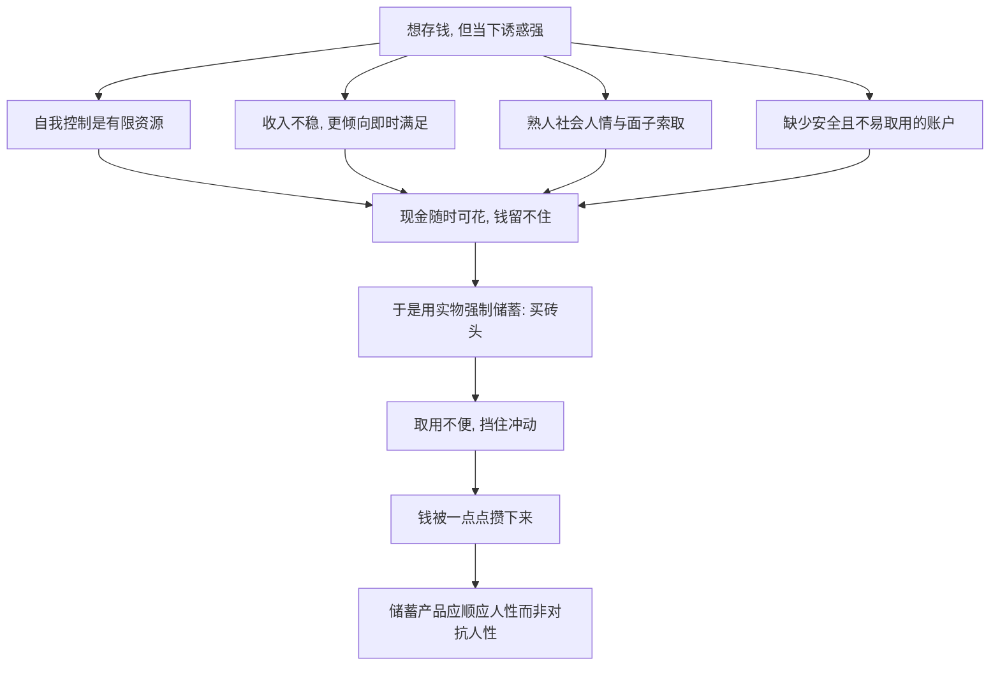

# 12｜为什么穷人存不下钱？

> 明明知道该存钱，为什么就是存不下来？

---

## 一、先说结论

两位作者认为，储蓄难，不只是因为"没钱"，更因为**自我控制难、外部压力大、以及缺少合适的储蓄工具**。

人都有"今天想花、明天想存"的拉扯，但穷人的拉扯格外艰难：收入不稳定、随时有急需、身边还有各种人情与面子上的索求。更麻烦的是，他们往往没有一个既安全、又不容易被随时取用的存钱方式。

于是作者发现了一些很有意思的土办法——比如不存现金，而是**把钱换成建筑材料，一块块买砖头**。这些砖头不容易随时变卖去换零食或应酬，实际上起到了"强制储蓄"的作用，等攒够了就盖房子。这类做法说明：**有效的储蓄产品，应该顺应人性，而不是对抗人性。**

一句话概括：**不是穷人不想存钱，而是他们手里的存钱方式，太容易被人性打败。**

---

## 二、我们先理解一个问题

先承认一件不太体面的事：存钱这件事，对谁都难。

你大概也有过这样的经验——这个月本来打算攒下一笔钱，可一顿聚餐、一件想买的衣服、一个临时的"就这一次"，钱就悄悄没了。到月底一看，账户里还是那么点。

如果我们这些收入稳定、有银行账户、有理财工具的人都常常存不下钱，那么可以想象，一个收入不稳定、没有合适账户、还要面对亲友层层求助的穷人，存钱会有多难。

所以真正的问题不是"穷人为什么会乱花"，而是：**为什么存钱这件事，本身就这么反人性？以及在资源匮乏的环境里，这种反人性被放大到了什么程度？**

---

## 三、作者到底提出了什么观点？

两位作者的分析，把"存不下钱"拆成了几股相互叠加的力量。

**第一，自我控制的困难。** 人在当下总倾向于即时满足，把"存钱"推迟到明天。收入一不稳定，这种倾向就更明显——既然未来不确定，今天先享受似乎更划算。

**第二，外部的社会压力。** 在紧密的熟人社会里，一个人很难把积蓄藏起来。亲戚朋友有难处来借钱，你很难拒绝；逢年过节的人情往来、面子开销，也难以回避。**你有钱这件事本身，就构成了被索取的理由。** 于是钱还没存热，就已经流出去了。

**第三，缺少合适的工具。** 有一个安全的、能生点息、又不容易被随时动用的储蓄账户，对存钱至关重要。可很多穷人要么没有银行账户，要么存取不方便，要么账户里的钱太容易被临时取走——工具不但没帮上忙，反而放大了诱惑。

正是针对第三点，作者特别提到了"强制储蓄"的价值。他们观察到，有些人会用一种相当聪明的方式存钱：不去存现金，而是**把钱换成建筑材料，比如一块一块地买砖头**。砖头不能当零食吃，也不方便拿去应酬，想变卖还得费一番周折。它用一个"取用不便"的实物，替人挡住了自己的冲动。等砖头攒够，就盖起房子——钱，就这样被"存"了下来。

作者由此得出一个重要判断：**好的储蓄产品，应该去理解人的弱点，并顺应它，而不是站在道德高地上要求人变得更有意志力。**

---

## 四、把这个观点翻译成人话

把它想成"把零食放在看不见的柜子里"。

如果你想减肥，最有效的办法往往不是每天发誓"我要靠意志力"，而是干脆不把零食买回家；退而求其次，把它放到最难拿的地方。因为意志力是有限的，环境才是可靠的。

穷人的储蓄难题，本质上是同一道题，只是更难。他们不是没有决心，而是环境处处和人性的弱点结盟：现金随时能花、熟人的求助很难拒绝、未来的不确定又总在怂恿"今天先享受"。

在这种环境里，"买砖头"就显得格外聪明了：它相当于**把零食放进了最难打开的那个柜子**。砖头不是最好的储值资产，流动性也差，可正是这份"流动性差"，替主人完成了他做不到的自律。

所以存钱的关键，未必在于更坚强，而在于**换一个让人不那么容易犯错的环境或工具。**

---

## 五、为什么会这样？

把这套机制拆成一条链：

关键在于 **F → G** 这一跳。

当现金、人情、诱惑联手，直接的"存钱"几乎注定失败。于是人们发明了迂回的办法：把"可花的钱"变成"不易花的物"。**这一步不是非理性，恰恰是对人性弱点的清醒应对。**

这也解释了作者为什么强调"顺应人性"：与其要求穷人天生自律，不如设计一种工具，让坚持变得轻松、让冲动变得困难。**储蓄的改善，往往来自工具的改进，而非道德的提升。**

---

## 六、举一个现实生活中的例子

看一个在书中被反复提及的做法：**用买建筑材料——一块块砖头——的方式来"逼自己存钱"。**

想象一个人打算盖一间自己的房子，但手头的钱总是留不住。如果他把钱放在家里，很快就会被各种开销和人情掏空；就算放进账户，也可能因为随时能取而被取走。于是他换了个办法：每当手上有余钱，就去买一些建材——砖头、水泥、钢筋，堆在准备盖房的地方。

这堆材料平时派不上用场，也不能拿去换零食或应付饭局；真要急着用钱，把它卖掉还很麻烦、要折价。正因为"不方便"，它成了一道天然的屏障，帮他挡住了当下的冲动。日积月累，砖头越堆越高，房子也就一点点有了着落。

作者从这类做法里看到的是一个更普遍的规律：**穷人并不缺存钱的意愿，缺的是一个能替他们抵抗诱惑的容器。** 现金是"最容易被花掉"的形态，而实物是"最不容易被花掉"的形态——于是人们自觉地选择了后者。

这个例子最能说明本书的态度：**理解人的弱点，再顺着它设计工具，比一味责备"你为什么不自律"，有用得多。**

---

## 七、回到书中重新理解

现在再看两位作者为什么把"储蓄"也当成一个独立且重要的问题，就顺了。

在他们的框架里，穷人想要积累、投资、抵御风险，都离不开储蓄。可储蓄却偏偏是他们最难做到的事——不是因为收入为零，而是因为他们的收入在"形态"上太容易被消耗，他们的环境在"结构"上太容易把钱抽走。

这也就把储蓄这一篇，和前面的"风险""信贷"缝在了一起：没有保险，风险直接砸在积蓄上；存不下钱，就只能靠借债周转；借债又贵，于是更存不下钱。**这几件事互相缠绕，构成一个穷人几乎无法独自挣脱的循环。**

而作者的解法，始终带着那种务实的气质：不喊口号，不指责个人，而是问一句——**什么样的工具，能让存钱这件事，对一个人来说不那么难？**

理解了这一点，也就能理解他们接下来为什么会去看穷人的"小生意"：一个人攒不下钱、做不大生意，往往不是不努力，而是被同一套约束反复困住。

---

## 八、这个观点背后还有什么？

**第一，它把"存钱"从道德问题变成了设计问题。** 存不下钱不代表缺少美德，而常常代表缺少一个合适的工具。

**第二，它重新定义了"非理性"。** 买流动性极差、难以变现的砖头，看起来不划算，却是对人性弱点的理性应对。

**第三，它强调了社会关系的双刃性。** 熟人网络既能互助，也会成为持续提取积蓄的压力来源。

**第四，它给"行为设计"留下了空间。** 只要让正确的行为更容易、错误的行为更麻烦，同样的一个人，就能做出不同的结果。

---

## 九、这个观点有问题吗？

有，关于储蓄难的解释，学界存在不同解释，需要平衡地看。

**第一，贫困是不是首位原因？** 一种观点强调，存不下钱的根本还是"收入太低、勉强糊口，本就没有余钱可存"；行为与工具的因素是叠加在这一点之上的。两种解释并不互斥，但侧重点不同。

**第二，强制储蓄的代价不容忽视。** 砖头确实能挡住冲动，但它流动性极差、还可能折价甚至损坏——当急事真的来临，省下来的钱却取不出来的那一刻，工具就变成了枷锁。

**第三，行为干预的效果未必长久。** 一些行为设计在短期内很有效，时间一长，人可能学会绕过它，效果就衰减了。指望一个巧办法解决长期储蓄，也未必可靠。

**第四，作者并未忽视结构因素。** 他们承认收入水平、社会保障、金融可及性是基础条件，只是特别提醒：在这些条件之外，**顺应人性的工具设计，同样能带来真实、可复制的改变。**

**所以更准确的说法是**：存不下钱，是收入约束、社会环境、自我控制与工具缺失共同作用的结果；改变工具可以帮上大忙，但它替代不了提高收入与完善保障这些更根本的努力。

---

## 十、今天再看这个观点

以下部分是基于本书思想的现代延伸，不是两位作者的原话。

今天，"帮助人存下钱"这件事，已经有了远比砖头精巧的工具。各种"自动储蓄""目标账户""到期前不能取"的产品，本质上都在做同一件事：**把自律外包给设计。** 发工资时自动划走一笔、把存款和日常消费账户分开、设定一个取钱的障碍——这些做法，都是"砖头思路"的数字版本。

与此同时，人们对"行为设计"也有了新的警觉。同样的机制，用来帮人存钱是善意，用来诱导借贷和消费就成了套路。工具本身是中性的，**方向取决于谁在设计、为了谁的利益设计。**

所以这本书留给今天的启示，不只是"要有个好用的储蓄工具"，还有一层更深的提醒：**既然人性有弱点，那么设计者的责任就格外重要——是帮人守住长远利益，还是趁人之危，界限往往只在一念之间。**

---

## 十一、这一篇真正应该记住什么？

1. **存不下钱，不全是意志力问题。** 自我控制、社会压力与工具缺失共同作用。
2. **现金是最容易被花掉的形态。** 换成不易取用的实物，反而挡住了冲动。
3. **买砖头不是愚昧，是对人性弱点的清醒应对。**
4. **好的储蓄工具顺应人性，而非对抗人性。** 让坚持变容易，让冲动变麻烦。
5. **设计能帮忙，但替代不了收入与保障。** 工具是助力，不是根本解药。

---

## 十二、留一个问题

> 如果连存钱都要靠买砖头来"逼"自己，
> 那么你该反思的，
> 究竟是自己的意志力，
> 还是那些一次次把你攒下的钱悄悄拿走的环境与设计？

---

**下一篇**：存不下钱的人，往往也想靠做点小生意改变处境。可为什么穷人的生意大多只能勉强糊口、始终做不大？那些看起来充满"创业精神"的摊贩与小店，为什么难以扩张、难以雇人、难以长成真正的企业？

下一篇我们就来拆开这个问题——**为什么穷人的生意做不大？**
