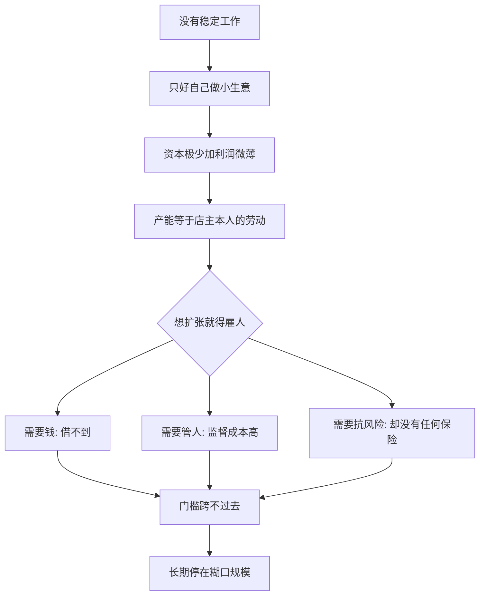

# 13｜为什么穷人的生意做不大？

> 穷人明明很有创业精神，为什么他们大多只能守着一个摊位、一间小店，做一份勉强糊口的生意？

---

## 一、先说结论

两位作者认为，穷人做的生意，绝大多数是“糊口型”生意：靠店主本人的劳动撑着，利润薄、规模小，很难雇人，也很难借到扩张需要的钱。

关键判断是：**这类生意并不是“未来大企业的幼苗”，而是“在没有更好工作时的一种谋生方式”。**

因此，如果政策制定者把它们想象成一台台等着被点燃的增长引擎，就容易开错药方——给一笔贷款、喊一句“创业致富”，并不会让它们长成企业。

---

## 二、我们先理解一个问题

先想象一个再常见不过的画面。

一个中年人，每天清晨推着三轮车到街口卖菜，或者守着一间不到十平方米的小卖部。她认识每一个熟客，知道哪家的孩子爱吃什么零食，也懂得什么时候该多进一点货。论“创业精神”“商业嗅觉”“对市场的敏感”，她可能不比写字楼里的白领差。

可是十年过去，她还是那个摊位、那间小店。没有雇人，没有开分店，没有变成连锁。

问题就来了：

> 如果她这么能干，为什么生意做不大？

是懒吗？是没雄心吗？还是我们哪里看错了？

---

## 三、作者到底提出了什么观点？

两位作者给出的解释，不是道德判断，而是处境判断。

他们观察到几个反复出现的特征。

第一，穷人的生意**资本极少**。启动资金往往来自多年积蓄或亲友借款，本小利薄，一次进货、一次被骗、一场病，就可能把周转金掏空。

第二，老板本人就是全部产能。一个小摊的“生产能力”，几乎等于店主一个人的体力与时间。想要做大，必须雇人、必须把一部分事情交出去——而这恰恰是最难的一步。

第三，这类生意的**利润极其微薄**，往往只够维持家庭日常开销，留不下扩张所需的积累。

于是作者提出一个扎心的说法：很多穷人其实是“**不情愿的创业者**”。他们不是天生想当老板，而是因为没有一份稳定的工作可做，只好自己给自己创造一份生计。

一句话概括他们的立场：**不要把糊口型生意浪漫化，也不要把它们误读成增长引擎。**

---

## 四、把这个观点翻译成人话

把它想成一个“一人公司”。

这家公司的全部设备，就是一个人的一双手、一辆车、一天十几个小时。它的“产能上限”，清清楚楚写在这个人身上：他一天能卖多少，生意就只能有多大。生病了、累了、要回家照顾孩子，生意就停摆。

而如果想让生意变大，就必须跨过一道门槛：**把“我”变成“我们”。** 要雇人，就要付得起工资、管得住人、算得清账、扛得住订单波动的风险。这几件事，每一件都需要资源，也需要经验。

所以“做不大”往往不是态度问题，而是这道门槛太高，而他们手里能用的资源太少。

---

## 五、为什么会这样？

把它拆成一条链：

关键在 **E → I** 这一跳。

扩张需要三样东西：钱、可信任的人、能扛住失败的家底。而穷人恰恰三样都缺。他们借不到便宜的钱，雇不到放心的帮手，也不敢拿全家的口粮去赌一次扩张。结果就是：生意一直停在“一个人刚好能撑住”的规模上。

---

## 六、举一个现实生活中的例子

就看清街的小摊和社区里的小卖部。

这类生意有个共同点：**扩大规模的第一步，往往就是雇人。** 可一旦要雇人，麻烦就来了。

第一，雇人要发工资，而且是先付出去、后收回来的钱。小摊的现金流本就紧张，多一个人的工资，可能就意味着少进一批货，或者家里这个月少买点东西。

第二，雇来的人未必靠得住。收钱、进货、看店，处处经手现金，若没有一个可靠的监督办法，就难免出岔子。小生意请不起会计，也装不起正规的管理流程。

第三，一旦把生意交出去一部分，就等于把身家押在别人身上。对一个没有保险、没有存款、没有退路的家庭来说，这个风险太大。

于是我们看到：他们更愿意自己多干几个小时、少睡一点，也不愿多雇一个人。这不是不懂“规模效应”，而是在他们真实的风险与算计里，**不雇人反而是更安全的选择。**

---

## 七、回到书中重新理解

现在再回看这个观点，就顺了。

它其实和前面几篇是连着的：信贷难，让缺钱的生意跨不过扩张的门槛；风险无从分散，让家庭不敢拿生存去赌成长；储蓄难，让利润留不住、攒不厚。糊口型生意，是这些约束共同作用的结果。

两位作者真正想纠正的，是一种流行的叙事：只要有“企业家精神”，再加上一点启动资金，穷人就能靠自己爬出贫困。他们提醒我们，**创业热情不缺，缺的是让生意长大的条件。** 而在这些条件不具备时，把所有人都往“创业”上赶，可能只是把风险转嫁给他们自己。

---

## 八、这个观点背后还有什么？

**第一，就业可能比创业更重要。** 如果一个人的小生意只是勉强糊口，那么一份稳定的、有保障的工资工作，也许更能改善生活。

**第二，性别与家庭结构在起作用。** 在很多地方，女性经营者还要承担照顾孩子、操持家务的责任，能投入生意的时间与精力被大幅挤压。

**第三，季节与冲击让积累难以持续。** 一场病、一次歉收、一次价格上涨，就可能把多年攒下的本钱清零。

**第四，政策的方向因此需要调整：** 与其一味鼓励“人人当老板”，不如想办法降低经营风险、提高现有小生意的收益，并为愿意扩张的那一小部分提供更有针对性的支持。

---

## 九、这个观点有问题吗？

有，需要平衡地看。

一方面，**确有少数小生意成长为大企业**。许多今天的大公司，起步也不过一间小店。因此，一些发展经济学家认为，不能因为大多数小生意长不大，就完全放弃对其中“有潜力者”的支持——关键是要能识别出哪些是真正想扩张、也具备条件的人。

另一方面，**“糊口型”这个标签本身也有滑动的空间**。同样一间小卖部，在有的地方是维持生计的无奈之举，在有的地方却可能是稳步积累的起点。把它一刀切地定性，可能既低估了部分经营者的能力，也忽略了环境差异。

此外，测量的偏差也值得注意：我们容易记住那些成功的例子，却看不到无数默默消失的小生意，于是高估了“创业改变命运”的概率。

所以更准确的说法是：**把绝大多数穷人的生意当成随时会腾飞的增长引擎，是误判；但把它们全部看成没有希望的糊口营生，同样失之草率。** 真正的功课，是分清哪些是生计、哪些是机会。

---

## 十、今天再看这个观点

以下部分是这一观点的现代延伸，不是两位作者的原话。

今天，“自己给自己打工”的形态变了：有人在平台上开店、做直播、跑外卖、接零散订单。门槛似乎降低了——不用租店面，不用先囤一大批货，一部手机就能开张。

但“糊口型”的逻辑未必变了。许多新形态的个体经营者，依然是一个人扛下全部产能，依然缺少社保、缺少议价能力、缺少扛风险的家底。平台给了他们更低的入场券，却没有自动给他们更大的成长空间。

这提醒我们：**降低创业的门槛，和帮助生意长大，是两件不同的事。** 前者可以很快发生，后者需要资本、信任、保险与制度一起跟上。

---

## 十一、这一篇真正应该记住什么？

1. **穷人的生意多是糊口型。** 靠自身劳动维持，利润薄，难雇人，难扩张。
2. **“做不大”不是态度问题，而是条件问题。** 缺钱、缺信任、缺抗风险的家底。
3. **别把糊口生意浪漫化。** 它常是“没有更好选择”的产物，而非增长引擎的雏形。
4. **就业与创业，未必谁高谁低。** 一份稳定工作，可能比勉强糊口的小生意更能改善生活。
5. **也要分清个案与整体。** 少数确有成长，但整体概率常被高估。

---

## 十二、留一个问题

> 如果一个人做小生意，不是因为“想当老板”，
> 而是因为找不到别的工作，
> 那么我们鼓励他“大胆创业”时，
> 到底是在给他机会，还是在把风险推给他？

---

**下一篇**：既然小生意难以靠自己长大，那外部的资金、粮食、疫苗、学校，也就是各种形式的“援助”，能不能帮上忙？几十年来，这个问题吵得比任何问题都凶。

下一篇我们就来拆开这个问题——**援助到底有没有用？**
