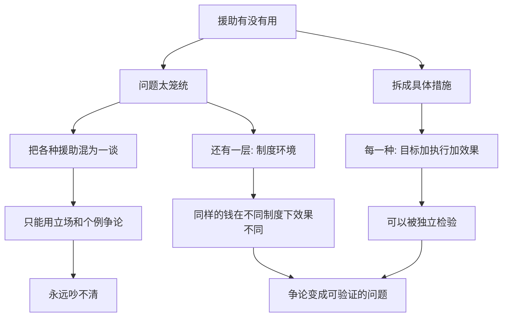

# 14｜援助到底有没有用？

> 几十年里，富国向穷国投入了巨额援助，可贫穷依然存在。那么，援助到底是救命的水，还是养懒的药？

---

## 一、先说结论

两位作者的答案，可能让两边都不太满意：**这个问题没有一个笼统的答案。**

批评者说，援助养成了依赖、被腐败截留、助长了不负责任的政府；支持者说，许多具体的援助——疫苗、驱虫、上学、清洁饮水——效果清清楚楚。

两位作者认为：与其争论“援助总体上有没有用”，不如把问题拆小，去问**具体哪一种援助、在什么条件下、对谁、效果如何**。前者永远吵不清，后者却可以被检验。

---

## 二、我们先理解一个问题

先听两句都很有道理的话。

第一句：“没有援助，很多孩子会死于本可预防的疾病，很多孩子上不了学。见死不救，说不过去。”

第二句：“几十年的援助砸下去，有些国家依然贫困，甚至更依赖外来施舍。钱去哪儿了？有没有养出一批靠援助吃饭的官僚？”

这两句话，一句讲道义，一句讲效果，各自都能举出例子。于是问题变成：

> 我们凭什么判断，援助到底有没有用？

---

## 三、作者到底提出了什么观点？

他们没有简单地站队，而是做了一个“拆解”。

两位作者认为，“援助”这个词太笼统了。它同时指很多东西：一顶蚊帐、一针疫苗、一笔预算支持、一个大型基建项目、一次紧急粮食救援……把它们打包在一起问“有没有用”，就像问“药有没有用”一样——答案只能是“看是什么药、治什么病”。

所以他们的立场是：**放弃宏大的总问答，改成具体检验。** 不问“援助有没有用”，而问“这一项具体的援助，有没有达到它宣称的效果”。

---

## 四、把这个观点翻译成人话

把它想成看病。

如果有人问“吃药到底有没有用”，你没法回答。因为有的药救命，有的药伤身，有的药对某些人有效、对另一些人无效，还有的药本身没错，只是被吃错了、开错了，或者根本没吃到嘴里。

援助也是一样。判断一笔援助是否有效，至少要问三件事：**它想解决什么具体问题？它有没有真的做到？效果能不能被独立验证？**

一旦问题被这样拆开，原本吵成一团的大争论，就变成了一个个可以被检验的小问题。

---

## 五、为什么会这样？

关键在 **B → F** 这一跳：把“援助”从一个大词，拆成一件件具体的事。而在 **J → K** 这一层，两位作者也承认，同样的援助放到不同国家、不同制度环境里，效果可能天差地别。

---

## 六、举一个现实生活中的例子

看关于非洲援助的那场著名争论，它最能说明为什么这件事吵了几十年还没有定论。

批评的一方——一些发展经济学家认为——长期、大规模的援助可能带来几个问题。第一，钱在层层流转中被腐败和行政成本截留，真正到达需要者手里的部分有限；第二，政府如果靠援助就能运转，就容易对本国纳税人缺乏责任，也就没有动力去建立有效的治理；第三，一些“大推进”式的宏大计划，因为高估了执行能力，最终效果不佳。他们还担心，援助会成为一种长期的依赖，而不是走向自立。

支持的一方——另一些经济学家则指出——用“总量”来评判援助，本身就会掩盖真相。因为许多**具体措施的效果是明确的**：驱虫项目能让孩子更多地到校上课，疫苗能降低本可预防的疾病，学校供餐能改善出勤与营养，提供信息能改变家长的选择。这些不需要宏大叙事去证明，它们是可以用数据检验的。他们还认为，把贫困国家的困境全归咎于援助，忽略了殖民历史、全球贸易、地理与气候等更深的因素。

两位作者的态度，正夹在这两方之间：**他们既不接受“援助万能”，也不接受“援助全错”。** 他们更愿意承认——同样的钱，有的被浪费了，有的救了命；关键在于具体设计和执行。

---

## 七、回到书中重新理解

现在再回看这个观点，就能理解它为什么重要。

这场争论之所以难有结论，很大程度上是因为双方经常在谈不同的东西：一方谈的是**宏观总量与长期制度**，另一方谈的是**具体措施与短期效果**。用宏观的失败去否定具体的成功，或者用具体的成功去替宏观的浪费辩护，都不公平。

两位作者的贡献，不是给援助下最终判决，而是提供一种更清醒的提问方式：**别问“援助好不好”，要问“这一项援助，在这里，做到了什么”。**

---

## 八、这个观点背后还有什么？

**第一，制度是效果的放大器或消音器。** 同样的资源，在有问责、有透明的地方能发挥巨大作用，在腐败横行的地方可能石沉大海。

**第二，援助的形式很重要。** 直接给钱、给物资、给技术、给预算支持，后果完全不同。设计不当的好意，也会造成伤害。

**第三，紧急救援与长期发展是两回事。** 灾难中救人性命，与帮助一个国家摆脱贫困，需要完全不同的思路，混为一谈就会失焦。

**第四，透明与评估是关键。** 只有让效果可被独立检验，援助才不至于永远停留在“相信它有用”或“怀疑它没用”的口水战里。

---

## 九、这个观点有问题吗？

有，而且这是一个真正没有共识的领域，需要格外平衡。

一方面，批评者的担忧不是空穴来风：确实存在援助被截留、项目不了了之、受援国产生依赖的情形。忽视这些问题，就是自欺欺人。

另一方面，全盘否定援助同样站不住脚：那些成本不高、效果明确的措施，确实改善了很多人的处境。用个别失败去否定整体，和用个别成功去美化整体，是一样的逻辑错误。

还有一层争议在于**“效果”该怎么衡量**。是看死亡率降了多少、入学率升了多少，还是看一个国家有没有走上自主发展的路？不同的标准，会导向不同的结论。关于这一问题，学界存在不同解释。一些学者还提醒，援助的受益者与设计者往往不是同一批人，所谓“有用”，对谁有用，也需要追问。

所以更准确的说法是：**援助既不是万能药，也不是万恶之源。它是一堆具体措施、具体设计的集合，有的有效，有的无效，有的甚至有害。** 能不能分辨清楚，正取决于我们是否愿意去做笨拙而扎实的验证。

---

## 十、今天再看这个观点

以下部分是这一观点的现代延伸，不是两位作者的原话。

今天，“援助”的形式已经远远超出了国家间的资金转移。公益基金会、慈善众筹、企业社会责任、直接给现金的试点项目，都加入了这场实验。而“直接发钱”——也就是无条件的现金转移——的一次次评估，也让老争论有了新的材料：在一些场景下，给钱并没有被挥霍，反而被用来买粮、看病、送孩子上学。

与此同时，数字化也让监督成为可能：电子转账可以减少中间环节的截留，公开的数据让外部能看到钱流向了哪里。但技术只能减少浪费，不能替代问责与制度建设。

这提醒我们：**争论援助，最终绕不开的不是“给不给”，而是“怎么给、给谁、谁来监督”。** 这正好把我们带到下一个问题。

---

## 十一、这一篇真正应该记住什么？

1. **“援助有没有用”是个太笼统的问题。** 把它拆成具体措施，才有可能回答。
2. **批评者的担忧是真实的：** 腐败、依赖、制度责任，都是真问题，不能回避。
3. **支持者也有硬证据：** 许多具体措施——疫苗、驱虫、信息——效果明确。
4. **同样的钱，效果取决于制度与设计。** 援助不是万能药，也不是万恶之源。
5. **透明与可验证，是让争论前进的唯一出路。**

---

## 十二、留一个问题

> 如果你要为一项援助辩护，或反对一项援助，
> 你手里握着的，
> 是“我相信它有（没）用”，
> 还是“有人验证过它到底有没有用”？

---

**下一篇**：就算我们找到了有效的措施，也无法保证它能真正落到需要的人身上。在援助与好政策之间，横着一道更麻烦的坎——执行。

下一篇我们就来拆开这个问题——**为什么好政策常常落不了地？**
