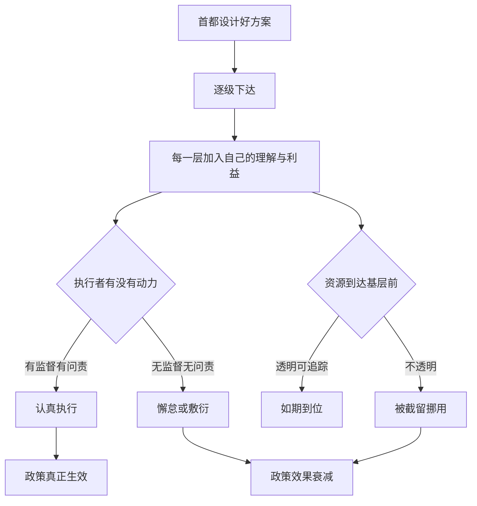

# 15｜为什么好政策常常落不了地？

> 一份在图纸上完美的方案，为什么走到村口就变形、走样，甚至悄无声息地消失？

---

## 一、先说结论

两位作者认为，政策从来不是在真空中执行的。它必须经过一层层执行者——官员、教师、医生、村干部——的手，而这些人也有自己的利益、压力与难处。

因此，**一项政策的成败，不只取决于设计得多好，更取决于执行它的人有没有动力、有没有能力把它做对。**

作者的态度是双重的：一方面承认制度与腐败是根本问题；另一方面强调，在现实约束一时难以改变的情况下，与其坐等完美制度，不如先做“能做的、可验证的小改进”。理想主义如果不能落地，就等于零。

---

## 二、我们先理解一个问题

先想象一份方案的旅程。

它在首都的会议室里诞生：逻辑严密、预算清楚、目标明确，甚至连实施时间表都排好了。它的出发点是善意的，设计者真心相信这能帮到穷人。

可它要想到达那个村口的小学、那个乡镇的诊所，必须先经过：部委、省、市、县、乡、村……每经过一个环节，就多一层理解、一次转手、一份可以被“灵活处理”的空间。

于是常见的结果是：文件发了，会议开了，钱也拨了，但村子里的孩子并没有多上一天学，诊所里依然没有药。

问题就来了：

> 一份好方案，为什么走不到最后一步？

---

## 三、作者到底提出了什么观点？

两位作者把目光从“方案设计”移到了“执行现场”。

他们的核心判断是：**执行者也是会算账的人。** 一个基层官员、一名教师、一位医生，面对层层下达的任务，会问自己几个很现实的问题：做这件事对我有什么好处？不做会有什么后果？我有没有能力做到？如果没人监督、没人问责，那么“不做”往往是成本最低的选择。

于是，政策在落地时常常遭遇三种扭曲。

第一种是**懈怠**：任务完成了没有，没人认真查，做与不做差别不大。

第二种是**错配**：政策的目标是甲，执行者却为了省事或图利，把它做成了乙。

第三种是**截留**：本该到基层的资源，在途中被挪用、占用甚至私分。

作者因此主张：**设计政策时，必须把执行者的激励考虑进去，而不是假定所有人都会忠实照办。**

---

## 四、把这个观点翻译成人话

把它想成一场接力赛。

指挥棒从第一个人手里传出去时，往往还是完整而有力的。可每传一棒，都可能慢一点、偏一点，甚至掉一棒。如果中间任何一棒敷衍了事，最后的冲刺手再快也没用。

或者更贴近生活一点：像公司总部定了一个好目标，可执行的是层层不同的部门。总部以为“说了就等于做了”，实际上，每往下走一层，目标就被稀释一次，直到一线员工根本没听说过这件事。

好的方案，不是“画出来的”，而是“被一层层做出来的”。

---

## 五、为什么会这样？

关键在 **D** 与 **G** 这两个分岔口。

执行者的动力从哪来？来自监督、问责、奖励，也来自身边的社会规范。资源能不能到位，则取决于流转过程透不透明、能不能被追踪。这两处一旦失守，再好的方案也会被消磨掉。

而在两位作者看来，一个常被忽略的杠杆是**信息**：当决策的依据和执行的结果变得公开可见，执行者就多了一重来自外部的约束。

---

## 六、举一个现实生活中的例子

来看一个被反复引用的真实案例。

在某个非洲国家，政府每年会给学校拨一笔办学经费，用来买教材、修教室、发办公用品。设计上，这是一项好政策，目的正是让每个孩子用上更好的学校。

有研究者去追踪这笔钱的去向，结果发现一个令人不安的现象：**真正到达学校的经费，只有很小一部分。** 大部分在逐级的流转过程中“消失”了——被上级部门截留、挪用，或者在账面上打了转。

学校拿不到钱，家长也就以为“政府根本没拨款”，于是既不抱怨，也不追问。问题就这样安静地存在着。

但故事并没有停在这里。后来，当地政府开始把每所学校应得的经费数额**在报纸上公布**，让家长和社区都能看到自己学校到底该拿多少钱。

这一招改变了很多东西：因为数字公开，家长知道了、社区知道了，中间环节再也难以悄悄截留。有研究发现，在信息公布之后，真正到达学校的经费比例大幅上升。

这个案例之所以经典，不是因为它证明了“政府一定腐败”，而是因为它同时说明了三件事：**执行会走样；走样有时悄无声息；而让信息透明，能实实在在地改善落地。**

---

## 七、回到书中重新理解

现在再回看这个观点，就能看出两位作者的务实。

他们并不天真地认为“只要有好政策就够了”，也并不是简单地把失败都归因于“坏人”。他们更感兴趣的是：在真实的人性和真实的制度里，怎么让好事真正发生。

这与全书反复出现的思路一致——**先看清真正的约束在哪里。** 如果约束在执行环节，那么再优化纸上方案也没用；如果约束是信息不透明，那么公开信息可能比追加投入更立竿见影。

---

## 八、这个观点背后还有什么？

**第一，问责比口号重要。** 没有后果的责任是空的，没有监督的权力容易懈怠。

**第二，激励要顺着人性设计。** 与其指望执行者“觉悟高”，不如让做对的事对他们也有好处。

**第三，透明度是一种低成本的力量。** 把信息交给当事人——家长、病人、村民——他们自己就会成为监督者。

**第四，能力问题不能忽视。** 有些政策落不了地，不是执行者不想做，而是他们根本做不到：缺人手、缺培训、缺基础设施。

---

## 九、这个观点有问题吗？

有，需要平衡地看。

一方面，“先做可验证的小改进”这一路径确实引人质疑：一些学者认为，如果不去触动根本的制度与政治结构，小改进可能只是杯水车薪，甚至会被用来替不合理的制度“贴金”。在权力高度集中、问责缺失的环境里，再多技术性的优化也可能被吸收、被消化。

另一方面，坐等大制度凭空改变，同样不现实。历史经验反复表明，制度极少在一夜之间重塑，而具体可行的改进却能在当下救人于水火。**“制度重要”和“小改进有用”这两句话，并不必然矛盾**——前者是方向，后者是可行的第一步。

还有一层复杂性在于：同样的透明化措施，在不同社会里效果不同。有的地方，公开信息立刻激活了社区监督；有的地方，公开了也少有人有力气去追问。因此，把某一地的成功经验简单照搬，也可能水土不服。

所以更准确的说法是：**政策落地难，根子在激励、制度与信息；解决办法既不能只靠技术性修补，也不能只靠坐等制度革命，而要在两者之间找到现实可行的路径。**

---

## 十、今天再看这个观点

以下部分是这一观点的现代延伸，不是两位作者的原话。

今天，数字技术给了“让政策落地”一些新工具。把补贴直接打进个人账户，可以减少中间环节的截留；统一的信息平台，使资金流向可查、可追溯；政务公开与在线监督，让普通人更容易看到“钱到哪儿了”。

但技术不是万能钥匙。账户可以被冒领，数据可以被造假，平台也可以被规避。真正起作用的，往往仍是那个老问题：**有没有人认真地在监督，以及监督能不能产生后果。** 技术降低了监督的成本，却替代不了监督的意愿。

这提醒我们：**让好政策落地，一半是制度设计，一半是诚实与勇气。** 而当我们把无数这种可验证的改进累积起来时，会通向一个更大的问题。

---

## 十一、这一篇真正应该记住什么？

1. **政策必须经过执行者的手。** 他们的激励与约束，决定政策能不能落地。
2. **落地的三种扭曲：** 懈怠、错配、截留。
3. **信息透明是低成本的杠杆。** 把数字告诉当事人，他们就会成为监督者。
4. **制度重要，但小改进也可行。** 方向与现实的第一步，可以并存。
5. **技术能降低监督成本，却替代不了监督意愿。**

---

## 十二、留一个问题

> 当你看到一个好政策失败时，
> 你首先想到的是“设计得不够好”，
> 还是“它根本没被好好执行”？
> 而这两者，哪一个才是你真正有能力改变的？

---

**下一篇**：从方法、到具体措施、再到落地，我们已经走完了这一路。那么在最后，面对如此复杂、如此顽固的贫穷，我们到底应该抱什么态度？

下一篇我们就来拆开这个问题——**消除贫穷究竟靠什么？**
