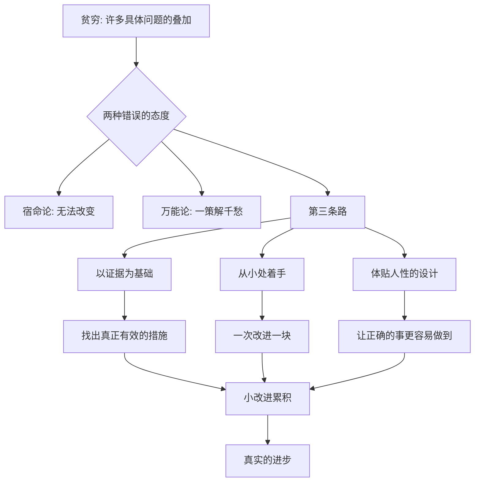

# 16｜消除贫穷，究竟靠什么？

> 贫穷如此顽固、如此复杂，我们到底该抱什么态度：相信它终会改变，还是接受它无法根除？

---

## 一、先说结论

两位作者的答案，既不是乐观的口号，也不是悲观的叹息。

他们反对两种态度：一种是“**宿命论**”——贫穷无法改变，穷人天生如此；另一种是“**万能论**”——只要有了某个方案、某个技术、某笔巨款，就能一举解决。

他们主张的是第三条路：**以证据为基础，从小处着手，把政策设计得体贴人性。** 一个个具体、可验证的小改变累积起来，就是真实的进步。做这件事，既需要科学的严谨，也需要直面现实的谦逊。

---

## 二、我们先理解一个问题

面对“如何消除贫穷”这样的大问题，人很容易滑向两个极端。

一个极端说：“人类的进步是必然的，贫穷终将被发展消灭。”它给人希望，却常常落空——几十年过去，仍有亿万人在贫困中挣扎。

另一个极端说：“试过了，都没用。援助被贪掉，政策会变形，穷人自己也不改变。”它似乎更“清醒”，却也堵死了所有行动的可能。

那么有没有第三种可能：

> 既不幻想一击而中，
> 也不放弃任何一次小胜？

---

## 三、作者到底提出了什么观点？

两位作者给出的，是一种**方法论上的谦逊**。

他们的主张可以拆成三点。

第一，**以证据为基础。** 不要凭信念断定哪种办法有效，而要像前面反复强调的那样，去检验它。有效的留下来，无效的改掉。

第二，**从小处着手。** 不要总想着用一个宏大方案包办一切。贫穷是许多具体问题的叠加——营养、健康、教育、生育、风险、信贷、储蓄、生意——每一块都有可以改进的地方。

第三，**把政策设计得体贴人性。** 人会拖延、会犯错、会被眼前的事牵着走。好的政策顺着人性设计，而不是要求每个人都像圣人。

一句话概括：**别问“有没有一个办法能解决贫穷”，要问“今天能做哪一件被验证过的小事”。**

---

## 四、把这个观点翻译成人话

把它想成盖一堵墙。

没有人能一挥而就盖起一堵墙，但如果每天砌一层，墙就会一寸寸长高。反过来，如果因为“一次盖不完”就干脆不动手，那墙永远只是图纸。

或者想成一条条小溪。它们单独看都微不足道，可当无数条汇到一起，就成了江。

两位作者想说的正是这个道理：**贫穷不是靠一次壮举打败的，而是靠许多被验证过的小改进，一层层被垫起来的。**

---

## 五、为什么会这样？

关键在 **B → E** 这一跳：拒绝非此即彼，改走一条既诚实又可行的路。而 **L → M** 则提醒我们：进步的形式，往往不是戏剧性的突破，而是许多细小的、可以被验证的改善，慢慢叠加。

---

## 六、举一个现实生活中的例子

来看几个被反复研究、也确实被证明有效的小改进。

**驱虫。** 在很多地区，孩子体内有寄生虫，却几乎没人当回事。而给学龄儿童定期驱虫，成本极低，一次服用的药费甚至不到一顿饭钱。研究发现，这么做不仅改善了孩子的健康，还显著减少了缺勤——因为不生病了、有力气了，孩子才坐得住、学得进。一项看似微不足道的措施，同时撬动了健康与教育。

**疫苗。** 接种疫苗是预防传染病最有效的手段之一，可它的好处“看不见”——没得病，你并不知道是谁的功劳。因此，光讲道理往往不够，需要用“助推”把接种变得更容易：上门提醒、就近设点、按时接种给一点小奖励。这些细节上的体贴，让接种率实实在在地提高。

**提供信息。** 有时候，只要把一条准确的信息交到当事人手中，选择就会改变。给家长一份清晰地说明“多读一年书能带来多少回报”的材料，或者把学校的经费、成绩公开，就能改变他们的投入与参与。信息本身，就是一种干预。

这些小改进，单拎出来都不起眼。可正是它们，一次次被验证、被复制、被推广，拼成了真实的进步。

---

## 七、回到书中重新理解

现在再回看整本书，就能看出两位作者真正想留下的东西。

他们没有许诺一个没有贫穷的明天，也没有把贫穷说得无药可救。他们做的，是**把一个个大问题拆成小问题，再一个个去检验解法**。营养、健康、教育、生育、风险、信贷、储蓄、生意、援助、落地——每一章，都是这个思路的一次实践。

所以，这本书最宝贵的地方，也许不是它给出的某个具体结论，而是它示范的那种态度：**不轻信、不绝望、动手验证、逐步改进。**

---

## 八、这个观点背后还有什么？

**第一，它是一种认识论：承认自己会错。** 正因为不确定，才需要实验；正因为会错，才要能改进。

**第二，它是一种伦理：不拿穷人的生活做宏大的赌注。** 与其用一个未经验证的方案去“一举改变”，不如用被验证过的小步骤，稳稳地改善。

**第三，它是一种耐心：接受进步是渐进的。** 消除贫穷不会在某一天完成，而是每天都在被推进一点。

**第四，它把责任交回到每个人手上。** 科学方法不是专家的专利，“先验证、再行动”的态度，对每一个想帮助别人的人都适用。

---

## 九、这个观点有问题吗？

有，而且这是整本书最深刻的争议之一。

一方面，强调“小处着手”确有风险：一些学者批评说，如果只做一个个孤立的小改进，而不去面对造成贫穷的结构性原因——土地制度、政治权力、全球贸易格局——那么这些小胜可能随时被更大的力量吞没，甚至被当作“已经尽力了”的挡箭牌。**在结构性不公面前，技术性的修补是否足够？** 这是一个严肃的追问。

另一方面，等待结构彻底改变才行动，往往意味着永远不行动。历史上，宏大的变革方案也常常带来灾难性的后果，因为它们高估了人的知识与执行能力。相比之下，稳扎稳打的小改进，虽然慢，却很少造成系统性伤害。

这场争论没有简单的答案。可以大致这样理解：**小改进回答的是“现在能做什么”，结构变革回答的是“为什么问题会长期存在”。** 前者不能替代后者，后者也不该成为放弃前者的理由。一个成熟的态度，是同时握住两端：一边推动制度层面的改变，一边不放过任何一件当下能做的、被验证过的小事。

---

## 十、今天再看这个观点

以下部分是这一观点的现代延伸，不是两位作者的原话。

今天，“以证据为基础地做小事”，已经变成一种全球性的实践。政府设立行为洞察团队，公益组织用数据评估项目，企业用对照实验改进产品。越来越多的人接受了那个朴素的道理：**先小规模试，再决定要不要推广。**

但热潮之下也有需要警惕的东西。“可验证”很容易变成“只验证容易量化的部分”：入学率能测，学习质量难测；收入能测，尊严难测；短期效果能测，长期影响难测。如果我们只追逐那些能快速拿出数字的改进，就可能悄悄把真正重要却难测量的问题排除在外。

所以这本书留给今天的，不只是一堆结论，更是一种自我要求：**既要相信证据，也要持续追问——我们到底在为什么而衡量。**

---

## 十一、这一篇真正应该记住什么？

1. **拒绝两种极端：宿命论与万能论。** 贫穷既可改变，又没有捷径。
2. **以证据为基础。** 有效才留下，无效就改掉。
3. **从小处着手。** 贫穷是许多问题的叠加，一次解决一块。
4. **体贴人性。** 让正确的事变得更容易做到。
5. **小改进累积成真实进步。** 进步往往是渐进的，但它是真的。
6. **同时不忘结构性追问。** 小改进回答“现在能做什么”，结构变革回答“问题为何长期存在”。

---

## 十二、留一个问题

> 你或许无法解决“贫穷”这个大问题，
> 但你面前，很可能有一件被验证过、又小到可以立刻去做的事。
> 那么，
> 你打算从哪一件开始？

---

到这里，这个系列就走到了终点。回过头看，这一路其实只做了一件事：把“穷人为什么穷”这个大问题，拆成一个个可以用证据回答的小问题。而这一切的起点，正是那个看似朴素的主张——**与其争论，不如实验。**

方法不是答案，但它让我们有可能得到答案；它不承诺奇迹，却让每一次微小的改进步步为营。至于贫穷究竟意味着什么、我们又该如何面对它，真正的理解不在这些文字里，而在你合上文章之后，用自己的眼睛去看、用自己的判断去形成的那个版本。
