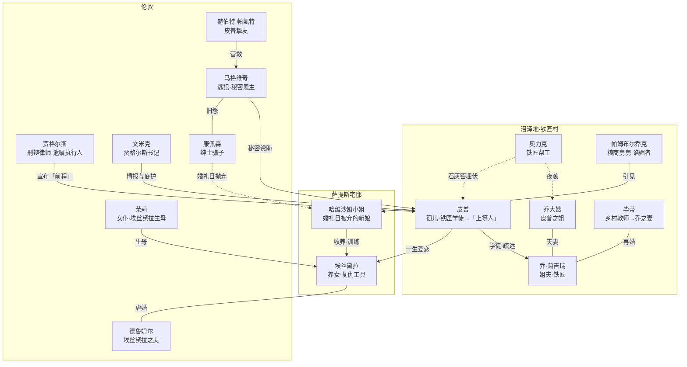
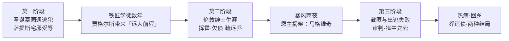

# 00｜系列导读与目录

> 《远大前程》深度解读系列：先带你认识这本书，再带你一层层走进去。

## 系列简介

《远大前程》是查尔斯·狄更斯一八六〇年至一八六一年连载于自办周刊《一年四季》的长篇小说，也是他倒数第二部完整作品。故事从肯特沼泽地一座墓园开始：孤儿皮普在父母的墓碑前被一名逃犯吓得魂飞魄散，偷了家里的食物与锉刀送去——多年以后，一份来历不明的「远大前程」突然降临，他以为是命运终于垂青，却不知道这份馈赠的每一分钱都来自当年那个他最怕的人。这本书最锋利的地方，不是讲一个穷孩子如何变成绅士，而是追问：成为「上等人」的代价是什么？一个社会的奖赏为什么常常落到最不该得的人手里，又被最配得的人拒绝？本系列按「故事 → 人物 → 冲突 → 主题 → 写法 → 今天」的递进逻辑，把这本书拆成十三篇文章加一篇总结，每一篇只回答一个问题。

## 作品定位

| 项目 | 内容 |
|---|---|
| 作者 | 查尔斯·狄更斯（Charles Dickens，1812—1870），英国维多利亚时代小说家 |
| 首版时间 | 一八六〇年十二月一日至一八六一年八月三日连载于《一年四季》（All the Year Round），共三十六期、五十九章，分为三个「阶段」；一八六一年由查普曼与霍尔出版社（Chapman & Hall）出版三卷单行本，当年一再重印 |
| 文学类型 | 长篇成长小说（Bildungsroman）；第一人称回望叙事；带哥特元素的社会讽刺小说 |
| 历史背景 | 故事主体一般推断发生于十九世纪最初数十年：罪犯流放澳洲、泰晤士河口监狱囚船、纽盖特绞刑文化、绅士观念与阶级流动焦虑 |
| 文学地位 | 狄更斯流传最广的作品之一；萧伯纳称其为狄更斯「最紧凑完美的书」，斯温伯恩视其为「最后的伟大作品」，安格斯·威尔逊称之为「狄更斯最完全统一的艺术品」；但初版评论褒贬不一（《布莱克伍德杂志》评其「疲弱、倦怠、失色」）；除《圣诞颂歌》外被影视改编最多的狄更斯作品；「两个结局」是出版史著名公案 |
| 创作缘起 | 原是给《一年四季》写的短文，狄更斯致信福斯特称「一个非常漂亮、新颖而怪诞的念头展开了」，最终扩为长篇；连载的直接动因是顶替查尔斯·利弗滞销的连载以挽救杂志销量 |
| 核心思想 | 「前程」与恩主之问的解构；绅士理想的批判；罪与愧、感恩与忘恩；童年如何塑造一生 |

## 全书核心问题

| 层次 | 核心问题 |
|---|---|
| 故事层 | 开场为什么选在五块小墓碑前的圣诞黄昏？一份「前程」究竟是谁给的？恩主之谜揭开时击碎的到底是什么？ |
| 人物层 | 皮普想当「上等人」究竟在逃避什么？马格维奇为何倾尽所有去造就一个绅士？乔为什么才是全书的良心？埃丝黛拉被制造出来伤人，她自己受过伤吗？哈维沙姆为什么把恨传给下一代？ |
| 社会层 | 「绅士」在维多利亚时代意味着什么？一部没有凶案的小说为什么从头到尾充满罪与愧？狄更斯在贵族与平民、法律与良心之间站在哪一边？ |
| 思想层 | 狄更斯为什么改掉原来的结尾？「期望」这个词在小说里完成了怎样的反讽？苦难究竟会不会改变一个人？ |
| 写法与价值层 | 回望式第一人称如何让皮普审判自己？周刊连载怎么逼出「最紧凑」的结构？一百六十多年后重读还剩什么？ |

## 故事与人物地图

人物关系总览（姓名按通行中译名）：

时间线（皮普的「三个阶段」与故事主线）：

## 剧透策略声明

本系列默认读者是**已经读完（或不在乎剧透）的人**：文学解读无法在不触碰结局的情况下讨论人物与主题。但本导读正文不点破结局的具体方式；目录标题只透露「恩主另有其人」的方向、不透露揭晓的过程与人物的最终下场。各篇文章开头均有「剧透提示」标明该篇允许动用的情节范围，未读完的读者可按提示自行绕行。

## 全系列目录

### 第一部分：进入故事

#### 01｜一个孤儿、一座墓园和一个逃犯：这本书为什么从死亡开始？
核心问题：小说的开场为什么选在五块小墓碑前的圣诞黄昏？
核心观点：开场不是噱头，而是全书的方法——一个孩子在死亡的坐标里认识自己，一次善举埋下整部小说的因果。
理解难度：★☆☆☆☆
关键词：墓园、马格维奇、善举、圣诞、囚船
剧透范围：前五章情节与背景设定
---

#### 02｜哈维沙姆小姐：被时间冻结的人为什么要把恨传给下一代？
核心问题：一个被抛弃的新娘，为什么要把自己的创伤变成伤人的武器？
核心观点：萨提斯宅邸不是奇景，而是一台复仇机器——钟表停摆的那一刻，她把自己的人生典当给了恨。
理解难度：★★☆☆☆
关键词：萨提斯宅邸、停摆的钟、婚纱、复仇教育、埃丝黛拉
剧透范围：第一、二阶段情节，兼及哈维沙姆结局
---

### 第二部分：理解人物

#### 03｜皮普：一个想成为「上等人」的男孩究竟在逃避什么？
核心问题：皮普的野心从哪里来，它真正在逃离的是什么？
核心观点：一种可能的读法是——皮普追求的不是前程本身，而是摆脱那个「不配被爱」的自己。
理解难度：★★★☆☆
关键词：羞耻、势利、忘恩、自我厌恶、绅士梦
剧透范围：第一、二阶段为主
---

#### 04｜马格维奇：为什么最「不配」的人成了真正的恩人？
核心问题：一个终身罪犯凭什么成为全书道德天平上最重的砝码？
核心观点：狄更斯让社会意义上的「渣滓」完成最慷慨的给予，以此拷问「绅士」与「好人」是不是同义词。
理解难度：★★★☆☆
关键词：马格维奇、流放、康佩森、感恩、恩主
剧透范围：全书含结局
---

#### 05｜乔：这个「跟不上」皮普的铁匠为什么才是全书的良心？
核心问题：一个被皮普反复嫌弃的人，为什么反而成了衡量皮普的尺子？
核心观点：乔的「笨拙」是狄更斯精心设计的对照——在一个人人往上爬的故事里，唯一不爬的人保存了全部的善良。
理解难度：★★☆☆☆
关键词：乔、铁匠铺、忠诚、还债、另一种绅士
剧透范围：全书含结局
---

#### 06｜埃丝黛拉：被制造出来伤人的女人，她自己受过伤吗？
核心问题：一件「复仇工具」有没有自己的人生？
核心观点：埃丝黛拉不是冷血的象征，而是哈维沙姆实验的真正成品——她被剥夺了「有心」的权利，又用一生偿还。
理解难度：★★★☆☆
关键词：埃丝黛拉、没有心、训练成果、德鲁姆尔、工具
剧透范围：全书，结局细节见第 10 篇
---

### 第三部分：冲突与时代

#### 07｜「前程」到底是谁给的：恩主之谜揭开时皮普为什么崩溃？
核心问题：狄更斯把全书最大的反转押在哪个瞬间，它击碎的是什么？
核心观点：暴风雨夜的揭晓拆穿的不只是一个误会，而是皮普整套世界观——他的优越原来建立在最被鄙弃的人身上。
理解难度：★★★☆☆
关键词：恩主之谜、贾格尔斯、暴风雨夜、反转、真相
剧透范围：全书含关键反转
---

#### 08｜维多利亚时代的「绅士」：狄更斯究竟在讽刺什么？
核心问题：「gentleman」这个词在那个时代意味着什么，狄更斯又用它撬开了什么？
核心观点：小说明明写满了想挤进上流的人，却让「绅士」这个词在真正的体面面前一步步贬值。
理解难度：★★★☆☆
关键词：绅士、阶级、势利、帕姆布尔乔克、文米克
剧透范围：全书
---

### 第四部分：核心主题

#### 09｜一部没有凶案的小说，为什么从头到尾都是罪与愧？
核心问题：脚镣、囚船、监狱、通缉令——犯罪意象为什么在书里无处不在？
核心观点：一种可能的读法是——狄更斯在问一个更尖的问题：法律和良心，究竟谁判得更准？
理解难度：★★★★☆
关键词：罪、脚镣、奥力克、茉莉、纽盖特、量刑不公
剧透范围：全书含结局
---

#### 10｜两个结局：狄更斯为什么改掉原来的结尾？
核心问题：皮普与埃丝黛拉到底该不该重逢？两个结尾各自说出了什么？
核心观点：这不是「大团圆还是真悲剧」的选择题，而是狄更斯对「人会不会被苦难改变」给出的两种答案。
理解难度：★★★☆☆
关键词：原结局、布尔沃-利顿、改稿、福斯特、团圆与救赎
剧透范围：全书含结局（本篇即结局解读）
---

### 第五部分：写法与文学价值

#### 11｜回望的眼睛：年长的皮普为什么这样讲自己的故事？
核心问题：让当事人自己叙述，却让他不断审判当年的自己——这种写法解决了什么问题？
核心观点：回望式第一人称是全书最深的装置：叙述者皮普既在讲自己，又站在法庭另一边做原告。
理解难度：★★★★☆
关键词：第一人称、回望叙事、反讽、自我审判、记忆
剧透范围：全书
---

#### 12｜《远大前程》凭什么被称为狄更斯最成熟的作品？
核心问题：一部为救杂志销量赶写的连载，怎么成了文学史上「最紧凑完美」的狄更斯？
核心观点：周刊连载的压力反而逼出了罕见的结构密度——狄更斯把自传、成长小说与犯罪故事焊成了一个整体。
理解难度：★★★★☆
关键词：连载史、成长小说、批评史、萧伯纳、自传性
剧透范围：全书
---

### 第六部分：连接今天

#### 13｜一百六十多年后，「远大前程」这四个字为什么还烫手？
核心问题：当「出人头地」依然是我们时代的咒语，皮普的故事还能照出什么？
核心观点：以下部分是 modern extensions——它对阶级跃升、原生羞耻与「谁的期望」的追问，今天依然有效。
理解难度：★★☆☆☆
关键词：现代意义、阶级跃升、原生羞耻、成功学、期望
剧透范围：全书
---

### 第七部分：收束

#### 99｜系列总结：《远大前程》
核心问题：这本书借这个故事，究竟在讨论什么？
核心观点：狄更斯借一个孤儿的「前程」实验，追问什么是体面、谁是恩人、人该如何偿还童年的债。
理解难度：★★★☆☆
关键词：总结、人物地图、主题回顾、文学史
剧透范围：全书含结局
---

## 推荐阅读顺序

主线按 **01 → 13 → 99** 顺序读，即本系列设计的递进路线：

- **第一段（01–02）**：进书。先看懂开场与萨提斯宅邸这两块地基，后面所有讨论都建立在这两处空间上。
- **第二段（03–06）**：看人。皮普、马格维奇、乔、埃丝黛拉各一篇，理解「他们为什么这样做」。
- **第三段（07–08）**：看反转与时代。恩主之谜是全书枢纽，「绅士」是时代的关键词。
- **第四段（09–10）**：看主题。罪与愧、两个结局——全书最难也最富争议的问题。
- **第五段（11–13）**：看写法与今天。拔高到叙事装置、文学史与现代意义。
- **99**：总结收束，把十三篇收进一张地图。

不同需求的入口：

- **只想抓骨架**：01 → 07 → 09 → 10 → 99。
- **对人物感兴趣**：02 → 03 → 04 → 05 → 06。
- **练批判性阅读**：08（「绅士」之争）→ 10（结局之争）→ 12（评价之争）→ 13（现代延伸）。
- **没读完原书**：只读 00 与 01，其余各篇开头的「剧透提示」会告诉你该篇会走多远。

## 全系列状态

本系列规划 **13 篇正文 + 00 导读 + 99 总结**，目录如上。回复「开始写」生成正文；回复「直到写完所有篇」一次性写完全部。
