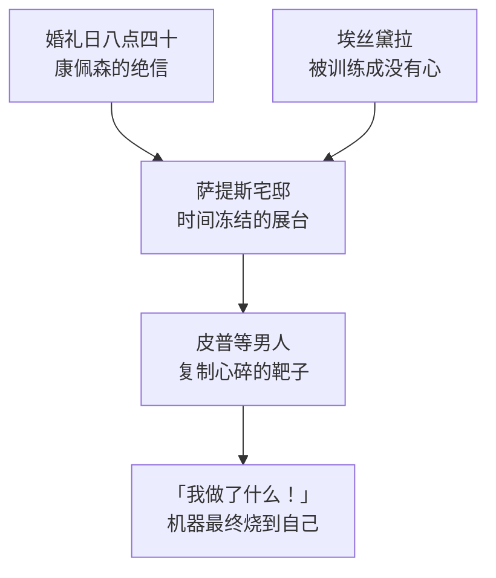

# 02｜哈维沙姆小姐：被时间冻结的人为什么要把恨传给下一代？

> 本篇核心问题：一个被抛弃的新娘，为什么要把自己的创伤变成伤人的武器？

> **剧透提示**：本文涉及第一、二阶段情节，兼及哈维沙姆的结局。

---

## 开篇：一个值得思考的问题

狄更斯写过很多怪人，但萨提斯宅邸里的哈维沙姆小姐大概是英语文学中最有名的怪人之一：婚纱穿了一辈子，满屋子的钟停在同一时刻，婚宴蛋糕留给老鼠和甲虫啃食。读者很容易把她当成一座哥特式奇观——一个「疯老太太」的猎奇标本。

但这样就漏掉了真正值得问的问题。她不是一个无害的疯子：她收养了一个女孩，专门训练她去伤男人的心；她把皮普叫到宅子里，看着他一步步坠入这个圈套。一个受害者，为什么要把自己的创伤变成伤人的武器？这才是狄更斯在这座宅子里真正埋下的问题。

## 一、从故事开始

皮普第一次被领进萨提斯宅邸，是帕姆布尔乔克牵的线。小说明确写了他看到的一切：宅子里所有钟表都停在八点四十；新娘还穿着婚纱，只是婚纱早已黄旧；长长的婚宴桌上，蛋糕被虫鼠占据，蜘蛛在桌布上爬进爬出；她一只脚穿着鞋，另一只鞋摆在桌上——信送到的那一刻她正在穿鞋，从此再没把这只鞋穿上。房间里不见天日，只有蜡烛。

事情的原委，小说借赫伯特之口补叙：哈维沙姆小姐是有钱的女继承人，婚礼那天早上八点四十，她收到未婚夫康佩森的信——这个男人早就伙同她同父异母的弟弟亚瑟掏空了她的财产，此刻宣布不会出席婚礼。她当场崩溃，随后下令宅中一切保持原样：不卸婚纱，不开门窗，不点新烛。

后来发生的事更冷。她收养了漂亮的孤女埃丝黛拉，小说明确写了收养的目的：把这孩子养成一件武器，替她「向男人复仇」。她让埃丝黛拉陪皮普打牌，看着男孩被羞辱、被迷住，然后一遍遍用近乎念咒的声音对他说：「爱她！爱她！爱她！」——那不是祝福，是让猎物落网的口令。

多年以后皮普再见到她时，她的婚纱意外着火，皮普扑上去救她；临死前，她跪在皮普面前，翻来覆去只喊一句话：「我做了什么！」

## 二、真正的问题是什么？

表面上，这是一个「被辜负的女人复仇记」，哥特小说的标准配置。但真正的问题藏在一个不对称里：**她复仇的对象从来不在场。** 伤害她的康佩森早已远走高飞，埃丝黛拉要伤的是抽象的「男人」，第一个靶子偏偏是无辜的孩子皮普。

也就是说，萨提斯宅邸不是纪念馆，是一间工厂。它生产的产品不是悲痛——悲痛只是原料——而是心碎本身：哈维沙姆要把自己经历过的那一刻，原样复制到别人身上。冻结的时间不是她的伤口，是她的模具。

## 三、人物为什么会这样选择？

先看哈维沙姆自己。为什么停在八点四十？一种可能的读法是：承认时间继续流动，就等于承认「被抛弃之后的日子」也是她的人生；而拒绝走针，就是把时钟砸在伤口上，让伤口成为她唯一的身份。她不是在纪念那一天，她是在拒绝那一天之后的所有日子——包括本该属于她的余生。

再看她为什么选中埃丝黛拉和皮普。埃丝黛拉必须没有心，因为武器不能把扳机握在自己手里；小说明确写了长大后的埃丝黛拉冷静地告诉皮普自己没有心——这是训练合格的产品报告。皮普必须地位低微，因为哈维沙姆需要一件不会反抗的试验品，也需要拿他演给那些亲戚看：口袋家族的人日日上门嘘寒问暖，只盼着她死后分遗产，她留着他们，就像留着一群供自己鄙视的活标本。

也有批评家认为，哈维沙姆对皮普并非纯粹的利用：皮普始终误认她是自己的恩主，她明知误会却不纠正，这份「放任」里藏着一丝复杂的旁观——她看着这个男孩像当年的自己一样，把全部指望押在一个承诺上，然后看着他被同样毁掉。这种读法未必能证实，但它解释了为什么她的咒语听起来更像诅咒而非取乐。

## 四、作者真正想讨论什么？

狄更斯在给福斯特的信里说过，这部小说起自「一个非常漂亮、新颖而怪诞的念头」——哈维沙姆正是那「怪诞」的核心。但怪诞在她身上不是装饰：狄更斯借她把「被爱的期待」写成一种可以传代的产业。皮普以为「远大前程」来自她，这是全书最重要的误会，而误会的两边是同一种逻辑——两个人都把自己的未来抵押给了别人的亏欠。

常见的读法把她看作「时间的囚徒」，一个象征性人物。一种可能的读法是：她是皮普的镜像而非对照——皮普处理过去的方式是往上爬，她处理过去的方式是往下钉，方向相反，病根相同：都不肯承认「那一天」已经过去了。

## 五、把这个问题放回时代

放回维多利亚时代看，哈维沙姆的处境有残酷的经济学：婚姻对女性首先是一份财产合同。她是有钱的女继承人，康佩森从头到尾图的是她的钱——这解释了为什么她要训练埃丝黛拉去伤「男人」：在她的世界里，爱情天然是骗局，先出手伤人才算生存。

宅邸的名字本身就是反讽：Satis 源自拉丁语「足够」。一座名为「足够」的宅邸里，住着一个永远无法满足的灵魂；一位什么都不缺的小姐，被缺了一样东西毁掉一生。

至于原型，通行说法认为宅邸参考了罗切斯特的 Restoration House——狄更斯晚年定居在那附近，这座房子如今还以「萨提斯宅邸原型」之名为人所知，但狄更斯本人没有留下确证。另有传闻说悉尼一位真的在婚礼上被抛弃的新娘 Eliza Donnithorne 是人物原型——这属于缺乏可靠来源的轶事，姑妄听之。

## 六、作品是怎么写出来的？

注意这座宅邸的写法：没有一个细节是闲笔。停摆的钟、不进的日光、烂掉的蛋糕、缺一只的鞋——狄更斯不写「她很伤心」，他让整座房子替她伤心。腐朽的是物品，而拒绝腐朽的那颗心才是真的腐朽：蛋糕可以烂在桌上，她不允许自己变。

把她的「复仇机器」拆开看，结构非常清楚：

## 七、如果放到今天

今天我们有专门的名字形容这种事：代际创伤、向攻击者认同、把痛苦外包给下一代。哈维沙姆像所有无法处理创伤之人的极端标本——她不是要报复某一个人，她是要报复「自己受过伤」这件事本身，而报复方式是让世界上多几个和她一样心碎的人。

她的结局因此格外重要。火焚和那句「我做了什么！」是全书少数的顿悟时刻：武器有了自己的一生，展品烧掉了展台，她终于在最后一刻看清机器的成品——不是男人的心碎，而是一个被造出来没有心的女孩，和一个被耽误的男孩。创伤传下去不会变成正义，只会变成更多的创伤。

## 八、小结

哈维沙姆把恨传给下一代，不是因为恨强大，而是因为恨是她唯一还拥有的东西。钟表停在八点四十，是因为除了那一刻她什么都没有了；复仇是她的余生，因为余生已经不可能再有别的内容。狄更斯借这座宅子写的不是疯子，而是一条完整的因果链：**伤口如果不被治愈，就会去寻找下一个宿主。**

宅邸的门为皮普打开过。他在里面第一次学会了羞耻，也第一次萌生了「逃离」的念头——他后来倾其所有往上爬，究竟是想得到什么，还是想甩掉什么？

## 下一篇

皮普走出萨提斯宅邸时，还是那个穿厚底靴的男孩，但有什么东西已经碎了。下一篇看这个想当「上等人」的男孩，究竟在逃避什么。
