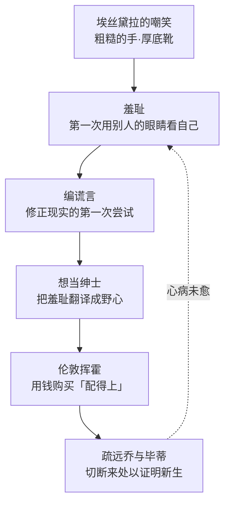

# 03｜皮普：一个想成为「上等人」的男孩究竟在逃避什么？

> 本篇核心问题：皮普的野心从哪里来，它真正在逃离的是什么？

> **剧透提示**：本文涉及第一、二阶段情节为主。

---

## 开篇：一个值得思考的问题

《远大前程》最常见的讲法是「穷小子想当绅士，最后幻灭」。这个讲法没错，但它漏掉了一个更前面的问题：皮普在铁匠村的那些年并不不快乐——有乔的炉火，有看得见头的学徒前程，日子清苦但安稳。野心不是他天生带的，是在某一天被人「放进去」的。那么是谁放进去的？放进去的那一刻，他丢掉的又是什么？

## 一、从故事开始

转折点精确得可怕。在萨提斯宅邸，埃丝黛拉第一次见他，小说明确写了她嘲笑的内容：他的手粗糙，靴子厚，打牌时把杰克（J）叫成「knaves」——那是下层人的叫法。牌局散后，皮普一个人待在院子里，踢墙、揪头发、哭。

注意：此前他从没觉得这些有什么不对。手和靴子原样没变，变的是有人在场——他第一次用别人的眼光看见了自己，而那双眼睛是嫌恶他的。

接着是三件小事，件件指向同一个方向。回家后，姐姐和帕姆布尔乔克逼问宅中见闻，皮普不肯说真话，反而编了一套奢华的谎：黑色天鹅绒马车、金盘子里的点心、四条大狗在银篮子里抢肉吃——事后他只向乔一个人忏悔。乔的劝告大意是：走正道到不了「不寻常」，走邪路更到不了。这是全书最正的劝告之一，出自一个几乎不识字的人。皮普还找毕蒂补习，坦白说「我想成为上等人」，并诚实到残酷地承认：是为了埃丝黛拉，为了让她不再觉得他粗鄙。然后是铁匠铺的几年：学徒契约本该是安稳的出路，可他盯着炉火和铁砧，只觉得一切都在提醒他配不上更好的东西。

等「远大前程」真的降临、他去了伦敦，这粒种子长成了它本来的样子：挥霍、欠债、记账全靠糊涂；回乡时他嫌弃乔上不了台面，还要毕蒂把乔「教得体面些」，被毕蒂不软不硬顶了回来。后来他在热病里反复想起乔——那笔债最后是乔替他还的，这是后话，本篇只看皮普当时的心理：他想见乔又怕见乔，想见的是乔这个人，怕的是在乔面前照见自己。

成年皮普讲述这一切时，语气从头到尾是自我审判的——他不替少年的自己辩护，反而把每一次势利都钉在耻辱柱上。

## 二、真正的问题是什么？

表面的问题是「皮普为什么忘恩负义」，但这个问题问错了方向。他不是因为坏才想当绅士，他是因为**羞耻**才想当绅士。真正的问题是：羞耻为什么比贫穷更能毁掉一个人？

贫穷是处境，羞耻是对处境的判决。皮普离开墓园时只是个穷孩子，离开萨提斯宅邸时已经是个「有缺陷」的孩子——区别不在钱包，在他开始用埃丝黛拉的眼睛看自己。狄更斯把野心的来历写得毫不含糊：不是向往，是被鄙视出来的。

## 三、人物为什么会这样选择？

皮普的每一次选择，都可以用「逃离羞耻」来解释。编谎言，是因为说出真相就得承认自己在宅子里只是个被取笑的穷孩子——谎言是对现实的一次审美修正。想当绅士，是因为埃丝黛拉的嘲笑给了他一把尺子，他只想量出自己及格。疏远乔，是因为乔的存在本身就是他最怕的东西：粗糙的手、厚底的靴、说错的词——乔身上有他全部的来处。

这里有个常被忽略的精确处：皮普想逃离的从来不是贫穷本身。乔不穷吗？毕蒂不穷吗？他爱的恰是这两个人，可他拼命要跟「和他们是同类」这个事实撇清。一种可能的读法是：他逃的是「不配被爱」的自我形象——埃丝黛拉把「你这种人不可能被我这种人爱上」钉进了他心里，于是「成为上等人」就成了「成为配得上被爱的人」的代称。

## 四、作者真正想讨论什么？

狄更斯借皮普拆解的是「前程」这个词本身：人人祝贺皮普交了好运，可小说一路上写的都是这份好运怎样腐蚀他。常见的读法是「势利小子受惩记」，主流批评也把皮普的弧光归结为「忘恩—受教—悔改」的道德剧。

一种可能的读法更尖锐：皮普的势利不是性格缺陷，是社会发给他的诊断书。在那个世界里，粗手、厚靴、knaves 不是审美问题，是「你不该被爱」的证明；狄更斯让皮普染上势利，正是为了让读者看见这种病是怎么传染的——埃丝黛拉只是第一个把病毒递给他的人，伦敦把剩下的剂量全打了进去。

也有读者认为皮普从未真正变坏，因为他一路都在记录自己的坏——叙述者的自我审判恰恰是良心的证据。这种读法把「忘恩负义」改写成了「一个好人目睹自己变坏的全过程」：悲哀加倍，罪名减半。

## 五、把这个问题放回时代

维多利亚时代的英国，阶级跃升正在变成可能：铁路、帝国、新兴商业都在制造新富，「绅士」这个词第一次可以被购买而非只能继承。狄更斯本人就是这条路上最成功的样本——他十二岁曾在沃伦鞋油厂当童工，父亲因欠债进了马夏尔西债务人监狱。这段经历见于传记记载，他自己终身讳言，是传记作者福斯特后来才公之于世的。

把这段经历放在皮普旁边看，对照锋利得惊人：狄更斯靠写作爬了上去，皮普靠一笔来路不明的钱爬了上去；狄更斯一生厌恶势利，皮普染上势利的每个症状他都写得分毫不差。一种可能的读法是：皮普的羞耻里有狄更斯自己没消化完的东西——那个在鞋油厂窗口干活、怕被路过的体面人看见的男孩。

## 六、作品是怎么写出来的？

注意狄更斯处理堕落的方式：他从不让皮普做一次大恶，只让小小的势利一次次累积——对毕蒂的语气、对乔的回避、账单上一笔笔糊涂账。这不是戏剧化的堕落，是会计式的堕落：每一次都在道德账上记一笔，读者比皮普自己更早看清他的资产负债表。

更妙的是叙述声音的调度：少年皮普陷在羞耻里看不清自己，成年皮普隔着几十年冷冷地解剖他。同一个「我」，一个当被告一个当检察官。效果是：读者没法单纯讨厌皮普，因为他已经替我们讨厌过自己了，而且讨厌得更专业。

## 七、如果放到今天

皮普的问题今天换了个名字还在流行：出身焦虑、向上流动、逃离原生阶层。多少人的奋斗史开头都有一句「我不想再过那种日子」，而「那种日子」里往往住着爱他们的人——于是上升路上要做的第一件事，就是学会嫌弃自己的来处。皮普的故事把这个代价算得很清楚：他爬上去的那天，正是他开始孤独的那天。

还有一个更细的对应：埃丝黛拉的嘲笑是一次身份上的降维打击——一句话就让一个人从此用别人的尺子量自己。今天这种尺子换了形态（学历、职业、圈子里的体面），但度量衡的逻辑没变：先让你觉得自己不配，再让你为「配」付出一生。

## 八、小结

皮普想当「上等人」，逃的不是贫穷，是那个被埃丝黛拉一句话钉死的自己——粗糙、粗鄙、不配被爱。羞耻比野心更早进入他的人生，野心只是羞耻换了一件体面的外套。等「远大前程」从天而降，他以为是命运还账，其实只是逃避终于有了经费。

而这份经费的来历，恰恰是全书最残酷的反讽：它来自一个比乔更「不配」的人。

## 下一篇

皮普在伦敦花的每一分钱都有出处，而出处揭晓的那天，他的整个世界塌了。下一篇看马格维奇——一个终身罪犯，凭什么成了真正的恩人。
