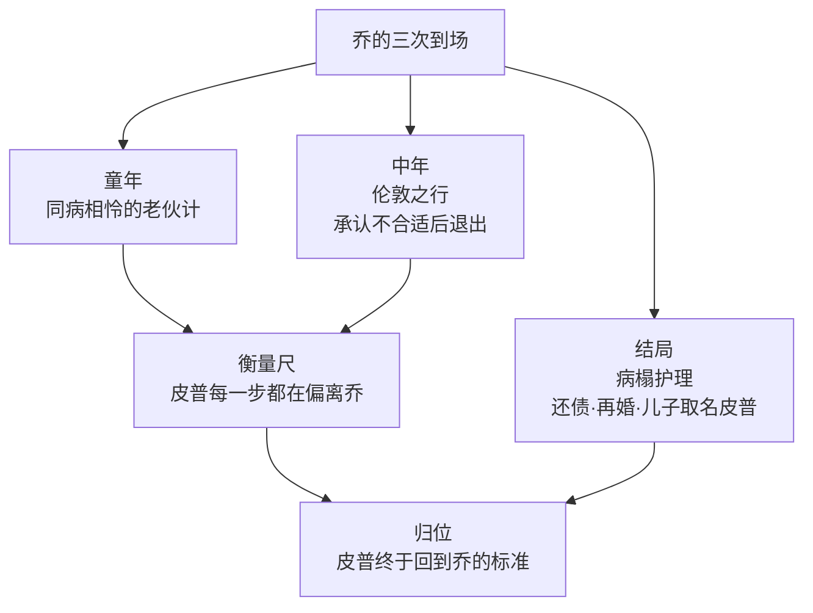

# 05｜乔：这个「跟不上」皮普的铁匠为什么才是全书的良心？

> 本篇核心问题：一个被皮普反复嫌弃的人，为什么反而成了衡量皮普的尺子？

> **剧透提示**：本文涉及全书情节，含结局。

---

## 开篇：一个值得思考的问题

《远大前程》里人人都在「向上」：皮普要当绅士，马格维奇要在澳洲攒出钱来「造」一个绅士，帕姆布尔乔克要巴结绅士，连逃犯都想用血汗钱买一张通往上流的门票。只有一个人从头到尾站在原地——铁匠乔。

皮普嫌他粗、嫌他土、嫌他在伦敦客厅里出丑；读者稍不留神，也会跟着叙述者一起嫌。可这本书最隐蔽的设计恰恰在这里：狄更斯把全书唯一一个从头到尾不变的人，做成了衡量所有变化的那把尺子。要读懂皮普跌得多惨，得先看懂乔站得多稳。

## 一、从故事开始

乔是皮普的姐夫，一个力气很大、识字不多的乡村铁匠。小说明确写了他们在乔大嫂的暴政下结成同盟——乔管皮普叫「老伙计」，两人是同病相怜的伙伴。乔说起自己的来历：父亲是打铁的，喝醉了就打老婆孩子；母亲几次带着他逃出来，他想上学，却始终没能正经读成书。这套来历足够喂养出怨恨，可提到那个打他的父亲，乔想给墓碑刻的话大意是「无论他有什么过失，请记住他心地善良」——对施暴者，他的账本是宽厚的。

皮普发达后，乔来伦敦看他。这是全书最难受的场面之一：乔穿着节日的衣服浑身不自在，礼帽在壁炉架角上怎么放都要滚下来，他坚持管自己一手带大的孩子叫「皮普先生」，临走说出的大意是「我们这样的人在伦敦不合适，我在铁匠铺、在厨房、在沼泽地才是对的」。他不要任何补偿，第二天一早就走了，只留下一张字条，大意是：永远做你最好的朋友。

后来皮普债务缠身、热病垂危，醒来时守在床边的还是乔。乔护理了他好几个星期；等皮普好转、重新像个「上等人」了，乔就悄悄回了乡——走之前替他把债还清了。乔大嫂死后，乔与毕蒂成婚；书的结尾，他们给新生的儿子也取名皮普。

## 二、真正的问题是什么？

表面上看，乔只是个「功能性好人」：每本成长小说里都要有一个淳朴的穷人做对照。但真正的问题是：**狄更斯为什么要把这个「好人」写得笨拙？**

注意乔每次出场的姿态：他总是「跟不上」。跟不上皮普的新词汇，跟不上伦敦的礼帽，跟不上绅士世界的任何规则。可每到真正要紧的时刻——被恐吓的童年、垂死的病榻、还不起的债——到场的永远是这个跟不上的人。狄更斯把「体面」和「善良」拆成两样东西，让皮普追前者、乔守后者，然后安静地看读者站在哪一边。

## 三、人物为什么会这样选择？

先问乔为什么不走。他有手艺、有力气，按书里的逻辑他最有资格「往上爬」，可他从没想过离开铁匠铺。一种可能的读法是：乔的知足不是无能，是完整。他对自己的来历清楚得近乎残酷——父亲酗酒家暴、母亲带他逃亡、自己因穷失学——这些经历本可以结出仇恨，他却把每一笔账都结成了宽厚：对父亲是「心地善良」，对泼悍的妻子是忍耐，对长大后疏远他的皮普是放手。

再问伦敦之行那句「我们不合适」。乔不是自卑到不敢踏进客厅，他是诚实到不肯假装。他说自己在铁匠铺才是「对的」——这句话在全书几乎只有他一个人有资格说，因为只有他从没扮演过另一个人。

最后问还债与离开。乔护理皮普数周，偏在病人好转、能重新摆绅士架子的时候走了。常见的读法是：乔太懂分寸——他留下来会让康复中的皮普难堪，他的在场本身就是一种提醒，提醒皮普欠着什么。他悄悄还债、悄悄离开，把恩情做成了不让对方偿还的东西——这与马格维奇那笔迟早要现身结账的恩情，恰好构成镜像。

## 四、作者真正想讨论什么？

狄更斯在给福斯特的信中把乔称为「好心肠的傻人」，这是作者观点层面能确认的：乔的「傻」是设定，不是缺陷。常见的读法把乔看作狄更斯心中「高尚劳动者」的理想——借他说明绅士是一种心灵状态，而不是一种阶级地位。小说明确写了皮普在书末的回望里给了乔一个近似定论的称呼，大意是「温厚的基督徒式的人」——这几乎就是狄更斯版本的「真绅士」。

也有批评家认为，乔被写得太好了，好到不太像真人，更像狄更斯为缺席的好父亲做的补偿性想象。这种说法缺乏作者本人的确证，但它提醒我们：乔的功能首先是一面镜子，他照出的不是自己，而是每个站在他面前的人的成色。

## 五、把这个问题放回时代

故事背景大致在十九世纪最初几十年，铁匠是乡村手工业者的典型：有手艺、有铺子、有固定身份和钟点，既不属于贵族也不算赤贫。当时的英国，这样的「体面劳动者」正被工业化慢慢改写——狄更斯一生都在为这个阶层的尊严辩护，从《雾都孤儿》一路写到《艰难时世》。

还要注意识字这件事。乔不识字不是笑话素材：十九世纪初英国穷人的教育几乎全靠慈善学校与自学，一个铁匠不会读写毫不稀奇。皮普教乔认字的那几页，是两人最平等的段落——教的人不优越，学的人不自卑。后来皮普忘了这段平等，故事才开始走下坡路。

## 六、作品是怎么写出来的？

狄更斯处理乔的手法有个明显特征：**乔几乎从不在情节里「赢」，只在每个阶段收账时「在场」。** 他不参与恩主之谜，不进萨提斯宅邸的戏，不沾伦敦的挥霍——可每次结账，来的人都是他。

这种写法让乔成了全书的常量：变量乱成一团的时候，常量负责显示偏移量。皮普每一次势利发作，读者都是拿乔当参照才量出刻度的。

## 七、如果放到今天

乔这种人，今天换一种说法：老家那个「没什么出息」的亲戚。孩子考出去、进了城、换了圈子，逢年过节回去，嫌他土、嫌他问不出得体的问题、嫌他在自己的新朋友面前拿不出手。

《远大前程》问的是一个我们仍在回避的问题：向上流动的时候，我们把谁留在了身后，又以什么名义？乔的答案今天依然扎手——他没要求皮普留下，也没假装跟得上，只是在皮普摔下来的时候，人还在原地。判断一段关系里谁是良心，标准从来不是谁配得上你的新生活，而是你摔下去的时候谁会到场。

## 八、小结

乔之所以是全书的良心，不是因为他做的事多伟大，而是因为他从没做过需要被原谅的事。在一个所有人都在攀爬、伪装、亏欠的故事里，唯一不爬的人保住了全部的善良——而狄更斯故意把他写得笨拙，是要让读者亲自体验皮普犯的那个错：把「跟不上」误认成「不值得」。书读到最后，皮普用一场热病还清了这个误会，读者也是。

## 下一篇

乔用一生证明「不伤人」也是一种成就；而萨提斯宅邸里被特意制造出来「伤人」的那个人，是另一种实验品。下一篇看埃丝黛拉——被制造出来伤人的女人，她自己受过伤吗？
