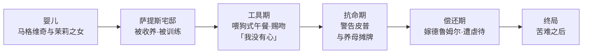

# 06｜埃丝黛拉：被制造出来伤人的女人，她自己受过伤吗？

> 本篇核心问题：一件「复仇工具」有没有自己的人生？

> **剧透提示**：本文涉及全书（她的两种结局细节留给后面的结局专文，本篇不展开）。

---

## 开篇：一个值得思考的问题

《远大前程》里最让人不舒服的女性形象，不是把自己冻在婚纱里的哈维沙姆，而是被哈维沙姆一手养大的埃丝黛拉。她漂亮、骄傲、残忍，从第一次出场起就在伤人——而且伤得极有章法。

可如果只把她读成「冷血美女」，就读漏了狄更斯埋下的另一半：埃丝黛拉是全书唯一一个明确告诉你「我是被制造出来的」人物。一件工具会不会疼？这正是本篇要回答的问题。

## 一、从故事开始

皮普第一次进萨提斯宅邸，接待他的不是哈维沙姆，是埃丝黛拉。小说明确写了两个细节：她把他带到庭院，像喂狗一样把食物和啤酒放在石板上给他吃，自己转身走开；她看着他强忍泪水的样子，流露出明确的快意。没过多久，她又安排一个「苍白的少年绅士」——后来皮普才知道那是赫伯特——跟皮普打了一架；皮普赢了，她让皮普吻了她的脸颊，像发奖品。

多年后重逢，埃丝黛拉对皮普说出全书最著名的自白之一：「我没有心。」皮普不信，她把话说得更绝——大意是那里没有柔软、没有同情、没有感情；并且反复警告他：不要追我，我会像对别人一样欺骗你、伤害你。社交场上皮普质问她为什么招引那么多倾慕者，她用蜡烛自辩：蛾子和丑虫扑向点亮的蜡烛，蜡烛有什么办法？

最锋利的一场是她与哈维沙姆摊牌。养母责备她对自己也这么冷，她的回答核心只有一句：是你塑造了我——我是你教出来的，你不能把我造成这样，又反过来怪我。后来她嫁了德鲁姆尔，一个又蠢又横的粗人，婚后遭到虐待；德鲁姆尔死于一场他虐马造成的事故。至于她的来历，小说明确揭示：她是马格维奇与茉莉的女儿——这个身份本身就值得记住：复仇者从「渣滓」里捡来的工具，本就是罪犯的孩子。

## 二、真正的问题是什么？

表面上看，埃丝黛拉的功能很清楚：她是哈维沙姆的复仇武器，是皮普欲望的对象，是「上等人」幻觉的具体形状。但真正的问题是：**一件工具有没有自己的人生？**

注意她的残忍从来不是放纵，是执行。喂狗式的午餐、赐吻、冷脸、警告——每一步都在训练大纲里。甚至连那句「我没有心」，重点也不在炫耀冷血，而在它说得像一份实验报告：她精确地知道自己缺了什么。狄更斯把全书最惨的事写得极其安静——不是她不会爱，是她被教育成了不需要爱的样子，而且她对此心知肚明。

## 三、人物为什么会这样选择？

先问她为什么反复警告皮普。这是埃丝黛拉身上最矛盾的行为：一个复仇工具本该收下这颗心，她却一次次推开。常见的读法是：这是她仅有的诚实——她知道自己给不出回报，警告是她能做的最大的善。工具在无意识中完成了一次抗命：哈维沙姆教她收心，她至少做到了不让皮普把心交得太深。

再看蜡烛自辩。蛾子扑火，蜡烛有什么办法？这句话表面是推卸责任，深层却是一次精确的自我描述：她是被点亮的那支蜡烛，燃烧不是她选的，扑来的蛾子也不是她招的——她只是被放在那儿发光。一种可能的读法是：这不是狡辩，而是全书唯一一次她把自己的处境讲对了。

最后是她与哈维沙姆的摊牌。这是全书少有的「产品控诉制造商」场面：养母要爱，她回答你是我造的。这一幕的残酷在于双方都对——哈维沙姆确实造了她，而造她的人也确实是受害者。她后来嫁德鲁姆尔，也不能简单读成「自甘堕落」：一个被告知「你没有心」的人，挑选丈夫时用的自然是财产和地位而不是感情——她只是把训练用在了自己身上。

## 四、作者真正想讨论什么？

常见的读法把埃丝黛拉读成「美丽而空洞的上流社会」的象征——她的存在就是为了打碎皮普对「上等人」的幻想。这是主流解释，站得住。

一种可能的读法更进一步：埃丝黛拉是全书对「教育」这件事最狠的提问。狄更斯一辈子相信环境造人——孤儿院、贫民窟、监狱都能把人造坏；而埃丝黛拉证明，豪宅和丝绸也能。她不是在贫穷里长歪的，她是在精心设计的富贵里被制造出来的。这让她的「没有心」比任何贫民窟悲剧都可怕：后者是没人管，前者是有人精心地管成了这样。

也有读者认为，狄更斯在埃丝黛拉身上留了破绽——她那些警告、那场摊牌、甚至后来态度的松动，都说明「心」并没有真的被拿走，只是被教成了不敢认领。这种读法在文本里找得到支撑：一个真正没有心的人，不会知道自己缺什么。

## 五、把这个问题放回时代

十九世纪初的英国，女孩子的「教育」在相当程度上就是婚嫁训练——才艺、仪态、持家，目标明确指向婚姻市场。狄更斯对这个市场从来不客气：他的书里反复出现被当作筹码嫁出去的女性。埃丝黛拉是这个时代命题的极端版本：普通女孩被训练成「好妻子」，她被训练成伤人的武器——两者的共同点，是没有人为「她自己想不想」留过位置。

还要注意她的身世配置：生父是流放犯，生母是涉案的女仆，养母是把自己钉在婚礼日的女人。她由三个失败者共同制造，然后被投进「上等人」的舞场。狄更斯让她身上流着「最低」的血、端着「最高」的架子——这个配置本身就是对血统论的一次拆台。

## 六、作品是怎么写出来的？

狄更斯写埃丝黛拉的手法很克制：**他几乎不给她内心独白，只让她说结果。** 我们看得见她做什么、说什么，却永远进不去她「感觉到什么」——因为她的感觉正是她被剥夺的东西。这种写法逼读者亲身体验她的处境：我们对她的了解，和她对自己的了解一样残缺。

注意这张图上没有一格是「她自己选的」。这个设计的狠处在于：狄更斯先让读者相信「她就是这样的人」，再告诉你她是被造出来的——于是读者被迫回头审判自己刚才的厌恶，这和皮普对马格维奇的那次认错是同构的。

## 七、如果放到今天

埃丝黛拉换一种现代说法：被当成「作品」培养的孩子。才艺、名校、履历、完美人设——当父母把孩子的人生当作自己意志的延伸来设计，成品可能光鲜、得体、战无不胜，唯独在某个深夜说不出「我想要什么」。

「我没有心」今天有一个更流行的翻译：空心。狄更斯早在一八六〇年就写了这种空心不是性格缺陷，而是教育成果——是有人专门教出来的。而埃丝黛拉那句「是你塑造了我」，放进任何一场亲子对质里都不会过时。

## 八、小结

埃丝黛拉不是冷血，是被制造出来的冷；她不是天生伤人的刀，是被磨出来的刀。她的悲剧在于全程知情：她知道自己被造、知道自己在伤人、知道自己给不出回报，却没有一条路能走出这个身份。狄更斯借她问的是一个至今有效的问题——当一个人被「培养」成某种样子，她还有没有权利，以及还有没有可能，拥有自己的人生？

## 下一篇

埃丝黛拉是「被给予的期望」的产物；皮普那份「远大前程」同样来路不明。这两笔馈赠终将在全书最大的反转之夜撞上——下一篇看恩主之谜：「前程」到底是谁给的，揭晓时皮普为什么崩溃？
