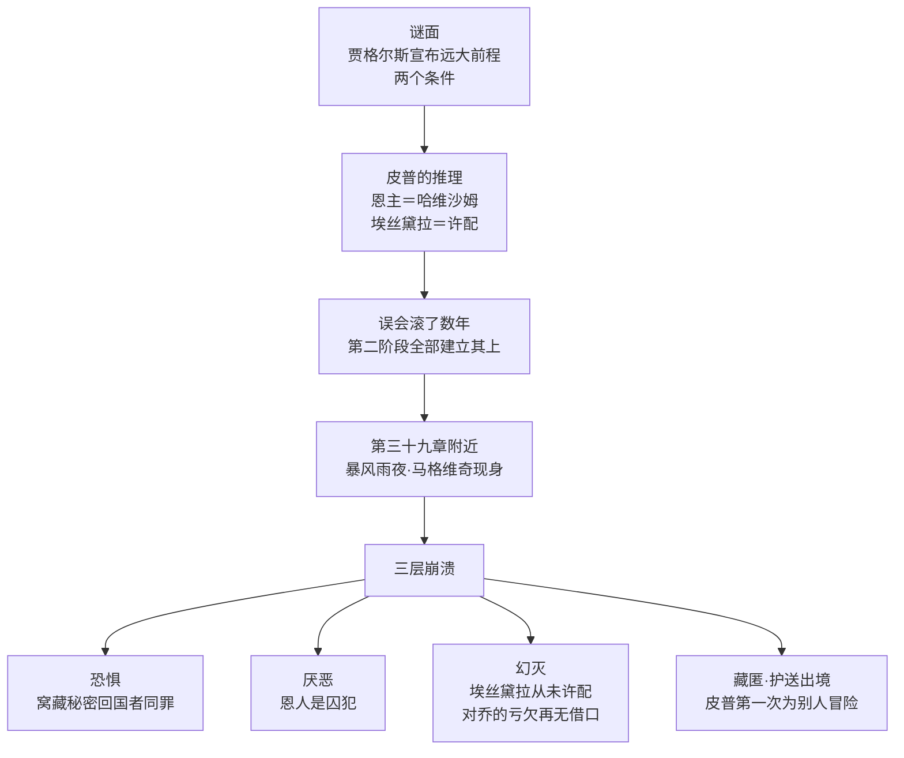

# 07｜「前程」到底是谁给的：恩主之谜揭开时皮普为什么崩溃？

> 本篇核心问题：狄更斯把全书最大的反转押在哪个瞬间，它击碎的是什么？

> **剧透提示**：本文涉及全书，含关键反转。

---

## 开篇：一个值得思考的问题

很多小说都有反转，但《远大前程》的反转特殊在：它反转的不是「凶手是谁」这类谜面，而是「你以为的恩人是谁」这种信念。谜底揭晓的那一刻，倒下的不是某个阴谋，是皮普的整个生活。

狄更斯把全书最大的机关设在一个暴风雨的深夜、皮普独自一人的房间里。这个瞬间为什么有这么大的破坏力？因为它砸中的不是一件事，是一整套世界观。

## 一、从故事开始

先把谜面摆出来。皮普还是个铁匠学徒时，名律师贾格尔斯出现在镇上的三快腿酒馆，当众宣布：这个孩子拥有「远大前程」——他将继承一笔可观的财产，脱离现在的阶层，被培养成上等人。条件有两条：第一，他必须永远保留「皮普」这个名字；第二，他不得追问恩人是谁——时机到了，恩人会自己现身。

皮普几乎没有犹豫就断定恩人是哈维沙姆小姐。这条推理链看起来无懈可击：他被叫去过那座豪宅，哈维沙姆有钱有势，贾格尔斯恰好又是她那边的法律顾问；再进一步，他把埃丝黛拉也脑补进了这份前程——恩主既然安排了一切，自然也把她「许配」给了自己。这套推理最大的漏洞，皮普后来自己承认了：它不是证据推出来的，是愿望推出来的。

谜底在多年后的一个暴风雨夜揭开。皮普当时二十三岁上下，住在伦敦 Temple 的寓所，赫伯特外出办事，他一个人听见楼梯上有脚步声。上来的是个粗野的老人，浑身湿透，进屋后反复让他点烟、伸出那双做过苦工的手、绕着圈子问他的前程从何而来——直到皮普认出：这是当年墓园里那个逃犯马格维奇。他冒着死罪从流放地潜回英国，只为亲眼看看自己用血汗钱「造出来」的绅士。

皮普的崩溃是分三层的。第一层是恐惧：窝藏秘密回国的流放犯在当时本身就是重罪，收留他可能把自己也搭进去。第二层是厌恶：他的恩人不是贵妇，是个囚犯——他吃的穿的、学的教养、摆的架子，全部来自苦役犯在澳洲攒下的钱。第三层最疼，是幻灭：哈维沙姆不是恩主，意味着埃丝黛拉从来不是「许配」给他的；连同他对乔的疏远也一并失去了借口——他为了一个囚犯的钱，丢下了全世界待他最好的人。之后，皮普与赫伯特把马格维奇藏匿起来、改名换姓，计划把他护送出境。

## 二、真正的问题是什么？

表面上看，这是一段「真相大白」的悬疑戏：恩主之谜憋了半本书，该揭开了。但真正的问题是：**为什么这个真相对皮普是摧毁性的？**

换个角度就清楚了。马格维奇给的钱是真的，这份恩情甚至比皮普想象的更大——一个苦役犯倾尽所有，只为「造一个绅士」。所以皮普崩溃的原因不是被欺骗，而是真相的成色：他无法假装这份馈赠有污点，它恰恰干净得让人难堪。击碎他的不是「恩人居然是坏人」，而是「我最鄙视的那种人，才是我最该感激的人」——他向上攀爬了半本书的坐标系，在那一夜整个反了过来。

## 三、人物为什么会这样选择？

先看皮普为什么非要坚信恩人是哈维沙姆。这不是智商问题：贾格尔斯守口如瓶，皮普手里的证据确实少得可怜。但他挑选答案的方式出卖了他——在所有可能的解释里，他选了那个能同时满足两件事的：让自己的富有显得「正当」（贵妇的馈赠），让自己的爱情显得「注定」（埃丝黛拉在计划里）。一种可能的读法是：皮普不是被误导的，他是主动需要这个误会的——承认钱来自囚犯，等于承认他这些年看不起的人一直在供养他。

再看马格维奇为什么冒死回来。秘密回国即死罪，他完全清楚。他的动机他自己说得很直白：他要看看自己的绅士。这里有一层让人不安的真诚——他不是来讨债的，是来验收作品的；在他看来，皮普不是恩情关系里的负债者，而是他这辈子造出的最好的东西。这让那一夜的残酷翻倍：一个人倾其所有的善意，在另一个人身上引起的是恶心。

最后看皮普为什么还是收留了他。恐惧、厌恶、幻灭之后，他本可以举报、可以赶走——他没有。文本写得清楚，他又厌又怕，但还是安排了藏匿与出逃的计划。这是皮普全书的转折点：他第一次为一个「配不上」的人做一件没有好处的事。墓园里那个送食物的孩子，在这个动作里回来了一半。

## 四、作者真正想讨论什么？

狄更斯把反转设在这里，要讨论的不是「真相很意外」，而是「真相很便宜」。皮普的世界观建立在一条鄙视链上：囚犯在底、铁匠在下、绅士在上、贵妇在顶。暴风雨夜只用几句话，就把这条链拧成了一个环：供养顶端的，正是底端。

常见的读法把这场戏看作全书对「绅士」概念的处决：皮普的绅士成色原来一钱不值，因为他是用钱堆出来的，而那钱来自最不像绅士的人。这是主流解释。

一种可能的读法是：这一夜真正处决的不是绅士，而是「恩典」的方向。皮普一直以为恩情从上往下流——贵妇施舍穷孩子；真相是恩情从下往上流——囚犯造了绅士。狄更斯借这股逆流追问：当一个社会的「上等人」是由「下等人」的血汗供养的，到底谁该对谁感恩？

## 五、把这个问题放回时代

这个反转的狠劲，大半来自当时的法律。十九世纪初的英国，被判终身流放的犯人私自回国，本身就是可判死刑的重罪——马格维奇踏上英国土地的那一刻就是死囚。所以皮普那一夜的恐惧不是文学夸张：他房间里站着一个「不该存在的人」，而收留这个人的行为足以把他也拖下水。

另一条时代线索是流放本身。澳洲殖民地在当时既是苦役场也是淘金地：不少流放犯刑满后在当地发家，英国本土却把他们当作「消失了的人」。马格维奇的钱合法又耻辱——在澳洲它是财富，汇回伦敦它就变成体面；可钱的主人一踏上伦敦，就重新变回死囚。狄更斯让「钱」和「人」在同一个身份里彼此矛盾，这是他对那个年代最精确的一刀。

## 六、作品是怎么写出来的？

先看位置：这场戏落在第三十九章附近。全书五十九章、分三个阶段——这个位置大致是全书三分之二的黄金分割处。第一阶段结束前贾格尔斯宣布前程，第二阶段在挥霍中把误会越滚越大，反转精确地砸在两个阶段的接缝上：此前的一切「上升」，都在此刻被重新计价。周刊连载逼出来的结构密度，在这一章看得最清楚。

再看写法：狄更斯故意让揭晓「很慢」。马格维奇进屋后不直接报名字，而是绕着圈子让皮普自己推——点烟、看手、问前程、提当年。读者被迫陪着皮普一步步走到结论跟前，而不是被一句话告知。这种写法的效果是：崩溃不是外来的打击，是皮普自己推导出来的——他必须亲手完成对自己的处决。

## 七、如果放到今天

把这场戏翻译成现代经验：一个人发现自己赖以立足的「成就」，来源和他想的完全不同。比如一直以为自己是靠实力上来的，某天发现背后是当年他最看不起的人默默垫的底；或者以为某个机会来自体面的人脉，真相是它来自一段他拼命想撇清的过去。

这个故事的锋利不在「恩人另有其人」，在「恩人恰好是你鄙视链最底端的人」。我们今天也习惯给善意标价：谁给的、从哪个圈子给的、说出来好不好听。狄更斯问的是：一份馈赠的价值，到底由馈赠本身决定，还是由馈赠者的身份决定？皮普用了好几年才敢回答这个问题。

## 八、小结

暴风雨夜揭开的不只是一个名字，是皮普整个世界的地基。他以为自己被高贵的目光选中，真相是他被最卑微的善意供养；他以为埃丝黛拉在命运的安排里，真相是那只是他自己的愿望；他以为离开铁匠铺是上升，真相是他一路向下——直到那一夜下落到底，他才第一次开始往上走。

## 下一篇

皮普的崩溃拆掉的是他个人的世界，而狄更斯拆的不止于此——他借整个故事瞄准的是一个词：「绅士」。下一篇看维多利亚时代的「绅士」，狄更斯究竟在讽刺什么？
