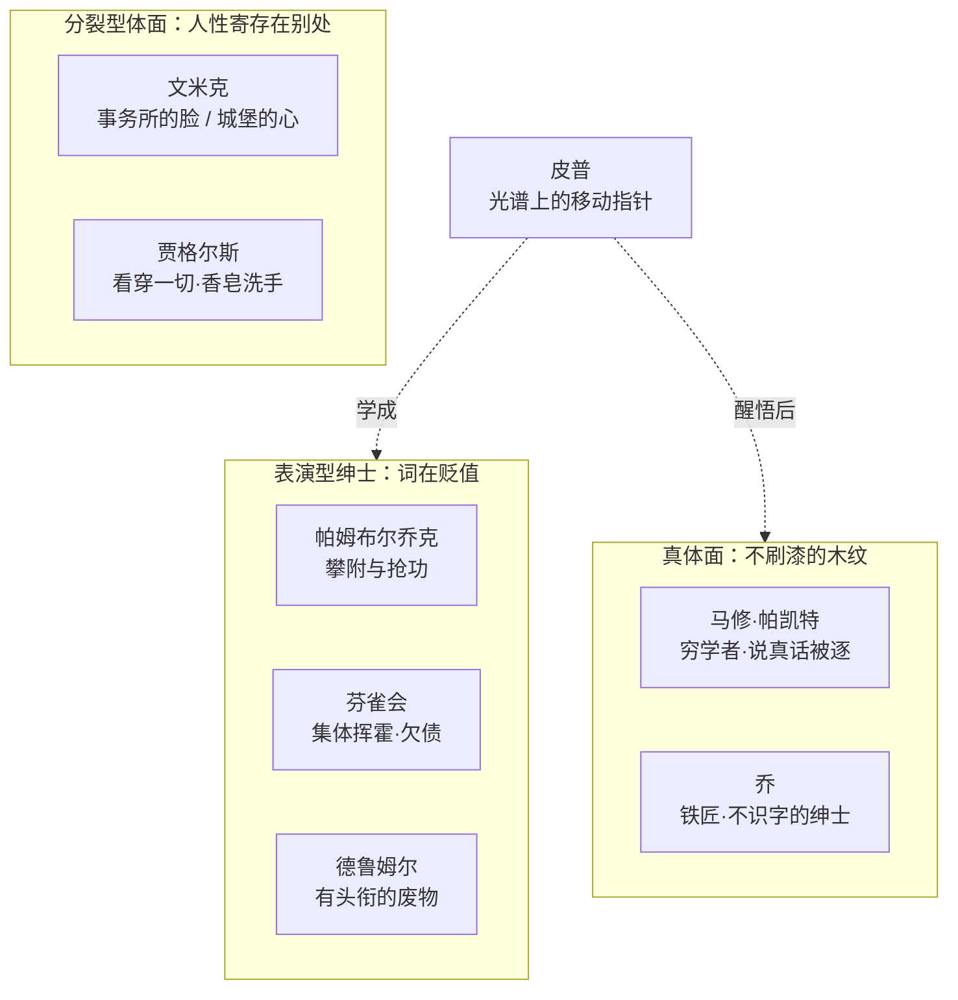

# 08｜维多利亚时代的「绅士」：狄更斯究竟在讽刺什么？

> 本篇核心问题：「gentleman」这个词在那个时代意味着什么，狄更斯又用它撬开了什么？

> **剧透提示**：本文涉及全书。

---

## 开篇：一个值得思考的问题

皮普拿到「远大前程」之后，做的第一件事不是报仇，不是投资，也不是去找埃丝黛拉——而是学怎么吃饭。

狄更斯在这里安排了一个极好的喜剧场面：伦敦青年赫伯特·帕凯特客客气气地教这位乡下出身的准绅士用刀叉，委婉提醒他在伦敦刀子是不能往嘴里送的，又给皮普起了个雅号叫「汉德尔」——取自亨德尔的曲子《和谐的铁匠》，因为皮普当过铁匠。一个铁匠的过去，被礼貌地改编成了一段背景音乐。整部小说最残忍的笑话，往往就是这么笑着讲出来的。

皮普学得很认真，也学得很痛苦。问题是：如果「绅士」是可以速成的技能，那它到底值什么钱？

## 一、从故事开始

先把小说里那群「绅士」摆上桌面。

皮普到伦敦后加入了「林中芬雀会」——一群和他一样靠津贴度日的年轻少爷，定期聚餐、互相敬酒、攀比挥霍。小说明确写了这个俱乐部的实际功能：没人说得清它存在的目的是什么，成员们唯一共同的成就是欠债。皮普和赫伯特在芬雀会里越陷越深，最后两人坐下来对账，那段「清算日」是全书最狠的讽刺之一——他们用正式公文格式写下每一笔债务，仿佛把欠债写整齐了，债就不算欠了。

再看文米克。他是律师贾格尔斯最得力的书记，在小不列颠的事务所里，他是一台精确、冷漠、只认「动产」的机器——他给皮普的人生忠告是：能揣进兜里换成钱的东西才是好东西。可是下了班，他走回沃尔沃思，那里有他自己动手建的「城堡」：吊桥、花园、每晚九点准时鸣放的小礼炮，还有一个耳聋的「老父亲」。在城堡里他孝顺、温和，会害羞地追求斯基芬小姐。小说明确写了他把两个世界焊死的规矩：办公室是一套脸，家里是另一套脸，两边绝不串门。

还有帕姆布尔乔克。皮普还是学徒时，这位粮商舅舅拿他当下属使唤；皮普一旦有了前程，帕姆布尔乔克立刻在镇上逢人便说自己是皮普「最早的引见人」，锦绣前程全是他的功劳。皮普离村赴伦敦前，他一路送到马车边，反复问那句著名的「我可以握你的手吗」——姿态低到尘土里，算盘打到天上去。

最狠的一刀来自特拉布的小伙计。皮普衣锦还乡、自鸣得意地走在街上时，这个裁缝铺的学徒领着一群孩子跟在后面游行，拿草耙当仪仗，用夸张的鞠躬和怪叫把他的绅士派头当众模仿了一遍。皮普气得发疯，全镇看得发笑。这说明什么？说明连街头孩子都一眼看穿：那身绅士行头是租来的。

## 二、真正的问题是什么？

表面看，狄更斯只是在讽刺一群装模作样的人。但真正的问题更尖：**当一个社会的最高赞美词可以按价购买，这个词还剩下什么？**

「gentleman」在书里几乎从来不是一个描述，而是一笔交易的标的：马格维奇花全部身家要「造就一个绅士」；皮普以为拿到钱就拿到了这个词；帕姆布尔乔克靠攀附它来抬高自己的身价；芬雀会靠集体表演来维持它的市价。人人都在买卖它，唯独没人问它指什么。

真正的问题藏在叙述者的一句题外话里。皮普描述赫伯特的父亲马修·帕凯特时，写下了一段全书最著名的话：没有一颗真正绅士的心，世上就没有真正的绅士风度；清漆盖不住木纹，漆刷得越厚，木纹反而越显眼。这句话是文本明确写下的，它等于宣布：狄更斯要量的不是谁最像绅士，而是谁在刷漆。

## 三、人物为什么会这样选择？

**文米克为什么活成两半？** 一种可能的读法是：他的分裂不是虚伪，而是幸存术。他每天在纽盖特的囚徒和绞刑案卷里讨生活，如果那张「公事公办的脸」跟着他回家，沃尔沃思的城堡就会塌。他把良心完整地保存在吊桥以内——所以狄更斯给他安排了全书最温暖的私生活和最冰冷的工作台。这恰恰说明：问题不在个人道德，在那个要求人把人性寄存门外才能上班的体系。

**贾格尔斯为什么洗手？** 小说明确写了他每次办完案就用香皂和香水反复洗手，那股气味在皮普鼻子里挥之不去。一个读法是：他自己清楚经手的是什么。他在纽盖特的客户生态里游刃有余，恰恰是看透了这套制度——可看透不等于干净，香皂是他唯一允许的忏悔。

**帕姆布尔乔克为什么谄媚？** 因为他和皮普是同一种人：都觉得自己的分量要靠别人的身份来称。皮普向上看时嫌他恶心，等于在镜子里看见自己——这也是为什么皮普恨他恨得格外狠，恨的其实是认出来的自己。

**特拉布的小伙计为什么羞辱皮普？** 他什么都不图。这说明民间自有一双眼睛：绅士的表演骗得过俱乐部，骗不过街头。狄更斯把全书最痛快的一次审判交给了一个学徒工，这不是闲笔——在「绅士」官司里，他让最没地位的人做了陪审团。

## 四、作者真正想讨论什么？

主流学术读法早有定评：汉弗莱·豪斯在《狄更斯的世界》（一九四一）中把势利与绅士理想视为解读这部小说的钥匙，认为狄更斯写的不是一个穷孩子向上爬的故事，而是「绅士」这个价值尺度本身的破产。这是常见的读法。

也有批评家认为狄更斯并不反对绅士理想本身——马修·帕凯特就是证据：一个不善营生、被势利妻子拖累、敢对哈维沙姆说真话而被逐出家门的穷学者，却是叙述者盖章的「真绅士」。狄更斯攻击的不是体面，是体面的伪造品。

一种可能的读法是：狄更斯真正拆的不是「绅士」这个词，而是它的标价牌。当绅士可以用钱买、用婚姻换、用表演租，它就成了一种通货——而通货最怕的不是假币，是滥发。小说里人人都想要这个头衔，恰恰让它在全书五十九章里一路贬值。到结尾，皮普倾家荡产之后才算摸到这个字的边缘：他在乔身上认出了它（乔的具体故事留待专文，这里只引结论——皮普最终承认，那个不识字、不会用刀叉的铁匠才是真体面）。这个词绕了一大圈，从伦敦俱乐部贬到铁匠铺，反而重新有了含金量。

## 五、把这个问题放回时代

这不是狄更斯凭空树起的靶子。十九世纪中叶的英国，「绅士」的判定标准正在剧烈换挡：老标准看血统和地产，新标准看教养、职业与收入。工业革命造出了一批有钱没姓氏的新富，公学和礼仪手册产业跟着兴旺——「如何成为绅士」成了一门可以开课授徒的生意。焦虑真实存在，商品化也真实存在。

狄更斯本人就活在这道缝里。他十二岁因父亲欠债入狱、被迫去黑鞋油厂做童工；后来靠一支笔成了全英国最富的作家之一，晚年买下乡绅宅邸盖德山庄。他比谁都清楚「绅士」的门槛是用什么材料砌的——所以他笔下没有一个人靠「配得上」得到这个词，得到的都是表演得好的。

## 六、作品是怎么写出来的？

狄更斯处理这个主题的手法值得单独看：他几乎从不说教，用的是**重复贬值法**。同一个词「gentleman」，第一次出现是褒义，第十次是讽刺，到马格维奇说出「我造就了一位绅士」时，它已经听不出褒贬——词没变，是读者被训练着一路听出了裂缝。这是连载作家的手艺：一个词在三十六期里慢慢腐蚀，比一篇檄文有效。

人物结构上，狄更斯给「绅士」搭了一张完整的光谱：

皮普是光谱上那根指针——故事的前半程他向「表演型」滑动，后半程被命运一格格敲回「真体面」一侧。狄更斯不辩论，他让指针自己走给读者看。

## 七、如果放到今天

「gentleman」这个词死了，但它的功能没有。今天的等价物大概是「精英感」「大厂背景」「名校光环」「老钱风」——同样是一套可以购买、表演、出租的体面。餐桌礼仪课换成了职场情商训练营，芬雀会换成了人均两千的饭局合影，帕姆布尔乔克那句「我可以握你的手吗」换成了一句「您还记不记得我，上次峰会咱们聊过」。

文米克可能是最现代的人物。白天在公司用一套话术、一个表情、一副人格，下班回到自己的小世界才做人——今天的打工人管这个叫「上班人格」和「下班人格」，狄更斯一八六〇年就写出来了，还给它配了吊桥和礼炮。差别只在：文米克守得住他的城堡，我们很多人把吊桥拆了。

## 八、小结

狄更斯讽刺的不是想往上爬的人——他自己就是爬上来的。他讽刺的是一个让「体面」变成通货的系统：可以伪造、可以囤积、可以拿它兑换别的东西。小说写满了想挤进上流的人，却让「绅士」这个词在真正的体面面前一步步贬值——贬到最后一章，才在铁匠铺里重新值钱。

清漆盖不住木纹。这句话放在书的正中间，像一把尺子横在所有人物头上。

## 下一篇

体面是假的，那什么是真的？这本书给的答案不在客厅，在监狱——脚镣、囚船、绞架和通缉令从头到尾没离开过书页。下一篇看：一部没有凶案的小说，为什么从头到尾都是罪与愧。
