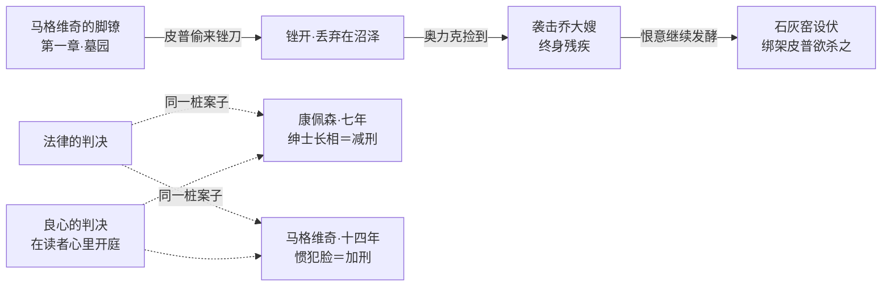

# 09｜一部没有凶案的小说，为什么从头到尾都是罪与愧？

> 本篇核心问题：脚镣、囚船、监狱、通缉令——犯罪意象为什么在书里无处不在？

> **剧透提示**：本文涉及全书，含结局。

---

## 开篇：一个值得思考的问题

《远大前程》不是侦探小说，全书甚至没有一桩需要破解的凶案。可是把书里的物件列个清单，你会发现它更像一份法庭证物目录：脚镣、囚船、锉刀、通缉令、纽盖特监狱、绞刑架、石灰窑、手铐。皮普还没离开村子，罪的物质证据就已经围着他摆了一圈。

更奇怪的是人物的体感：皮普在漫长的成长里明明没犯什么法，却从第一章「愧」到最后一章；真正在法律眼里罪大恶极的马格维奇，读起来反而常常是全书最冤的人。罪与愧在这本书里分了家——这才值得问一句为什么。

## 一、从故事开始

先看那副脚镣的旅行。第一章马格维奇用皮普偷来的锉刀锉开脚镣逃走，脚镣被丢弃在沼泽地里——狄更斯没有让这个道具消失。多年以后，铁匠铺帮工奥力克在沼泽里捡到它，用它从背后袭击乔大嫂，把她打成终身残疾；又过数年，还是奥力克，把皮普骗到沼泽边的石灰窑里捆住，准备将他推进窑里灭口——要不是赫伯特等人循线索赶来，皮普就死在那副脚镣主人的同乡手里。一副脚镣，先是刑具，再是善缘的契机（锉开它才有了墓园那场相遇），最后成了凶器。小说明确写了这条流转线，它不是巧合，是记账。

再看茉莉案。贾格尔斯的女仆茉莉，多年前被控谋杀情敌，死者是个比她强壮得多的女人。贾格尔斯为她辩护脱了罪——辩护的要诀之一，是把她的手腕藏起来：那双手腕粗大带疤，一露出来，陪审团就会认定她「长得像凶手」。她赢了官司，代价是婴儿被抱走送人（那孩子就是埃丝黛拉），本人留在贾格尔斯家里当女仆，像一件打赢了就被收进柜子的证物。

再看量刑。康佩森和马格维奇是同案的合伙骗子：康佩森有「好出身、好教育、绅士派头」，出庭时仪表堂堂；马格维奇是惯犯脸、粗人一个。同一桩案子，绅士骗子判七年，粗人判十四年。小说明确写了法庭的逻辑：康佩森那副体面长相本身就是减刑证据，马格维奇那张脸本身就是加刑证据。

最后是皮普自己的罪。马格维奇冒险回国看他，皮普收留了这个被终身流放的人——这个收留依法是重罪：归国流放犯可判死刑，窝藏者同罪。皮普人生第一次真正的犯法，恰恰是他做的第一件不求回报的善事。

## 二、真正的问题是什么？

把这几笔账摆在一起，真正的问题浮出水面：**在这本书里，法律定罪和良心定罪几乎从不在同一页上。**

皮普偷食物：法律上是贼，良心上是救人。马格维奇锉脚镣逃亡：法律上是逃犯，良心上是求生。茉莉：法律上脱了罪，可那双「长得像凶手」的手腕让全社会继续判她有罪——包括替她打赢官司的贾格尔斯，赢了案子还是把她当危险品收着。康佩森：法律轻判了他，良心账上他才是全书真正的祸首。皮普窝藏逃犯：法律上要治他重罪，良心上这是他此生唯一纯粹的时刻。

一种可能的读法是：狄更斯故意让两套法庭背靠背开庭——纽盖特判一遍，读者心里再判一遍——全书五十九章，没有一次判决是重合的。他逼问的不是「谁有罪」，而是「谁有资格判」。

## 三、人物为什么会这样选择？

**奥力克为什么恨皮普？** 文本给出的理由细得可怜：皮普「抢」了他的学徒位置（其实是乔的安排），毕蒂不肯理他，乔大嫂骂过他。他的恨没有大奸大恶的剧本，就是发酵了多年的怨气——被漠视、被比下去、永远当帮工。这说明狄更斯笔下的恶并不都来自阴谋家：它更常来自那种「全世界欠我」的发酵。他用脚镣袭击乔大嫂，等于捡起一件法律扔掉的刑具，替自己的委屈执行私刑。

**贾格尔斯为什么成为系统里最游刃有余的人？** 因为他彻底看透了规则：证据可以陈列，手腕可以藏起来，体面的长相可以折算成刑期。他不愤怒也不难过——只洗手。小说明确写了他用香皂洗手的气味，那是他全部的良心：知道脏，洗一洗，继续。他不是恶棍，他是那个「看得最清所以站得最稳」的人——这恰恰是更冷的一种坏。

**茉莉为什么接受当女仆？** 她没有别的选择：女儿没了，案底跟着她，贾格尔斯是唯一给她饭碗的人。那双被藏起来的手腕说明了一切——在这个系统里，无罪判决不等于无罪。

**皮普为什么冒着重罪窝藏马格维奇？** 这是他全书的转折点：前程没了，面子没了，剩下的只有一个他必须还的人。法律账上他终于犯了罪，良心账上他终于清了账——两笔账在他犯罪的那一刻，第一次对齐。

## 四、作者真正想讨论什么？

狄更斯对司法系统的敌意有自传根底：他童年亲历父亲因债入狱，全家搬进马歇尔西监狱，他在鞋油厂做工时看惯了「体面人欠钱照样坐牢、穷人欠钱坐得更久」。这不是推测，是他生平有据可查的事实，他后来亲口向福斯特讲述过这段经历。

常见的读法是把书里的犯罪意象读成道德结构：罪与愧互为镜像，皮普的「愧」替他提前服了刑，马格维奇的「罪」反而替他积了德。这是主流解释。

也有批评家认为，狄更斯在本书里对法律的态度比早期更复杂——贾格尔斯不是《荒凉山庄》式的制度讽刺画，他是个有效的人，甚至偶有善举（安排孤婴被收养、给皮普留余地）。这个读法提醒我们：狄更斯批判的不是某几个坏法官，是一套「看脸量刑」的逻辑本身。

一种可能的读法是：全书只有一个法庭真正作出了判决——就是读者的法庭。纽盖特判马格维奇十四年，读者判康佩森无期；法律放走茉莉，社会继续判她有罪。狄更斯把终审权从书里抽出来，塞到看书的人手里。

## 五、把这个问题放回时代

书里写的全是当时的现实，不是背景装饰：

- **归国流放犯可判死刑**：马格维奇偷偷回英国，本身就是拿命换一个心愿。
- **新南威尔士流放制在一八四〇年代终结**——小说连载时（一八六〇至一八六一），流放仍是刚过去不久的历史，读者都记得囚船。
- **公开绞刑到一八六八年才停止**：本书连载的年代，纽盖特监狱外的公开处决仍是真实景观，围观绞刑是大众娱乐。狄更斯本人一八四九年亲睹一场公开绞刑后，曾致信《泰晤士报》强烈主张把处决移入监狱内进行——他反对的是围观文化对看客与行刑者双方的腐蚀，这一点有书信可查。

理解了这条时间线，贾格尔斯的手帕和香皂就有了分量：他每天打交道的不是抽象案件，是一屋子明天可能上绞架的人。

## 六、作品是怎么写出来的？

狄更斯在这里用了一个极讲究的装置：**让罪的物质证据在书里循环使用，却从不点破。**脚镣从第一章活到倒数几章，读者要自己认出：袭击乔大嫂的凶器，就是当年沼泽里那副被锉开的脚镣；囚船在开场出现，到结尾皮普护送马格维奇出逃时，河面上等着的还是同样的法网。物件记得每一笔账，人反而忘了——这种「物件记账法」让全书读起来像一份不断增厚、却没人签收的案卷。

另一条线索是气味和触觉：贾格尔斯的香皂味、监狱的石灰味、镣铐的铁味。狄更斯不写「法律不公」四个字，他让你闻到它。

## 七、如果放到今天

「看脸量刑」换了个皮肤还在：同样的罪名，有律师团队的体面被告和无辩护资源的底层被告，拿到的刑期常常是两本书。康佩森式的人物今天叫「白领犯罪」——西装本身就是辩护词，「初犯、有家有业、社区声誉良好」，句句都是那副绅士长相的现代翻译。

出狱人员的处境也还在：茉莉脱了罪，照样是「有案底的人」；马格维奇在澳洲挣了钱、洗白了身份，踏上英国土地那一刻又变回逃犯。今天的「前科查询」「就业歧视」，是同一副脚镣的新款式——只是从腿上挪到了档案里。

## 八、小结

这部小说没有凶案，是因为狄更斯要写的罪不在案发现场——在量刑庭上、在手腕的疤上、在香皂洗不掉的气味里。法律判人，用的是脸和档案；良心判人，用的是谁对谁好过。两套判决在五十九章里一次都没有重合过——这本书最安静也最响亮的指控，就是这个「从未重合」。

## 下一篇

判到最后一页，还剩一个人悬着：埃丝黛拉。皮普该不该等到她？狄更斯自己也没拿定主意——他写了两个结尾。下一篇看这场出版史上著名的改稿公案：两个结局，狄更斯为什么改掉原来的结尾。
