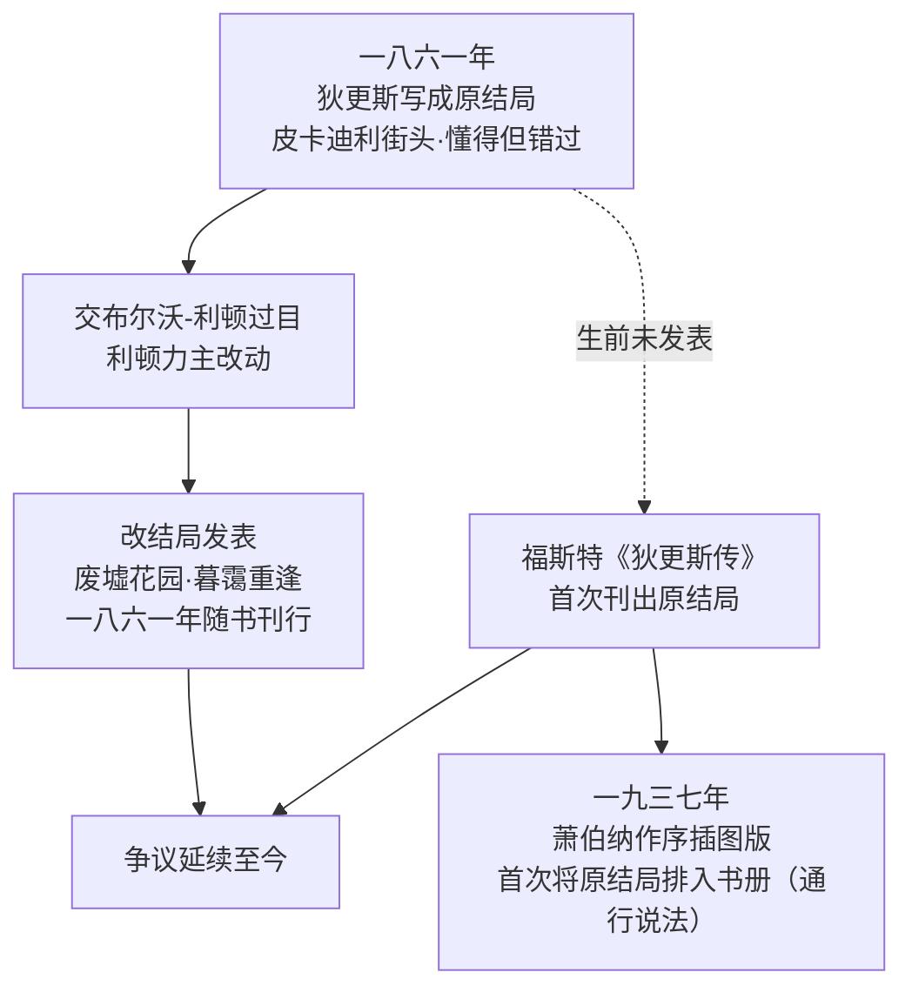

# 10｜两个结局：狄更斯为什么改掉原来的结尾？

> 本篇核心问题：皮普与埃丝黛拉到底该不该重逢？两个结尾各自说出了什么？

> **剧透提示**：本文涉及全书，含结局（本篇即结局解读）。

---

## 开篇：一个值得思考的问题

文学史上很少有作家在自己最著名的书上留两个结尾，还两个都留了下来。《远大前程》就有两个结局：一个写在书稿里，一个印在书上。狄更斯听取了朋友的意见，把原来的结尾换掉重写——原稿直到他死后，才由传记作者福斯特公之于世。

这不是「改了个字」级别的修改。两个结尾给出了两种完全不同的人生判断：皮普与埃丝黛拉这对被毁掉的人，到底有没有可能重新开始？狄更斯自己在这道题前改了答案——为什么？

## 一、从故事开始

先看被换掉的原结局。皮普在国外待了八年后回国（发表版改成了十一年），在伦敦皮卡迪利街头遇见乘小马车的埃丝黛拉。这时的她已嫁给德鲁姆尔又守了寡——德鲁姆尔死于一场虐马事故，常年虐待马匹，最后被马踢死，死法像一份判词。她改嫁了一位什罗普郡的医生。两人寒暄，埃丝黛拉亲吻了皮普抱着的孩子——那是乔与毕蒂的儿子小皮普。原结尾的大意是：苦难胜过了哈维沙姆的教导，给了她一颗能理解我从前心迹的心。懂了，但各走各路。

再看印出来的改结局。皮普十一年后回国，夜里独自走进已成废墟的萨提斯宅邸花园，在那里遇见同样回来凭吊的埃丝黛拉。她也守了寡，也被苦难磨过。两人牵手走出废墟，暮霭升起，皮普说大意是「我看不到再与她分离的影子」。门留了一道缝，没有关死。

## 二、真正的问题是什么？

把这场改稿当成「大团圆还是真悲剧」的选择题，就把它看小了。真正的问题是：**狄更斯对「苦难会不会改变人」给出了两个答案。**

原结局的答案是冷的：苦难确实胜过了哈维沙姆的教育——埃丝黛拉终于「懂了」皮普的心迹。但懂得不等于重来：她嫁了别人，孩子不是她的，两个人在路边客气几句就散了。成长真实发生，代价是错过。这是更残忍也更诚实的版本：人会被苦难改变，但改变不一定来得及。

改结局的答案是温的：同样的两个人，同样在苦难之后「懂了」，狄更斯把散场的地点从闹哄哄的皮卡迪利换到了萨提斯的废墟——那个制造了他们全部痛苦的地方已经塌了。在废墟上重逢，等于说：旧机器的残骸还在，但它不再运转。而「看不到再与她分离的影子」不是承诺，是一个刚刚松开的判决——连团圆都是用否定句说的。

## 三、人物为什么会这样选择？

这一篇的「人物」，先要算狄更斯自己。

改稿的直接推手是小说家布尔沃-利顿——狄更斯的朋友、当时很有名望的同行。原稿给他看后，他强烈主张改动。狄更斯随后在给福斯特的信里写道：他尽量写了一小段漂亮的文字，毫不怀疑改动后故事会更受欢迎。这封书信是作者观点层面最硬的证据：狄更斯自己把这次改动描述为一次「让故事更可接受」的修饰——他说的是「更受欢迎」，不是「更真」。

但只把它读成市场妥协，又漏了一个人物状态：埃丝黛拉。

**埃丝黛拉在两个结局里分别是谁？** 原结局里，她改嫁医生、亲吻别人的孩子——她走出了皮普的叙事，过上了与复仇机器无关的人生。改结局里，她回到废墟，人生似乎永远被那座宅邸圈定。一种可能的读法是：原结局给了埃丝黛拉自由，改结局把她拉回故事——团圆的代价，是她重新成为「皮普的结局」。

**皮普为什么非回来不可？** 两个结局里他都回国、都去找她。这说明狄更斯从头到尾没打算改一件事：皮普的爱是执念，不是选择。前程可以破产，恩主可以死，乔可以被辜负，只有对埃丝黛拉的那点执念，烧掉一切之后还剩着。两个结局的分歧不在皮普身上——他始终是要回来的那个人；分歧在狄更斯肯不肯让这份执念得到回音。

## 四、作者真正想讨论什么？

回到「期望」这个词——书名就叫《远大前程》，皮普一生的病就是「期望」：期望前程、期望恩主、期望埃丝黛拉。全书五十九章在拆「期望」这件东西：恩主是逃犯，前程是赃款，淑女是复仇工具。那么最后一个期望——埃丝黛拉——该不该兑现？

一种可能的读法是：原结局完成了主题的全部逻辑——期望该落空就落空，皮普最后一个期望也以「懂得但错过」的形式结清，全书对「期望」的反讽贯彻到底。改结局则等于狄更斯在最后一刻心疼了自己的人物：他把最后一张空头支票，兑现了一半。

也有批评家站在另一边：既然全书一直在审判「期望」，给皮普一个被允许的期望未必是妥协，也可能是狄更斯给出的赦免——皮普已经赎完了罪，赎罪的人配得上一道门缝。这两种读法至今没有分出胜负，而这个悬而未决本身，就是答案的一部分。

## 五、把这个问题放回时代

改稿发生在连载收尾、单行本付印之前。维多利亚时代的连载读者对结局的态度是真实的商业力量：狄更斯靠自办的《一年四季》杂志吃饭，读者想要团圆不是抽象概念，是销量。他给福斯特那封信的语气——「毫不怀疑改动后故事会更受欢迎」——说明他很清楚自己在做什么：一位靠读者吃饭的作家，在艺术的冷答案和市场的热答案之间选了后者，并且选得不算羞愧。

同时别忘了当时的小说惯例：大团圆是默认的出厂设置，悲剧结局才需要勇气。狄更斯一辈子大部分长篇都向惯例靠拢，《远大前程》的原结尾其实是一次罕见的「不合作」——被朋友一句话劝了回去。这也是这场公案让人叹息的地方：狄更斯不是没有勇气写冷的那个，他是在最后一刻收回了勇气。

## 六、作品是怎么写出来的？

这两个结局的存世方式，本身就是一则出版史故事：

评论界的分裂同样有名：小说家乔治·吉辛痛斥这是「利顿的愚蠢建议」；传记家埃德加·约翰逊称改后的结尾是「硬接上去的附加物」。可一八六一年《雅典娜神庙》杂志当年的书评，反而欣赏新结尾的「不确定」——当时的读者里就有人觉得，那道没关死的门比关死的门更准。

还有一个写法上的细节值得点一下：改结局的暮霭与雾，不是随手布景。雾在这部书里从第一章墓园的清晨一路下到结尾，是全书最重要的气氛装置（这套雾意象另有专文细说，这里只点一句）：让重逢发生在雾霭里，等于狄更斯用自己的符号给「不确定」盖了章——看得见人，看不见结局。

## 七、如果放到今天

导演剪辑版和院线版、游戏的多结局、剧集因观众抗议改写大结局——「两个结局」之争今天每个月都在上演，争的还是那道题：观众想要的是安慰，还是诚实？

有意思的是立场常常反转。今天的读者未必站吉辛一边——越来越多的人觉得，废墟花园里那个不确定的结尾，反而比「各自安好」的街头更像现代人的感情经验：旧创伤的废墟还在，两个人也都变旧了，能不能重来没人保证，但门没锁。狄更斯当年那句「更受欢迎」，误打误撞写出了一种比团圆更耐看的东西。

## 八、小结

狄更斯改结局，表面上是听了朋友的劝、照顾了读者的期待；深处是他自己也没在「苦难会不会改变人」这道题上打定主意。原结局说：会改变，但改变不了已成的事实——懂了，也晚了。改结局说：会改变，而改变本身值得一扇没关死的门。

两个结尾都活着，这或许是狄更斯留给这本书最诚实的形式：他没让我们选。他让我们两个人都当——当那个在街头告别的皮普，也当那个在暮霭里说「看不到分离影子」的皮普。

## 下一篇

无论哪个结局，讲故事的都是同一个声音：一个年长的皮普，在多年以后平静地、甚至带着笑意地审判年轻的自己。这套「回望的眼睛」是怎么搭起来的？它为什么让全书的每一个字都站上了被告席——下一篇看叙述者皮普如何同时当原告和被告。
