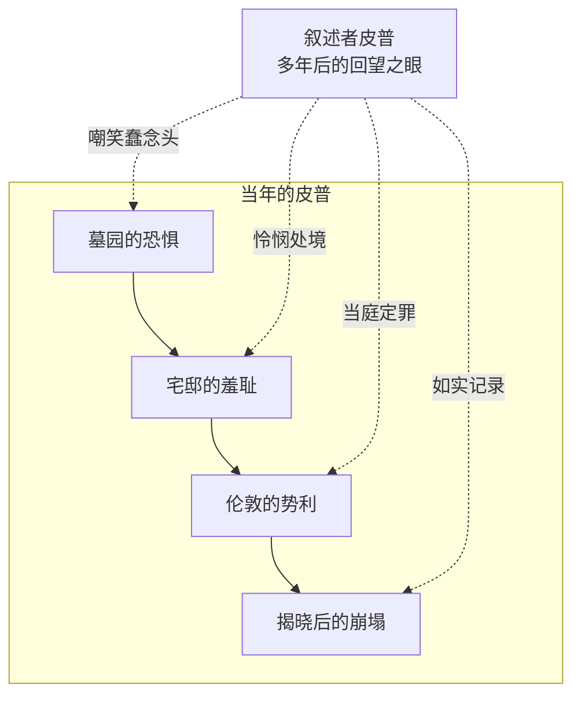

# 11｜回望的眼睛：年长的皮普为什么这样讲自己的故事？

> 本篇核心问题：让当事人自己叙述，却让他不断审判当年的自己——这种写法解决了什么问题？

> **剧透提示**：本文涉及全书。

---

## 开篇：一个值得思考的问题

绝大多数自传式小说里，叙述者和读者是天然同盟：他讲自己的委屈，我们替他抱不平。《远大前程》打破了这个默契。这本书由皮普亲口讲述，可他讲着讲着，就站到了自己的对立面——揭发自己当年的势利，嘲笑自己的蠢念头，宣判自己对乔忘恩负义。被告兼任了原告和法官。

这不是自传文学里的常态。一个叙述者为什么要这样对待自己？这双「回望的眼睛」究竟解决了什么第三人称解决不了的问题？

## 一、从故事开始

先看这部小说真正的第一个动作。小说明确写了：在任何人出场之前，皮普先给自己命名——他念不清「菲利普·皮利普」，念来念去只剩「皮普」，「于是我管自己叫皮普，别人也就跟着叫皮普」（通行中译大意）。一部小说从主角自己发明名字开始，这个细节要到后面才显出分量：皮普的身份从一开始就是他造出来、再由别人签字承认的东西。「远大前程」降临后发生的事，不过是把同一件事再做一遍——他再造一个「绅士皮普」，周围的人再次跟着叫。

再看叙述者怎么对待那个孩子。小说明确写了皮普靠墓碑形状推断父母长相的推理，叙述者讲这段时明显在笑——笑那个孩子把石碑的轮廓当成亲人的长相。但笑声里有怜悯：他同时让我们看见，这孩子不是蠢，是除了石碑没有任何可参考的材料。嘲笑与心疼叠在同一个句子里，这是全书语调的底色。

最能说明问题的是叙述者随时插入的自我定罪。全书多处，他讲到一半会停下来审判当年的自己——「我良心不安」「我本该知道」「我对乔忘恩负义」（均系通行中译大意）。这些剖白不是攒到结尾的忏悔，而是散布在每一段快活叙述里的钉子：故事越讲越热闹，判词越下越重。

## 二、真正的问题是什么？

真正的问题是：**回望式第一人称解决的是什么技术难题？**

设想另外两种写法。如果换成全知第三人称，皮普的势利就需要作者出面评判，小说会变成狄更斯在教训自己的角色——他早期作品常被批评的正是这种旁白说教。如果让少年皮普用现在时态叙述，读者会得到天真，却失去判断——孩子会真心相信自己受的辱、做的梦都合理，势利就不再是缺点，而只是设定。

回望装置把两者焊在一起：恐惧和野心是少年皮普的，反讽和定罪是成年皮普的。读者因此同时做两件矛盾的事——住进错误里，又看着它被宣判。一种可能的读法是：这才是这本书真正的「情节」——表面故事是孤儿得到前程，深层动作是一个男人在审计自己的一生，每一章都是一条账目。

## 三、人物为什么会这样选择？

问题是：叙述者皮普为什么选择对自己这么狠？

一种可能的读法是：他别无选择。这部小说的道德结构里，法律判了马格维奇，社会抬举了皮普，而唯一知道全部内情、又欠着良心债的人，是皮普自己。外部的法庭全部判错之后，只剩下叙述这一个法庭。他讲这个故事，就是在给自己判刑——也是在偿还。把对乔的忘恩负义一句句写出来，是他余生能做的唯一补偿。

另一种可能的读法是：这份狠恰恰是诚意的担保。叙述者对别人都很厚道——乔的憨、马格维奇的粗、甚至帕姆布尔乔克的谄，他都给足了好笑与体面。一个对全世界宽容的叙述者，唯独对自己不宽容，读者才肯相信他的证词。自我审判不是姿态，是证人资格。

## 四、作者真正想讨论什么？

关于构思，作者层面有可靠记录。狄更斯在给福斯特的信中说，这个故事原本只是给杂志写的一篇短文，写着写着，「一个非常漂亮、新颖而怪诞的念头展开了」；他还提到自己安排了「一个孩子和一个好心肠的傻人」之间的有趣关系（以上书信内容均出自福斯特《狄更斯传》所载）。

更关键的一条材料同样出自福斯特的记载：动笔之前，狄更斯重读了自己的《大卫·科波菲尔》，「深受触动」——为的是确认自己不会在无意中重复那本书。这个细节说明，他是自觉地在同一套装置上做变奏。

常见的读法是：两本书共享一副骨架——第一人称、孤儿、童年回望、成年后再看，但温度不同。主流解释认为，科波菲尔回望童年时更多是温柔的怀旧，连苦都被回忆焐热了；皮普回望时却更狠，他不是怀念那个孩子，而是在提审那个孩子。一种可能的读法是：科波菲尔的问题是「我怎么走到今天」，皮普的问题是「我当年到底是个什么人」——同一套装置，狄更斯第二次用它时，把它从相册变成了卷宗。

## 五、把这个问题放回时代

维多利亚时代的读者对「忏悔式自述」并不陌生。那是一个盛产自传、日记与心灵自省文献的时代，宗教上的自我省察传统给文学提供了现成形式；同时代流行的「纽盖特小说」，更以罪犯临终忏悔为典型叙事——一个戴罪之人从头讲自己如何堕落。

放在这个脉络里看，皮普的叙述就有了双重出身：一半是成长小说式的「我如何成为我」，一半是忏悔录式的「我错在哪里」。狄更斯的狡猾在于，他把忏悔录的格式给了一个没坐过牢的绅士——让一个体面的成功故事自己招供。这也呼应了全书无处不在的罪与愧气氛：审判不只发生在法庭，还发生在每一页回忆里。

## 六、作品是怎么写出来的？

回望装置还配套了一套意象系统，最明显的是雾。小说明确写了皮普离村赴伦敦的那个清晨：他走过沼泽，「雾都庄严地升起，世界铺展在眼前」（通行中译大意）——雾散之处理应是坦途，实际却是他一生错觉最盛的时刻。到全书结尾，荒废花园的暮霭里他又看见雾——同一个意象，隔着一生首尾相认。雾是这部小说的视觉语法：皮普每一次以为自己看清了，其实都站在雾里。

与之配套的是记忆自身的不可靠。开篇那段墓碑推理，表面是笑话，实则是方法论演示：这个孩子是根据碎片推断世界的——他从石碑形状推断父亲，后来又从宅邸主人的古怪推断恩主，每次都错。叙述者把这个错误放在第一页，等于提前声明：本证词由一台爱猜想的头脑生产，请读者自行核对。

这套装置可以这样画：

## 七、如果放到今天

这种「两个我」的结构，今天的人其实不陌生。翻自己几年前的发言记录感到尴尬、深夜复盘某次搞砸的选择、在咨询室里重讲童年——都是叙述者皮普在做的事：站在时间另一头，审判那个已经回不去的自己。

差别在于工具。皮普只有记忆和一支笔，所以他的审判必须诚实到残忍才有分量；而今天的自我叙述常常带滤镜——我们发动态时既当当事人又当叙述者，却通常只行使叙述者里「美化」的那一半权力。皮普的示范恰好相反：一个合格的人生叙述者，首要义务是对自己不客气。

## 八、小结

回望式第一人称解决的，是道德教育小说最古老的难题：谁来教训谁？狄更斯的答案是——不请牧师，不设旁白，让被告自己开庭。恐惧归孩子，判断归大人；过失归当年，偿还归讲述。皮普把一生的账讲成一本书，等于把自己送上唯一能判准他的法庭。

而全书第一句话早已预告了这个装置：「我管自己叫皮普」——这个名字是他发明的，这段叙述也是。一个人如何讲述自己，本身就是他的第二次人生。

## 下一篇

回望装置让这部小说的每一页都密度惊人，而这种密度从何而来，本身就是一桩文学史公案：一部为救杂志销量赶写出来的连载，凭什么被称为狄更斯最成熟的作品？
