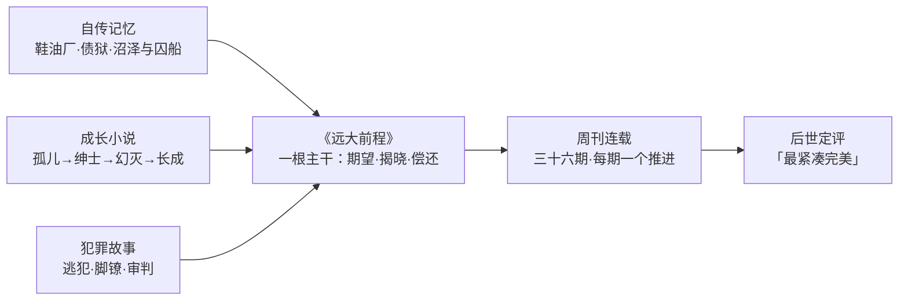

# 12｜《远大前程》凭什么被称为狄更斯最成熟的作品？

> 本篇核心问题：一部为救杂志销量赶写的连载，怎么成了文学史上「最紧凑完美」的狄更斯？

> **剧透提示**：本文涉及全书。

---

## 开篇：一个值得思考的问题

文学史上有一个耐人寻味的反差：狄更斯公认「最完美」的书，恰恰是写得最急的一本。《远大前程》不是从容酝酿的杰作，而是一次救火——自家杂志销量告急，正在连载的小说没人看，狄更斯只好亲自披挂上阵，按期交稿，写到一半连结局都要临时找人商量。

可就是这样一部救场之作，后来被萧伯纳称为狄更斯「最紧凑完美的书」。仓促与完美，这两个词怎么会落在同一本书上？

## 一、从故事开始

先把事实摆清楚。生产记录是明确的：一八六〇年十二月一日至一八六一年八月三日，《远大前程》连载于狄更斯自办的周刊《一年四季》（All the Year Round），共三十六期、五十九章，书中分为三个「阶段」。直接动因是一次商业危机：刊物上正在连载查尔斯·利弗的小说《一日之行》，销路疲软，狄更斯决定自己写一部顶上，挽救杂志销量。

关键在于刊期形式。狄更斯此前多数长篇是按月连载，每期二十来页，容得下枝蔓；《一年四季》是周刊，每期只有寥寥数页——这和当年被逼出紧凑结构的《艰难时世》《双城记》是同一处境。每周一小段，每一小段都必须有一个钩子、一次推进。一八六一年，查普曼与霍尔出版社推出三卷单行本，当年一再重印——市场立刻承认了它，评论界却没有。

## 二、真正的问题是什么？

真正的问题是：**为什么压力没有压垮这本书，反而把它压得更密？**

月刊连载时代的狄更斯有一个著名的写作方式：边写边想，人物随写随添，伏笔可以隔一年再收。这种方式产出了丰盛，也产出了松散——他早期几部巨著常被批评「好段落多过好结构」。周刊模式把这扇门焊死了：每期篇幅太短，容不得闲笔；间隔太短，读者忘不掉伏笔，作者也不许忘。

于是《远大前程》出现了狄更斯作品里罕见的经济性：开场出现的每一件东西——脚镣、锉刀、雾、宅邸里停摆的钟——后面全部结账。一种可能的读法是：不是狄更斯突然学会了紧凑，而是周刊形式替他执行了纪律，而他罕见地服从了。

## 三、人物为什么会这样选择？

这里的「人物」得换成作者本人。看他在期限压力下做的几个选择，能看出成熟度在哪里。

第一个选择：把三种材料焊成一根主干。这个故事同时是三种东西——自传记忆（穷孩子的羞耻）、成长小说（孤儿变绅士）、犯罪故事（逃犯与审判）。一般的处理会让三条线轮流出场；狄更斯让它们长在同一根骨头上：犯罪故事提供「钱从哪来」，成长小说提供「人往哪去」，自传记忆提供「疼在哪里」。皮普得知恩主是谁的那一夜，三条线在同一根引信上爆炸。

第二个选择：让结构自己表态。三个阶段对应「期望」的起落——得到前程、挥霍前程、偿还前程。狄更斯不需要写一句议论，结构本身就是判词。

第三个选择，也是最冒险的：全书最大的反转不放在外部事件，而放在认知内部。揭晓的那一刻，世界没有变，是皮普对世界的一切理解被推翻了。把高潮押在「知道真相」而不是「发生大事」上，是只有对结构极有把握的作家才敢下的注。

## 四、作者真正想讨论什么？

狄更斯在书里埋了一套姓名密码。按批评界通行的文字游戏读法：宅邸名 Satis 来自拉丁语「足够」——住在一座叫「足够」的房子里的人，恰恰一辈子不知足；Estella 意为「星」，美丽、遥远而冷；Pip 是果核里的「种子」；Havisham 被读作 have-a-sham，「拥有一个假象」。这些属于后世批评界的通行解释，狄更斯本人未留下逐条确认，但四个名字指向同一个意思——全书人人都在被自己的名号反讽。

自传性投入有传记通行记载佐证：狄更斯十二岁进沃伦鞋油厂做童工，父亲一度被关进马夏尔西债狱，这两段经历他终生讳言；他童年住在查塔姆，沼泽与囚船是亲眼所见；动笔前后，他刚经历一八五八年与凯瑟琳分居的人生低谷。也就是说，皮普的羞耻不是研究出来的，是寄存出来的——狄更斯把自己的旧伤口存进了角色体内。

至于他要讨论什么，批评界有一把公认的钥匙：汉弗莱·豪斯在《狄更斯的世界》（一九四一）中把「势利」与「绅士理想」视为解读本书的核心——狄更斯讨论的不是贫富，而是「想被当作上等人」这个念头本身如何腐蚀人。

## 五、把这个问题放回时代

《远大前程》通常被定位为典型的成长小说（Bildungsroman）：一个青年离开家乡，进入社会，完成自我教育。但也有批评家把它读作「反成长小说」——因为皮普的成长神话恰恰在书里破产：他得到教育、金钱、地位，失去的是品格；真正的「长成」发生在他放弃前程之后。两种定位争的不是分类，而是这本书到底信不信任「向上流动」这件事。

这个争论有时代根源。十九世纪中期的英国，一边是中产阶级兴起、「自助者天助」的信条盛行，一边是狄更斯亲眼见过的债务监狱与流放制度。「绅士该不该由出身决定」是那个时代的公共议题——这本书恰好长在议题的裂缝上。

## 六、作品是怎么写出来的？

它的评论史本身就是一部反转剧。初版时恶评不少：《布莱克伍德杂志》评它「疲弱、倦怠、失色」，《大西洋月刊》感叹旧日的欢闹与想象力游戏消失了些（均为对当时评论的转述大意）。早期评论界怀念的是狄更斯的喧闹与枝蔓——而这两点正是这本书主动切除的东西。

定评来得慢但彻底：斯温伯恩称之为狄更斯「最后的伟大作品」；萧伯纳一九三七年称它为狄更斯「最紧凑完美的书」，还说它「浑然一体且始终真实」（大意）；安格斯·威尔逊称之为「狄更斯最完全统一的艺术品」。也就是说，当初被嫌「失色」的，后来被认定为「统一」——评论家用了一百年才把缺点改读成优点。

改编史是另一重认证。大卫·里恩一九四六年的电影版（约翰·米尔斯饰皮普）被公认为文学改编的经典；一九九八年阿方索·卡隆拍出现代版；BBC 与 FX 的剧集改编多次出现——除《圣诞颂歌》外，它是被影视改编最多的狄更斯作品。故事能被一次次搬进别的时代而不散架，本身就是结构密度的证明。

这本书的「焊接」可以这样看：

## 七、如果放到今天

放到今天，这本书的生产方式像个预言。流媒体时代的编剧室、网文连载、漫画周刊——所有「按期交稿、每期要有钩子」的写作，都在重复《一年四季》的处境。狄更斯证明了截稿期限不是质量的反义词：期限压死的是散漫，压出的是取舍——你没法什么都写，所以必须想清楚什么非写不可。

更有意思的是评论史的教训：同时代的差评，针对的往往是「不像以前的你」。一个创作者最成熟的作品，很可能最先被老读者认出来是「背叛」。一百年后才改判的事，文学史上常有——这本书是标准案例。

## 八、小结

《远大前程》被称为最成熟的狄更斯，靠的不是题材的严肃，而是三样东西罕见地同时到场：周刊纪律压出的结构密度，自传伤口提供的情感浓度，以及一个敢把反转押在认知上的作者意志。仓促是真的，完美也是真的——前者是史料，后者是定评。

一句话概括这场公案：狄更斯救了一次杂志的销量，顺便把自己的写法救到了最紧凑的形态。

## 下一篇

文学史给了这本书定评，但定评回答不了另一个问题：一百六十多年后，当「出人头地」仍是普通人头上的咒语，「远大前程」这四个字为什么还烫手？
