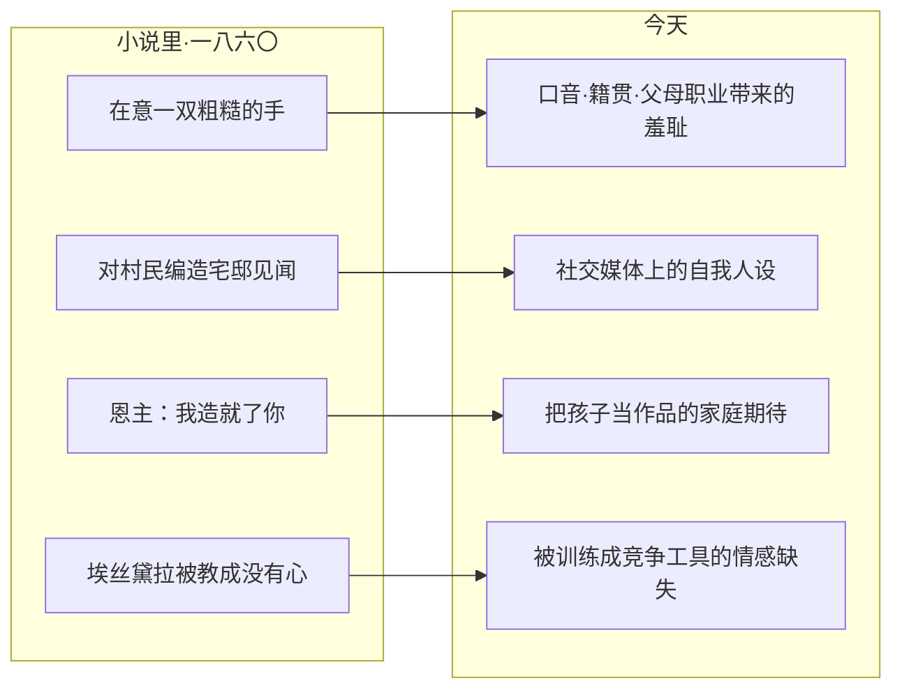

# 13｜一百六十多年后，「远大前程」这四个字为什么还烫手？

> 本篇核心问题：当「出人头地」依然是我们时代的咒语，皮普的故事还能照出什么？

> **剧透提示**：本文涉及全书。

---

## 开篇：一个值得思考的问题

中文里「前程远大」是一句祝福，几乎没人会把它当成警告。可狄更斯这本书恰恰把它写成了一张传票：一个乡下男孩得到一份来路不明的前程，接下来几百页都在证明，这份礼物是债。

一百六十多年过去，我们不再流放犯人，不再有囚船和债狱，「绅士」这个词也基本退出了日常。但祝福还是那个祝福，咒语也还是那个咒语——「你要出人头地」。为什么一本维多利亚小说里的事，放到今天依然烫手？

## 一、从故事开始

用一句话讲清这个故事的机制：一个铁匠学徒突然得到匿名资助去当上等人，他学会了为出身羞耻，最后发现钱来自他最瞧不上的那种人，又用余生偿还。机制的全部零件都在这一句里：馈赠、羞耻、真相、偿还。

请注意，这个故事里没有任何一场「努力改变命运」的奋斗戏。皮普从头到尾没挣过一分钱，他的全部动作是接收——接收馈赠、接收身份、接收羞耻。这种「被动」正是它能照到今天的关键：大多数人对前程的真实体验，恰恰不是规划出来的，而是被发放下来的。

## 二、真正的问题是什么？

真正的问题是：这本书里有没有一样东西，是只属于当时、今天已经消失的？

逐项检查会发现几乎没有。让皮普抬不起头的不是贫穷，是「被看见贫穷」；让他兴奋的不是财富，是「可以被当成另一个人」；压垮他的也不是真相本身，而是发现自己的优越感一直记在一本错账上。这三样——羞耻、伪装、错账——没有一样依赖维多利亚时代的制度。

也就是说，这本书讲的从来不是「穷人如何变富」，而是一个更耐久的问题：**当一个人用来评价自己的那套标准是别人塞给他的，他的一生就是在替别人活。** 狄更斯把这份「别人写好的前程」拟人化成一个神秘恩主；今天的恩主换了名字，功能没变。

## 三、人物为什么会这样选择？

把书里的人物放到今天，几乎个个能对号入座。

皮普对应的是从小镇进大城市的年轻人：换掉口音、学用餐具、藏起家世，表演一个「本来就该在这里」的自己。小说里那个著名的「手粗糙」时刻——他在意的是一双手暴露出身——今天的版本无处不在：简历上被模糊处理的教育经历、聚会上被绕开的家乡话题、相亲时被掂量的父母职业。羞耻的靶子换了，羞耻的机制原封不动。

小说明确写了皮普对乡亲编造宅邸见闻的谎话——他描述了一个根本不存在的华丽场面，大家听得艳羡。这是社交媒体人设的一八六〇年版：人还没成为想象中的自己，先开始用叙述预支它。这种谎言的功能不是欺骗别人，是安抚自己——「我已经不一样了」。

埃丝黛拉对应的是情感教育的缺席：她被一个大人系统性地教成「没有心」，成果斐然，代价是一辈子不会爱人。把这个机制翻译过来毫无难度——被训练成竞赛工具、情绪表达被视为软弱的孩子，今天仍在批量生产。

马格维奇那句大意的「我造就了你」，则是当代家庭期待倒置的先声：一个付账的人，把受惠者当成自己的作品。孩子读书、出国、进大公司，究竟是谁在完成谁的前程？狄更斯让最卑微的恩主问出这句话，今天它从无数家庭的饭桌上被问出来。

## 四、作者真正想讨论什么？

把这四面镜子收拢，狄更斯真正的问题浮出来：**这是谁的期望？**

书名里的 expectations 在英文里既是「期望」也是「预期继承的财产」——一个词同时装着「别人盼你成为什么」和「别人决定给你什么」。皮普一生的悲剧不是追求前程，而是他从未选择过自己的前程：恩主选了，社会标准选了，连他的羞耻都是被挑选出来的。一种可能的读法是：狄更斯用整本书论证，最彻底的异化不是没钱，是连欲望都是二手的。

这个问题之所以今天还有效，正因为「发放前程」的机构更多了。维多利亚时代需要一个神秘恩主才能完成的指定，今天由教育体系、行业标准、流量算法和家庭期待分摊着做完——你被期望成为什么样的人，常常在你说出「我想」之前就已经定稿。

## 五、把这个问题放回时代

也要承认两端的差异。狄更斯的时代，羞耻的来源相对固定：出身、口音、手艺人的身份，几乎写在出生证明上；向上流动的通道很窄，但「留在原地」不被视为失败本身。

今天的版本更隐蔽，也更苛刻：出身仍然计分，却又叠加了一层「是你自己不够努力」的归因——成功学把阶级焦虑改写成个人意志问题，让羞耻从「我出身不好」升级为「我不够拼、不够自律、不够配」。皮普至少还有具体的人可以怨——恩主、宅邸主人、那个时代；今天的皮普常常只能怨自己。从这个角度看，狄更斯的故事甚至算温和的：他给了主角一个可以被揭穿的谎言，而今天很多期望连可揭穿的实体都没有。

## 六、作品是怎么写出来的？

这本书为什么经得起一代代移植？一种可能的读法是：狄更斯写的不是现象，是机制。现象会过期——囚船、流放、绅士头衔都过期了；机制不会——「用别人的标准惩罚自己」到今天还在运转。这也是为什么它能被不断改编进新语境：只要一个社会还存在「成为上等人」的许诺和对应的羞耻税，皮普就有新的肉身。

小说机制与今日处境的对应，可以这样画：

## 七、如果放到今天

那么，这个故事给今天的皮普留了出口吗？

小说给过一个提示：皮普的救赎不是「终于成为上等人」，而是重新有能力区分——什么是别人塞给他的尺度，什么是他自己认的账。对应到今天，这大概是最难也最值得做的一项练习：在每一次为出身、为薪水、为「不够成功」而羞耻的瞬间，多问一句——这个标准是哪里来的？我什么时候签的字？

同样值得问的是给别人的那一半。每一代人都同时是皮普和马格维奇：既在接受期望，也在发放期望。当我们对孩子说「为你好」、对晚辈说「听我的没错」，可以先检查一下，自己递出去的是礼物还是账单——狄更斯已经演示过，以爱为名的馈赠，收货时可能是一张人格欠条。

## 八、小结

「远大前程」这四个字今天还烫手，因为它包装的从来不是机会，而是一笔糊涂账：谁在定义前程，谁在支付代价，谁最后来收账。狄更斯在一八六〇年就把这笔账算清楚了——馈赠可能来自你最看不起的地方，体面可能标价你最舍不得的东西，而「成为上等人」的梦想，常常是别人做旧了再卖给你的。

一百六十多年后，囚船沉了，宅邸塌了，机制还在。这本书至今有效，不是因为它预言了今天，而是因为它当年就把那台机器的内部结构画了出来。

## 下一篇

到这里，故事、人物、时代、主题、写法与今天，都已各自成篇。这个系列还剩下最后一件事：不再提出新问题，而是把十三篇讨论收成一张可以带走的完整地图——《远大前程》系列总结。
