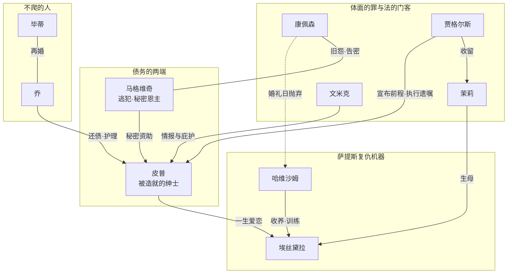

# 99｜系列总结：《远大前程》

> 十三篇文章走完，回到最初的问题：狄更斯借一个孤儿的「前程」实验，追问的是什么是体面、谁是恩人、人该如何偿还童年的债。

## 一、故事地图

整个故事可以用三句话讲完，但每一句都压着一笔旧账。

第一句：一笔债记下了。圣诞前后的沼泽地墓园，孤儿皮普给逃犯马格维奇送去食物和锉刀——这是第一「阶段」的开端，善与罪在同一动作里完成。

第二句：一笔账记错了。多年后律师贾格尔斯宣布皮普拥有「远大前程」，皮普认定恩人是哈维沙姆小姐、埃丝黛拉是许配给他的奖赏，于是去伦敦学做绅士，一路疏远铁匠乔——这是第二阶段，也是全书误读的滋生期。

第三句：账单递到了本人手里。暴风雨夜马格维奇现身，恩主之谜揭开：前程来自最被鄙弃的人。出逃失败、审判、狱中临终，皮普从「被造就的绅士」退回一个还账的人——第三阶段，误读被逐条清算。

## 二、人物地图

按「人物想要什么」给全书人物排一次队：

| 人物 | 想要什么 | 得到什么 |
|---|---|---|
| 皮普 | 成为「上等人」，配得上埃丝黛拉 | 得到了前程，发现它的来源恰恰否定了前程的意义——他是唯一被自己的愿望教训的人 |
| 马格维奇 | 用钱「造就」一个绅士，向看不起他的世界证明点什么 | 他的绅士活了，又在暴风雨夜亲手拆掉了绅士的地基；他死在听皮普说「我爱你的女儿」之后 |
| 哈维沙姆小姐 | 把婚礼日凝固，让恨活得比自己久 | 她造出的武器埃丝黛拉最后掉转枪口对准她——复仇没有结账日 |
| 埃丝黛拉 | 按设计活下去：无心、胜利、不负债 | 她成了设计本身最完整的证据：一台成功的复仇机器，同时是一份失败的人生 |
| 乔·葛吉瑞 | 守着铁匠铺和皮普，别无所求 | 被皮普疏远，又在他热病与破产时不请自来——全书唯一不求回报的人，唯一留下后代的人 |
| 埃丝黛拉的反面·毕蒂 | 让皮普诚实地看见自己 | 她等到的是乔——清醒的人不接盘幻梦 |
| 康佩森 / 奥力克 | 康佩森要体面地作恶，奥力克要报复世界 | 一个绅士骗子获刑七年，一个流氓用别人的脚镣行凶——罪在书里从不按身份分配 |
| 贾格尔斯 / 文米克 | 在罪恶行业里保持功能与洁癖 | 一个用香皂洗手，一个把家筑成城堡——体面的两种生存策略 |

## 三、人物关系图

这张图暴露了全书的枢纽结构：皮普站在两笔「馈赠」之间——马格维奇的钱与哈维沙姆的恨——他以为自己在领赏，其实一直在替两笔旧债做抵押。而乔站在整张网外面：唯一不欠他的人，也是唯一他还不起的人。

## 四、核心冲突

表层冲突是人与命运：孤儿对时代，穷小子对「前程」。

深层冲突是两种「造就」对撞：马格维奇用钱把皮普造成绅士，哈维沙姆用恨把埃丝黛拉造成武器——两个人都是别人工程的成品，区别只在于皮普最终认领了自己的工程事故，埃丝黛拉到结尾才刚刚开始认领。

最深的冲突在皮普内部：他想要的一切（绅士、埃丝黛拉、离开沼泽地）都实现了，实现的瞬间才知道自己想要的是错的东西。这部小说最狠的地方，是让主人公的每一个愿望都兑现——然后用兑现来证明愿望本身有病。

## 五、核心主题

**前程与恩主**：「远大前程」在英语里本是法律与继承的行话——尚未到手的财产。狄更斯把这个词从褒义一路写到反讽：前程越大，来源越脏；得到越多，亏欠越深。

**罪与愧**：一部没有凶杀主线的小说，却从头到尾泡着犯罪——囚船、脚镣、监狱、通缉令。它问的不是「谁犯了法」，而是「法律与良心谁判得更准」：法律账上皮普是清白的孩子，良心账上他偷了东西；法律账上马格维奇是渣滓，良心账上他是全书最大的债主。

**羞耻与自我厌弃**：皮普的势利不是虚荣，是羞耻——他从埃丝黛拉的眼睛里第一次看见自己「粗糙的手」，从此想换掉整个人生。这个主题与狄更斯自己的鞋油厂记忆暗通，也是全书最现代的部分。

**感恩与忘恩**：乔是「不忘恩」的基准线，马格维奇是「记恩一生」的极端，皮普是所有读者——接受善意时心安理得，发现债主身份后大惊失色。小说把「接受」写得比「给予」更难。

## 六、作者思想

可以确认的作者表达：他在致福斯特的信中记下构思的来历——本想给杂志写篇短文，「一个非常漂亮、新颖而怪诞的念头展开了」，并且特意安排了「一个孩子和一个好心肠的傻人」的关系；动笔前他重读《大卫·科波菲尔》，「深受触动」，以免无意重复；结局改稿时他告诉福斯特「毫不怀疑改动后故事会更受欢迎」。

从这些自述与文本推得的思想轮廓：狄更斯既不是上流社会的颂扬者，也不是简单的平等主义者。他更像一个「靠一支笔从底层爬上来的成功者面对成功的审问」——他比谁都清楚「上等人」三个字的分量，也比谁都有资格怀疑它。汉弗莱·豪斯《狄更斯的世界》（一九四一）把势利与绅士理想视为解读本书的钥匙，已成主流学术读法；也有批评家强调它对司法与刑事制度的拷问更根本——两种读法至今并存。

## 七、时代背景

故事时间：一般推断在十九世纪最初数十年。真实制度锚点：罪犯流放澳大利亚（新南威尔士流放制一八四〇年代终结）、归国流放犯可判死刑、泰晤士河口监狱囚船、纽盖特公开绞刑文化（英国至一八六八年才停止公开处决）。

写作时间：一八六〇至一八六一年。狄更斯四十八岁，刚经历一八五八年与凯瑟琳的分居，事业与私生活都在清算期；他的周刊《一年四季》正被一篇滞销连载拖累，《远大前程》本是救场之作——狄更斯自己最狼狈也最有钱的那几年，写出了这本质问「钱与体面」的书，这层自传暗线几乎无法忽略。

资料底子：一半是亲眼所见（查塔姆童年见过的沼泽、囚船与教堂墓地的小墓碑，常被指认为开场五块菱形小石头的原型），一半是他自己的传记材料——鞋油厂、债狱、一个对出身讳莫如深的成功作家。读它时最好记得：皮普的羞耻里住着狄更斯的羞耻，这是主流读法而非定论。

## 八、写作技巧

全书技法可以收成四句话：

- **回望式第一人称**：让长大后的皮普讲小时候的自己——孩子负责经历，大人负责审判，同一双眼睛当原告和被告。
- **意象系统埋雷**：雾（升起=认知，落下=遮蔽）、脚镣（流转成凶器也流转成救赎）、停摆的钟（一个人的创伤时区）——先当背景再当伏笔的延时装置。
- **误读式结构**：皮普与读者一起信错了恩人——全书最大的反转不靠新信息，靠读者自己脑补出来的推理被拆穿。
- **周刊连载的密度**：三十六期短章逼出紧凑结构，每个次要人物（文米克、帕姆布尔乔克、特拉布的小伙计）都自带一台小发动机。

代价也明显：相比《大卫·科波菲尔》的温厚从容，这本书更冷、更狠、更算无遗策——「浑然一体」的赞美与「少了点旧日欢闹」的差评，说的是同一枚硬币。

## 九、文学史意义

出版史：一八六〇年十二月一日至一八六一年八月三日连载于《一年四季》，共三十六期、五十九章分三个「阶段」；一八六一年由查普曼与霍尔出版三卷本，当年一再重印。它是狄更斯倒数第二部完整作品，也是「救场写成经典」的出版史名例。

接受史：初版评论两极——《布莱克伍德杂志》讥其「疲弱、倦怠、失色」，《大西洋月刊》叹「旧日欢闹与想象力游戏消失了些」；后世几乎一边倒——萧伯纳一九三七年称之为狄更斯「最紧凑完美的书」「浑然一体且始终真实」，斯温伯恩誉之为「最后的伟大作品」，安格斯·威尔逊称「最完全统一的艺术品」。

影响面：除《圣诞颂歌》外被影视改编最多的狄更斯作品——大卫·里恩一九四六年版公认文学改编经典，此后现代版、BBC 与 FX 剧集不断。它还悄悄参与塑造了一个中文成语级词汇的读法：「远大前程」四个字在汉语里至今带着反讽的阴影，多半拜这本书所赐。

## 十、作品的局限与争议

如实摆开三件事：

- **结局之争**：布尔沃-利顿劝改的团圆式结尾被吉辛斥为「愚蠢建议」、被约翰逊称为「硬接上去的附加物」；但当年《雅典娜神庙》的书评反而欣赏结尾的「不确定」。原结局生前未发表——读者今天能同时读到两个结尾，这本身就是争论仍未终结的证据。
- **埃丝黛拉之争**：她究竟是「被写实的受害者」还是「被功能化的道具」？认为狄更斯给了她足够人性的读法，与认为她只是哈维沙姆机器上的零件的读法，并存至今。
- **作者的诚实边界**：狄更斯借皮普审判势利，自己却终身以「上等人」自居、对鞋油厂往事讳莫如深——写这本书是忏悔、开脱还是自我解剖，没有标准答案。这也是本系列反复标注「一种可能的读法」的原因。

## 十一、今天为什么值得阅读

以下部分是现代延伸，不是狄更斯原话。

三个今天仍然锋利的切口：其一，「出人头地」的价目表——皮普用十几年才明白自己付的不是学费是人格，这个账单在每一代小镇青年进城的路上重印。其二，羞耻如何伪装成上进心——「粗糙的手」时刻换了一身衣服活在今天的简历、口音和朋友圈里。其三，「谁的期望」之问——父母、社会、恩人替我们写好的前程，与马格维奇替皮普写好的那份，结构惊人地相似：馈赠的背面都写着一笔账。

## 十二、只记住 10 句话

1. 开场在墓园不是噱头：一个从石碑上推理父母长相的孩子，一生都在猜活人想要什么。
2. 「远大前程」是法律行话也是反讽——尚未到手的财产，先到手的是债。
3. 萨提斯宅邸是一台复仇机器：钟表停摆的那一刻，哈维沙姆把人生典当给了恨。
4. 皮普想当绅士不是虚荣，是羞耻——他想换掉的不是职业，是「不配被爱」的自己。
5. 马格维奇让「最不该被信任的人」完成最慷慨的给予——狄更斯在拷问「绅士」与「好人」是不是同义词。
6. 乔是全书唯一不往上爬的人，也因此是唯一存住善良的人——衡量皮普的尺子从来不是伦敦。
7. 埃丝黛拉是实验的成功品：一台完美的复仇机器，一份报废的人生。
8. 恩主之谜揭开的不是一个秘密，是皮普整套世界观——优越的地基恰恰是他最鄙弃的东西。
9. 全书没有凶案却充满罪与愧：法律判马格维奇十四年、康佩森七年，良心的判决书完全反过来。
10. 两个结局的分歧不是团圆或悲剧，是「苦难到底改不改变人」——狄更斯把两种答案都留给了读者。

## 十三、与其他作品的关联

往前看，它接的是《大卫·科波菲尔》的自传性第一人称——但科波菲尔的回望是温柔的，皮普的回望是带审判席的；同一支笔，隔了十一年，从怀旧写成了清算。横向看，它与《双城记》同为周刊救场之作，共享「被时代拖垮的紧凑结构」；一个问革命中的牺牲，一个问阶级中的体面。

往后看，「小人物被他人的馈赠绑架」的结构在无数后来的作品里复活——从《了不起的盖茨比》的自我造就神话，到今天每一部「寒门贵子」叙事，「前程是谁给的、代价是谁付的」始终是文学不肯放下的问题。

系列到这里收束。十三篇正文按「故事 → 人物 → 冲突 → 主题 → 写法 → 今天」走完了一圈，但文学作品的好处在于它不接受最终裁决——如果哪一篇的读法让你想反驳，恭喜你，那正是狄更斯想要的读者。
