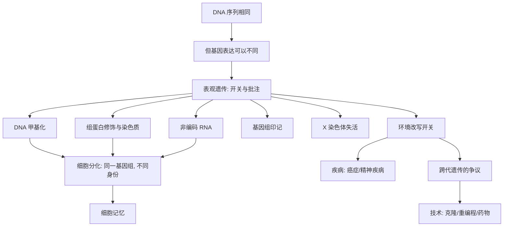

# 《遗传的革命》深度解读系列

## 系列简介

《遗传的革命》讲的是生物学里一次安静的范式转移：**基因并不是命运。**

长久以来，我们习惯把 DNA 想象成一张写死的蓝图：你有某种基因，就注定有某种命运。但表观遗传学（epigenetics）发现，在 DNA 序列**之上**，还存在一整套"开关与批注"系统——它决定哪些基因被打开、哪些被关闭、何时打开、开多大。这套系统能被发育、环境、经历甚至生活方式改写。

这本书要回答的核心问题是：**如果每个细胞的 DNA 都一样，为什么我们的身体里会有几百种不同的细胞？为什么同卵双胞胎会越来越不像？为什么饥荒和创伤的阴影，可能隔代还在？** 它不否定基因，而是给"基因决定论"补上了最关键的一半。

本系列围绕 **16 个核心问题**，从表观遗传的基本机制，讲到细胞分化、基因组印记、环境与疾病、跨代遗传的争议，最后落到技术与未来。

---

## 全书核心问题

| 层次 | 问题 |
|---|---|
| 概念问题 | 什么是表观遗传？它为什么推翻"基因即命运"？ |
| 发育问题 | 同一个基因组，如何变出几百种细胞？ |
| 机制问题 | 甲基化、组蛋白、X 失活、基因组印记是怎么工作的？ |
| 环境问题 | 环境、经历、饥荒如何改写基因的"开关"？能否跨代传递？ |
| 技术问题 | 克隆、干细胞、表观遗传药物，能带来什么？ |

---

## 全书知识地图



---

## 全系列目录

### 第一部分：从基因到"基因之上"

#### 01｜为什么同卵双胞胎也会不一样？

核心问题：基因完全相同，为什么两个人在性格、健康、命运上会越走越远？

核心观点：同卵双胞胎的 DNA 序列几乎一致，但他们并不相同。差别来自"基因如何被使用"——表观遗传标记会随年龄、环境、经历而分化。双胞胎是"基因不是命运"最直观的证据。

理解难度：★★★☆☆

关键词：同卵双胞胎、表观遗传、分化、环境

---

#### 02｜什么是“表观遗传”？

核心问题："表观遗传"到底在研究什么？

核心观点：表观遗传研究的是"在 DNA 序列不变的前提下，基因表达如何被调控、并稳定地传递"。如果把 DNA 比作乐谱，基因序列是音符，表观遗传就是演奏的强弱、快慢与是否演奏——同一份乐谱，能奏出完全不同的音乐。

理解难度：★★★☆☆

关键词：表观遗传、基因表达、调控、遗传

---

#### 03｜为什么说“基因不是命运”？

核心问题：如果有了某种基因就一定会得病，那"基因不是命运"从何说起？

核心观点：大多数性状和常见疾病并非由单一基因决定，而是众多基因与环境、表观修饰的复杂互动。少数单基因病确实"一个基因定生死"，但更普遍的情况是：基因提供了倾向，环境与表观调控决定它是否兑现。

理解难度：★★★★☆

关键词：基因决定论、复杂性状、外显率、环境

---

### 第二部分：细胞与发育

#### 04｜同一个基因组，为什么能长出几百种细胞？

核心问题：神经细胞、肌肉细胞、免疫细胞的 DNA 明明一样，为什么会完全不同？

核心观点：因为它们"打开"的基因不同。细胞分化靠的就是表观遗传：把不需要的基因永久关掉，把需要的基因保持开启。基因组像同一座图书馆，不同细胞只是借了不同的书。

理解难度：★★★★☆

关键词：细胞分化、基因开关、染色质、身份

---

#### 05｜一个受精卵是怎么变成一个人的？

核心问题：一个细胞如何一步步长成有器官、有组织的复杂个体？

核心观点：发育是一个"表观遗传程序"逐步展开的过程：随着细胞分裂，不同谱系的细胞被赋予不同的表观标记，逐步锁定身份。它既精确又灵活，是理解表观遗传最壮观的自然实验。

理解难度：★★★★☆

关键词：发育、胚胎、谱系、程序

---

#### 06｜为什么细胞能“记住”自己的身份？

核心问题：细胞分裂那么多次，为什么皮肤还是皮肤、肝脏还是肝脏？

核心观点：表观遗传提供了"细胞记忆"：通过稳定的甲基化与组蛋白修饰，细胞把"我是谁"写入后，能在分裂中传给子细胞。没有这份记忆，多细胞生命根本无法维持。

理解难度：★★★★☆

关键词：细胞记忆、稳定性、分裂、遗传

---

### 第三部分：印记与性别

#### 07｜为什么父母给的基因不一样重要？

核心问题：同样一段基因，来自父亲和来自母亲，为什么后果可能不同？

核心观点：基因组印记是一种特殊的表观现象：某些基因会"记住"自己来自父方还是母方，只表达其中一方。一旦出错，会导致特定疾病（如普拉德-威利、安格尔曼综合征）。它证明表观信息与序列信息同样关键。

理解难度：★★★★★

关键词：基因组印记、父源/母源、疾病、表观

---

#### 08｜为什么女性的两条 X 染色体要“关掉”一条？

核心问题：女性有两条 X 染色体，男性只有一条，为什么女性不会"剂量翻倍"？

核心观点：X 染色体失活：女性细胞会随机关闭一条 X，以平衡基因剂量。有趣的是，关闭哪条是随机的，因此可能形成"嵌合"——三花猫的毛色斑块，就是这个机制的经典证据。

理解难度：★★★★☆

关键词：X 失活、剂量补偿、随机、嵌合

---

### 第四部分：环境、疾病与跨代

#### 09｜环境如何改变你的基因“开关”？

核心问题：饮食、压力、毒素真的能影响基因表达吗？

核心观点：能。表观遗传是环境作用于基因的接口：营养、压力、污染物都能改变甲基化与组蛋白状态，从而影响基因开关。荷兰"饥饿冬天"的研究是经典案例：同一段历史事件，在不同人生阶段留下了不同的健康烙印。

理解难度：★★★★☆

关键词：环境、甲基化、饥饿冬天、可塑性

---

#### 10｜表观遗传如何参与癌症？

核心问题：癌症不只是基因突变吗？表观遗传在其中扮演什么角色？

核心观点：癌细胞常常"用错了开关"：本该沉默的促癌基因被打开，本该工作的抑癌基因被甲基化关闭。这解释了很多"有突变却没坏、没突变却得癌"的现象，也带来了新的治疗靶点。

理解难度：★★★★★

关键词：癌症、甲基化、抑癌基因、表观药物

---

#### 11｜“童年的经历”会写进基因里吗？

核心问题：童年的压力与养育，真的会留下生物学的痕迹吗？

核心观点：动物研究（如幼鼠被舔舐的差异）表明，早期经历能通过表观机制改变应激反应系统，并影响一生。这为"童年影响深远"提供了生物学解释，但也需谨慎——人类证据远比动物实验复杂。

理解难度：★★★★☆

关键词：童年、压力、应激反应、动物研究

---

#### 12｜创伤和饥荒能传给下一代吗？

核心问题：祖辈的经历，真的会"遗传"给从未经历过的后代吗？

核心观点：跨代遗传是表观遗传中最激动人心、也最有争议的部分。动物研究显示某些表观标记可跨代传递，人类研究则受混杂因素影响、结论不一。这一篇要格外小心地呈现：既有吸引人的证据，也有尚未定论的争议。

理解难度：★★★★★

关键词：跨代遗传、争议、生殖细胞、证据

---

### 第五部分：技术与未来

#### 13｜克隆羊多莉告诉我们什么？

核心问题：一个已分化的细胞，为什么能被"恢复"成全能状态？

核心观点：多莉羊证明：分化并非不可逆。把成体细胞的核放入卵子，其表观标记会被"重编程"，让一个乳腺细胞重新变成一个完整个体。这直接挑战了"发育一旦定型就无法回头"的旧观念。

理解难度：★★★★☆

关键词：克隆、多莉、核移植、重编程

---

#### 14｜我们能把细胞“重编程”吗？

核心问题：能否不靠卵子，直接把普通细胞变回干细胞？

核心观点：诱导多能干细胞（iPS）技术，用几个因子就把成体细胞"倒回"类胚胎状态，再分化成任意组织。它既是再生医学的希望，也因绕开了胚胎伦理争议而意义重大。表观遗传正是这套技术的核心原理。

理解难度：★★★★★

关键词：iPS、干细胞、重编程、再生医学

---

#### 15｜表观遗传药物能治病吗？

核心问题：既然开关能出错，能不能用药物把开关调回来？

核心观点：已有一批"表观遗传药物"（如去甲基化剂、组蛋白去乙酰化抑制剂）用于特定血液肿瘤。它们证明了"改开关治病"可行，但副作用大、选择性差，远未到"能治百病"的程度。这是一条有希望但仍在早期的路。

理解难度：★★★★☆

关键词：表观药物、甲基化抑制剂、血液肿瘤、副作用

---

#### 16｜我们能改变自己的表观遗传吗？

核心问题：饮食、运动、睡眠、压力管理，真的能改写基因开关吗？

核心观点：生活方式确实会影响表观遗传状态，但"影响"不等于"随意改写"。目前的证据支持：健康生活有助于维持更"正常"的表达模式，但宣称某种饮食能精确调控某个基因，多半是过度承诺。这一篇要保持科学上的谦逊。

理解难度：★★★★☆

关键词：生活方式、可塑性、证据边界、谦逊

---

## 推荐阅读顺序

**主线顺序（推荐）：01 → 16。**

```text
第一段｜概念（01–03）   双胞胎 → 表观遗传 → 基因非命运
第二段｜发育（04–06）   细胞分化 → 受精卵 → 细胞记忆
第三段｜印记（07–08）   基因组印记 → X 失活
第四段｜环境（09–12）   环境开关 → 癌症 → 童年 → 跨代遗传
第五段｜技术（13–16）   克隆 → iPS → 药物 → 可塑性
```

**阅读建议：**

- **想先抓住骨架**：读 01、02、04、07、09、12 六篇。
- **对发育/干细胞感兴趣**：读 04、05、06、13、14。
- **对健康/疾病感兴趣**：读 09、10、11、15、16。
- **想练习批判性阅读**：重点看 03、12、16 三篇（争议与证据边界最集中）。

---

## 全系列状态

> 本系列共 16 篇，正文生成中。
