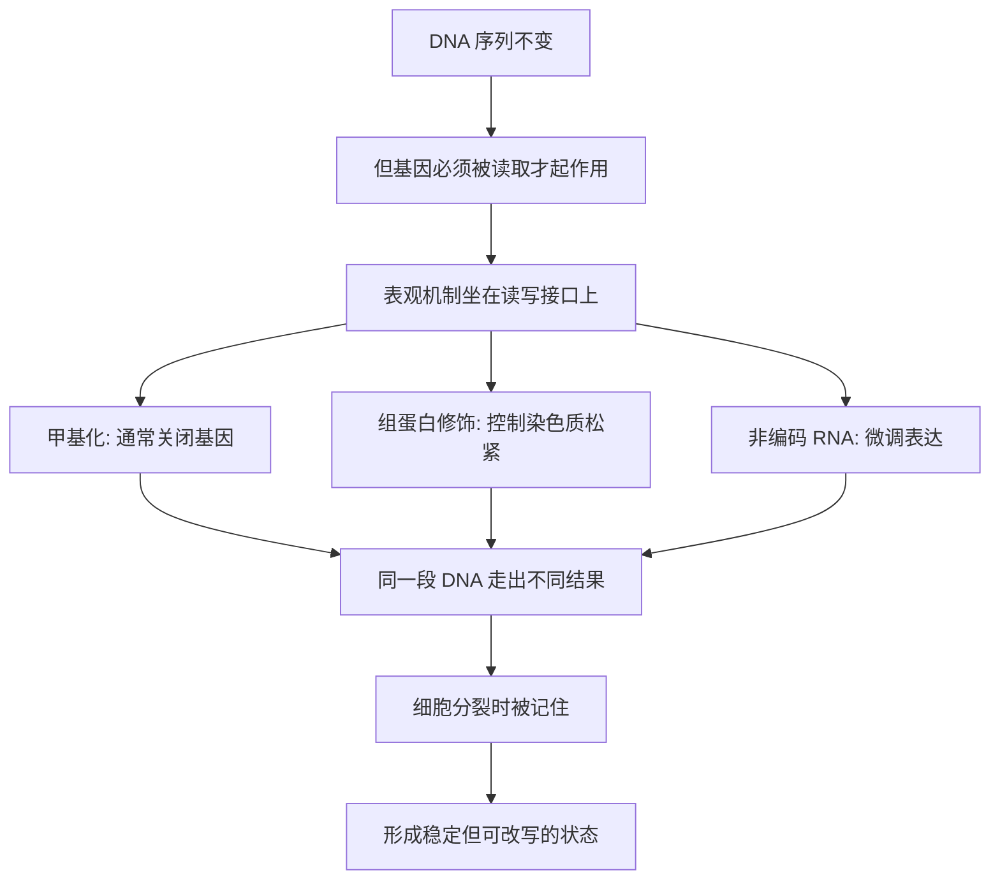

# 02｜什么是“表观遗传”？

> “表观遗传”到底在研究什么，它和普通遗传学又有什么不同？

---

## 一、先说结论

内莎·凯里认为，**表观遗传（epigenetics）研究的是一件被传统遗传学长期忽略的事：在 DNA 序列完全不改变的前提下，基因的表达如何被调控，并且这种调控状态还能稳定地传递下去。**

换句话说，普通遗传学关心的是“基因写了什么”，表观遗传关心的是“这些基因什么时候被读、读得多大声、要不要读”。

如果用一个意象来概括：**DNA 序列是乐谱上的音符，表观遗传是演奏方式。** 同一份乐谱，可以演奏出截然不同的音乐。

---

## 二、我们先理解一个问题

先从一个词的构造入手。

“表观遗传”的英文是 epigenetics，前缀 epi- 在希腊语里是“在上面、之外”的意思，gene 是基因，合起来大致是“遗传学之上的学问”。这个命名本身就点明了它的位置：**它不是取代遗传学，而是站在遗传学的上一层。**

那为什么需要这一层？

因为古典遗传学有一个回答不了的问题。按老观念，基因是蓝图，序列决定一切。可现实中我们反复看到：**相同的 DNA，能产生不同的结果。** 同一个基因组，能长出神经、肌肉、免疫等上百种细胞；同卵双胞胎能走出不同的人生。

如果序列就是全部答案，这些现象就说不通。于是，“基因之上还有一层调控”这个念头，就变得必要了。

---

## 三、作者到底提出了什么观点？

凯里在书里把表观遗传的轮廓勾勒得很清楚。她认为，这一层至少包含三类主要机制：

1. **DNA 甲基化**：在 DNA 上贴上化学“小标签”，通常起到让基因沉默的作用；
2. **组蛋白修饰**：DNA 缠绕在组蛋白上，修饰会改变缠绕的松紧，从而决定这段 DNA 是否“可读”；
3. **非编码 RNA**：不编码蛋白质的 RNA 分子，可以微调基因的表达。

凯里强调的关键，不在某一类机制本身，而在它们的共同性质：

- 它们**不改变基因序列**；
- 它们**决定基因是否表达、表达多少**；
- 它们**可以随发育、环境和经历变化**；
- 同时，它们又**具有一定的稳定性**，能在细胞分裂中被“记住”并传下去。

前三点让“可塑”成为可能，第四点让“遗传”这个词名副其实。缺了任何一半，表观遗传都不成立。

---

## 四、把这个观点翻译成人话

忘掉分子细节，先听一段音乐。

想象你手里有一份**乐谱**。乐谱上印着固定的音符，印出来就不再变化——这就是 DNA 序列。它是信息，是底稿，是死的。

可乐谱不会自己响。它必须被**演奏**。而演奏是活的：

- 用**快板**还是**慢板**，是演奏者的决定；
- 每个音是**强**还是**弱**，是演奏者的决定；
- 某个段落要不要**反复**，要不要**留白**，同样如此。

现在把同一份乐谱，交给不同的乐队。

一支军乐团会把它吹成进行曲，铿锵、整齐、响亮；一支爵士三重奏会把它改成摇摆的即兴；一位母亲则可能把它哼成摇篮曲，缓慢、轻软、几乎睡去。

**乐谱一个字都没改，音乐却完全是三首曲子。**

这就是表观遗传做的事。基因序列是那份乐谱，甲基化和组蛋白修饰是演奏者的手——它们决定这段旋律到底以什么方式被听见。

---

## 五、为什么会这样？

把凯里的思路理成一条链：

关键在 **B → C** 这一跳。

基因不会自动开工。它要先被转录，才能变成 RNA，再变成蛋白质。而“转不转录、转录多少”，正是表观机制的岗位所在。它像一道闸门，坐在 DNA 和细胞之间。

有了这道闸门，两件原本矛盾的事就同时成立了：**为什么同一个基因组能造出不同细胞，为什么同一份序列能被环境改写。** 前者靠闸门的稳定，后者靠闸门的可调。

---

## 六、举一个现实生活中的例子

回到乐谱这个比喻，但换成一个你我都能遇到的场景。

同一首民歌，在不同歌手的嘴里，就是不同的歌。

一位老民歌手唱它，用的是方言、拖腔，尾音颤着，像隔着山喊话；一位流行歌手唱它，配上了鼓点和合成器，副歌反复，情绪推到最高；一支儿童合唱团唱它，节奏规整，声音干净，像清晨的操场。

歌词一个字没变，旋律骨干也没变，可你听到的已经是三首不同的作品。听众甚至会争论：谁的版本才是“真正的这首歌”。

而答案其实是——**版本之争本身，就是这个版本的秘密。**

把民歌换成基因，把歌手换成细胞或环境，一切都对上了。DNA 序列是那首歌的谱子，而甲基化、组蛋白修饰就是每一位演唱者处理它的方式。同一份谱子，被“唱”成了多少种曲风，身体里就有多少种细胞、多少种状态。

---

## 七、回到书中重新理解

理解了这一层，再看凯里为什么要把“什么是表观遗传”当作全书的第二块基石，就清楚了。

第一篇讲双胞胎，是在**制造困惑**：序列相同，结果却不同。而这一篇，是在给出那个让人松一口气的**答案**：因为序列之上还有一层调控，它可读可写、可稳定可改变。

一旦这层被立起来，后面的整本书就都有了地基：细胞分化是这层被差异化地“演奏”，细胞记忆是这层的稳定传递，印记与 X 失活是这层的特殊案例，环境与疾病是这层被改写后的后果，克隆与重编程是这层被整体翻写。

所以说，表观遗传不是一个新名词，而是一把**新钥匙**。它开的门，通向的是整本《遗传的革命》。

---

## 八、这个观点背后还有什么？

**第一，它区分了“序列信息”和“表达信息”。** 生命的信息不止一套，我们过去只读了其中一半。

**第二，“表观”不排斥“遗传”，而是扩展了它。** 凯里强调的“稳定传递”意味着：开关一旦被设定，是能被子细胞继承的，这让细胞身份得以维持。

**第三，它天然是“可逆”与“稳定”的张力。** 表观状态既要在发育中稳住，又要在需要时被改动，这种平衡本身就是生命的关键设计。

**第四，它把环境请回了生物学。** 在表观视角下，营养、压力、经历都不是背景板，而是能坐进闸门操作台的力量。

**第五，它给技术留了接口。** 既然开关能被写入，就也可能被“重写”——克隆、干细胞、药物，都建立在这个接口之上。

---

## 九、这个观点有问题吗？

有，而且这一篇尤其要小心，因为“表观遗传”是全系列最容易被人夸大的概念。

**第一，“遗传”这个词有争议。** 在细胞层面，表观标记确实能随分裂传递，这是相对清楚的；但要说它能像基因那样“遗传给下一代个体”，则证据要弱得多。关于这一问题，学界存在不同解释，名词的用法本身也不统一。

**第二，媒体常把它浪漫化。** “意念改变基因”“想瘦就瘦”“经历一定写进血脉”这类说法，多数是对严谨研究的过度延伸，甚至干脆是误读。

**第三，机制与结果之间常差一环。** 我们能观察到“标记变了”和“状态变了”，但要证明“就是这一个标记导致了那个结果”，在人类研究中非常困难。

**第四，它仍是一门年轻的学科。** 定义在演化，边界在争论，很多结论还处在“尚未定论”的阶段。

**所以更准确的说法是**：表观遗传是一个真实、机制清楚、意义重大的调控层，它确实补上了旧遗传学缺少的那一半；但它的能力有明确边界，远没有到“可以随意改写命运”的程度。

---

## 十、今天再看这个观点

以下部分是这一概念的现代延伸，不是凯里的原话。

今天，“epigenetics”已经成了一个横跨科研与商业的热词。一方面，它确实推动了癌症研究、干细胞技术和药物开发；另一方面，它也频繁出现在保健品、身心灵课程和健康自媒体的营销话术里，成为一句万能的解释。

这种“一半科学、一半神话”的处境，本身就是最好的提醒：**一个概念越流行，越需要回到它的原始定义和证据边界去看。**

具体来说，当你再看到“表观遗传”四个字时，可以先问三个问题：它到底说的是细胞层面的稳定传递，还是个体层面的跨代遗传？它拿出的证据是机制实验，还是相关性观察？它讲的是“可能影响”，还是被偷换成了“必然决定”？问完这三句，很多鼓吹就会自己褪色。

---

## 十一、这一篇真正应该记住什么？

1. **表观遗传研究的是“序列不变，表达可变”。** 它管的是基因读不读、读多少，而不是基因写了什么。
2. **它有明确的分子机制。** DNA 甲基化、组蛋白修饰、非编码 RNA 是三个主要抓手。
3. **它既要“可塑”，又要“稳定”。** 前者让它能回应环境，后者让它能形成细胞记忆。
4. **乐谱与演奏是它最好的比喻。** 同一份谱子能奏出不同音乐，正如同一段 DNA 能走出不同结果。
5. **它是最容易被夸大的概念之一。** 认同它的重要性，同时守住它的证据边界，才是负责的读法。

---

## 十二、留一个问题

> 如果 DNA 只是一份不会出声的乐谱，
> 而真正在响的，是此刻正被演奏的那部分，
> 那么你的身体里，
> 此刻正在响的旋律，
> 有多少是你听得见的，又有多少是你从未留意过的？

---

**下一篇**：既然基因只是一份乐谱，命运就不是刻在纸上的音符——可为什么我们从小又被教导“有什么基因就注定得什么病”？这句话到底错在哪里，又对在哪里？

下一篇我们就来拆开这个问题——**为什么说“基因不是命运”？**
