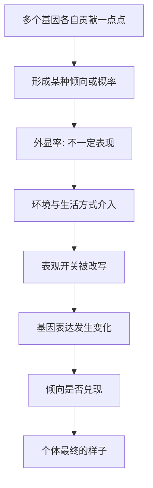

# 03｜为什么说“基因不是命运”？

> 如果有了某种基因就一定会得病，那“基因不是命运”这句话又从何说起？

---

## 一、先说结论

凯里认为：**对绝大多数性状和常见疾病来说，基因提供的是一种“倾向”，而不是一份“判决”。** 它决定你有没有可能、可能性有多大，但最终是否兑现，还要看环境、生活方式和表观调控。

她并不否认少数情况下“一个基因定生死”——某些单基因病确实如此。但更普遍、也更贴近我们生活的真相是：**基因与环境的复杂互动，才是常态。**

---

## 二、我们先理解一个问题

先看一个几乎人人都有的直觉。

我们从小听过太多这样的说法：“这个家族有高血压”“那家有糖尿病”“某某基因是致癌的”。说多了，就形成一个印象：**身上带着某个基因，就等着某天发病。**

这个印象并不完全是空穴来风。确实有一类疾病是“单基因”的：只要那一个基因出了特定问题，几乎必然患病，和环境关系不大。

但麻烦在于——把这种“少数情况”推广到“所有情况”，就错了。为什么同样携带“风险基因”，有人一辈子没事，有人却早早发病？如果不解开这个矛盾，“基因不是命运”就只是一句口号。

---

## 三、作者到底提出了什么观点？

凯里给出的答案，可以拆成四层：

第一，**大多数性状是“多基因”的。** 身高、体重、血压、智力倾向、常见慢病，都不是一个基因说了算，而是成百上千个基因各自贡献一点点。

第二，**基因的作用往往通过“外显率”体现。** 携带某个变异，不等于一定表现；它只改变概率。

第三，**基因与环境存在交互作用。** 同一个基因型，在不同环境下可以走出不同结果；反过来，同样的环境，对不同基因型的人影响也不同。

第四，**表观调控是这种交互落地的地方。** 环境不是隔着基因起作用，而是通过甲基化、组蛋白修饰这些开关，直接改变“哪些基因被读”。

用一句话概括：**基因给范围，环境定落点。**

---

## 四、把这个观点翻译成人话

把基因想象成**发到你手里的一副牌**。

牌是既定的，你没法换牌——这就是你的基因组。但打出什么结果，既取决于牌本身，也取决于你怎么打、对手是谁、桌面是什么局势。**高手拿一手普通牌也能赢，庸手拿一手好牌也能输。**

再换个说法：基因不是给你一个**确定的数字**，而是给你一个**区间**。

以身高为例，基因大致决定了你能长的“上下限”——比如一对父母都不高，孩子的基因就给出了一个偏矮的可能范围；但这范围里到底落在哪一点，还要看营养、睡眠、疾病、运动。区间由基因划定，落点由生活填上。

这种“区间思维”，正是理解“基因不是命运”的钥匙。

---

## 五、为什么会这样？

这条链的关键在 **C 与 D** 之间。

基因给的是概率，概率要变成事实，需要条件。而环境恰恰提供条件：营养够不够、压力大不大、有没有运动、睡得好不好。这些条件通过表观机制，改变基因被读取的方式，从而决定那颗“概率的种子”有没有发芽。

所以“基因不是命运”不是否认基因，而是说：**基因是起点，不是终点；是条件，不是结论。**

---

## 六、举一个现实生活中的例子

先看身高。

一对同卵双胞胎，基因几乎完全相同。如果营养、睡眠、运动条件也接近，他们的成年身高往往非常接近——这正说明身高的确强烈受基因影响。多项研究表明，身高的遗传度相当高。

但把这对双胞胎分开，一个在食物充足、医疗良好的环境长大，另一个在长期营养不良的环境长大，结果就会拉开差距。基因没变，身高变了。**基因给了上限，营养决定能不能够到上限。**

再看近视。

近视同样有明确的遗传成分：父母都近视，孩子近视的风险更高。但近几十年，东亚一些地区的青少年近视率出现了非常快速的上升，快到远非基因库能在两三代里改变的程度。这说明，真正的推手很可能是**环境与生活方式的剧变**——长时间的近距离用眼、户外活动时间减少、学业负担加重。一些研究表明，每天户外活动时间与近视的发生风险相关。

这几乎就是“基因不是命运”的活教材：**同样的基因底子，换一种生活方式，就换一种结局。** 身高与近视这两个例子放在一起，把道理讲透了——它们既有基因的影响，也强烈受环境与生活方式的塑造。

---

## 七、回到书中重新理解

现在回看凯里为什么要在讲完表观遗传之后，专门用一篇来谈“基因不是命运”，顺序就顺了。

前两篇解决的是“有没有基因之上那一层”和“那一层是什么”。到了这一篇，她要回答的是这层机制在**现实中的分量**：既然环境能通过表观开关改写表达，那么“有了某个基因就必然得病”的说法，就失去了普适性。

也就是说，这一篇是把抽象机制落到一个具体的公共认知上。**它要拆掉的不是基因，而是“基因决定论”这堵墙。** 墙一拆，后面关于疾病、环境、亲历如何影响身体的讨论，才能展开。

---

## 八、这个观点背后还有什么？

**第一，它引入了“概率”视角。** 现代遗传学越来越多地谈论风险，而不是判决。这与“基因就是命运”的直觉正好相反。

**第二，它区分了“群体”与“个体”。** 一个基因在人群中平均带来多少风险，和落到某个具体人身上是否发病，是两回事。

**第三，它让“可干预”成为可能。** 如果结果只由基因锁死，干预就无从谈起；正因为有环境和表观这一环，生活方式、筛查和治疗才有意义。

**第四，它给表观机制提供了舞台。** 环境作用于身体，总要有个落地的接口，这个接口就是表观调控。

**第五，它为后面的疾病篇埋了线。** 癌症、精神疾病这些复杂病症，恰恰是“基因给倾向、环境与表观定兑现”的典型。

---

## 九、这个观点有问题吗？

有，而且这一篇特别容易被矫枉过正，需要十分小心。

**第一，“基因不是命运”不等于“基因不重要”。** 这句话常被误解为“只要努力，什么都能改变”。事实上，单基因病是真实的，很多遗传风险也确实显著，否认这一点就是另一种不诚实。

**第二，概率不等于可随意改写。** 表观调控确实能被环境改变，但“能改变”和“能被你按意愿精确改变”是两回事。多数情况下我们改变的是概率，不是结论。

**第三，“外显率”的存在不代表原因不清。** 有时它反映的是多个因素共同作用，有时则只是我们还没识别的其他变量。关于多基因性状的机制，学界存在不同解释，遗传度的高低也常被误读（它并不是“某性状由基因决定的百分比”）。

**第四，对个体的预测能力仍然有限。** 基因检测对少数单基因病很有价值，但对常见复杂疾病，往往只能给出模糊的概率区间。

**所以更准确的说法是**：基因不是命运，但它也不是无关紧要。它划定的是可能性与倾向的边界，而环境、生活方式与表观调控，决定边界内最终的落点。两头都承认，才是完整的图景。

---

## 十、今天再看这个观点

以下部分是这一观点的现代延伸，不是凯里的原话。

如今，普通人花很少的钱就能买到一份“基因报告”，它会告诉你携带哪些“风险变异”，给出各种疾病的相对风险。这既是好事，也是陷阱。

好事在于，它让“概率而非判决”的观念有了具体的载体；陷阱在于，很多人会把它当成绩效考核一样去读：风险高就惶惶不可终日，风险低就继续熬夜抽烟。这恰恰误解了基因报告的含义。

一个更健康的读法是：**把基因报告当作一张“提示卡”，而不是一张“判决书”。** 它提示你在哪些方向值得多留心，而真正决定结局的，仍然是你在漫长日常里反复做出的那些小选择。

---

## 十一、这一篇真正应该记住什么？

1. **大多数性状和常见病是多基因、多因素的结果。** 单一基因定生死是少数情况，不是普遍规律。
2. **基因给的是概率与倾向，不是判决。** 外显率这个概念，就是“有了变异也不一定表现”。
3. **基因与环境存在交互。** 同样的基因，在不同环境下可能是不同结局。
4. **表观调控是环境作用落地的接口。** 环境通过开关改变表达，从而影响倾向是否兑现。
5. **别从“基因决定论”滑向“努力万能论”。** 承认基因的力量，也承认可塑的空间，才是平衡。

---

## 十二、留一个问题

> 如果基因给你的只是区间，是倾向，是一副发好的牌，
> 那么真正决定这局牌输赢的，
> 究竟是那副牌，
> 还是你日复一日，是怎么把它打出去的？

---

**下一篇**：既然一个基因不能决定命运，那更不可思议的问题来了——你身上有几十万亿个细胞，每一个都带着几乎一模一样的基因组，为什么它们能长得如此不同？

下一篇我们就来拆开这个问题——**同一个基因组为什么能长出几百种细胞？**
