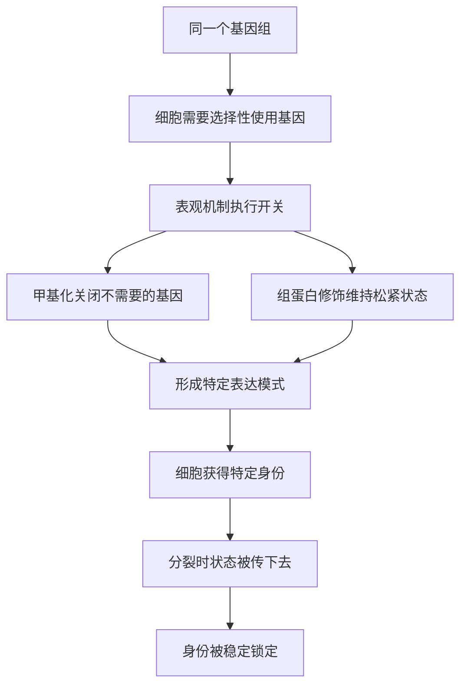

# 04｜同一个基因组，为什么能长出几百种细胞？

> 神经细胞、肌肉细胞、免疫细胞的 DNA 明明一样，为什么会完全不同？

---

## 一、先说结论

凯里认为：**细胞的区别，不在于它们带着哪些基因，而在于它们打开了哪些基因。** 细胞分化靠的正是表观遗传——把不需要的基因永久关掉，把需要的基因保持开启，并且在一次次分裂中把这份“开关状态”传下去。

所以，神经细胞、肌肉细胞、免疫细胞本质上携带着同一份说明书，却因为读了不同的章节，成了完全不同的角色。

---

## 二、我们先理解一个问题

先把这件事的荒谬感摆出来。

想象你打开自己的身体，取出三个细胞：一个来自大脑的神经细胞，一个来自大腿的肌肉细胞，一个正在血液里巡逻的免疫细胞。

神经细胞能传导电信号，肌肉细胞能收缩，免疫细胞能识别并清除病原。它们长得不一样，干的活不一样，连寿命都不一样。

现在去测它们的 DNA——**序列几乎完全相同。**

这就麻烦了。如果 DNA 是蓝图，如果蓝图决定一切，那么拿着同一份蓝图的三栋建筑，凭什么一栋是桥梁、一栋是工厂、一栋是哨所？

问题摆在眼前：**同一份基因组，凭什么长出这么多种细胞？** 不回答它，“基因决定一切”就自相矛盾。

---

## 三、作者到底提出了什么观点？

凯里的回答毫不含糊：**答案是基因的“选择性使用”，而实现这种选择的，是表观遗传。**

具体来说，她的逻辑是这样的：

1. 所有细胞都带着同一个基因组，基因本身不缺不少；
2. 一个细胞不需要用到全部基因——用上全部基因既浪费又有害；
3. 因此，细胞必须对基因做**选择性开关**：该开的开，该关的关；
4. 开关的稳定状态，由 DNA 甲基化和组蛋白修饰来维持；
5. 当这种开关状态在分裂中稳定传递，细胞就“锁定”了身份。

换句话说：**基因是公共的，表达是个人的。** 决定一个细胞是谁的，不是它有什么，而是它正在用什么。

---

## 四、把这个观点翻译成人话

把基因组想象成**一大盒乐高积木**。

积木盒里装的东西是固定的，每个细胞都拿到了完全相同的一盒。可积木本身不会自己拼成东西，关键在**你会拿出哪些积木、拼成什么**。

同一盒积木，可以拼成飞机、可以搭成城堡、可以组装成汽车。三种作品用的可能都是这盒里的零件，但取用的组合完全不同，拼出来的东西也就毫无相似之处。

更妙的是，一旦拼好，这个作品会**稳定地保持下去**：拼成飞机的，之后拆开重拼（分裂）时，还是会拼成飞机的样子。它不是每次重新随机决定一遍，而是把“我是飞机”这件事记了下来。

这个“拿出哪些、拼成什么、并记得住”的过程，就是细胞分化，就是表观遗传在背后做的选择与记忆。

---

## 五、为什么会这样？

关键在 **C → F** 这一段。

开关不是零散的，而是成批地套在基因上，形成一整套“表达模式”。一套模式对应一种细胞身份：神经细胞把神经相关基因打开，把肌肉相关基因关上；肌肉细胞反过来。等这套模式稳定下来，细胞就“知道自己是谁”了。

而 **H → I** 让分化不至于前功尽弃。如果没有稳定的传递，细胞每次分裂都要重新决定一次身份，多细胞生命根本无法维持。

---

## 六、举一个现实生活中的例子

就用同一段 DNA 分出的三种细胞，把这场选择看得具体些。

**神经细胞**：它要长成能传导信号的形状，伸出细长的突起，把电信号一路传出去。为此，它把负责离子通道、神经递质、突触连接的基因打开，同时把负责收缩的肌肉基因、负责吞噬的免疫基因牢牢关上。它一生的主题是“传递信息”。

**肌肉细胞**：它的任务是收缩。于是负责肌动蛋白、肌球蛋白、能量代谢的基因被大量打开，细胞的形态也被重塑成能产生力的结构。而制造神经递质的那批基因，对它毫无用处，被沉默。它一生的主题是“产生力量”。

**免疫细胞**：它的任务不是传导，也不是收缩，而是识别与清除。它把与抗原识别、免疫信号、吞噬或分泌抗体相关的基因打开，把神经和肌肉的整套程序关掉。它一生的主题是“分辨敌我”。

三种细胞，同一份 DNA。**它们之间的区别，几乎全部写在“打开与关闭”的清单上，而不是写在基因本身。**

这就像同一个班的学生，拿到同一本教材：后来成了医生、工程师、教师的那些人，书是一样的，读的章节不一样。

---

## 七、回到书中重新理解

理解了这一层，再看凯里为什么把“细胞分化”放在表观遗传的机制之后来讲，就明白了。

前一篇讲的是表观遗传“是什么”，这一篇讲的是它“最壮观的一次应用”——**把同一份基因组，变成几百种不同的细胞。** 这是表观遗传最日常、最根本、也最不可替代的功绩。

同时，这一篇也自然地引出一个更难的追问：既然每个细胞都是这样被一步步“选”出来的，那么这份选择究竟是从什么时候开始、又按什么顺序发生的？这就把我们引向了下一站——发育。为什么从一颗受精卵开始，这套选择能精确到分毫不差？这也是全书从机制走向“发育程序”的转折点。

---

## 八、这个观点背后还有什么？

**第一，它解释了“细胞记忆”的必要性。** 光分化还不够，还得记住，否则身份会散架。这正是后续要展开的主题。

**第二，它把基因表达变成了“组合”问题。** 细胞的多样，来自组合的多样，而不是基因种类的多样。

**第三，它让“可逆”有了想象空间。** 如果身份由开关决定，那么改一改开关，理论上能否让细胞回到从前？这个问题后来直接催生了克隆与重编程。

**第四，它给“染色质”这个概念留了位置。** 基因组并不是裸露的，它缠在组蛋白上；松紧本身就构成了一层信息。

**第五，它把发育与疾病连了起来。** 如果开关出错，细胞可能忘记自己是谁——这正是癌症等疾病的一条线索。

---

## 九、这个观点有问题吗？

有，而且这一篇最容易把话说满，需要格外注意。

**第一，“每个细胞只打开一小部分基因”是简化说法。** 真实情况远比“开或关”复杂：很多基因是“调量”而不是“开关”，表达水平是连续的，不是二值的。

**第二，分化并不只有表观遗传一份功劳。** 细胞的不对称分裂、外部信号、转录因子的时序作用，都参与其中。把分化全归给甲基化，是一种过度简化。关于分化的完整机制，学界仍有不同解释和正在研究的空白。

**第三，稳定性不能被读成“绝对不可逆”。** 表观状态通常很稳，但并非铁板一块——克隆实验早就证明了成体细胞的身份可以被翻写。所以“锁定”是相对的。

**第四，要警惕把“决定论”从基因搬到表观。** 旧说法是“基因决定你是谁”，新说法若变成“甲基化决定你是谁”，只是换了个主角，仍然丢掉了随机性、环境和动态调控。这种“表观决定论”同样值得怀疑。

**所以更准确的说法是**：细胞的分化确实主要由差异化的基因表达来实现，而表观遗传是维持这种差异的核心机制；但真实的细胞身份是一套动态、多因素、可被扰动的状态，而不是一排干脆利落的开关。

---

## 十、今天再看这个观点

以下部分是这一思路的现代延伸，不是凯里的原话。

今天的单细胞测序技术，让科学家能够把成百上千个细胞一个个“读”一遍，看清每种细胞各自打开了哪些基因，由此绘制出所谓的“细胞图谱”。这项工作，正是凯里那句话的技术版：**要理解一个细胞，就看它在用什么。**

同时，这些图谱也正在应用于再生医学与疾病研究。如果细胞的身份是“一套表达模式”，那么理解这套模式，就有可能在实验室里引导干细胞变成我们需要的细胞类型，比如用来修复受损组织。当然，从图谱到治疗，中间隔着很长的路。

---

## 十一、这一篇真正应该记住什么？

1. **同一个基因组，可以造出几百种细胞。** 差异不在基因本身，而在基因的使用方式。
2. **细胞分化靠“选择性开关”。** 关掉不需要的、开启需要的，是分化的基本逻辑。
3. **表观遗传是执行与维持这套开关的核心机制。** 甲基化与组蛋白修饰是关键工具。
4. **开关状态能被稳定传递。** 这就是细胞身份能维持、能被“记住”的原因。
5. **别用新的决定论替换旧的决定论。** 细胞身份是动态的、多因素的，不是一排干净的开与关。

---

## 十二、留一个问题

> 如果每一个细胞都不是天生的，
> 而是在一次次分裂中，慢慢“选择”成了自己，
> 那么你身体里此刻的每一个细胞，
> 是否都还记得，自己当初是从哪里出发的？

---

**下一篇**：既然细胞身份是这样一步步“选”出来的，那这套选择最初是从哪里开始的？一个人，怎么就从一个受精卵，长成了有心脏、有大脑、有四肢的样子？

下一篇我们就来拆开这个问题——**一个受精卵是怎么变成一个人的？**
