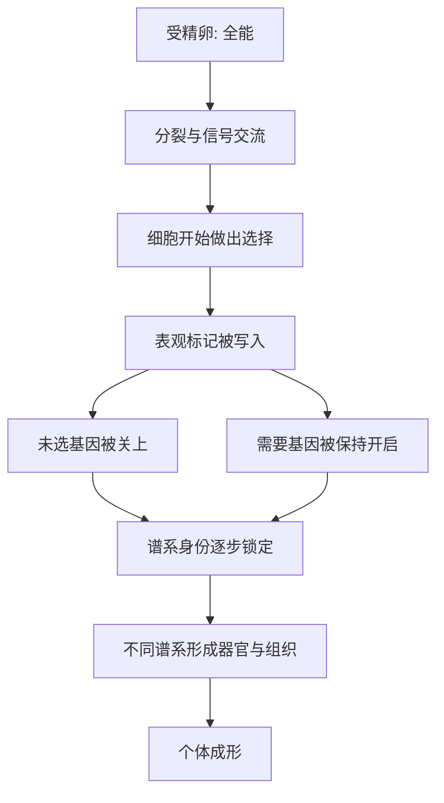

# 05｜一个受精卵是怎么变成一个人的？

> 一个细胞如何一步步长成有器官、有组织的复杂个体？

---

## 一、先说结论

凯里认为：**发育是一套“表观遗传程序”逐步展开的过程。** 从一个受精卵开始，每一次分裂都伴随着新的选择；随着细胞谱系的分离，不同的细胞被赋予不同的表观标记，身份被一步步锁定。

它的奇妙之处在于兼顾了两件相反的事：**既精确**——同一个物种几乎总能长成同一副样子；**又灵活**——环境变化时还能做一定的调整。这是理解表观遗传最壮观、也最直观的一场自然实验。

---

## 二、我们先理解一个问题

先看一个最朴素的奇迹。

你、我、一棵树、一只狗，最初都只是一个细胞。受精卵是那么小，小到肉眼几乎看不见。可它会分裂，一分二、二分四，越分越多。

问题是：**分出来的细胞，怎么就不一样了？**

如果它们只是不停地自我复制，那结果应该是一大团一模一样的细胞。可现实中，这团细胞会分化出心脏、大脑、骨骼、皮肤、血液……几百种细胞、几十个器官，各自出现在该出现的位置、该出现的时间。

更要命的是，这一切几乎没有“图纸”在指挥。细胞们看不见整体，也不知道自己要长成什么。可它们偏偏配合得天衣无缝。**这份没有指挥的精确，究竟从何而来？**

---

## 三、作者到底提出了什么观点？

凯里的回答是：**发育不是被“拼装”出来的，而是被“展开”出来的。** 它的底层，是一套逐步收窄、逐步锁定的表观遗传程序。

这个观点可以拆成几层：

1. **起点是“全能”的。** 受精卵拥有形成完整个体所需的全部潜能。
2. **每一步分裂都在做“取舍”。** 细胞不是保留所有可能性，而是一路放弃一部分、强化一部分。
3. **取舍由表观标记固化。** 甲基化和组蛋白修饰把“我从这里开始就不做某个选择了”记录下来。
4. **表观标记稳定传递。** 一旦某一谱系被设定，它的子细胞大多会沿着同一条路走下去。
5. **整体由局部信号拼合。** 细胞之间相互通报位置与身份，让各自的局部选择拼成完整的身体。

用一句话概括：**发育是一场不断分岔、并把走过的岔路记下来的旅程。**

---

## 四、把这个观点翻译成人话

用一个经典的画面来理解。

想象一个球，要从山坡顶端滚到谷底。山坡不是斜坡，而是有许多**沟谷交错**的地形：越往下走，路越窄，选择越少。

球刚出发时，站在高高的山顶，四面八方都能去——这就是受精卵的**全能性**。随着它往下滚，地形开始把它推向某一条沟谷；一旦滑入某条深沟，它就很难再爬回别的沟里。

这就是一些学者用来描述发育的经典比喻：**发育像一颗球在起伏的地形上滚落，越滚越难回头。**

这个画面同时说清了两件事：为什么发育**精确**——因为沟谷会引导球走向固定的去处；为什么发育**难以逆转**——因为球一旦落进深沟，就很难再回到山顶重新选择。

---

## 五、为什么会这样？

关键在 **C → G** 这一整段。

每一个细胞在每一轮分裂中，都要面对“继续保留可能性”还是“确定走某条路”的选择。选择一旦做出，表观标记就把它固定下来：与这条路无关的基因被关上，需要长期使用的基因被保持开启。随着分化层级一层层加深，可选的空间越来越小，身份越来越清晰。

于是，从一粒全能细胞开始，经过无数次这样的分岔，最终长出了器官、组织和完整的人。

---

## 六、举一个现实生活中的例子

把镜头对准一个人从受精卵到成形的过程。

**最初**，是一个受精卵，一个细胞，拥有形成完整个体的一切潜能。

**接着**，它开始卵裂，一分二、二分四、四分八……数目迅速增加，但它们暂时还都保留着很大的可塑性。到了**囊胚**阶段，细胞已经出现初步的分工：一部分将发育成胚胎本身，一部分将发育成支持它的组织。

**再接着**，是一步关键的分层。胚胎形成**三个胚层**：外胚层、中胚层、内胚层。这三层就像三条主干道，以后几乎所有器官都从它们出发——外胚层给出神经与表皮，中胚层给出肌肉、骨骼、血液和心脏，内胚层给出消化道与肺的内衬。

**此后**，每条干道继续细分：神经细胞开始长出突起，肌肉细胞开始排练收缩，免疫细胞开始学习识别敌我。形态、功能、寿命，越分越清楚。

从一个看不见的细胞，到一颗跳动的心脏、一套能思考的神经系统、一双能握住东西的手——**这中间发生的，主要不是“新增”，而是“选择”与“锁定”。**

---

## 七、回到书中重新理解

到这里，凯里为什么把发育放在“细胞分化”之后，就清楚了。

上一站讲的是“同一份基因组能产出不同细胞”，这一站讲的是“这些不同细胞是怎么在时间中被一步步安排出来的”。前者是空间上的多样性，后者是时间上的程序性。

而这两者其实是一体两面：**分化是横截面，发育是纵向过程。** 没有分化的机制，发育无从谈起；没有发育的顺序，分化就不会精确。

更重要的是，这一篇把此前所有概念串成了一条线：表观遗传是工具，细胞分化是动作，发育是整场演出。而从下一站开始，我们又要往回追问一个更细的问题——当这些细胞各自选定身份之后，它们又是怎么把这份身份，一直牢牢记住的？

---

## 八、这个观点背后还有什么？

**第一，它给出了“未分化”与“已分化”的桥梁。** 干细胞、祖细胞、成熟细胞，其实是同一段程序上的不同阶段。

**第二，它解释了为什么时序这么重要。** 同样的信号，早出现和晚出现，效果可能天差地别。

**第三，它把“环境”引入了发育。** 母体的营养、激素与压力，都能影响这套程序的展开方式。

**第四，它让“重编程”成为可想象的事。** 如果发育是一路关掉可能性，那么把这些关掉的开关重新打开，理论上就能往回走。

**第五，它把发育与疾病连在一起。** 程序若在错误的时间或地点被激活或沉默，就可能带来先天异常或肿瘤。

---

## 九、这个观点有问题吗？

有，而且这一篇尤其要小心“程序”这个词带来的误导。

**第一，“程序”容易让人以为一切都是预先写好的。** 事实上，发育包含大量随机的、被动的、依赖环境反馈的成分，并不是一台严格按脚本运行的机器。一些学者甚至反对用“程序”来形容发育，认为它过于机械。

**第二，“不可逆”这个印象其实被后来的实验打破了。** 克隆羊和诱导多能干细胞都证明，发育的“深沟”并非绝对翻不过去。所以“球滚下去就回不来”这个比喻，只是大致成立。

**第三，表观遗传只是发育故事的一部分。** 基因调控网络、细胞间信号、机械力、细胞位置，都参与其中。把发育的全部神秘都归给表观遗传，是过度归因。

**第四，人类早期发育的证据有限。** 出于伦理，我们很难直接观察人类胚胎发育的每一步，很多认识来自动物模型和体外研究，推论时需要保持谨慎。关于具体谱系如何决定，学界仍有大量未解之谜。

**所以更准确的说法是**：发育确实是一个以表观遗传为核心机制、逐步收窄并锁定身份的过程；但它既非全凭预设、也非完全可逆，而是几率、环境与调控共同织出的动态结果。

---

## 十、今天再看这个观点

以下部分是基于这一思路的现代延伸，不是凯里的原话。

今天，发育生物学正借助单细胞技术和类器官培养，试图把“一个受精卵如何变成一个人”的每一步都拍成一张高清地图。类器官，也就是在培养皿里用干细胞培育出的微型组织，让我们能在体外观察某些器官的早期发育。

这些研究既带来了再生医学的希望，也带来了新的伦理问题：如果我们能越来越精确地模拟甚至操作早期发育，边界该划在哪里？这已经不是纯粹的科学问题，而是一个社会必须共同回答的问题。

---

## 十一、这一篇真正应该记住什么？

1. **发育是从全能到专一的逐步展开。** 起点是受精卵，终点是器官与个体。
2. **每一步分裂都在做选择。** 细胞在保留可能性与锁定身份之间取舍。
3. **表观标记把选择固定下来。** 甲基化和组蛋白修饰是“记账”的方式。
4. **精确与灵活并存。** 发育既稳定又不乏应变，这正是生命的了不起之处。
5. **别把“程序”理解成“预设脚本”。** 发育有随机、被动与环境反馈，并非机械播放。

---

## 十二、留一个问题

> 如果一个人是从一颗看不见的细胞，
> 一路“选择”着长成今天的样子，
> 那么在这条早已走过、却无法重走的路线上，
> 究竟是哪一个岔口，
> 决定了此刻的你，会站在这里？

---

**下一篇**：既然细胞一路都在做选择、锁定身份，可它们要分裂那么多次，为什么皮肤还是皮肤、肝脏还是肝脏？这份“我是谁”的记忆，究竟是怎样被保存下来、又传给下一代的？

下一篇我们就来拆开这个问题——**为什么细胞能“记住”自己的身份？**
