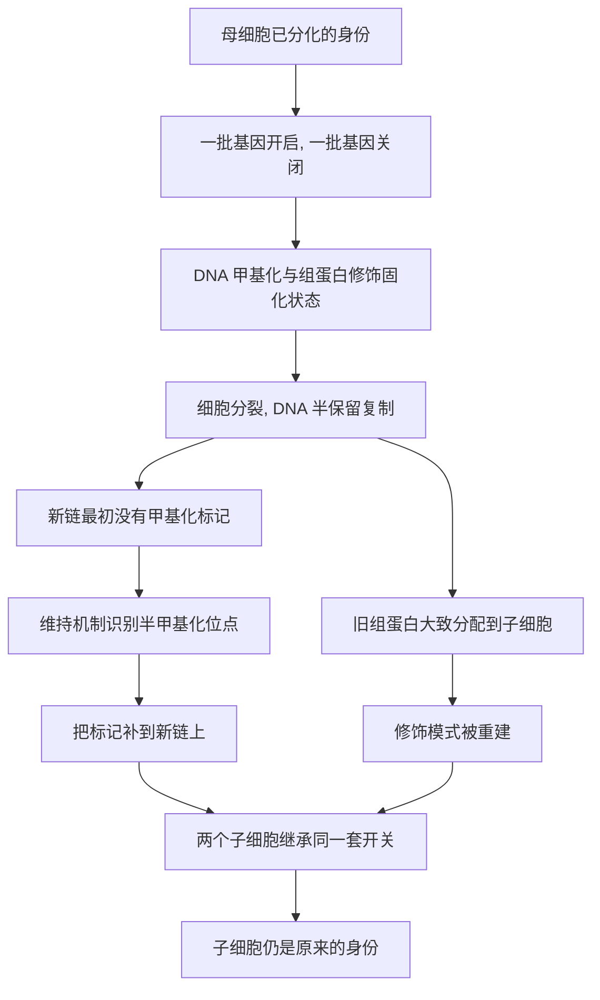

# 06｜为什么细胞能“记住”自己的身份？

> 一个细胞分裂了无数次，为什么长出来的还是它自己——皮肤是皮肤，肝脏是肝脏？

---

## 一、先说结论

内莎·凯里认为，细胞之所以能在无数次分裂之后仍然“做自己”，靠的是一套可以复印、可以继承的分子批注——**细胞记忆**。

DNA 序列本身并不携带“我是肝细胞”这样的说明书。真正把身份固定下来的，是铺在 DNA 之上的表观遗传标记：甲基化和组蛋白修饰。它们在细胞分裂时被大致复制到子细胞里，于是“我是谁”被一代代传了下去。

如果没有这份记忆，多细胞生命根本无法维持：你今天长出的新皮肤，明天可能变成肌肉；一场伤口愈合，可能长出别的组织。**记忆是分化的前提，也是复杂生命的前提。**

## 二、我们先理解一个问题

先看一个再普通不过的场景。

你的皮肤被划破了。接下来几天，伤口处的细胞开始快速分裂，把缺口一点点补上。长好之后，那里还是皮肤——有表皮、有结缔组织，而不是长出一块骨头、一段软骨或者一片神经。

可是，这些填补伤口的细胞，DNA 和你身体里所有细胞完全一样。既然基因内容相同，为什么它们偏偏长成皮肤，而不是别的？

更日常地说：你的肠上皮几天就换一遍，血液细胞每天大量新生，皮肤基底层细胞一生要分裂无数次。每一次分裂，都是一次“抄写”。问题在于——**抄写的时候，怎么保证不抄错身份？** 为什么新细胞不会忘记自己原本该是谁？

顺着这个疑问往下追，你会碰到发育生物学最核心的一道题：一个受精卵如何变出几百种细胞，已经变出来的细胞又凭什么各安其位。

## 三、作者到底提出了什么观点？

凯里提出的核心判断是：**表观遗传不仅负责“当下开关”，还负责“跨代记忆”。**

她认为，细胞分化之所以能稳定，不是因为基因被改写了，而是因为表观标记具备两个关键能力：

1. **可复制**：细胞分裂时，旧链上的标记能被“照抄”到新链上；
2. **可继承**：子细胞继承的不只是 DNA，还有一套关于“哪些基因该开、哪些该关”的批注。

具体来说，机制大致是这样的：

- DNA 复制是**半保留**的，每一条新链最初并不带甲基化标记；
- 细胞有专门的**维持机制**，识别只在一侧有标记的位点，把另一侧补上；
- 组蛋白在复制时被大致分配到两个子细胞，随后被“重建”出相近的修饰模式；
- 一些转录因子还会通过正反馈，把自己维持在一个自我延续的状态里。

于是，一个肝细胞分裂之后，两个子细胞仍然是肝细胞。凯里把这种能力称为**细胞记忆**。她的核心主张可以概括为：**分化不是一次性事件，而是一种被反复重写的状态；记忆让这种状态稳定到足以支撑整个身体。**

## 四、把这个观点翻译成人话

把细胞的身份想象成一本**被反复誊抄的手稿**。

每次抄写时，抄写员不仅抄原文，还抄页边的眉批：这一段要重点读，那一段划掉不看，这里加个书签。日子久了，手稿越抄越多，但“哪些段落要读”的规则被完整保留下来。

细胞分裂就是这样一次誊抄。DNA 是原文，甲基化是“划掉的段落”，组蛋白修饰是“重点标记”。子细胞拿到的，是一份带着全部批注的新抄本。

再换一个比喻：细胞身份像一家**老字号店铺的手艺**。老师傅带新徒弟，教的不只是原料清单，更是“我们家的做法”：火候、手法、什么时候停。徒弟出师再带徒弟，配方没变，手艺也没走样。

**决定细胞成为什么的，不只是它拥有哪些基因，而是它把哪一套做法传了下去。** 这份“做法”，就是细胞记忆。

## 五、为什么会这样？

把机制拆成一条链：

关键在 **E → F → G** 这一跳。

DNA 复制本身只会复制“文字”，不会自动复制“批注”。是维持机制在复制之后把批注补齐，记忆才得以延续。也正因为如此，记忆不是免费的：细胞要投入能量和酶去维护它。一旦维护出错，身份就可能松动——这正为后文谈重编程和疾病埋下线索。

## 六、举一个现实生活中的例子

回到最开始那道伤口。

皮肤受伤后，伤口周围的**基底层细胞**和毛囊里的**干细胞**会被激活，加速分裂，迁移到缺口处把它填满。整个过程结束后，那里的组织仍然是皮肤：表皮在重建，结缔组织在修复，皮肤该有的结构大体都在。

关键在于：这些正在分裂的细胞，并没有因为“正在快速增殖”就改变身份。它们带着基底层细胞的记忆，把“我是皮肤细胞”这套开关状态一次次传给子细胞。所以愈合的结果是皮肤，而不是别的组织。

换个角度想：如果这份记忆失效会怎样？细胞可能开始不按本分行事。这正是研究者长期关注的方向之一——**身份记忆的丢失或错乱，常常与疾病联系在一起。** 换句话说，伤口长成皮肤，看起来天经地义，实际上是亿万年进化打磨出来的一套精密维护机制在背后默默工作。

## 七、回到书中重新理解

现在再回看凯里为什么反复强调“记忆”，就顺了。

细胞分化要回答“同一基因组怎么变出几百种细胞”，而记忆要回答另一半：**变出来之后，为什么能稳住。** 没有记忆，分化就只是一次性的偶然，身体每天都会失去秩序。

更重要的是，记忆这个概念把全书串了起来：

- 它解释了**发育的稳定**；
- 它解释了**克隆**为什么令人震惊——多莉羊说明记忆可以被“抹掉重写”；
- 它也为**重编程技术**和**疾病**埋下伏笔：前者是恢复或改写记忆，后者常常是记忆被破坏。

**表观遗传既能锁定身份，也能被重新打开。** 这一体两面，是全书后面所有故事的底层逻辑。

## 八、这个观点背后还有什么？

**第一，记忆是有分子基础的。** 维持性甲基化和组蛋白的回收与重建，让“批注”能被继承，而不是每次从头再来。

**第二，记忆往往靠正反馈维持。** 某些转录因子会激活自己，把自己的存在变成一种自我延续的状态，这让身份格外稳固。

**第三，记忆与可塑性存在张力。** 成年身体里仍保留了一部分干细胞，它们既要维持身份，又要在需要时分化出新细胞。这种“既稳定又不僵死”的平衡，正是生命的精妙之处。

**第四，记忆不是绝对的。** 凯里也承认，分化状态在某些条件下可以被逆转——否则克隆和诱导多能干细胞都无从谈起。记忆更像“默认继承”，而不是“永世不得更改”。

## 九、这个观点有问题吗？

需要保持平衡。

**第一，细胞记忆是真实、机制清楚、被广泛接受的概念。** 表观标记可以随细胞分裂传递，是主流认识，也是理解发育的基础。

**第二，但它不是绝对的枷锁。** 克隆羊和诱导多能干细胞都证明，高度分化的细胞在合适条件下可以回到更原始的状态。所以“记忆”意味着稳定，不意味着不可逆。

**第三，稳定本身需要持续维护。** 它是一个有能量成本的动态过程，而不是刻在石头上的字。把细胞记忆想象成“一次写死”，并不准确。

**第四，很多证据来自体外实验和动物模型。** 在活体里逐代追踪“记忆如何传递”，技术上非常困难。我们更多看到的是群体层面的稳定性，而不是单个细胞里每一次抄写的全过程。

**所以更准确的说法是**：细胞记忆是一个真实存在、机制逐步清楚的核心概念，它很好地解释了分化的稳定性；但“稳定”是相对的、需要维持的，且随时可能被重编程或破坏。“记住身份”是真的，“永远记住身份”则过了头。

## 十、今天再看这个观点

以下部分是本书思想的现代延伸，不是凯里的原话。

今天，“细胞记忆”已经不只是理论问题，而是再生医学和细胞工程的核心议题。人们想知道：怎样让细胞记住正确的身份，避免在培养或移植中“走样”；又怎样在需要时安全地抹掉记忆，让它变成想要的组织。

单细胞测序和表观基因组图谱，让我们第一次能在单个细胞的尺度上观察这些“批注”的分布。研究者也越来越清楚：细胞记忆不是单一的开关，而是许多标记、许多分子共同维持的一种状态。

对普通人来说，这一篇的现实提醒也许是：**身体的秩序，是每天被默默维护出来的。** 而这种维护一旦被长期扰乱，代价往往要在很多年之后才显现。

## 十一、这一篇真正应该记住什么？

1. **细胞身份靠记忆维持。** 表观标记在分裂时被复制、被继承，“我是谁”才能传下去。
2. **记忆的分子基础是甲基化和组蛋白修饰。** DNA 复制只抄文字，维持机制负责补批注。
3. **记忆是分化的前提。** 没有它，多细胞生命无法维持秩序。
4. **记忆不是绝对的。** 它可以被重编程，也可能出错，这正是克隆、干细胞与疾病故事的入口。
5. **稳定是有成本的。** 它不是静止，而是一种需要持续投入的动态平衡。

## 十二、留一个问题

> 如果每一个细胞都在分裂时“抄写”自己的身份，
> 那么当你受了伤、发了炎、熬了夜，
> 那些被悄悄改动的批注，
> 会不会在你毫不知情的时候，慢慢改写你身体的一部分？

---

**下一篇**：如果说体内所有基因都来自父母各一半，那么还有一类基因更特别——它们甚至“认得”自己来自父亲还是来自母亲，只肯表达其中一份。这究竟是怎么回事？

下一篇我们就来拆开这个问题——**为什么父母给的基因不一样重要**
