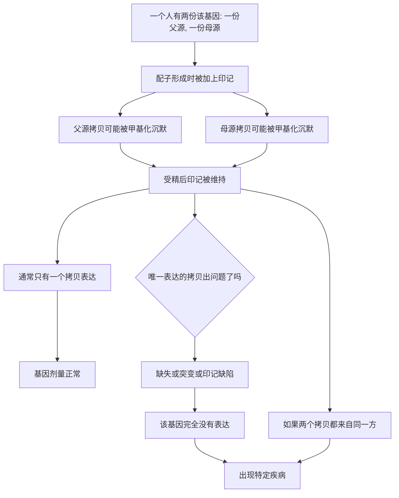

# 07｜为什么父母给的基因不一样重要？

> 同样一段基因，来自父亲和来自母亲，为什么后果可能完全不同？

---

## 一、先说结论

凯里认为，我们习惯以为父母各给一半基因、两份“平起平坐”，但有一小部分基因并非如此：它们被**基因组印记**打上了“出身”的记号，只表达来自其中一方的拷贝。

印记不是 DNA 序列的差异，而是表观差异。它让同样由 A、T、G、C 组成的序列，因为“贴着父方还是母方的标签”而命运截然不同。这套机制一旦出错，就会导致特定疾病，其中最经典的例子，是同一段染色体上的普拉德-威利综合征与安格尔曼综合征。

**它证明：基因的内容重要，“基因从哪来”同样重要。**

## 二、我们先理解一个问题

先看一个反常的现象。

按孟德尔遗传，孩子从父母各拿一份基因，两份理应等价。如果其中一份出了问题，还有另一份顶上。可现实中，有些疾病偏偏不肯遵循这套“备份”逻辑：

同一段染色体，**从父亲那里缺失**，会得一种病；**从母亲那里缺失**，会得另一种病。同样的缺失范围，同样的基因内容，结果却取决于“缺的是哪一边来的那份”。

这就奇怪了：如果两份基因等价，为什么会出现这种“看人下菜碟”的现象？

它指向一个更根本的问题：**基因除了内容，是不是还带着某种关于“出处”的信息？** 而这信息，又是由什么写上去的？

## 三、作者到底提出了什么观点？

凯里的核心判断是：**存在一类基因，它们“记得”自己来自父方还是母方，只表达其中一方。**

这种现象叫**基因组印记**。她强调，印记是表观遗传最有力的证据之一，因为它说明：即使序列完全相同，一段 DNA 也可以因为表观标记的不同，被区别对待。

印记的要点大致是：

1. **印记在配子形成时建立。** 在精子或卵子形成的早期，特定基因会被打上“这是来自父方”或“这是来自母方”的表观标记，通常是 DNA 甲基化。
2. **印记在受精后体细胞中被维持。** 一旦建立，这套标记会在个体一生中大致保持。
3. **结果是一方表达、一方沉默。** 对印记基因而言，通常只有一个拷贝处于开启状态。
4. **因此“剂量”关系重大。** 如果唯一表达的那一份出了问题，就没有备份可以补救。

凯里想借此说明：**序列是信息，表观标记同样是信息；谁来自谁，是可以被细胞“读懂”的。**

## 四、把这个观点翻译成人话

把基因想象成一份**双人签署的合同**。

大多数合同上，两个人的签名同等有效，谁签都一样。但有些合同有特殊条款：**只认某一个签名**。盖了父方的章才算数，盖了母方的章就作废；换成另一类条款，则恰好相反。

再换一个比喻：一场**接力赛**，规则规定某一棒必须由指定的人来跑。赛道上站了两个人，但规则说“这一棒只能由父亲那边的人跑”。如果该跑的人缺席，比赛就直接中断——因为另一个人不被允许上场。

细胞就是这样“读”印记基因的：它不看你有没有这段序列，而是看这段序列身上带着谁的标记。**同样是一段 DNA，贴了谁的标签，就由谁来发言。**

## 五、为什么会这样？

把机制拆成一条链：

关键在 **E → F → H** 这条线。

印记机制把“备份冗余”变成了“单点依赖”。正常情况下，一份表达、一份沉默，剂量刚刚好。可一旦唯一在工作的那一份缺失、突变，或者印记本身出了错——比如本该沉默的一份也沉默了，或者两个拷贝都来自同一方——基因就彻底失声，疾病随之而来。

## 六、举一个现实生活中的例子

最好的例子是第 15 号染色体上一段区域的两种疾病。

这段区域里，有些基因**只在父源拷贝上表达**，另一些基因**只在母源拷贝上表达**——同一条 DNA，两侧各有各的“负责片段”。于是：

- 如果缺失的是**父源**的那一份，或者孩子从母亲那里得到了两份、没有父亲的贡献，那么本该由父源表达的基因沉默缺失，会表现为**普拉德-威利综合征**：婴儿期肌张力低、喂养困难，之后出现食欲亢进、肥胖倾向和发育迟缓；
- 如果缺失的是**母源**的那一份，或者孩子从父亲那里得到了两份，那么本该由母源表达的基因受到了影响，会表现为**安格尔曼综合征**：严重的智力障碍、运动与平衡问题、容易发笑的表情，以及癫痫等表现。

**同一段染色体、同样的缺失范围，只因为“缺的是爸爸那份还是妈妈那份”，疾病就完全不同。** 这是基因组印记最直观、也最令人印象深刻的证据。

## 七、回到书中重新理解

现在再回看凯里为什么把印记单独放进一个部分，就明白了。

它要说明的是：**表观信息与序列信息同样关键。** 一个基因组里既写着“有什么”，也写着“谁来说”。这与前面讲的分化、细胞记忆是同一套逻辑——细胞靠表观标记区分“该读不该读”，而印记把这种区分用在了“来自谁”这件事上。

同时，印记也提醒我们：**“有两份基因”不等于“有两份保障”。** 对普通基因，冗余可以缓冲；对印记基因，冗余恰恰被机制主动取消了。

## 八、这个观点背后还有什么？

**第一，印记基因为数不多，但影响不小。** 凯里指出，人类被确认的印记基因数量有限，但它们往往与生长、发育、代谢等关键过程相关。

**第二，进化上有一个有吸引力的假说。** 一些生物学家认为，印记的由来可能与父母双方“对后代资源投入”的利益分歧有关：一方的基因倾向让胎儿多索取营养、长得更大，另一方的基因则倾向节制。这个假说被称为亲缘冲突假说，它解释了为什么不少与生长相关的基因会被印记。

**第三，印记与克隆、辅助生殖存在交集。** 由于印记需要在配子和早期胚胎中正确重建，任何干扰这一过程的环节，都可能带来印记异常的风险，这是研究和临床都在留意的问题。

**第四，印记与疾病也存在关联。** 正常沉默的拷贝如果异常“醒来”，属于印记丢失，可能与某些肿瘤相关。

## 九、这个观点有问题吗？

需要保持平衡。

**第一，印记是真实、机制清楚的现象。** 它在分子层面被反复验证，也解释了普拉德-威利与安格尔曼这类经典疾病，是表观遗传学的支柱证据之一。

**第二，但它在基因组中属于少数。** 绝大多数基因并不被印记，父母两份都参与表达。因此不能由此推论“所有基因都看来源”，那是过度推广。

**第三，进化解释仍有争论。** 亲缘冲突假说很有影响力，也有支持证据，但并非所有研究者都认同它能解释全部印记现象。关于“印记为什么进化出来”，学界存在不同解释。

**第四，相关疾病的讨论容易被放大。** 印记异常导致的疾病本身相当罕见，公众传播时有时会被描述得比实际更普遍。

**所以更准确的说法是**：基因组印记是表观遗传里极为精彩、也确实存在的一类机制，它有力地证明了“出处也是信息”；但它是特例而非通则，其进化意义仍在讨论之中。

## 十、今天再看这个观点

以下部分是本书思想的现代延伸，不是凯里的原话。

今天，印记相关疾病已经可以通过**甲基化检测**来帮助诊断：医生不只查序列有没有缺失，还会看这段区域的表观标记是否正常。这正体现了表观信息在临床上的价值。

同时，辅助生殖技术与印记异常之间的关系，一直是学界谨慎关注的话题。研究者也在继续探索印记与疾病、与生长发育之间的联系。

对普通人而言，这一篇的提醒是：**遗传不是简单的“对半分账”。** 同样的基因，因为来自不同的亲人，可能承担完全不同的意义。生命的规则，比我们以为的更讲究“出身”。

## 十一、这一篇真正应该记住什么？

1. **基因组印记让“出处”变成了信息。** 有些基因只表达父源或母源的一份拷贝。
2. **它靠的是表观标记，不是序列差异。** 印记在配子形成时建立，受精后被维持。
3. **冗余被主动取消，单点故障代价巨大。** 唯一表达的拷贝出问题，就会导致疾病。
4. **同一段染色体的两种病，是最好的例证。** 缺父源得普拉德-威利，缺母源得安格尔曼。
5. **但它是特例，不是通则。** 绝大多数基因并不被印记，进化解释也仍有争论。

## 十二、留一个问题

> 如果基因会“记得”自己来自父亲还是母亲，
> 那么在生命最早的那些时刻，
> 究竟是谁，给这些 DNA 一一盖上了“出身”的印章？
> 而这印章，又是如何被后来的每一个细胞读懂并遵守的？

---

**下一篇**：印记讲的是一种“标明出处”的机制。而在染色体层面，还有另一个更戏剧化的例子——雌性明明有两条 X 染色体，却为什么必须随机关掉其中一条？三花猫的毛色斑块，或许是最好的线索。

下一篇我们就来拆开这个问题——**为什么女性的两条 X 染色体要“关掉”一条**
