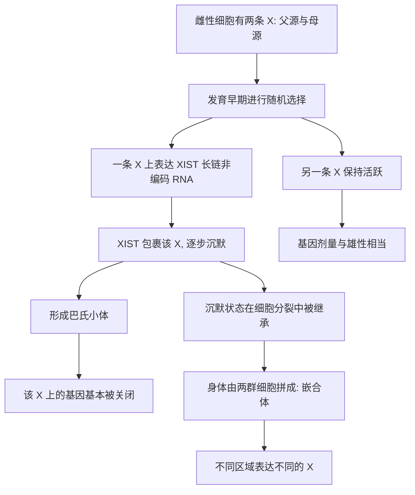

# 08｜为什么女性的两条 X 染色体要“关掉”一条？

> 女性有两条 X 染色体，男性只有一条，为什么女性不会出现“剂量翻倍”？

---

## 一、先说结论

凯里认为，雌性哺乳动物用一种极为巧妙的方式解决了剂量问题：**在每一个细胞里，随机关掉两条 X 染色体中的一条。**

这就是 **X 染色体失活**。它既是一次表观遗传的“关闭”，又因为选择是随机的、关闭状态是稳定遗传的，让雌性身体变成了一幅**嵌合体**——不同区域的细胞，关掉的可能不是同一条 X。

三花猫身上那些橙色与黑色的毛色斑块，正是这个机制最直观、最漂亮的证据。

## 二、我们先理解一个问题

先看一个数量上的矛盾。

在哺乳动物里，雌性是 XX，雄性是 XY。Y 染色体很小，上面的基因很少，大量基因只存在于 X 染色体上，Y 上没有对应版本。

那么问题来了：如果雌性的两条 X 都正常表达，那些只由 X 携带的基因，产量就会是雄性的**两倍**。基因剂量失衡，对细胞来说往往是有害的——许多基因需要精确的“配比”，多出一倍可能打乱整个网络。

可现实是，女性并没有因此出问题。她们既没有“两倍的 X 基因”，也没有明显的生理紊乱。**那么，那多出来的一条 X，去哪了？**

这个问题，正是理解剂量补偿的入口。

## 三、作者到底提出了什么观点？

凯里的核心判断是：**雌性用 X 染色体失活来实现剂量补偿。**

她指出：

1. **每个雌性细胞会在发育早期随机关闭一条 X。** 选中的可能是父源的，也可能是母源的。
2. **关闭是稳定的。** 一旦做出选择，这个细胞及其所有后代细胞都会维持同一个选择——这又回到了细胞记忆。
3. **因此雌性是嵌合体。** 身体由两群细胞拼成：一群表达了父源 X，一群表达了母源 X。凯里用一个比喻说，女性在遗传上是“马赛克”。
4. **沉默的机制很特别。** 一条长链非编码 RNA——**XIST**——会从将被关闭的那条 X 上产生，像一件外衣一样把它包裹起来，逐步让它沉默，最终形成显微镜下可见的**巴氏小体**。

凯里想说明：**X 失活是表观遗传的经典范例**——它不使用序列改变，却能把一整条染色体稳定地“关上”，还能把这种关闭状态一代代传给子细胞。

## 四、把这个观点翻译成人话

把两条 X 想象成**两套并行的供电线路**。

一间屋子只需要一路电。为了不让两路同时供电造成混乱，规矩规定：**每间屋子在开工时，随机选一路接通，另一路封存。** 选哪一路不重要，重要的是只留一路，而且一旦选定，就再也不改。

再换一个比喻：两位同名的**值班医生**，一位来自父方，一位来自母方。每个科室只能留一位在岗。抽签决定谁上岗，抽完之后这位医生就一直在这个科室干到退休，而他的“接班人”也沿着同一套安排走下去。

因为抽签是在胚胎很早的时候、在每一群细胞里各自进行的，**身体不同部位可能留下不同的人值班**。这就产生了一个奇妙后果：如果两位“医生”的处方略有不同，身体就会呈现出斑块状的差异——这正是三花猫毛色的由来。

## 五、为什么会这样？

把机制拆成一条链：

关键在 **B → C → D** 这一跳。

选择是随机的，但执行是彻底而稳定的。XIST 像一把总开关，把整条染色体从活跃状态切换成沉默状态；而前面讲过的细胞记忆，则保证这个切换一旦发生，就会在后续所有分裂中被继承。**随机加上稳定，两个条件合在一起，才能造出嵌合体。**

## 六、举一个现实生活中的例子

看一下三花猫，也叫玳瑁猫。

猫的毛色与 X 染色体有关：**橙色基因位于 X 染色体上**。一只母猫如果同时携带一个“橙色”版本和一个“黑色”版本，她的每个色素细胞就会随机关闭一条 X：

- 关闭携带橙色等位的那条 X，细胞就呈现黑色；
- 关闭携带黑色等位的那条 X，细胞就呈现橙色。

由于关闭是随机且稳定的，这些细胞各自分裂、扩增，形成了**一块块橙色和黑色的毛色斑块**。那些斑块不是染色染上去的，而是“哪条 X 被关掉”在地图上的可见投影。

这也解释了为什么三花猫几乎都是母猫：公猫只有一条 X，通常只能带一种毛色版本。极少数的三花公猫，通常是因为染色体数目特殊，多了一条 X。

**三花猫的每一块斑，都是一次随机的表观决定。** 这是 X 失活最漂亮、最日常的证据。

## 七、回到书中重新理解

现在再看凯里为什么把 X 失活和印记放在同一部分，就顺了。

它们都是“表观信息决定基因命运”的例子：印记说明了“来自谁”可以被读懂，X 失活则说明“整条染色体”可以被整体关闭。两者都依赖甲基化、非编码 RNA 和染色质状态，也都要靠细胞记忆在分裂中维持。

而且 X 失活比印记更进一层：**印记是单基因层面的“出身标记”，X 失活是整个染色体层面的“剂量调节”。** 一个揭示“出处”，一个揭示“平衡”，共同说明表观遗传在基因组尺度上的力量。

## 八、这个观点背后还有什么？

**第一，失活并非百分之百彻底。** 研究表明，被关闭的 X 上仍有部分基因“逃逸”失活，继续表达。这可能是男女在某些性状和疾病易感性上存在差异的原因之一。

**第二，选择可以出现偏斜。** “随机”是总体规律，但个别个体的失活选择可能偏向某一条 X，这会影响携带某些 X 连锁变异的女性是否出现症状、症状有多重。

**第三，胎盘与胚胎的模式不同。** 研究发现，在某些组织的早期发育中，父源 X 会被优先失活，这与通常讲的随机选择并不完全一样，说明机制比经典描述更复杂。

**第四，X 失活体现了非编码 RNA 的调控。** XIST 是“RNA 调控基因”的经典案例，它让研究者看到，RNA 不只是信使，也能直接参与基因组的开关。

## 九、这个观点有问题吗？

需要保持平衡。

**第一，X 失活的总体框架是清楚的、被广泛接受的。** 它是一种真实存在的剂量补偿机制，巴氏小体和 XIST 都有明确的实验支持。

**第二，但“完全随机”是简化。** 选择可以偏斜，失活也不彻底，部分基因会逃逸。把它讲成“精确的一半一半”并不准确。

**第三，“嵌合”与疾病之间的因果细节仍有讨论。** 研究者知道女性是嵌合体，但要精确说明这种嵌合如何在具体疾病中起作用，往往并不容易。

**第四，物种之间并不完全相同。** 三花猫是极好的直观例子，但不同哺乳动物的 X 失活时间、方式和逃逸程度各有差异，不能一概而论。

**所以更准确的说法是**：X 失活是表观遗传里机制清楚、证据充分的核心现象，它解释了剂量平衡和雌性嵌合；但“随机失活、彻底沉默”是一个有用而不完美的概括，真实过程包含偏斜和逃逸，细节仍在研究中。

## 十、今天再看这个观点

以下部分是本书思想的现代延伸，不是凯里的原话。

今天，X 失活仍是理解性别差异、X 连锁疾病和女性健康的重要线索。为什么有些携带致病变异的女性症状轻微甚至无症状？部分答案就藏在“她关掉的是哪一条 X”里。

XIST 也吸引了工程化的兴趣：既然它能让一整条染色体沉默，研究者就在探索能否用它来处理染色体数目异常带来的问题。这类工作目前仍处于早期探索阶段，距离临床应用还有很长距离。

对普通人来说，这一篇最直观的收获或许是：**你身体里的每一个细胞，都在做选择。** 只不过这些选择发生在你出生之前，安静得几乎听不见，却写进了你身体的花纹里。

## 十一、这一篇真正应该记住什么？

1. **X 失活是剂量补偿机制。** 雌性随机关闭一条 X，让 X 基因产量与雄性相当。
2. **选择随机，执行稳定。** XIST 包裹并沉默被选中的 X，形成巴氏小体，靠细胞记忆传给子细胞。
3. **随机加稳定，造出嵌合体。** 雌性身体由表达不同 X 的两群细胞拼成。
4. **三花猫是经典证据。** 毛色斑块是“哪条 X 被关闭”的可见地图。
5. **但并非完全随机、也非彻底沉默。** 存在偏斜和逃逸，物种间细节也不同。

## 十二、留一个问题

> 如果在你身体里，每一个细胞都曾随机关掉一条 X，
> 那么此刻的“你”，
> 究竟是由多少群各自做出不同选择的细胞，
> 悄悄拼凑出来的？

---

**下一篇**：X 失活告诉我们，基因可以被安静地关掉。但如果关闭它的不是随机的抽签，而是环境——战争、饥荒、压力——那么历史会不会真的写进身体里？

下一篇我们就来拆开这个问题——**环境如何改变你的基因“开关”**
