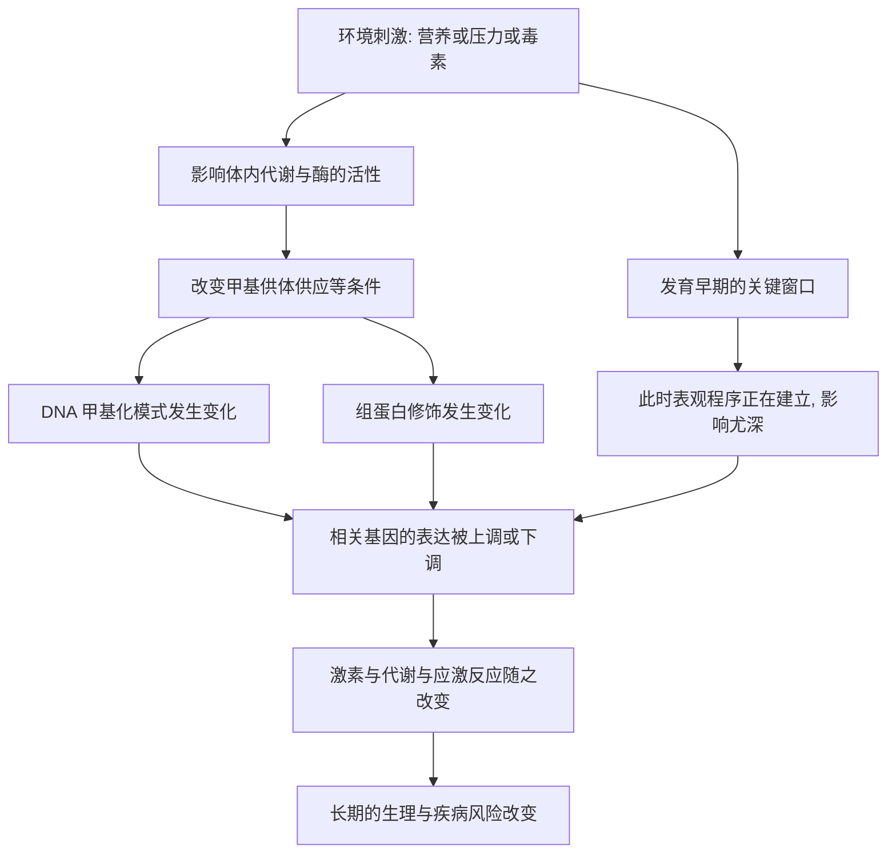

# 09｜环境如何改变你的基因“开关”？

> 饮食、压力、经历，真的能改写基因的开关吗？荷兰“饥饿冬天”给出了一份沉重的证据。

---

## 一、先说结论

凯里认为，**环境能够作用于表观遗传，改变基因的开关**。营养、压力、毒素这类外部条件，可以通过甲基化和组蛋白修饰影响基因表达，把“外面的世界”写进身体内部。

其中最经典的人类证据，是荷兰的“饥饿冬天”。同一场饥荒，因为发生在不同人的不同人生阶段，留下了不同的健康烙印——有人成年后更易肥胖和心血管疾病，有人却表现出另一种模式。

**同一段历史，在不同时间里进入身体，结果并不相同。** 这提醒我们：环境写入基因的方式，讲究“时机”。

## 二、我们先理解一个问题

先看一个看似矛盾的问题。

环境是“外面”的，基因是“里面”的。外部条件凭什么影响内部？更费解的是：如果一个人只是在胎儿期经历过几个月的饥饿，为什么几十年后，他的健康风险还会与别人不同？

而且，饥饿对不同人的影响并不一样：有人因此更容易发胖，有人反而更瘦。为什么**同样的坏事，会留下不同的结果**？

这就引出两个关键疑问：**第一，环境通过什么通道进入基因调控层？第二，为什么“什么时候经历”比“经历了什么”还要重要？**

## 三、作者到底提出了什么观点？

凯里的核心判断是：**表观遗传是环境作用于基因的接口。**

她认为：

1. **环境能改变表观标记。** 营养状况、压力激素、污染物等，可以影响甲基化和组蛋白修饰，从而改变基因的开关。
2. **影响往往发生在“关键窗口”。** 发育早期，尤其是胎儿期和婴幼儿期，细胞正在大量分化，表观程序正在建立，此时环境的影响可能格外深远。
3. **同一刺激在不同阶段，后果可能不同甚至相反。** 在胎儿早期遇到饥荒，和在胎儿晚期遇到饥荒，身体的“应对策略”不一样，留下的长期烙印也不一样。
4. **因此环境不是被动背景，而是主动力量。** 它能在生物学层面留下长期的、可测量的痕迹。

凯里想说明的是：**基因没有被改掉，但基因的“用法”被改掉了——而这一改，可能会持续一生。**

## 四、把这个观点翻译成人话

把身体想象成一栋**带智能线路的房子**。

房子建成时的布线（基因序列）是固定的，不会因为天气改变。但天气、季节、用电习惯会影响哪些开关被打开、哪些灯亮多久。长期住在阴冷的房子，和住在阳光充足的房子，同一套线路会呈现出完全不同的运行状态。

再换一个比喻：同一批**种子**，种在不同的土壤里。土质、光照、水分不同，长出来的植株高矮、开花时间、果实多少都可能不一样。种子里的遗传信息没变，变的是“哪些信息被表达出来”。

**环境不会改写你的基因，但会改写你的基因如何被使用。** 而且，如果这种“改写”发生在种子刚发芽的时候，影响往往会跟随它一生。

## 五、为什么会这样？

把机制拆成一条链：

关键在 **A → B → C → F** 这条通道，以及 **I → J** 这个时间条件。

环境不是直接伸手去改 DNA，而是通过代谢、激素、酶活性这些中介，间接改变甲基化与组蛋白状态，进而改变基因表达。而**发育早期**之所以关键，是因为那时表观程序正在被建立，写入的内容更容易被长期保留下来。

## 六、举一个现实生活中的例子

来看荷兰的“饥饿冬天”。

1944 到 1945 年的冬天，第二次世界大战末期的荷兰西部遭遇严重饥荒：配给急剧下降，食物极度短缺，许多人长期处于半饥饿状态，造成大量死亡。

战后，研究者据此建立了出生队列，长期追踪那些在母亲怀孕期间经历过饥荒的人。研究表明，**暴露的时间点非常关键**：

- 在**孕早期**——胎儿器官与表观程序正在建立时——经历饥荒的人，成年后肥胖、心血管疾病、2 型糖尿病等风险偏高；
- 在**孕晚期**——胎儿主要在增重时——经历饥荒的人，出生体重往往偏低，而成年后的肥胖风险反而相对较低。

在表观层面，一些研究者在几十年后检测这些人的 DNA 甲基化，发现与未暴露者相比，某些基因（例如与生长相关的 IGF2）区域的甲基化水平存在差异。

需要强调：这是**观察性研究**，提示的是相关关系，而不是被完全证实的因果链。但它提供了一个极为罕见的机会——**一场历史事件，被记录进了生物学**。

## 七、回到书中重新理解

现在再看凯里为什么把环境放在这么重要的位置，就明白了。

前面的分化、记忆、印记、X 失活，讲的都是“身体内部的程序如何运行”。而这一篇要回答的是：**这套程序为什么会被外部世界扰动？**

凯里反复强调的“可塑性”，在这里有了具体的分量：身体不是一台与外界隔绝的机器，它会根据环境的信号调整自己的表达模式。这种调整在短期内可能是适应性的——**但它也可能为长远的健康埋下代价**。饥饿冬天里“早期挨饿、成年易胖”的现象，正是这种“适应与代价并存”的写照。

## 八、这个观点背后还有什么？

**第一，可塑性可能是有代价的。** 如果一个人在发育早期“预判”自己将生活在一个食物匮乏的世界，身体会调整代谢策略；如果长大后食物充足，这套策略就可能变成负担。

**第二，它把“环境”从背景变成了机制。** 环境不再只是生活条件的描述，而是能进入基因组调控层的实际力量。

**第三，它为“发育起源与健康”提供了线索。** 为什么同一个人的健康风险，会与他在胎儿期的经历有关？表观遗传给出了一种可能的机制解释。

**第四，它也埋下了“能否传给下一代”的伏笔。** 如果环境能改写开关，那么这些改动会不会影响后代？这是一个引人入胜、但远比看上去复杂的问题。

## 九、这个观点有问题吗？

需要保持平衡。

**第一，饥饿冬天的证据是真实的、有价值的。** 它罕见地记录了人类遭遇极端环境后的长期健康影响，也提示了暴露时机的重要性。

**第二，但它属于观察性研究。** 队列中的人除了饥荒，还同时经历了战争、贫困、医疗条件差、社会动荡等因素，很难把这些影响完全分开。相关不等于因果。

**第三，效应通常不大。** 研究提示的是群体层面的风险变化，而不是“某个在饥荒中出生的人一定会得某种病”。个体差异很大。

**第四，甲基化往往是几十年后测量的。** 我们无法确定这些差异是当年就写上去、还是一生中逐渐形成的，时序问题始终存在。

**第五，部分发现并未被稳定重复。** 在表观基因组流行病学中，不同研究之间结果不完全一致是常见现象，需要更多证据。

**所以更准确的说法是**：环境能够影响表观状态，这一点有相当充分的依据，“关键窗口”的概念也被广泛接受；但具体到某个历史事件如何留下长期烙印，证据仍是相关性的、复杂的，需要谨慎解读。

## 十、今天再看这个观点

以下部分是本书思想的现代延伸，不是凯里的原话。

今天，“环境如何影响基因表达”已经成为营养学、流行病学和表观基因组学交叉的重要课题。研究者试图理解：哪些暴露、在什么阶段、通过什么机制、留下多持久的影响。

但也要警惕一种流行的简化：把“环境能影响基因开关”读成“只要改变生活方式，就能精确控制某个基因”。现实是，环境的作用往往是多基因、微小而累积的，个体层面的预测能力仍然有限。

这一篇最实际的提醒也许是：**我们无法选择自己出生的时机，但可以理解时机如何塑造了我们。** 而对仍在发育中的孩子而言，营养、压力与照护的质量，可能正在写下一些会持续很久的东西。

## 十一、这一篇真正应该记住什么？

1. **环境能作用于表观遗传。** 营养、压力、毒素通过甲基化和组蛋白修饰影响基因表达。
2. **时机至关重要。** 发育早期是关键窗口，同样的经历在不同阶段会留下不同结果。
3. **饥饿冬天是最好的例证。** 孕早期与孕晚期暴露，长期健康影响并不相同。
4. **但这是相关性证据。** 混杂因素多、效应不大、机制链条未完全闭合，需要谨慎。
5. **可塑性既是适应，也可能是代价。** 早期适应的策略，未必适合后来的环境。

## 十二、留一个问题

> 如果一场发生在母亲肚子里的饥荒，
> 可以在几十年后仍然写在你的身体里，
> 那么今天你正在经历的压力、饮食与作息，
> 又正在为未来的哪一段人生，悄悄铺路？

---

**下一篇**：环境能改变基因开关，这套逻辑一旦用在疾病上，问题就变得尖锐了——癌症，真的只是基因突变造成的吗？如果说癌细胞是“用错了开关”，那我们又该如何理解它？

下一篇我们就来拆开这个问题——**表观遗传如何参与癌症**
