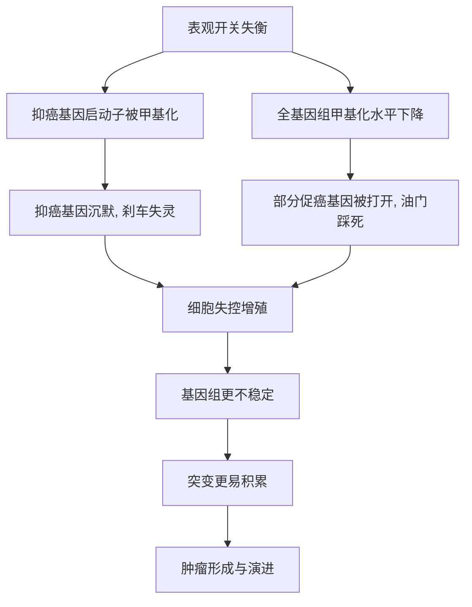

# 10｜表观遗传如何参与癌症？

> 癌症只是"基因坏了"吗？表观遗传又在这一过程中扮演了什么角色？

---

## 一、先说结论

内莎·凯里想让我们修正一个流行已久的印象：癌症并不只是"基因拼错了字"。

在她看来，细胞里其实有两套可以被搅乱的信息：一套是 DNA 序列本身，另一套是写在序列**之上**的调控开关——甲基化、组蛋白修饰。**很多肿瘤中，问题的关键不是某个基因坏掉了，而是它被错误地打开或关闭。** 本该站岗的抑癌基因被甲基化关掉，本该沉默的促癌基因却被打开，细胞于是失去刹车、猛踩油门。

凯里认为，正是这层"开关错误"，解释了不少单纯用突变说不通的现象，也为治疗打开了一条新路。

---

## 二、我们先理解一个问题

先看两个让人别扭的事实。

第一，有些肿瘤里，研究者翻遍常见的癌基因和抑癌基因，却找不到一个明确的序列突变。按"癌症等于基因突变"的说法，这几乎无法解释。

第二，有的人明明携带高风险突变，却一辈子平安无事；有的人没有任何已知"坏基因"，却偏偏得了癌。

如果癌症的前提只是"基因坏了"，这两个事实都不好交代。为什么"坏了"不一定出事？为什么"没坏"也可能出事？

顺着这个疑问往下追，就会碰到表观遗传：也许问题不在字母本身，而在标点和音量——**基因还在，只是被用错了方式。**

---

## 三、作者到底提出了什么观点？

凯里的核心判断可以概括成一句话：**癌症是一类"调控失衡"的疾病，而不只是"序列损毁"的疾病。**

她指出，肿瘤细胞常同时出现两类表观异常：

1. **局部过度甲基化**：某些抑癌基因的启动子区域被贴上大量甲基标签，基因被"锁死"，监控和刹车功能失效。
2. **全局普遍低甲基化**：整个基因组的甲基化水平下降，一些本该沉默的区域变得松弛，其中包括部分促癌基因，于是它们被错误地激活。

此外，组蛋白修饰的异常会让染色质"松紧失当"，使整套基因表达的秩序更加混乱。

凯里并不主张"表观遗传取代突变论"。她强调的是**两者常常联手**：一次突变可能引发连锁的表观变化，一次表观错误也可能让突变更容易积累，最终一起把细胞推向失控。

---

## 四、把这个观点翻译成人话

把细胞想象成一家工厂。

DNA 是设备清单，表观开关则是每台设备的电源和阀门。传统观念认为，癌症是"设备坏了"；凯里提醒我们，还有另一种事故：**设备没坏，但刹车被人用胶带封住，油门却被死死踩下。**

抑癌基因像刹车，被甲基化"粘住"之后根本踩不动；促癌基因像油门，在错误的时点被打开。工厂于是不顾订单、拼命生产，最后彻底失控。

这个比喻还带出一个诱人的推论：既然是开关，理论上就有拨回来的可能。这正是后来表观遗传药物想要去做的事。

---

## 五、为什么会这样？

把凯里的推理链拆开看：

关键在于，**突变和表观并不是两条互不相干的线，而是一个会相互喂养的循环**。

刹车失灵让细胞不该分裂时也分裂，这会增加 DNA 复制出错的概率；而基因组越不稳定，负责维持表观秩序的机制也越容易跟着崩坏。于是"开关错了"和"字母错了"互相加剧，肿瘤就在这种恶性循环中一步步演进。

这也解释了为什么同样是癌，有的以突变为主，有的却以表观异常为主——它们本就是同一场失控的不同侧面。

---

## 六、举一个现实生活中的例子

来看最典型的一类现象：**抑癌基因被甲基化关闭，促癌基因被打开。**

研究表明，在一些肿瘤中，负责给细胞周期踩刹车、或负责修复 DNA 的抑癌基因，其启动子区域常被发现高度甲基化。基因序列本身可能完好无损，但因为启动子被"贴满标签"，转录机器根本无法靠近，这个基因就相当于被永久静音。刹车还在，却被人封住了。

与此同时，肿瘤细胞的整体甲基化水平往往偏低。原本被甲基化稳定压制的某些区域因此松开，其中就可能包括促进细胞增殖、抑制凋亡的基因。它们本该安静，此刻却被误开。

一头是刹车被关，一头是油门被开。凯里想让我们看到的，正是这种"开关方向的全面错乱"，它比单纯某个基因突变更能解释肿瘤为何同时具备多种失控特征。

---

## 七、回到书中重新理解

现在再回看凯里为什么要把癌症放进表观遗传的框架里，逻辑就清楚了。

前面几篇讲过的机制——甲基化让基因沉默、组蛋白决定染色质松紧、表观标记能在细胞分裂中被稳定传递——在这里全部派上了用场。癌症恰恰是这些机制**被系统性用错**的结果：该沉默的没沉默，该表达的没表达，而且这种错误状态会被一代代子细胞继承下去。

也就是说，癌症不是表观遗传学的边缘应用，而是它的一个核心战场。**它证明了：不改变 DNA 的字母，也能造成严重的疾病。** 这句话既是机制上的洞见，也是治疗上的希望。

---

## 八、这个观点背后还有什么？

**第一，它把"基因病"的范围扩大了。** 疾病未必来自基因本身出错，也可能来自基因的"管理"出错。

**第二，它解释了"可逆性"的想象空间。** 如果癌变有一部分是开关问题，那就存在把开关拨回去的可能——这正是表观遗传药物的立足点。

**第三，它让人重新看待环境与生活方式。** 吸烟、饮食、慢性炎症等，都可能通过表观机制影响开关状态，这给"预防"提供了新的解释层。

**第四，它强调了"时间"的重要性。** 表观错误往往在肿瘤形成早期就已出现，这让甲基化标志物有望成为早期筛查的信号。

---

## 九、这个观点有问题吗？

有，而且需要认真对待。

**第一，相关不等于因果。** 我们常能看到"某基因被甲基化了"和"这里长了肿瘤"同时发生，但要证明"正是这个甲基化导致了这个肿瘤"，在人类研究中非常困难。也可能是肿瘤形成后，反过来改变了甲基化状态。

**第二，全局低甲基化不等于"所有基因都被打开"。** 甲基化下降是统计层面的，具体到哪个基因、哪个细胞，情况复杂得多，不能简单想象成"开关全乱"。

**第三，从机制到治疗仍有很长的路。** 表观药物选择性差、副作用大，能拨乱反正、也可能误伤正常基因，目前只在少数病种上取得较明确的疗效。

**第四，但它确实补上了一个真实的层面。** 它至少纠正了"癌症等于突变总和"的过度简化，让研究者把目光投向了调控层。

**所以更准确的说法是**：表观遗传异常是癌症图景中真实且重要的一半，它与突变互相交织；但把癌症简单说成"开关坏了"，同样是另一种过度简化。

---

## 十、今天再看这个观点

以下部分是基于本书思想的现代延伸，不是凯里的原话。

凯里写作的年代，表观遗传还主要是一项实验室里的发现；而今天，它已经进入了临床视野。

一方面，基于 DNA 甲基化的检测手段被用于癌症的早期筛查与辅助诊断，例如通过血液中游离 DNA 的甲基化特征，去寻找肿瘤存在的迹象。另一方面，针对甲基化的药物、以及针对组蛋白修饰的药物，已经在某些血液肿瘤中显示出疗效。

但同样要清醒：**"能影响开关"不等于"能精准治好癌症"。** 绝大多数表观药物的作用范围仍然很宽，如何做到只拨正确的那一个开关，依然是未解的难题。凯里的洞见给了我们方向，而把方向变成可靠的疗法，仍是漫长的工作。

---

## 十一、这一篇真正应该记住什么？

1. **癌症不只有突变这一面。** 表观开关错误——抑癌基因被沉默、促癌基因被打开——同样是重要的驱动因素。
2. **突变与表观互相喂养。** 失控的增殖会加剧基因组不稳定，让表观秩序进一步崩坏。
3. **不改变 DNA 字母，也能致病。** 这是表观遗传学对整个疾病观的重要补充。
4. **错误出现在早期。** 这让表观标志物有潜力成为早筛的工具。
5. **可逆是希望，也是难点。** "能拨回来"意味着治疗可能，但精准地拨回来要难得多。

---

## 十二、留一个问题

> 如果一个细胞的失控，
> 不全是因为它的说明书印错了字，
> 而是因为有些章节被人悄悄合上、有些却被强行打开，
> 那么"治好"癌症的关键，
> 究竟是修好那些字，还是重新整理那本书的读法？

---

**下一篇**：开关会出错，那开关又会被谁拨动？一个几乎每个人都经历过、却极少被当成"生物学事件"的东西——童年，会不会真的在我们身体里留下痕迹？

下一篇我们就来拆开这个问题——**"童年的经历"会写进基因里吗？**
