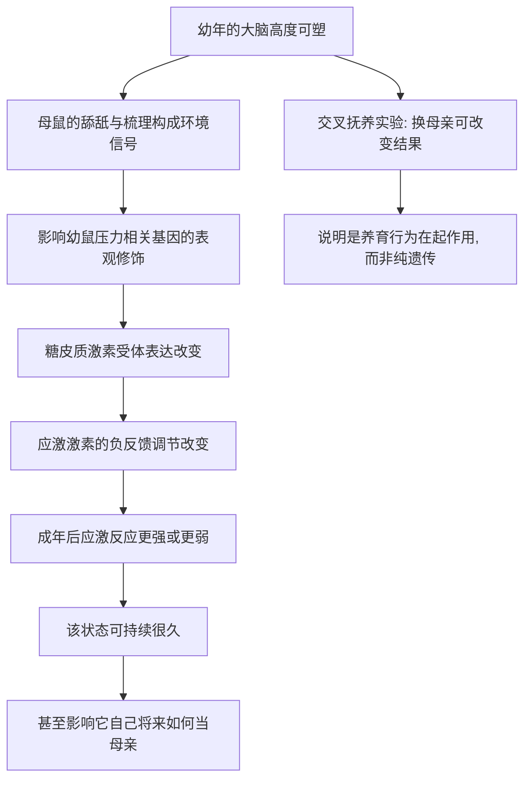

# 11｜“童年的经历”会写进基因里吗？

> 童年的压力与养育，真的会在身体里留下生物学的痕迹吗？

---

## 一、先说结论

内莎·凯里认为：**早期的经历，确实可能通过表观遗传机制，写进身体里，并且影响很久。**

她给出的最有力的证据，来自动物实验。在啮齿类动物中，母鼠对幼鼠照料方式的差异——舔舐、梳理得多还是少——会改变幼鼠体内一套与压力相关的基因开关，进而改变它一生的应激反应。被照顾得多的幼鼠，长大后更镇定、更抗压；被照顾得少的，往往长期紧张、恢复更慢。

凯里想说的不是"童年决定一切"，而是：**童年之所以重要，是因为它会落到具体的分子上。** 那些被称作"性格""抗压能力"的东西，背后有一部分是可以被观察、被测量的生物学变化。

---

## 二、我们先理解一个问题

先抛开生物学，看一个很多人都有的直觉。

同一个人，如果童年被稳定地爱、被耐心地回应，长大后往往更容易信任别人，遇到挫折也更快恢复；而如果童年在冷落、恐惧或不确定中度过，成年后可能长期处于"随时准备应对危险"的状态。

问题来了：**这种差别，究竟只是心理层面、行为层面的，还是真的刻在了身体里？**

如果只是"记忆"和"习惯"，那它应该可以被理性说服、被时间冲淡。可现实中，很多人的紧绷和警觉，似乎并不完全听道理的指挥。于是就要问：身体里是不是有一件东西，在替我们"记住"了童年？

---

## 三、作者到底提出了什么观点？

凯里的核心判断是：**早期经历能通过表观机制，校准一个人的应激系统，而且这种校准相对持久。**

具体来说，她讲述的是一条这样的通路：

1. 幼年时期，大脑中负责压力调节的系统仍在发育，这个阶段对环境高度敏感；
2. 母亲的照料方式（比如舔舐、梳理的频率）构成了一种"环境信号"；
3. 这种信号会改变某些关键基因的甲基化或组蛋白修饰状态；
4. 开关状态的不同，最终体现为应激反应强弱的不同。

凯里强调，这套机制本质上是**适应性的**：一个在危险、照料不足的环境里长大的个体，更敏感、更警觉，未必是"坏掉了"，而可能是一种对所处环境的合理设定。问题在于，当环境已经改变，这套设定却可能还留在原地。

---

## 四、把这个观点翻译成人话

可以把它想成一部**出厂前就被调过灵敏度的报警器**。

报警器本身是同一款——硬件、说明书都一样。但在安装调试阶段，如果周围总是有可疑的动静，安装师傅就会把灵敏度调高一点；如果一直很安静，就调低一点。调高之后，它在安静环境里也容易误报。

童年，就是这部报警器的"调试期"。**母亲怎么对待幼崽，就是在告诉它"这个世界是危险还是安全"。** 身体据此把灵敏度调到了某个档位。

关键在于，这个档位不是写死在硬件里的，而是写在一个可以被拆卸、也可以被重新调整的部分——这正是表观遗传标记的特点。它稳定，但不是绝对不可改。

---

## 五、为什么会这样？

把凯里的推理拆成一条链：

这条链里最关键的一环，是"负反馈"。

应激激素升高时，身体本该有一套机制把它降下来，让系统回到平静。如果负责这套"刹车"的基因表达不足，应激反应就会升得高、退得慢。早期照料通过表观修饰，调的正是这个刹车的灵敏度。

另一个关键点，是**交叉抚养实验**：把幼崽交给不同风格的养母抚养，结果随后者的风格而改变。这有力地说明：起作用的不是亲生基因，而是**养育这个行为本身**。

---

## 六、举一个现实生活中的例子

来看凯里书中反复提到的那个经典实验图景：**幼鼠被舔舐得多与少，会长成完全不同的成年个体。**

研究表明，在啮齿类动物中，有些母鼠会频繁地舔舐和梳理幼崽，有些则很少。等幼崽长大，研究者发现，受到更多舔舐的那些个体，面对压力时更从容：应激激素升高得较温和，也回落到正常水平得更快。而受到较少舔舐的个体，则更易长期紧绷。

进一步的分析显示，两组幼鼠在压力调控相关基因的表观修饰上存在差异，这改变了该基因的表达量，从而改变了整条应激通路的反应方式。

更值得注意的是：受到高照料的雌性幼鼠，长大后自己也更可能成为高照料的母亲。**照料方式，就这样沿着行为一路传了下去。**

凯里提醒我们，这并不等于"母亲要负全责"。这套机制是自然选择塑造出的适应策略，不是对任何个体的道德评判。

---

## 七、回到书中重新理解

现在再回看凯里为什么要把童年写进表观遗传的框架，就顺了。

前面讲过的道理在这里再次显现：**基因不决定命运，决定命运的是基因被怎样使用。** 童年经历之所以"深刻"，正是因为它恰好处在表观程序最容易被改写的窗口期——那时的身体，恰好在广泛地"写"自己的调节参数。

于是，"三岁看老"这类老话，有了一部分可被检验的生物学解释。但凯里也借此强调：**影响深远，不等于不可更改。** 表观标记是稳定的，但稳定的东西也可以在新的经历、新的环境中被重新调整。

---

## 八、这个观点背后还有什么？

**第一，它把"心理"和"生理"连了起来。** 童年经历不再只是情绪记忆，而是一条能被追踪到分子的通路。

**第二，它让敏感期有了具体含义。** 早期之所以特殊，是因为那时调控系统尚未定型，写起来最容易。

**第三，它说明了影响的"适应性"。** 童年留下的痕迹，未必是损伤，也可能是对当时环境的匹配。

**第四，它引出了一个更难的问题。** 如果母亲的行为能影响后代，那么这种影响，会不会再往下一代传？这正是表观遗传学中最受关注、也最需要小心对待的部分。

---

## 九、这个观点有问题吗？

有，必须谨慎。

**第一，动物研究到人类的外推有风险。** 在啮齿类动物中观察到的机制，未必能以同样方式适用于人。人类的大脑和社会环境，复杂得多。

**第二，人类研究大多只能看到相关。** 儿童期的经历、家庭环境、遗传背景、社会经济状况彼此交织，很难分清到底是谁在起作用。要做因果判断，几乎不可能设置严格的对照。

**第三，测量本身有局限。** 研究常取外周血来测甲基化，但真正起作用的组织在大脑，两者未必一致，结果需要审慎解读。

**第四，并非所有结果都能稳定重复。** 表观遗传研究的效应量往往不大，不同实验室、不同样本之间的结论也有出入。

**第五，"不可逆"的说法被夸大了。** 一些报道把早期经历讲成"一旦写定就无法修改"，这既不准确，也容易造成不必要的焦虑。

**第六，但它确实提供了一条真实的解释。** 它至少说明，童年影响深远并非只是说法，而是有迹可循的生物学现象。

**所以更准确的说法是**：早期经历通过表观机制影响应激调节，在动物模型中证据较强，在人类中则表现为值得重视但远未定论的方向。

---

## 十、今天再看这个观点

以下部分是基于本书思想的现代延伸，不是凯里的原话。

今天，"童年影响一生"已经不只是心理学的命题。研究者开始把早期逆境与表观标志物、炎症水平、压力激素节律等指标联系起来，试图找到可测量的中介通路。

在实践层面，这些研究的价值不在于给人贴标签，恰恰相反：**它提醒我们，早期环境的改善是有生物学意义的。** 稳定的照护、较低的慢性压力，不只是让孩子"心情更好"，也可能实实在在地影响他调节压力的方式。

但同样要小心：目前还远不能说，测一测某个孩子的甲基化就能预测他的一生。把研究变成宿命论的判决，是对科学最大的误用。

---

## 十一、这一篇真正应该记住什么？

1. **早期经历可能通过表观机制留下生物学痕迹。** 这在动物模型中有较强的证据。
2. **调的是"灵敏度"。** 受影响的往往是应激系统的调节方式，而不只是一个具体行为。
3. **交叉抚养实验说明关键在养育行为。** 起作用的不是亲生基因，而是幼年所处的环境。
4. **影响深远，但不等于不可逆。** 表观标记是稳定的，也是可被新经历调整的。
5. **从动物到人，必须慢一点下结论。** 人类证据更复杂，要警惕过度解读。

---

## 十二、留一个问题

> 如果一个人在生命最初的那几年，
> 身体就已经悄悄调好了自己面对世界的"灵敏度"，
> 那么这个档位，
> 究竟是可以被后来的经历重新拨动的，
> 还是会以某种方式，
> 继续影响他之后的下一代？

---

**下一篇**：既然早期经历能在身体里留下痕迹，那更让人不安的问题就来了——这些痕迹，会不会随着生育，被交给从未经历过那段历史的下一代？

下一篇我们就来拆开这个问题——**创伤和饥荒能传给下一代吗？**
