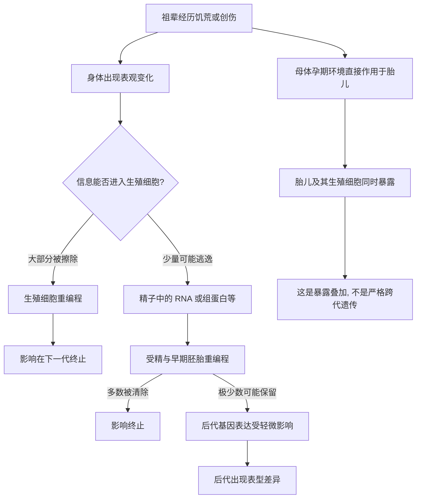

# 12｜创伤和饥荒能传给下一代吗？

> 祖辈亲身经历过的苦难，真的会"遗传"给从未经历过的后代吗？

---

## 一、先说结论

这是本系列里最需要慢下来的一篇。

凯里认为，跨代遗传是表观遗传学中最激动人心、也最有争议的部分。她一方面承认：动物研究中确实出现了一些似乎可以跨越世代传递的表观现象，人类中也存在引人注目的流行病学线索；另一方面，她又反复提醒：这些证据远不像媒体渲染得那样确定。

所以，对"创伤和饥荒能传给下一代吗"这个问题，最诚实的回答不是"能"或"不能"，而是：**目前有一些值得认真对待的线索，但尚未形成定论。** 凯里自己的态度，也是审慎而非断言。

---

## 二、我们先理解一个问题

要理解争议为何如此之大，得先知道一道生物学上的关卡。

在哺乳动物里，有一套机制专门用来"重置"：生殖细胞形成的过程中，以及受精之后、胚胎发育的早期，会发生大规模的**表观重编程**——大部分甲基化标记会被擦除，染色质被重新组织。这道关卡的目的，是让下一代"从头开始"，不被上一代的临时状态干扰。

于是问题就尖锐起来了：**如果每一代都要经历这样一次彻底的重启，那么祖辈的经历，凭什么还能传到孙辈身上？** 按理说，它应该在这一关被擦得干干净净。

跨代遗传之所以充满争议，正因为它要回答的，就是这道关卡究竟是不是密不透风。

---

## 三、作者到底提出了什么观点？

凯里的立场可以概括为两点：**第一，原则上存在传递的可能；第二，证据的强度必须逐条审视。**

她指出，理论上至少有几种路径可能让上一代的信息越过关卡：

1. **生殖细胞自身携带的表观信息。** 精子或卵子中可能存在未被完全擦除的甲基化标记。
2. **精子中的非 DNA 成分。** 除了 DNA 序列，精子还携带 RNA 片段、组蛋白修饰等，它们可能影响受精后胚胎的早期表达。
3. **母体环境的间接影响。** 母亲在孕期所处的环境，会直接影响胎儿；而胎儿的生殖细胞此时也已经形成，于是形成一种"暴露叠加"。

同时，凯里特别强调一个关键区分：**"母体暴露直接影响胎儿"和"真正的跨代遗传"不是一回事。** 前者只是同一次暴露同时落到两代人身上，后者才要求信息真正穿过生殖细胞、独立地传到再下一代。很多被误读为"跨代"的现象，其实是前者。

---

## 四、把这个观点翻译成人话

把基因组想象成一本要被反复重印的书。

祖辈读书时，在页边写下了很多批注——"这里危险""这里要节省"。按照规则，重印之前会把所有批注擦干净，让下一版恢复空白。绝大多数批注确实被擦掉了。

但"跨代遗传"要问的是：**有没有少量批注，写在擦不掉的地方？或者，有没有可能夹进一张小纸条，随着新书一起被印出来？**

凯里给出的答案是：这种可能性存在，但极为有限，而且每一例都要拿出过硬的证据。看到一句"祖辈挨过饿，所以孙辈容易得糖尿病"的说法，不能立刻当成科学结论——它可能只是忘了检查，那批注到底有没有真的留下来。

---

## 五、为什么会这样？

把可能的路径和关卡画在一起：

这张图想说明的是：从"祖辈经历"到"孙辈表型"之间，横着一道又一道的过滤网。**每一道网都可能把信息拦下，也可能漏下一点。** 争议的核心，正在于"漏下的那一点"究竟有多大、多稳定、是否足以解释观察到的现象。

任何一条跨代遗传的主张，都必须同时回答三件事：信息是什么、如何穿过这几道关口、以及如何解释那些没能穿过的情况。缺了任何一条，证据就还不完整。

---

## 六、举一个现实生活中的例子

关于饥荒与创伤的代际传递，动物和人类各自提供了不同的证据，也都各有各的短板。

**动物方面，有几类常被引用的研究。** 例如，有研究让小鼠把某种气味与不适的刺激关联起来，随后发现它们的后代对这种气味也更敏感；也有研究观察到父代饮食改变后，后代出现代谢差异；还有一些在秀丽隐杆线虫、果蝇等简单生物中进行的工作，显示某些表观标记可以稳定地传递几代，其分子机制相对清楚。**但要注意**：简单生物的结论不能直接搬到人类；即便是小鼠的气味恐惧研究，也面临样本、方法学与可重复性的质疑，不同实验室的结果并不完全一致。

**人类方面，最常被提到的是历史饥荒队列。** 例如瑞典北部的历史记录研究，曾发现祖辈在青春期前的食物供应状况，与其孙辈的寿命、代谢疾病风险之间存在统计关联；荷兰的饥荒研究则显示，孕期经历饥荒的母亲，其子女在代谢和健康上有可观察的差异。**但前者的样本规模有限，且难以排除遗传、社会经济与生活方式的干扰；后者主要反映的是母亲暴露对胎儿的直接影响，并不能直接证明信息独立地传到了孙辈。**

换句话说：**动物证据提示"机制上可能发生"，人类证据提示"值得继续追"，但两者都还不足以给出肯定的结论。** 关于这一问题，学界存在不同解释，至今没有共识。

---

## 七、回到书中重新理解

现在再回看凯里为什么把这一篇处理得格外小心，就理解了。

前面几篇建立的机制，让人觉得"环境能改写开关"已经成立；很自然就会往前推一步：那这些改写能不能传给下一代？凯里承认这个推理的诱人之处，但她拒绝让它直接变成结论。

她的态度是：**把"机制上可能存在"和"这例具体现象已被证明"严格分开。** 前者是合理的科学假说，后者需要逐案的、可重复的证据。正是这种区分，让跨代遗传成了全书最需要读者保持清醒的一章。

---

## 八、这个观点背后还有什么？

**第一，真正的跨代遗传要穿过生殖细胞这道关。** 而生殖细胞与早期胚胎的大规模重编程，是它最大的障碍。

**第二，"跨代"这个词本身常被混用。** 母体孕期暴露同时影响胎儿和胎儿的生殖细胞，看起来像"传了两代"，其实只是同一次暴露被叠加了两次，严格来说不算跨代遗传。

**第三，印记基因是天然的例外。** 基因组印记本身就是表观标记在生殖过程中被保留、并区分父源母源的机制，它说明"逃逸重编程"在生物学上确有先例。

**第四，环境与遗传很难彻底分开。** 一个家庭可能同时传递基因、饮食习惯、居住条件与行为模式，这些都会在数据里留下相似的相关性，让人误以为是表观遗传。

---

## 九、这个观点有问题吗？

这一节必须两边都摆出来，而不是替任何一方下结论。

**支持跨代传递的一方可以说**：动物实验里确实出现了跨代的表型差异和可测的表观变化；机制上，"未被完全擦除"并非不可能，印记基因就是现成的例子；人群队列中的历史关联反复被不同数据观察到，很难完全用混杂因素一笔带过。

**质疑这一方可以说**：生殖细胞重编程是强有力的屏障，多数标记都会被清除，能逃逸的往往是极少数、效应极小的情形；人类研究无法做随机对照，饥荒与贫困、社会变迁、遗传背景全部纠缠在一起，相关性根本无法确定归因；许多报告的样本规模小、效应量弱，重复性也不稳定；而"祖辈的创伤传给了孙辈"这种说法，在传播中极易被简化成一个动人的故事，却缺少能撑起它的证据。

**关于这一问题，学界存在不同解释。** 一种较谨慎的立场是：只有少数特定的表观标记、在特定条件下，才可能对后代产生有限且可测的影响，远达不到"创伤被遗传"这种通俗表述的程度。另一种较开放的立场是：现有证据虽然零散，但方向一致，值得继续深入，不应过早否定。

**两方都同意的事只有一件**：这是一个尚未解决的问题，需要更多、更严谨的研究，而不是急着站队。

---

## 十、今天再看这个观点

以下部分是基于本书思想的现代延伸，不是凯里的原话。

这些年来，围绕这一问题的研究路径变得更具体了：研究者开始直接分析人类精子和卵子中的表观特征，尝试在受孕前就捕捉可能的传递信号；也有团队利用长期人群队列，去区分"基因层面的传递"和"环境与行为的传递"。

与此同时，一个重要的提醒正在形成：**"创伤的代际影响"在心理、家庭和文化层面是真实存在的，但这与"在生物学上被遗传"是两件不同的事。** 一个家庭的沉默、焦虑、应对方式，可以通过养育、语言与生活境遇传下去，完全不需要借助表观遗传。把这两者混为一谈，既会误读科学，也会掩盖那些本来更直接、更可干预的传递途径。

真正有价值的，也许不是急着回答"能不能遗传"，而是问：**即使存在某种生物学的痕迹，它在多大程度上、在什么条件下是可以被改变的？**

---

## 十一、这一篇真正应该记住什么？

1. **这是一个尚未定论的问题。** 凯里本人就把它当作全书最需要谨慎的一章。
2. **生物学上存在障碍。** 生殖细胞与早期胚胎的大规模重编程，是跨代传递最难跨越的关口。
3. **"暴露叠加"不等于"跨代遗传"。** 母体孕期影响胎儿和胎儿生殖细胞，常被误读成跨代。
4. **动物证据与人类证据各有短板。** 前者难外推，后者难归因，都不能单独定案。
5. **不要替科学下结论。** 既不要轻信"创伤会遗传"，也不要武断地全盘否定。

---

## 十二、留一个问题

> 如果一道苦难的痕迹，
> 有可能在重印的过程中被擦掉，
> 也有可能留下一点点没被擦净的墨迹，
> 那么我们该更相信自己的直觉，
> 还是更相信那道尚未验证的关卡？
>
> 而在答案出现之前，
> 又该怎样对待那些确实在家族中流传下来的沉默与恐惧？

---

**下一篇**：把视线从"信息能否传下去"转向"细胞身份能否被推倒重来"——一个有名字、有生日、曾经轰动了全世界的动物，逼着我们重新回答：分化，到底是不是一条单行道？

下一篇我们就来拆开这个问题——**克隆羊多莉告诉我们什么？**
