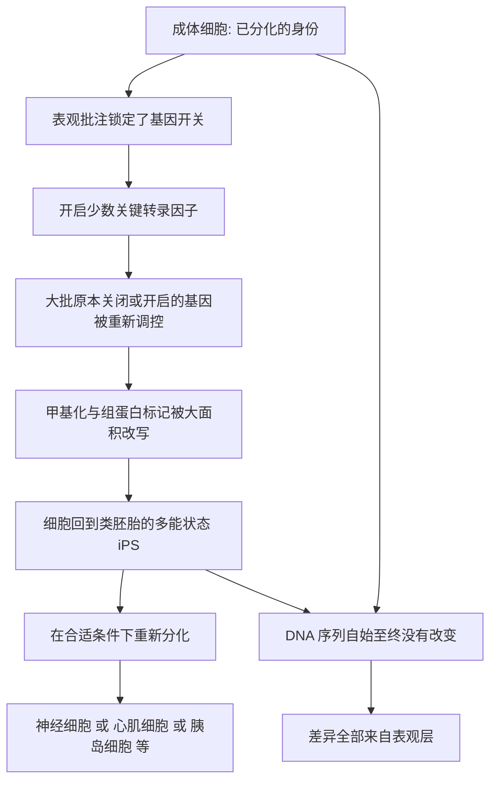

# 14｜我们能把细胞“重编程”吗？

> 不靠卵子，我们能不能直接把一个已经“定型”的成体细胞，倒回干细胞状态？

---

## 一、先说结论

凯里在这一类技术问题上的态度可以概括为一句话：**细胞的身份不是刻在石头上的，而是写在表观层里的一层“批注”；批注既然能写上去，原则上就能被擦掉、被重写。**

诱导多能干细胞（induced pluripotent stem cells，简称 iPS 细胞）就是这条思路的产物。研究表明，只要在成体细胞里人为开启少数几个关键因子，就能把它的表观遗传“批注”大面积重排，让它回到类似胚胎干细胞的状态，然后再重新分化成身体里几乎任何一种细胞。

所以答案是：能，但“能”有严格的条件与代价。这不是随心所欲的魔法，而是一场对表观遗传程序的强行重置。

---

## 二、我们先理解一个问题

先看这个困惑。

你身体里每一个细胞都来自同一个受精卵，DNA 序列完全一样。可是皮肤细胞就是皮肤细胞，神经细胞就是神经细胞，它们不会自己变来变去。之前我们讲过，这是表观遗传在起作用：分化过程中，细胞把“我要做皮肤”这件事通过甲基化和组蛋白修饰牢牢锁定，并一代代传给子细胞。这份“细胞记忆”让多细胞生命得以维持。

但问题来了：如果身份被锁定得这么牢，那它到底是“永久锁死”，还是“只是锁着、钥匙还在”？

如果只是锁着，那理论上就存在一把钥匙，能把锁打开，让细胞回到最初那个“什么都能变”的状态。那么，能不能不用卵子、也不做核移植，只用几个分子信号，就把一个成体细胞“倒回去”？

这正是这一篇要回答的核心问题。

---

## 三、作者到底提出了什么观点？

凯里认为，iPS 的真正意义不在于“造出了干细胞”，而在于它**证明了细胞身份的可逆性，并揭示这种可逆性由表观遗传来掌管**。

她的论证逻辑大致是：

1. 细胞分化靠的是表观遗传标记的改变，而不是 DNA 序列的改变；
2. 既然序列没变，只是“批注”变了，那么抹掉批注、重写批注在原理上是可行的；
3. 少数被称为“转录因子”的蛋白，正好是控制大批基因开关的“总闸”；
4. 把几个这样的总闸同时打开，就能让整个表观遗传网络重新洗牌，细胞因此回到类胚胎的多能状态。

所以凯里的核心判断是：**不是 DNA 决定了细胞是谁，而是 DNA 上的表观“批注”决定了细胞是谁；批注可写，就可改。**

---

## 四、把这个观点翻译成人话

想象一个已经工作多年的成年人，专业、职业、说话方式都定型了。你很难让他“变回婴儿、重新长大、去当另一种职业的人”。这就是分化后的细胞。

iPS 技术做的事，相当于给这个成年人按下了一个“重新开始”的按钮：不是改变他的履历本身，而是把写满批注的职业档案清空，让他回到还没选择专业的入学状态，然后再送他去学一门全新的专业。

用更贴近本书的说法：细胞身份像一本被反复批注过的书。基因序列是印好的正文，一个字没动；表观批注是读者在旁边写下的笔记——哪些段落要重点读，哪些直接跳过。iPS 做的事，是拿橡皮把这些笔记擦干净，再重新写。**正文没变，读法重来。**

---

## 五、为什么会这样？

关键在 C → E 这一跳。

翻转开关的几个因子本身并不“制造”神经或皮肤，它们做的是**改写调控网络**：把成体细胞里那一整套已经固化的表达模式推倒重来。当甲基化与组蛋白状态被重塑，细胞就找回了“什么都能变”的潜能。整个过程中，DNA 序列一个字母都没改——这正是为什么它是表观遗传最有力的证据之一。

---

## 六、举一个现实生活中的例子

看 iPS 技术本身的诞生过程。

研究表明，日本科学家山中伸弥团队在 2006 年发现，只要在小鼠成体细胞中同时引入四个转录因子，就能把它变成类似胚胎干细胞的状态；随后在 2007 年，这一结果在人类细胞中也被重复。这四个因子后来被称为“山中因子”。

操作上，研究者通常取的是最方便获得的成体细胞——比如皮肤成纤维细胞或血细胞，把它们放进培养皿，导入这几个因子，等上若干天到数周。原本只会安分守己的皮肤细胞，会逐渐失去原有的形态与标志，重新表现出多能干细胞的特征：既能持续增殖，又能分化成神经、心肌、肝脏等多种细胞。凭借这项工作，山中伸弥获得了 2012 年的诺贝尔生理学或医学奖。

这正是凯里那句话的实证版：**改变的从来不是基因本身，而是基因被读的方式。**

---

## 七、回到书中重新理解

现在再回看凯里的整条逻辑，就清楚了。

这本书从“同卵双胞胎为什么不同”开始，一路讲细胞分化、细胞记忆、甲基化与组蛋白——这些都在说明一件事：**DNA 序列之上有一层可变的调控信息。** 但“可变”到什么程度？分化到底是不是一条单行道？iPS 给出的答案是：不是单行道，是一条可以调头的路。

所以 iPS 不是全书里孤立的“高科技章节”，而是前面所有机制讨论的**集中检验**。如果表观遗传真的只是“批注”，那它就应该能被擦除、被重写；iPS 恰恰证明了这一点。

---

## 八、这个观点背后还有什么？

**第一，它把“重编程”从实验室推向了医学。** 如果能拿到病人的皮肤细胞，把它变回 iPS，再分化成需要修复的细胞，理论上就绕开了免疫排斥问题——因为细胞源自病人自身。

**第二，它绕开了胚胎来源的伦理争议。** 这一点极其关键：不破坏胚胎，也能获得类似胚胎干细胞的能力。

**第三，它带来了“疾病建模”的新可能。** 把带有某种遗传背景的细胞重编程，再让其分化成受累组织，可以在培养皿里观察疾病如何发生、药物是否有效。

**第四，它同时是风险信号。** 让细胞“回到能持续增殖的状态”，离“失控增殖”只有一线之隔。安全性问题从一开始就伴随这项技术。

---

## 九、这个观点有问题吗？

必须保持平衡。

**第一，“能重编程”不等于“安全可控”。** 早期方法使用的一个因子本身与肿瘤相关，导入方式也可能随机插入基因组，带来不可预测的风险。安全性改良至今仍是研究重点。

**第二，效率并不理想。** 不是每个被处理的细胞都能成功变回多能状态，很多细胞停在半路或死去。这意味着“批量制造”仍需要优化。

**第三，从 iPS 到成熟可用的组织，仍有长路。** 让干细胞稳定分化成功能正确的目标细胞，再保证移植后不致瘤，是远比“造出 iPS”更难的工程。

**第四，科学事实与商业宣传要分开。** 一些机构把 iPS 说成“随时换个器官就能换”，这远远超出了目前证据能支持的范围。所以更准确的说法是：iPS 是一项机制清晰、意义重大的突破，但它是一项**正在进行中的技术**，而不是已经兑现的承诺。

---

## 十、今天再看这个观点

以下部分是基于本书思想的现代延伸，不是凯里的原话。

今天，iPS 及相关重编程技术已经延伸到多个方向：用病人来源细胞构建“培养皿里的疾病模型”，用于新药筛选；探索把重编程用于再生受损组织；甚至研究更温和的“部分重编程”，只让细胞年轻一点、而不彻底回到胚胎状态。与此同时，直接递送重编程因子、不经过干细胞中间步骤的“体内重编程”也在探索中，但安全性与可控性仍是最大障碍。

更现实的判断是：**重编程改变的是可能性边界，而不是把“逆生长”变成日常服务。** 它让我们看到衰老与身份或许并非绝对不可逆，但从实验室成果到稳定疗法之间，隔着大量尚未解决的证据与安全问题。

---

## 十一、这一篇真正应该记住什么？

1. **细胞身份是可逆的。** 分化不是刻死的，iPS 证明了可以“倒回”。
2. **可逆的根源在表观层，不在序列。** 整个过程中 DNA 序列没有改变。
3. **几个“总闸”因子就能改写全局。** 少数转录因子足以重塑一大片基因的表达。
4. **技术突破与治疗成熟是两回事。** 机制成立不代表安全可用。
5. **它是前面所有机制的检验。** iPS 是“表观批注可擦可写”这一主张最有力的证据之一。

---

## 十二、留一个问题

> 如果连“细胞是谁”都可以被重写，
> 那么真正决定一个细胞身份的，
> 究竟是它拿到的那本 DNA，
> 还是它一路上被写下的那些批注？

---

**下一篇**：既然开关会被写错、也能被重写，那么一个更现实的问题就出现了——我们能不能干脆用药物，把出错的开关调回来，用它来治病？

下一篇我们就来拆开这个问题——**表观遗传药物能治病吗？**
